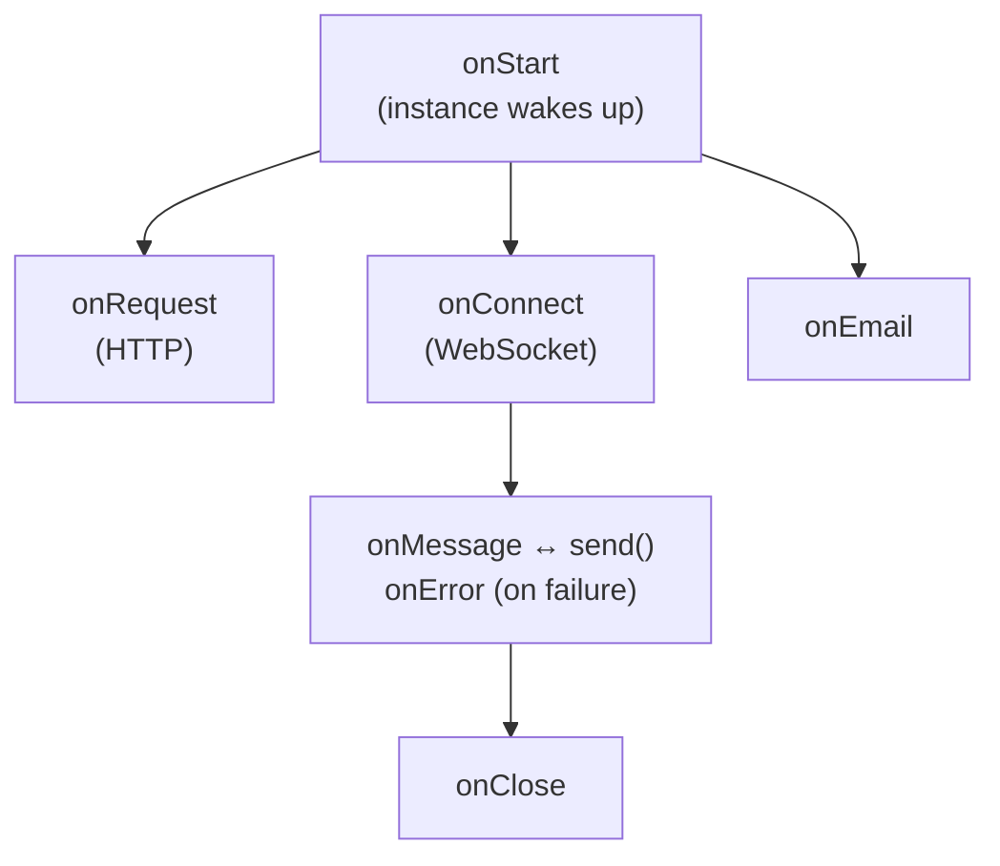

import { Render, LinkCard } from "~/components";

이 페이지에서는 Agents SDK의 개요을 제공합니다. 각 기능에 대한 자세한 문서는 링크된 참고 자료 페이지를 참조하세요.

## 개요

Agents SDK는 두 가지 주요 API를 제공합니다.

| API                | 설명                                                         |
| ------------------ | ---------------------------------------------------------- |
| **서버 측** `Agent`수업 | 에이전트 로직 캡슐화: 연결, 상태, 메소드, AI 모델, 오류 처리                     |
| **클라이언트 측**SDK     | `AgentClient`, `useAgent`, 그리고`useAgentChat`브라우저에서 연결하기 위해 |

:::참고

에이전트가 요구하는 것[Cloudflare Durable Objects](/durable-objects/). 참조[구성](/agents/api-reference/configuration/)필수 바인딩을 추가하는 방법을 알아보세요.

:::

## 에이전트 클래스

에이전트는 기본을 확장하는 클래스입니다.`Agent`수업:

```ts
import { Agent } from "agents";

class MyAgent extends Agent<Env, State> {
	//에이전트 논리
}

export default MyAgent;
```

각 에이전트는 수백만 개의 인스턴스를 가질 수 있습니다. 각 인스턴스는 독립적으로 실행되는 별도의 마이크로 서버이므로 수평 확장이 가능합니다. 인스턴스는 고유 식별자(사용자 ID, 이메일, 티켓 번호 등)로 주소가 지정됩니다.

<Render file="unique-agents" product="agents" />

## 수명주기



| 방법                                            | 실행될 때                                                                                                                           |
| --------------------------------------------- | ------------------------------------------------------------------------------------------------------------------------------- |
| `onStart(props?)`                             | 인스턴스가 시작되거나 최대 절전 모드에서 깨어날 때입니다. 선택적 수신[초기화 소품](/agents/api-reference/routing/#props)통과하다`getAgentByName`또는`routeAgentRequest`. |
| `onRequest(request)`                          | 인스턴스에 대한 각 HTTP 요청에 대해                                                                                                          |
| `onConnect(connection, ctx)`                  | WebSocket 연결이 설정된 경우                                                                                                            |
| `onMessage(connection, message)`              | 수신된 각 WebSocket 메시지에 대해                                                                                                         |
| `onError(connection, error)`                  | WebSocket 오류가 발생하는 경우                                                                                                           |
| `onClose(connection, code, reason, wasClean)` | WebSocket 연결이 닫힐 때                                                                                                              |
| `onEmail(email)`                              | 이메일이 인스턴스로 라우팅되는 경우                                                                                                             |
| `onStateChanged(state, source)`               | 상태가 변경될 때(서버 또는 클라이언트에서)                                                                                                        |

## 핵심 속성

| 재산           | 유형                 | 설명                     |
| ------------ | ------------------ | ---------------------- |
| `this.env`   | `Env`              | 환경 변수 및 바인딩            |
| `this.ctx`   | `ExecutionContext` | 요청에 대한 실행 컨텍스트         |
| `this.state` | `State`            | 현재 지속 상태               |
| `this.sql`   | 기능                 | 내장된 SQLite에서 SQL 쿼리 실행 |

## 서버측 API 참고 자료

| 특징             | 방법                                                                                   | 문서                                                            |
| -------------- | ------------------------------------------------------------------------------------ | ------------------------------------------------------------- |
| **상태**         | `setState()`, `onStateChanged()`, `initialState`                                     | [상태 저장 및 동기화](/agents/api-reference/store-and-sync-state/)    |
| **호출 가능한 메서드** | `@callable()`장식가                                                                     | [호출 가능한 메서드](/agents/api-reference/callable-methods/)         |
| **스케줄링**       | `schedule()`, `scheduleEvery()`, `getSchedules()`, `cancelSchedule()`, `keepAlive()` | [작업 예약](/agents/api-reference/schedule-tasks/)                |
| **대기열**        | `queue()`, `dequeue()`, `dequeueAll()`, `getQueue()`                                 | [대기열 작업](/agents/api-reference/queue-tasks/)                  |
| **웹소켓**        | `onConnect()`, `onMessage()`, `onClose()`, `broadcast()`                             | [웹소켓](/agents/api-reference/websockets/)                      |
| **HTTP/SSE**   | `onRequest()`                                                                        | [HTTP와 SSE](/agents/api-reference/http-sse/)                  |
| **이메일**        | `onEmail()`, `replyToEmail()`                                                        | [이메일 라우팅](/agents/api-reference/email/)                       |
| **Workflows**  | `runWorkflow()`, `waitForApproval()`                                                 | [Workflows 실행](/agents/api-reference/run-workflows/)          |
| **MCP 클라이언트**  | `addMcpServer()`, `removeMcpServer()`, `getMcpServers()`                             | [MCP 클라이언트 API](/agents/api-reference/mcp-client-api/)        |
| **AI 모델**      | Workers AI, OpenAI, Anthropic 바인딩                                                    | [AI 모델 사용](/agents/api-reference/using-ai-models/)            |
| **프로토콜 메시지**   | `shouldSendProtocolMessages()`, `isConnectionProtocolEnabled()`                      | [프로토콜 메시지](/agents/api-reference/protocol-messages/)          |
| **맥락**         | `getCurrentAgent()`                                                                  | [getCurrentAgent()](/agents/api-reference/get-current-agent/) |
| **관찰 가능성**     | `subscribe()`, 진단 채널, Tail Workers                                                   | [관찰 가능성](/agents/api-reference/observability/)                |

## SQL API

각 에이전트 인스턴스에는 다음을 통해 액세스되는 내장형 SQLite 데이터베이스가 있습니다.`this.sql`:

```ts
//테이블 생성
this.sql`CREATE TABLE IF NOT EXISTS users (id TEXT PRIMARY KEY, name TEXT)`;

//데이터 삽입
this.sql`INSERT INTO users (id, name) VALUES (${id}, ${name})`;

//데이터 쿼리
const users = this.sql<User>`SELECT * FROM users WHERE id = ${id}`;
```

클라이언트와 동기화해야 하는 상태의 경우[상태 API](/agents/api-reference/store-and-sync-state/)대신.

## 클라이언트측 API 참고 자료

| 특징             | 방법               | 문서                                                                           |
| -------------- | ---------------- | ---------------------------------------------------------------------------- |
| **웹소켓 클라이언트**  | `AgentClient`    | [클라이언트 SDK](/agents/api-reference/client-sdk/)                               |
| **HTTP 클라이언트** | `agentFetch()`   | [클라이언트 SDK](/agents/api-reference/client-sdk/#http-requests-with-agentfetch) |
| **React 후크**   | `useAgent()`     | [클라이언트 SDK](/agents/api-reference/client-sdk/#react)                         |
| **채팅훅**        | `useAgentChat()` | [클라이언트 SDK](/agents/api-reference/client-sdk/)                               |

### 빠른 예

```ts
import { useAgent } from "agents/react";
import type { MyAgent } from "./server";

function App() {
	const agent = useAgent<MyAgent, State>({
		agent: "my-agent",
		name: "user-123",
	});

	//에이전트의 호출 방법
	agent.stub.someMethod();

	//상태 업데이트(서버 및 모든 클라이언트에 동기화)
	agent.setState({ count: 1 });
}
```

## 채팅 상담원

AI 채팅 애플리케이션의 경우 확장`AIChatAgent`대신에`Agent`:

```ts
import { AIChatAgent } from "agents/ai-chat-agent";

class ChatAgent extends AIChatAgent {
	async onChatMessage(onFinish) {
		//this.messages에는 대화 기록이 포함되어 있습니다.
		//스트리밍 응답 반환
	}
}
```

기능은 다음과 같습니다:

- 내장된 메시지 지속성
- 자동 재개 가능한 스트리밍(스트림 중간에 다시 연결)
- 함께 작동`useAgentChat`React 후크

참조[채팅 에이전트 구축](/agents/getting-started/build-a-chat-agent/)완전한 튜토리얼을 보려면.

## 라우팅

에이전트는 URL 패턴을 통해 액세스됩니다.

```txt
https://your-worker.workers.dev/agents/:agent-name/:instance-name
```

사용`routeAgentRequest()`작업자에서 요청을 라우팅하려면 다음을 수행하세요.

```ts
import { routeAgentRequest } from "agents";

export default {
	async fetch(request: Request, env: Env) {
		return (
			routeAgentRequest(request, env) ||
			new Response("Not found", { status: 404 })
		);
	},
} satisfies ExportedHandler<Env>;
```

참조[라우팅](/agents/api-reference/routing/)사용자 정의 경로, CORS 및 인스턴스 이름 지정 패턴의 경우.

## 다음 단계

<LinkCard title="빠른 시작" href="/agents/getting-started/quick-start/" description="약 10분 만에 첫 번째 에이전트를 구축하세요." />

<LinkCard title="구성" href="/agents/api-reference/configuration/" description="wrangler.jsonc 설정 및 배포에 대해 알아보세요." />

<LinkCard title="웹소켓" href="/agents/api-reference/websockets/" description="고객과의 실시간 양방향 커뮤니케이션." />

<LinkCard title="채팅 에이전트 구축" href="/agents/getting-started/build-a-chat-agent/" description="AIChatAgent를 사용하여 AI 애플리케이션을 구축하세요." />
