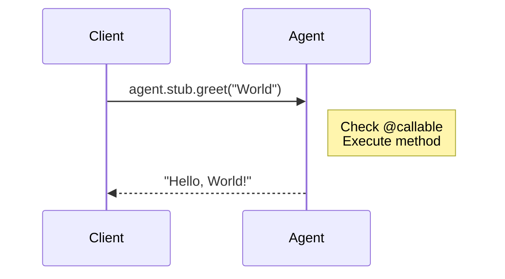

import { TypeScriptExample, LinkCard } from "~/components";

호출 가능 메서드를 사용하면 클라이언트가 RPC(원격 프로시저 호출)를 사용하여 WebSocket을 통해 에이전트 메서드를 호출할 수 있습니다. 메소드를 다음으로 표시`@callable()`브라우저, 모바일 앱 또는 기타 서비스와 같은 외부 클라이언트에 노출됩니다.

## 개요

<TypeScriptExample>
  ```ts
  import { Agent, callable } from "agents";

  export class MyAgent extends Agent {
  	@callable()
  	async greet(name: string): Promise<string> {
  		return `Hello, ${name}!`;
  	}
  }
  ```
</TypeScriptExample>

<TypeScriptExample>
  ```ts
  //클라이언트
  const result = await agent.stub.greet("World");
  console.log(result); //"안녕하세요, 월드!"
  ```
</TypeScriptExample>

### 작동 원리



### 언제 사용하나요?`@callable()`

| 시나리오                   | 사용                                  |
| ---------------------- | ----------------------------------- |
| 브라우저/모바일 통화 에이전트       | `@callable()`                       |
| 외부 서비스 호출 에이전트         | `@callable()`                       |
| 작업자 호출 에이전트(동일한 코드베이스) | 내구성 있는 개체 RPC(데코레이터 필요 없음)          |
| 상담원이 다른 상담원에게 전화 걸기    | 내구성 있는 개체 RPC를 통해`getAgentByName()` |

는`@callable()`데코레이터는 특히 외부 클라이언트의 WebSocket 기반 RPC용입니다. 동일한 작업자나 다른 상담원 내에서 전화를 걸 때는 표준을 사용하세요.[내구성 있는 개체 RPC](/durable-objects/best-practices/create-durable-object-stubs-and-send-requests/)직접.

## 기본 사용법

### 호출 가능한 메서드 정의

추가`@callable()`노출하려는 메소드에 대한 데코레이터:

<TypeScriptExample>
  ```ts
  import { Agent, callable } from "agents";

  export type CounterState = {
  	count: number;
  	items: string[];
  };

  export class CounterAgent extends Agent<Env, CounterState> {
  	initialState: CounterState = { count: 0, items: [] };

  	@callable()
  	increment(): number {
  		this.setState({ ...this.state, count: this.state.count + 1 });
  		return this.state.count;
  	}

  	@callable()
  	decrement(): number {
  		this.setState({ ...this.state, count: this.state.count - 1 });
  		return this.state.count;
  	}

  	@callable()
  	async addItem(item: string): Promise<string[]> {
  		this.setState({ ...this.state, items: [...this.state.items, item] });
  		return this.state.items;
  	}

  	@callable()
  	getStats(): { count: number; itemCount: number } {
  		return {
  			count: this.state.count,
  			itemCount: this.state.items.length,
  		};
  	}
  }
  ```
</TypeScriptExample>

### 클라이언트에서 호출

클라이언트에서 메서드를 호출하는 방법에는 두 가지가 있습니다.

#### 사용`agent.stub`(권장):

<TypeScriptExample>
  ```ts
  //깔끔하고 형식화된 구문
  const count = await agent.stub.increment();
  const items = await agent.stub.addItem("new item");
  const stats = await agent.stub.getStats();
  ```
</TypeScriptExample>

#### 사용`agent.call()`:

<TypeScriptExample>
  ```ts
  //문자열로 된 명시적 메소드 이름
  const count = await agent.call("increment");
  const items = await agent.call("addItem", ["new item"]);
  const stats = await agent.call("getStats");
  ```
</TypeScriptExample>

는`stub`프록시는 더 나은 인체공학성과 TypeScript 지원을 제공합니다.

## 메소드 서명

### 직렬화 가능한 유형

인수 및 반환 값은 JSON 직렬화 가능해야 합니다.

<TypeScriptExample>
  ```ts
  //유효함 - 기본 요소 및 일반 개체
  class MyAgent extends Agent {
  	@callable()
  	processData(input: { name: string; count: number }): { result: boolean } {
  		return { result: true };
  	}
  }

  //유효 - 배열
  class MyAgent extends Agent {
  	@callable()
  	processItems(items: string[]): number[] {
  		return items.map((item) => item.length);
  	}
  }

  //유효하지 않음 - 직렬화할 수 없는 유형
  //함수, 날짜, 지도, 세트 등은 직렬화할 수 없습니다.
  ```
</TypeScriptExample>

### 비동기 방식

동기화 및 비동기 방법이 모두 작동합니다.

<TypeScriptExample>
  ```ts
  //동기화 방법
  class MyAgent extends Agent {
  	@callable()
  	add(a: number, b: number): number {
  		return a + b;
  	}
  }

  //비동기 방식
  class MyAgent extends Agent {
  	@callable()
  	async fetchUser(id: string): Promise<User> {
  		const user = await this.sql`SELECT * FROM users WHERE id = ${id}`;
  		return user[0];
  	}
  }
  ```
</TypeScriptExample>

### 무효 방법

값을 반환하지 않는 메소드:

<TypeScriptExample>
  ```ts
  class MyAgent extends Agent {
  	@callable()
  	async logEvent(event: string): Promise<void> {
  		await this.sql`INSERT INTO events (name) VALUES (${event})`;
  	}
  }
  ```
</TypeScriptExample>

클라이언트에서는 메서드가 완료되면 해결되는 Promise를 반환합니다.

<TypeScriptExample>
  ```ts
  await agent.stub.logEvent("user-clicked");
  //서버가 실행을 확인하면 해결됩니다.
  ```
</TypeScriptExample>

## 스트리밍 응답

시간이 지남에 따라 데이터를 생성하는 방법(예: AI 텍스트 생성)의 경우 스트리밍을 사용합니다.

### 스트리밍 방법 정의

<TypeScriptExample>
  ```ts
  import { Agent, callable, type StreamingResponse } from "agents";

  export class AIAgent extends Agent {
  	@callable({ streaming: true })
  	async generateText(stream: StreamingResponse, prompt: string) {
  		//첫 번째 매개변수는 스트리밍 메서드의 경우 항상 StreamingResponse입니다.

  		for await (const chunk of this.llm.stream(prompt)) {
  			stream.send(chunk); //각 청크를 클라이언트에 보냅니다.
  		}

  		stream.end(); //신호 완료
  	}

  	@callable({ streaming: true })
  	async streamNumbers(stream: StreamingResponse, count: number) {
  		for (let i = 0; i < count; i++) {
  			stream.send(i);
  			await new Promise((resolve) => setTimeout(resolve, 100));
  		}
  		stream.end(count); //선택적 최종 값
  	}
  }
  ```
</TypeScriptExample>

### 클라이언트에서 스트림 소비

<TypeScriptExample>
  ```ts
  //선호하는 형식(시간 초과 및 기타 옵션 지원)
  await agent.call("generateText", [prompt], {
  	stream: {
  		onChunk: (chunk) => {
  			//각 청크에 대해 호출됨
  			appendToOutput(chunk);
  		},
  		onDone: (finalValue) => {
  			//스트림이 끝나면 호출됩니다.
  			console.log("Stream complete", finalValue);
  		},
  		onError: (error) => {
  			//오류가 발생하면 호출됩니다.
  			console.error("Stream error:", error);
  		},
  	},
  });

  //레거시 형식(이전 버전과의 호환성을 위해 계속 지원됨)
  await agent.call("generateText", [prompt], {
  	onChunk: (chunk) => appendToOutput(chunk),
  	onDone: (finalValue) => console.log("Done", finalValue),
  	onError: (error) => console.error("Error:", error),
  });
  ```
</TypeScriptExample>

### 스트리밍응답 API

| 방법                 | 설명                           |
| ------------------ | ---------------------------- |
| `send(chunk)`      | 클라이언트에 청크 보내기                |
| `end(finalChunk?)` | 선택적으로 최종 값을 사용하여 스트림을 종료합니다. |
| `error(message)`   | 클라이언트에 오류를 보내고 스트림을 닫습니다.    |

<TypeScriptExample>
  ```ts
  class MyAgent extends Agent {
  	@callable({ streaming: true })
  	async processWithProgress(stream: StreamingResponse, items: string[]) {
  		for (let i = 0; i < items.length; i++) {
  			await this.process(items[i]);
  			stream.send({ progress: (i + 1) / items.length, item: items[i] });
  		}
  		stream.end({ completed: true, total: items.length });
  	}
  }
  ```
</TypeScriptExample>

## TypeScript 통합

### 입력된 클라이언트 호출

완전한 유형 안전성을 위해 에이전트 클래스를 유형 매개변수로 전달하십시오.

<TypeScriptExample>
  ```ts
  import { useAgent } from "agents/react";
  import type { MyAgent } from "./server";

  function App() {
  	const agent = useAgent<MyAgent>({
  		agent: "MyAgent",
  		name: "default",
  	});

  	async function handleGreet() {
  		//TypeScript은 메소드 서명을 알고 있습니다.
  		const result = await agent.stub.greet("World");
  		//^? 문자열
  	}

  	//TypeScript 오류 포착
  	//에이전트를 기다립니다.stub.greet(123); // 오류: 'number' 유형의 인수는 할당할 수 없습니다.
  	//Agent.stub.nonExistent()를 기다립니다. // 오류: 'nonExistent' 속성이 존재하지 않습니다.
  }
  ```
</TypeScriptExample>

### 호출할 수 없는 메서드 제외

장식되지 않은 메소드가 있는 경우`@callable()`, 유형에서 제외할 수 있습니다.

<TypeScriptExample>
  ```ts
  class MyAgent extends Agent {
  	@callable()
  	publicMethod(): string {
  		return "public";
  	}

  	//클라이언트에서 호출할 수 없습니다.
  	internalMethod(): void {
  		//내부 논리
  	}
  }

  //클라이언트 유형에서 내부 메소드 제외
  const agent = useAgent<Omit<MyAgent, "internalMethod">>({
  	agent: "MyAgent",
  });

  agent.stub.publicMethod(); //작품
  //Agent.stub.internalMethod(); // TypeScript 오류
  ```
</TypeScriptExample>

## 오류 처리

### 호출 가능한 메서드에서 오류 발생

호출 가능한 메서드에서 발생한 오류는 클라이언트에 전파됩니다.

<TypeScriptExample>
  ```ts
  class MyAgent extends Agent {
  	@callable()
  	async riskyOperation(data: unknown): Promise<void> {
  		if (!isValid(data)) {
  			throw new Error("Invalid data format");
  		}

  		try {
  			await this.processData(data);
  		} catch (e) {
  			throw new Error("Processing failed: " + e.message);
  		}
  	}
  }
  ```
</TypeScriptExample>

### 클라이언트 측 오류 처리

<TypeScriptExample>
  ```ts
  try {
  	const result = await agent.stub.riskyOperation(data);
  } catch (error) {
  	//에이전트 메서드에서 발생한 오류
  	console.error("RPC failed:", error.message);
  }
  ```
</TypeScriptExample>

### 스트리밍 오류 처리

스트리밍 방법의 경우`onError`콜백:

<TypeScriptExample>
  ```ts
  await agent.call("streamData", [input], {
  	stream: {
  		onChunk: (chunk) => handleChunk(chunk),
  		onError: (errorMessage) => {
  			console.error("Stream error:", errorMessage);
  			showErrorUI(errorMessage);
  		},
  		onDone: (result) => handleComplete(result),
  	},
  });
  ```
</TypeScriptExample>

서버 측에서 사용할 수 있습니다`stream.error()`스트림 중간에 오류를 정상적으로 보내려면 다음을 수행하십시오.

<TypeScriptExample>
  ```ts
  class MyAgent extends Agent {
  	@callable({ streaming: true })
  	async processItems(stream: StreamingResponse, items: string[]) {
  		for (const item of items) {
  			try {
  				const result = await this.process(item);
  				stream.send(result);
  			} catch (e) {
  				stream.error(`Failed to process ${item}: ${e.message}`);
  				return; //스트림이 현재 폐쇄되었습니다.
  			}
  		}
  		stream.end();
  	}
  }
  ```
</TypeScriptExample>

### 연결 오류

RPC 호출이 보류 중인 동안 WebSocket 연결이 닫히면 "연결 닫힘" 오류와 함께 자동으로 거부됩니다.

<TypeScriptExample>
  ```ts
  try {
  	const result = await agent.call("longRunningMethod", []);
  } catch (error) {
  	if (error.message === "Connection closed") {
  		//연결 끊김 처리
  		console.log("Lost connection to agent");
  	}
  }
  ```
</TypeScriptExample>

#### 재접속 후 재시도 중

클라이언트는 연결 해제 후 자동으로 다시 연결됩니다. 다시 연결한 후 실패한 통화를 다시 시도하려면 대기하세요.`agent.ready`다시 시도하기 전에:

<TypeScriptExample>
  ```ts
  async function callWithRetry<T>(
  	agent: AgentClient,
  	method: string,
  	args: unknown[] = [],
  ): Promise<T> {
  	try {
  		return await agent.call(method, args);
  	} catch (error) {
  		if (error.message === "Connection closed") {
  			await agent.ready; //다시 연결될 때까지 기다리세요
  			return await agent.call(method, args); //한 번 다시 시도하세요.
  		}
  		throw error;
  	}
  }

  //사용법
  const result = await callWithRetry(agent, "processData", [data]);
  ```
</TypeScriptExample>

:::참고

멱등성 작업만 재시도하세요. 서버가 요청을 받았지만 응답이 도착하기 전에 연결이 끊어진 경우 재시도하면 중복 실행이 발생할 수 있습니다.

:::

## @callable을 사용하지 말아야 할 경우

### 작업자 대 상담원 통화

동일한 작업자의 상담원에게 전화를 걸 때(예:`fetch`처리기), 내구성 개체 RPC를 직접 사용합니다.

<TypeScriptExample>
  ```ts
  import { getAgentByName } from "agents";

  export default {
  	async fetch(request: Request, env: Env) {
  		//에이전트 스텁 가져오기
  		const agent = await getAgentByName(env.MyAgent, "instance-name");

  		//메소드를 직접 호출 - @callable이 필요하지 않음
  		const result = await agent.processData(data);

  		return Response.json(result);
  	},
  } satisfies ExportedHandler<Env>;
  ```
</TypeScriptExample>

### 상담원 간 통화

한 상담원이 다른 상담원에게 전화를 걸어야 하는 경우:

<TypeScriptExample>
  ```ts
  class OrchestratorAgent extends Agent {
  	async delegateWork(taskId: string) {
  		//다른 에이전트를 구하세요
  		const worker = await getAgentByName(this.env.WorkerAgent, taskId);

  		//해당 메서드를 직접 호출
  		const result = await worker.doWork();

  		return result;
  	}
  }
  ```
</TypeScriptExample>

### 왜 구별합니까?

| RPC 유형        | 운송  | 사용 사례                   |
| ------------- | --- | ----------------------- |
| `@callable`   | 웹소켓 | 외부 클라이언트(브라우저, 앱)       |
| 내구성 있는 개체 RPC | 내부  | 작업자 대 에이전트, 에이전트 대 에이전트 |

지속형 개체 RPC는 WebSocket 직렬화를 거치지 않으므로 내부 호출에 더 효율적입니다. 는`@callable`데코레이터는 외부 클라이언트에 필요한 WebSocket RPC 처리를 추가합니다.

## API 참고 자료

### @callable(메타데이터?) 데코레이터

외부 클라이언트에서 호출 가능한 메서드를 표시합니다.

<TypeScriptExample>
  ```ts
  import { callable } from "agents";

  class MyAgent extends Agent {
  	@callable()
  	method(): void {}

  	@callable({ streaming: true })
  	streamingMethod(stream: StreamingResponse): void {}

  	@callable({ description: "Fetches user data" })
  	getUser(id: string): User {}
  }
  ```
</TypeScriptExample>

### 호출 가능메타데이터 유형

```ts
type CallableMetadata = {
	/** 메소드가 수행하는 작업에 대한 선택적 설명*/
	description?: string;
	/** 메소드가 스트리밍 응답을 지원하는지 여부*/
	streaming?: boolean;
};
```

### StreamingResponse 클래스

클라이언트에 데이터를 보내기 위해 스트리밍 호출 가능 메서드에 사용됩니다.

<TypeScriptExample>
  ```ts
  import { type StreamingResponse } from "agents";

  class MyAgent extends Agent {
  	@callable({ streaming: true })
  	async streamData(stream: StreamingResponse, input: string) {
  		stream.send("chunk 1");
  		stream.send("chunk 2");
  		stream.end("final");
  	}
  }
  ```
</TypeScriptExample>

| 방법      | 서명                               | 설명                 |
| ------- | -------------------------------- | ------------------ |
| `send`  | `(chunk: unknown) => void`       | 클라이언트에 청크 보내기      |
| `end`   | `(finalChunk?: unknown) => void` | 스트림 종료             |
| `error` | `(message: string) => void`      | 오류를 보내고 스트림을 닫습니다. |

### 클라이언트 방법

| 방법           | 서명                                     | 설명          |
| ------------ | -------------------------------------- | ----------- |
| `agent.call` | `(method, args?, options?) => Promise` | 이름으로 메소드 호출 |
| `agent.stub` | `Proxy`                                | 입력된 메서드 호출  |

<TypeScriptExample>
  ```ts
  //통화() 사용
  await agent.call("methodName", [arg1, arg2]);
  await agent.call("streamMethod", [arg], {
  	stream: { onChunk, onDone, onError },
  });

  //시간 초과 있음(통화가 시간 내에 완료되지 않으면 거부됨)
  await agent.call("slowMethod", [], { timeout: 5000 });

  //스텁 사용
  await agent.stub.methodName(arg1, arg2);
  ```
</TypeScriptExample>

### CallOptions 유형

```ts
type CallOptions = {
	/** 시간 초과(밀리초). 통화가 시간 내에 완료되지 않으면 거부됩니다.*/
	timeout?: number;
	/** 스트리밍 옵션*/
	stream?: {
		onChunk?: (chunk: unknown) => void;
		onDone?: (finalChunk: unknown) => void;
		onError?: (error: string) => void;
	};
};
```

:::참고

레거시 형식`{ onChunk, onDone, onError }`(아래에 중첩되지 않고`stream`)은 계속 지원됩니다. 클라이언트는 사용 중인 형식을 자동으로 감지합니다.

:::

### getCallableMethods() 메서드

메타데이터와 함께 에이전트에서 호출 가능한 모든 메서드의 맵을 반환합니다. 자체 조사 및 자동 문서화에 유용합니다.

<TypeScriptExample>
  ```ts
  const methods = agent.getCallableMethods();
  //맵<문자열, CallableMetadata>

  for (const [name, meta] of methods) {
  	console.log(`${name}: ${meta.description || "(no description)"}`);
  	if (meta.streaming) console.log("  (streaming)");
  }
  ```
</TypeScriptExample>

## 문제 해결

### `SyntaxError: Invalid or unexpected token`

개발 서버가 실패하는 경우`SyntaxError: Invalid or unexpected token`사용할 때`@callable()`, 설정`"target": "ES2021"`당신의`tsconfig.json`. 이는 Vite의 esbuild 트랜스파일러가 TC39 데코레이터를 기본 구문으로 전달하는 대신 레벨을 낮추는 것을 보장합니다.

```json
{
	"compilerOptions": {
		"target": "ES2021"
	}
}
```

:::주의
설정하지 않음`"experimentalDecorators": true`당신의`tsconfig.json`. 에이전트 SDK는 다음을 사용합니다.[TC39 표준 데코레이터](https://github.com/tc39/proposal-decorators), TypeScript 레거시 데코레이터가 아닙니다. 활성화`experimentalDecorators`자동으로 중단되는 호환되지 않는 변환을 적용합니다.`@callable()`런타임에.
:::

## 다음 단계

<LinkCard title="에이전트 API" href="/agents/api-reference/agents-api/" description="Agents SDK용 API 참고 자료를 완료하세요." />

<LinkCard title="웹소켓" href="/agents/api-reference/websockets/" description="고객과의 실시간 양방향 커뮤니케이션." />

<LinkCard title="상태 관리" href="/agents/api-reference/store-and-sync-state/" description="에이전트와 클라이언트 간의 상태를 동기화합니다." />
