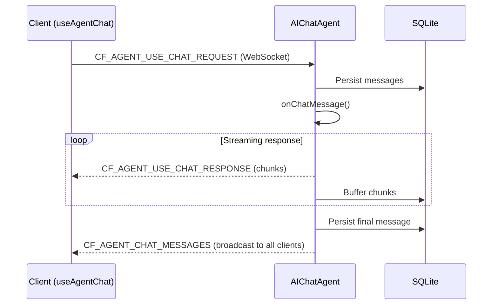

import { TypeScriptExample, LinkCard } from "~/components";

AI 기반 채팅 인터페이스 구축`AIChatAgent`그리고`useAgentChat`. 메시지는 자동으로 SQLite에 유지되고, 연결이 끊어지면 스트림이 다시 시작되며, 도구 호출은 서버와 클라이언트에서 작동합니다.

## 개요

는`@cloudflare/ai-chat`패키지는 두 가지 주요 내보내기를 제공합니다.

| 수출             | 가져오기                        | 목적                              |
| -------------- | --------------------------- | ------------------------------- |
| `AIChatAgent`  | `@cloudflare/ai-chat`       | 메시지 지속성과 스트리밍을 갖춘 서버 측 에이전트 클래스 |
| `useAgentChat` | `@cloudflare/ai-chat/react` | React 채팅 UI 구축을 위한 후크           |

Built on the[AI SDK](https://ai-sdk.dev)Cloudflare Durable Objects, 다음을 얻습니다.

- **자동 메시지 지속성**— 대화는 SQLite에 저장되며 다시 시작해도 유지됩니다.
- **재개 가능한 스트리밍**— 연결이 끊긴 클라이언트는 데이터 손실 없이 중간 스트림을 재개합니다.
- **실시간 동기화**— WebSocket을 통해 연결된 모든 클라이언트에 메시지가 브로드캐스트됩니다.
- **도구 지원**— 서버 측, 클라이언트 측 및 인간 참여형 도구 패턴
- **데이터 부분**— 텍스트와 함께 메시지에 입력된 JSON(인용, 진행 상황, 사용법)을 첨부합니다.
- **행 크기 보호**— 메시지가 SQLite 제한에 도달하면 자동 압축

## 빠른 시작

### 설치

```sh
npm install @cloudflare/ai-chat agents ai
```

### 서버

<TypeScriptExample>
  ```ts
  import { AIChatAgent } from "@cloudflare/ai-chat";
  import { createWorkersAI } from "workers-ai-provider";
  import { streamText, convertToModelMessages } from "ai";

  export class ChatAgent extends AIChatAgent {
  	async onChatMessage() {
  		//Worker-ai-provider, openai, anthropic, google 등과 같은 공급자를 사용하세요.
  		const workersai = createWorkersAI({ binding: this.env.AI });

  		const result = streamText({
  			model: workersai("@cf/zai-org/glm-4.7-flash"),
  			messages: await convertToModelMessages(this.messages),
  		});

  		return result.toUIMessageStreamResponse();
  	}
  }
  ```
</TypeScriptExample>

### 클라이언트

<TypeScriptExample>
  ```ts
  import { useAgent } from "agents/react";
  import { useAgentChat } from "@cloudflare/ai-chat/react";

  function Chat() {
  	const agent = useAgent({ agent: "ChatAgent" });
  	const { messages, sendMessage, status } = useAgentChat({ agent });

  	return (
  		<div>
  			{messages.map((msg) => (
  				<div key={msg.id}>
  					<strong>{msg.role}:</strong>
  					{msg.parts.map((part, i) =>
  						part.type === "text" ? <span key={i}>{part.text}</span> : null,
  					)}
  				</div>
  			))}

  			<form
  				onSubmit={(e) => {
  					e.preventDefault();
  					const input = e.currentTarget.elements.namedItem(
  						"input",
  					) as HTMLInputElement;
  					sendMessage({ text: input.value });
  					input.value = "";
  				}}
  			>
  				<input name="input" placeholder="Type a message..." />
  				<button type="submit" disabled={status === "streaming"}>
  					Send
  				</button>
  			</form>
  		</div>
  	);
  }
  ```
</TypeScriptExample>

### Wrangler 구성

```jsonc
//랭글러.jsonc
{
	"ai": { "binding": "AI" },
	"durable_objects": {
		"bindings": [{ "name": "ChatAgent", "class_name": "ChatAgent" }],
	},
	"migrations": [{ "tag": "v1", "new_sqlite_classes": ["ChatAgent"] }],
}
```

는`new_sqlite_classes`마이그레이션이 필요합니다 —`AIChatAgent`메시지 지속성과 스트림 청크 버퍼링을 위해 SQLite를 사용합니다.

## 작동 원리



1. 클라이언트는 WebSocket을 통해 메시지를 보냅니다.
2. `AIChatAgent`메시지를 SQLite에 유지하고 호출합니다.`onChatMessage`방법
3. 귀하의 메소드는 스트리밍을 반환합니다`Response`(일반적으로`streamText`)
4. 청크는 실시간으로 WebSocket을 통해 다시 스트리밍됩니다.
5. 스트림이 완료되면 최종 메시지가 유지되고 모든 연결에 브로드캐스트됩니다.

## 서버 API

### `AIChatAgent`

확장`Agent`에서`agents`패키지. 대화 상태, 지속성 및 스트리밍을 관리합니다.

<TypeScriptExample>
  ```ts
  import { AIChatAgent } from "@cloudflare/ai-chat";

  export class ChatAgent extends AIChatAgent {
  	//Access current messages
  	//this.messages: UIMessage[]

  	//저장된 메시지 제한(선택사항)
  	maxPersistedMessages = 200;

  	async onChatMessage(onFinish?, options?) {
  		//onFinish: streamText에 대한 선택적 콜백(정리 자동)
  		//options.abortSignal: 신호 취소
  		//options.body: 클라이언트의 사용자 정의 데이터
  		//응답 반환(스트리밍 또는 일반 텍스트)
  	}
  }
  ```
</TypeScriptExample>

### `onChatMessage`

이것이 재정의하는 주요 방법입니다. 대화 컨텍스트를 수신하고 다음을 반환해야 합니다.`Response`.

**스트리밍 응답**(가장 일반적):

<TypeScriptExample>
  ```ts
  export class ChatAgent extends AIChatAgent {
  	async onChatMessage() {
  		const workersai = createWorkersAI({ binding: this.env.AI });

  		const result = streamText({
  			model: workersai("@cf/zai-org/glm-4.7-flash"),
  			system: "You are a helpful assistant.",
  			messages: await convertToModelMessages(this.messages),
  		});

  		return result.toUIMessageStreamResponse();
  	}
  }
  ```
</TypeScriptExample>

**일반 텍스트 응답**:

```ts
export class ChatAgent extends AIChatAgent {
	async onChatMessage() {
		return new Response("Hello! I am a simple agent.", {
			headers: { "Content-Type": "text/plain" },
		});
	}
}
```

**사용자 정의 본문 데이터 및 요청 ID에 액세스**:

```ts
export class ChatAgent extends AIChatAgent {
	async onChatMessage(_onFinish, options) {
		const { timezone, userId } = options?.body ?? {};
		//LLM 호출 또는 비즈니스 로직에서 이러한 값을 사용하세요.

		//options.requestId — 이 채팅 요청에 대한 고유 식별자,
		//이벤트를 기록하고 연관시키는 데 유용합니다.
		console.log("Request ID:", options?.requestId);
	}
}
```

### `this.messages`

SQLite에서 로드된 현재 대화 기록입니다. 이것은 배열이다`UIMessage`AI SDK의 개체입니다. 메시지는 각 상호 작용 후에 자동으로 유지됩니다.

### `maxPersistedMessages`

SQLite에 저장된 메시지 수를 제한합니다. 제한을 초과하면 가장 오래된 메시지가 삭제됩니다. 이는 저장소만 제어하며 LLM으로 전송되는 내용에는 영향을 미치지 않습니다.

<TypeScriptExample>
  ```ts
  export class ChatAgent extends AIChatAgent {
  	maxPersistedMessages = 200;
  }
  ```
</TypeScriptExample>

모델로 전송되는 내용을 제어하려면 AI SDK의`pruneMessages()`:

<TypeScriptExample>
  ```ts
  import { streamText, convertToModelMessages, pruneMessages } from "ai";

  export class ChatAgent extends AIChatAgent {
  	async onChatMessage() {
  		const workersai = createWorkersAI({ binding: this.env.AI });

  		const result = streamText({
  			model: workersai("@cf/zai-org/glm-4.7-flash"),
  			messages: pruneMessages({
  				messages: await convertToModelMessages(this.messages),
  				reasoning: "before-last-message",
  				toolCalls: "before-last-2-messages",
  			}),
  		});

  		return result.toUIMessageStreamResponse();
  	}
  }
  ```
</TypeScriptExample>

### `waitForMcpConnections`

여부를 제어합니다.`AIChatAgent`호출하기 전에 MCP 서버 연결이 안정될 때까지 기다립니다.`onChatMessage`. 이는 다음을 보장합니다.`this.mcp.getAITools()`특히 연결이 백그라운드에서 복원될 때 지속성 개체 최대 절전 모드 후에 전체 도구 세트를 반환합니다.

| 가치                    | 행동                          |
| --------------------- | --------------------------- |
| `{ timeout: 10_000 }` | 최대 10초 동안 기다립니다(기본값)        |
| `{ timeout: N }`      | 최대 기다려`N`밀리초                |
| `true`                | 모든 연결이 준비될 때까지 무기한 대기       |
| `false`               | 기다리지 마십시오(0.2.0 이전의 이전 동작). |

<TypeScriptExample>
  ```ts
  export class ChatAgent extends AIChatAgent {
  	//기본값 — 최대 10초 동안 기다립니다.
  	//waitForMcpConnections = { 시간 초과: 10_000 };

  	//영원히 기다려
  	waitForMcpConnections = true;

  	//대기 비활성화
  	waitForMcpConnections = false;
  }
  ```
</TypeScriptExample>

더 낮은 수준의 제어를 위해서는 다음을 호출하세요.`this.mcp.waitForConnections()`당신의 내부에 직접`onChatMessage`대신.

### `persistMessages`그리고`saveMessages`

고급 사례의 경우 메시지를 수동으로 유지할 수 있습니다.

<TypeScriptExample>
  ```ts
  //새로운 응답을 트리거하지 않고 메시지 유지
  await this.persistMessages(messages);

  //메시지를 유지하고 onChatMessage를 트리거합니다(예: 프로그래밍 방식 메시지).
  await this.saveMessages(messages);
  ```
</TypeScriptExample>

### 수명주기 후크

재정의`onConnect`그리고`onClose`사용자 정의 논리를 추가합니다. 스트림 재개 및 메시지 동기화가 자동으로 처리됩니다.

<TypeScriptExample>
  ```ts
  export class ChatAgent extends AIChatAgent {
  	async onConnect(connection, ctx) {
  		//사용자 정의 로직(예: 로깅, 인증 확인)
  		console.log("Client connected:", connection.id);
  		//스트림 재개 및 메시지 동기화가 자동으로 처리됩니다.
  	}

  	async onClose(connection, code, reason, wasClean) {
  		console.log("Client disconnected:", connection.id);
  		//연결 정리가 자동으로 처리됩니다.
  	}
  }
  ```
</TypeScriptExample>

는`destroy()`메서드는 보류 중인 채팅 요청을 취소하고 스트림 상태를 정리합니다. 지속성 개체가 제거되면 자동으로 호출되지만 필요한 경우 수동으로 호출할 수 있습니다.

### 취소요청

사용자가 채팅 UI에서 "중지"를 클릭하면 클라이언트는`CF_AGENT_CHAT_REQUEST_CANCEL`메시지. 서버는 이를 다음 사용자에게 전파합니다.`abortSignal`안으로`options`:

<TypeScriptExample>
  ```ts
  export class ChatAgent extends AIChatAgent {
  	async onChatMessage(_onFinish, options) {
  		const result = streamText({
  			model: workersai("@cf/zai-org/glm-4.7-flash"),
  			messages: await convertToModelMessages(this.messages),
  			abortSignal: options?.abortSignal, //취소하려면 통과하세요
  		});

  		return result.toUIMessageStreamResponse();
  	}
  }
  ```
</TypeScriptExample>

:::주의
합격하지 못한 경우`abortSignal`에`streamText`, 사용자가 취소한 후에도 LLM 호출은 백그라운드에서 계속 실행됩니다. 가능하면 항상 전달하십시오.
:::

## 클라이언트 API

### `useAgentChat`

React 연결되는 후크`AIChatAgent`WebSocket을 통해. AI SDK를 래핑합니다.`useChat`기본 WebSocket 전송을 사용합니다.

<TypeScriptExample>
  ```ts
  import { useAgent } from "agents/react";
  import { useAgentChat } from "@cloudflare/ai-chat/react";

  function Chat() {
  	const agent = useAgent({ agent: "ChatAgent" });
  	const {
  		messages,
  		sendMessage,
  		clearHistory,
  		addToolOutput,
  		addToolApprovalResponse,
  		setMessages,
  		status,
  	} = useAgentChat({ agent });

  	//...
  }
  ```
</TypeScriptExample>

### 옵션

| 옵션                            | 유형                                          | 기본값    | 설명                                                                          |
| ----------------------------- | ------------------------------------------- | ------ | --------------------------------------------------------------------------- |
| `agent`                       | `ReturnType<typeof useAgent>`               | 필수     | 다음에서 에이전트 연결`useAgent`                                                      |
| `onToolCall`                  | `({ toolCall, addToolOutput }) => void`     | —      | 클라이언트 측 도구 실행 처리                                                            |
| `autoContinueAfterToolResult` | `boolean`                                   | `true` | 클라이언트 도구 결과 및 승인 후 자동으로 대화를 계속합니다.                                          |
| `resume`                      | `boolean`                                   | `true` | 다시 연결 시 자동 스트림 재개 활성화                                                       |
| `body`                        | `object \| () => object`                    | —      | 모든 요청과 함께 전송되는 맞춤 데이터                                                       |
| `prepareSendMessagesRequest`  | `(options) => { body?, headers? }`          | —      | 요청별 고급 사용자 정의                                                               |
| `getInitialMessages`          | `(options) => Promise<UIMessage[]>`또는`null` | —      | 사용자 정의 초기 메시지 로더. 다음으로 설정`null`HTTP 가져오기를 완전히 건너뛰려면(제공할 때 유용함)`messages`직접) |

### 반환 값

| 재산                        | 유형                                 | 설명                                                  |
| ------------------------- | ---------------------------------- | --------------------------------------------------- |
| `messages`                | `UIMessage[]`                      | 현재 대화 메시지                                           |
| `sendMessage`             | `(message) => void`                | 메시지 보내기                                             |
| `clearHistory`            | `() => void`                       | 명확한 대화(클라이언트 및 서버)                                  |
| `addToolOutput`           | `({ toolCallId, output }) => void` | 클라이언트 측 도구에 대한 출력 제공                                |
| `addToolApprovalResponse` | `({ id, approved }) => void`       | 승인이 필요한 도구 승인 또는 거부                                 |
| `setMessages`             | `(messages \| updater) => void`    | 메시지 직접 설정(서버에 동기화)                                  |
| `status`                  | `string`                           | `"idle"`, `"submitted"`, `"streaming"`, 또는`"error"` |

## 도구

`AIChatAgent`AI SDK를 사용하는 세 가지 도구 패턴을 지원합니다.`tool()`기능:

| 패턴      | 실행되는 곳               | 언제 사용하나요?               |
| ------- | -------------------- | ----------------------- |
| 서버 측    | 서버(자동)               | API 호출, 데이터베이스 쿼리, 계산   |
| 클라이언트 측 | 브라우저(경유`onToolCall`) | 위치정보, 클립보드, 카메라, 로컬 저장소 |
| 승인      | 서버 (사용자 승인 후)        | 결제, 삭제, 외부 조치           |

### 서버 측 도구

도구`execute`함수는 서버에서 자동으로 실행됩니다.

<TypeScriptExample>
  ```ts
  import { streamText, convertToModelMessages, tool, stepCountIs } from "ai";
  import { z } from "zod";
  export class ChatAgent extends AIChatAgent {
  	async onChatMessage() {
  		const workersai = createWorkersAI({ binding: this.env.AI });

  		const result = streamText({
  			model: workersai("@cf/zai-org/glm-4.7-flash"),
  			messages: await convertToModelMessages(this.messages),
  			tools: {
  				getWeather: tool({
  					description: "Get weather for a city",
  					inputSchema: z.object({ city: z.string() }),
  					execute: async ({ city }) => {
  						const data = await fetchWeather(city);
  						return { temperature: data.temp, condition: data.condition };
  					},
  				}),
  			},
  			stopWhen: stepCountIs(5),
  		});

  		return result.toUIMessageStreamResponse();
  	}
  }
  ```
</TypeScriptExample>

### 클라이언트측 도구

없이 서버에서 도구를 정의합니다.`execute`, 그런 다음 클라이언트에서 처리하십시오.`onToolCall`. 브라우저 API가 필요한 도구에 사용하세요.

**서버:**

<TypeScriptExample>
  ```ts
  tools: {
  	getLocation: tool({
  		description: "Get the user's location from the browser",
  		inputSchema: z.object({}),
  		//실행 없음 - 클라이언트가 처리함
  	});
  }
  ```
</TypeScriptExample>

**클라이언트:**

<TypeScriptExample>
  ```ts
  const { messages, sendMessage } = useAgentChat({
  	agent,
  	onToolCall: async ({ toolCall, addToolOutput }) => {
  		if (toolCall.toolName === "getLocation") {
  			const pos = await new Promise((resolve, reject) =>
  				navigator.geolocation.getCurrentPosition(resolve, reject),
  			);
  			addToolOutput({
  				toolCallId: toolCall.toolCallId,
  				output: { lat: pos.coords.latitude, lng: pos.coords.longitude },
  			});
  		}
  	},
  });
  ```
</TypeScriptExample>

LLM이 호출될 때`getLocation`, 스트림이 일시 중지됩니다. 는`onToolCall`콜백이 실행되고 코드가 출력을 제공하며 대화는 계속됩니다.

### 도구 승인(인간 참여형)

사용`needsApproval`실행하기 전에 사용자 확인이 필요한 도구의 경우.

**서버:**

<TypeScriptExample>
  ```ts
  tools: {
  	processPayment: tool({
  		description: "Process a payment",
  		inputSchema: z.object({
  			amount: z.number(),
  			recipient: z.string(),
  		}),
  		needsApproval: async ({ amount }) => amount > 100,
  		execute: async ({ amount, recipient }) => charge(amount, recipient),
  	});
  }
  ```
</TypeScriptExample>

**클라이언트:**

<TypeScriptExample>
  ```ts
  const { messages, addToolApprovalResponse } = useAgentChat({ agent });

  //메시지 부분에서 보류 중인 승인 렌더링
  {
  	messages.map((msg) =>
  		msg.parts
  			.filter(
  				(part) => part.type === "tool" && part.state === "approval-required",
  			)
  			.map((part) => (
  				<div key={part.toolCallId}>
  					<p>Approve {part.toolName}?</p>
  					<button
  						onClick={() =>
  							addToolApprovalResponse({
  								id: part.toolCallId,
  								approved: true,
  							})
  						}
  					>
  						Approve
  					</button>
  					<button
  						onClick={() =>
  							addToolApprovalResponse({
  								id: part.toolCallId,
  								approved: false,
  							})
  						}
  					>
  						Reject
  					</button>
  				</div>
  			)),
  	);
  }
  ```
</TypeScriptExample>

#### 사용자 정의 거부 메시지`addToolOutput`

사용자가 도구를 거부하면`addToolApprovalResponse({ id, approved: false })`도구 상태를 다음으로 설정합니다.`output-denied`일반적인 메시지로. LLM에 거부에 대한 보다 구체적인 이유를 제공하려면 다음을 사용하십시오.`addToolOutput`와`state: "output-error"`대신:

<TypeScriptExample>
  ```ts
  const { addToolOutput } = useAgentChat({ agent });

  //맞춤 오류 메시지로 거부
  addToolOutput({
  	toolCallId: part.toolCallId,
  	state: "output-error",
  	errorText: "User declined: insufficient budget for this quarter",
  });
  ```
</TypeScriptExample>

이것은`tool_result`사용자 정의 오류 텍스트를 LLM에 전달하여 적절하게 응답할 수 있도록 합니다(예: 대안을 제안하거나 명확한 질문을 하는 등).

`addToolApprovalResponse`(와`approved: false`) 다음과 같은 경우 대화가 자동으로 계속됩니다.`autoContinueAfterToolResult`활성화되어 있습니다(기본값).`addToolOutput`와`state: "output-error"`않습니다**아니**자동 계속 — 통화`sendMessage()`나중에 LLM이 오류에 응답하도록 하려는 경우.

더 많은 패턴을 보려면[인간 참여형](/agents/concepts/human-in-the-loop/).

## 맞춤 요청 데이터

다음을 사용하여 모든 채팅 요청에 맞춤 데이터를 포함합니다.`body`옵션:

<TypeScriptExample>
  ```ts
  const { messages, sendMessage } = useAgentChat({
  	agent,
  	body: {
  		timezone: Intl.DateTimeFormat().resolvedOptions().timeZone,
  		userId: currentUser.id,
  	},
  });
  ```
</TypeScriptExample>

동적 값의 경우 함수를 사용하십시오.

<TypeScriptExample>
  ```ts
  body: () => ({
  	token: getAuthToken(),
  	timestamp: Date.now(),
  });
  ```
</TypeScriptExample>

서버에서 다음 필드에 액세스합니다.

<TypeScriptExample>
  ```ts
  export class ChatAgent extends AIChatAgent {
  	async onChatMessage(_onFinish, options) {
  		const { timezone, userId } = options?.body ?? {};
  		//...
  	}
  }
  ```
</TypeScriptExample>

요청별 고급 사용자 정의(사용자 정의 헤더, 요청당 다른 본문)의 경우 다음을 사용하세요.`prepareSendMessagesRequest`:

<TypeScriptExample>
  ```ts
  const { messages, sendMessage } = useAgentChat({
  	agent,
  	prepareSendMessagesRequest: async ({ messages, trigger }) => ({
  		headers: { Authorization: `Bearer ${await getToken()}` },
  		body: { requestedAt: Date.now() },
  	}),
  });
  ```
</TypeScriptExample>

## 데이터 부분

데이터 부분을 사용하면 진행률 표시기, 소스 인용, 토큰 사용 또는 UI에 필요한 모든 구조화된 데이터와 함께 텍스트와 함께 메시지에 입력된 JSON을 첨부할 수 있습니다.

### 데이터 부분 쓰기(서버)

사용`createUIMessageStream`와`writer.write()`서버에서 데이터 부분을 보내려면 다음을 수행하십시오.

<TypeScriptExample>
  ```ts
  import {
  	streamText,
  	convertToModelMessages,
  	createUIMessageStream,
  	createUIMessageStreamResponse,
  } from "ai";

  export class ChatAgent extends AIChatAgent {
  	async onChatMessage() {
  		const workersai = createWorkersAI({ binding: this.env.AI });

  		const stream = createUIMessageStream({
  			execute: async ({ writer }) => {
  				const result = streamText({
  					model: workersai("@cf/zai-org/glm-4.7-flash"),
  					messages: await convertToModelMessages(this.messages),
  				});

  				//LLM 스트림 병합
  				writer.merge(result.toUIMessageStream());

  				//데이터 부분 쓰기 — message.parts에 유지됨
  				writer.write({
  					type: "data-sources",
  					id: "src-1",
  					data: { query: "agents", status: "searching", results: [] },
  				});

  				//나중에: 동일한 부품을 그 자리에서 업데이트합니다(동일한 유형 + ID)
  				writer.write({
  					type: "data-sources",
  					id: "src-1",
  					data: {
  						query: "agents",
  						status: "found",
  						results: ["Agents SDK docs", "Durable Objects guide"],
  					},
  				});
  			},
  		});

  		return createUIMessageStreamResponse({ stream });
  	}
  }
  ```
</TypeScriptExample>

### 세 가지 패턴

| 패턴     | 어떻게                                       | 지속되었나요? | 사용 사례             |
| ------ | ----------------------------------------- | ------- | ----------------- |
| **화해** | 동일`type` + `id`→ 현재 위치에서 업데이트             | 예       | 진행형 상태(검색 중 → 찾음) |
| **추가** | 아니요`id`, 또는 다른`id`→ 첨부                    | 예       | 로그 항목, 여러 인용      |
| **과도** | `transient: true`→ 추가되지 않음`message.parts` | 아니요     | 임시 상태(사고 표시기)     |

일시적인 부분은 연결된 클라이언트에 실시간으로 브로드캐스트되지만 SQLite 지속성 및`message.parts`. 사용`onData`콜백하여 소비합니다.

### 데이터 부분 읽기(클라이언트)

일시적이지 않은 데이터 부분은 다음 위치에 나타납니다.`message.parts`. 사용`UIMessage`일반 형식으로 입력하세요.

<TypeScriptExample>
  ```ts
  import { useAgentChat } from "@cloudflare/ai-chat/react";
  import type { UIMessage } from "ai";

  type ChatMessage = UIMessage<
  	unknown,
  	{
  		sources: { query: string; status: string; results: string[] };
  		usage: { model: string; inputTokens: number; outputTokens: number };
  	}
  >;

  const { messages } = useAgentChat<unknown, ChatMessage>({ agent });

  //입력된 액세스 - 캐스트가 필요하지 않습니다.
  for (const msg of messages) {
  	for (const part of msg.parts) {
  		if (part.type === "data-sources") {
  			console.log(part.data.results); //문자열[]
  		}
  	}
  }
  ```
</TypeScriptExample>

### 과도 부품`onData`

임시 데이터 부분은`message.parts`. 사용`onData`대신 콜백:

<TypeScriptExample>
  ```ts
  const [thinking, setThinking] = useState(false);

  const { messages } = useAgentChat<unknown, ChatMessage>({
  	agent,
  	onData(part) {
  		if (part.type === "data-thinking") {
  			setThinking(true);
  		}
  	},
  });
  ```
</TypeScriptExample>

서버에서 다음을 사용하여 임시 부분을 작성합니다.`transient: true`:

<TypeScriptExample>
  ```ts
  writer.write({
  	transient: true,
  	type: "data-thinking",
  	data: { model: "glm-4.7-flash", startedAt: new Date().toISOString() },
  });
  ```
</TypeScriptExample>

`onData`새 메시지, 스트림 재개, 크로스탭 브로드캐스트 등 모든 코드 경로에서 실행됩니다.

## 재개 가능한 스트리밍

클라이언트 연결이 끊어졌다가 다시 연결되면 스트림이 자동으로 재개됩니다. 구성이 필요하지 않습니다. 즉시 사용 가능합니다.

스트리밍이 활성화된 경우:

1. 모든 청크는 생성될 때 SQLite에 버퍼링됩니다.
2. 클라이언트 연결이 끊어지면 서버는 스트리밍 및 버퍼링을 계속합니다.
3. 클라이언트가 다시 연결되면 버퍼링된 모든 청크를 수신하고 라이브 스트리밍을 재개합니다.

다음으로 비활성화`resume: false`:

<TypeScriptExample>
  ```ts
  const { messages } = useAgentChat({ agent, resume: false });
  ```
</TypeScriptExample>

## 스토리지 관리

### 행 크기 보호

SQLite 행의 최대 크기는 2MB입니다. 메시지가 이 제한에 도달하면(예: 매우 큰 출력을 반환하는 도구)`AIChatAgent`메시지를 자동으로 압축합니다.

1. **도구 출력 압축**— 대규모 도구 출력은 도구 재실행을 제안하도록 모델에 지시하는 LLM 친화적인 요약으로 대체됩니다.
2. **텍스트 잘림**— 도구 압축 후에도 메시지가 여전히 너무 크면 텍스트 부분이 메모와 함께 잘립니다.

Compacted messages include`metadata.compactedToolOutputs`클라이언트가 이를 정상적으로 감지하고 표시할 수 있도록 합니다.

### LLM 컨텍스트와 스토리지 제어

스토리지(`maxPersistedMessages`) 및 LLM 컨텍스트는 독립적입니다.

| 우려                 | 제어                     | 범위       |
| ------------------ | ---------------------- | -------- |
| SQLite가 저장하는 메시지 수 | `maxPersistedMessages` | 지속성      |
| 모델이 보는 것           | `pruneMessages()`      | LLM 컨텍스트 |
| 행 크기 제한            | 자동 압축                  | 메시지별     |

<TypeScriptExample>
  ```ts
  export class ChatAgent extends AIChatAgent {
  	async onChatMessage() {
  		const result = streamText({
  			model: workersai("@cf/zai-org/glm-4.7-flash"),
  			messages: pruneMessages({
  				//LLM 컨텍스트 제한
  				messages: await convertToModelMessages(this.messages),
  				reasoning: "before-last-message",
  				toolCalls: "before-last-2-messages",
  			}),
  		});

  		return result.toUIMessageStreamResponse();
  	}
  }
  ```
</TypeScriptExample>

## 다양한 AI 제공업체 사용

`AIChatAgent`모든 AI SDK 호환 공급자와 작동합니다. 서버 코드는 사용할 모델을 결정합니다. 클라이언트는 이를 수동으로 변경할 필요가 없습니다.

### Workers AI(Cloudflare)

<TypeScriptExample>
  ```ts
  import { createWorkersAI } from "workers-ai-provider";

  const workersai = createWorkersAI({ binding: this.env.AI });
  const result = streamText({
  	model: workersai("@cf/zai-org/glm-4.7-flash"),
  	messages: await convertToModelMessages(this.messages),
  });
  ```
</TypeScriptExample>

### 오픈AI

<TypeScriptExample>
  ```ts
  import { createOpenAI } from "@ai-sdk/openai";

  const openai = createOpenAI({ apiKey: this.env.OPENAI_API_KEY });
  const result = streamText({
  	model: openai.chat("gpt-4o"),
  	messages: await convertToModelMessages(this.messages),
  });
  ```
</TypeScriptExample>

### 인류학

<TypeScriptExample>
  ```ts
  import { createAnthropic } from "@ai-sdk/anthropic";

  const anthropic = createAnthropic({ apiKey: this.env.ANTHROPIC_API_KEY });
  const result = streamText({
  	model: anthropic("claude-sonnet-4-20250514"),
  	messages: await convertToModelMessages(this.messages),
  });
  ```
</TypeScriptExample>

## 고급 패턴

이후`onChatMessage`당신에게 모든 권한을 부여합니다`streamText`호출하면 모든 AI SDK 기능을 직접 사용할 수 있습니다. 아래 패턴은 모두 기본적으로 작동합니다. 특별한 것은 없습니다.`AIChatAgent`구성이 필요합니다.

### 동적 모델 및 도구 제어

사용[`prepareStep`](https://ai-sdk.dev/docs/agents/loop-control)다단계 에이전트 루프의 단계 간에 모델, 사용 가능한 도구 또는 시스템 프롬프트를 변경하려면 다음을 수행하세요.

<TypeScriptExample>
  ```ts
  import { streamText, convertToModelMessages, tool, stepCountIs } from "ai";
  import { z } from "zod";

  export class ChatAgent extends AIChatAgent {
  	async onChatMessage() {
  		const result = streamText({
  			model: cheapModel, //간단한 단계를 위한 기본 모델
  			messages: await convertToModelMessages(this.messages),
  			tools: {
  				search: searchTool,
  				analyze: analyzeTool,
  				summarize: summarizeTool,
  			},
  			stopWhen: stepCountIs(10),
  			prepareStep: async ({ stepNumber, messages }) => {
  				//1단계: 검색(0~2단계)
  				if (stepNumber <= 2) {
  					return {
  						activeTools: ["search"],
  						toolChoice: "required", //강제 도구 사용
  					};
  				}

  				//2단계: 더 강력한 모델로 분석(3~5단계)
  				if (stepNumber <= 5) {
  					return {
  						model: expensiveModel,
  						activeTools: ["analyze"],
  					};
  				}

  				//3단계: 요약
  				return { activeTools: ["summarize"] };
  			},
  		});

  		return result.toUIMessageStreamResponse();
  	}
  }
  ```
</TypeScriptExample>

`prepareStep`각 단계 전에 실행되며 다음에 대한 재정의를 반환할 수 있습니다.`model`, `activeTools`, `toolChoice`, `system`, 그리고`messages`. 다음 용도로 사용하세요.

- **모델 전환**— 간단한 단계에는 저렴한 모델을 사용하고 추론을 위해 에스컬레이션합니다.
- **위상 도구**— 각 단계에서 사용할 수 있는 도구를 제한합니다.
- **컨텍스트 관리**— 토큰 한도 내에서 메시지를 정리하거나 변환합니다.
- **강제 도구 호출**— 사용`toolChoice: { type: "tool", toolName: "search" }`특정 도구가 필요한 경우

### 언어 모델 미들웨어

사용[`wrapLanguageModel`](https://ai-sdk.dev/docs/ai-sdk-core/middleware)채팅 로직을 수정하지 않고 가드레일, RAG, 캐싱 또는 로깅을 추가하려면 다음을 수행하세요.

<TypeScriptExample>
  ```ts
  import { streamText, convertToModelMessages, wrapLanguageModel } from "ai";
  import type { LanguageModelV3Middleware } from "@ai-sdk/provider";

  const guardrailMiddleware: LanguageModelV3Middleware = {
  	wrapGenerate: async ({ doGenerate }) => {
  		const { text, ...rest } = await doGenerate();
  		//응답에서 PII 또는 민감한 콘텐츠 필터링
  		const cleaned = text?.replace(/\b\d{3}-\d{2}-\d{4}\b/g, "[REDACTED]");
  		return { text: cleaned, ...rest };
  	},
  };

  export class ChatAgent extends AIChatAgent {
  	async onChatMessage() {
  		const model = wrapLanguageModel({
  			model: baseModel,
  			middleware: [guardrailMiddleware],
  		});

  		const result = streamText({
  			model,
  			messages: await convertToModelMessages(this.messages),
  		});

  		return result.toUIMessageStreamResponse();
  	}
  }
  ```
</TypeScriptExample>

AI SDK에는 다음과 같은 내장 미들웨어가 포함되어 있습니다.

- `extractReasoningMiddleware`— DeepSeek R1과 같은 모델의 표면적 사고 사슬
- `defaultSettingsMiddleware`— 기본 온도, 최대 토큰 등을 적용합니다.
- `simulateStreamingMiddleware`— 스트리밍이 아닌 모델에 스트리밍 추가

여러 미들웨어가 순서대로 구성됩니다.`middleware: [first, second]`다음과 같이 적용됩니다`first(second(model))`.

### 구조화된 출력

사용[`generateObject`](https://ai-sdk.dev/docs/ai-sdk-core/generating-structured-data)구조화된 데이터 추출을 위한 내부 도구:

<TypeScriptExample>
  ```ts
  import {
  	streamText,
  	generateObject,
  	convertToModelMessages,
  	tool,
  	stepCountIs,
  } from "ai";
  import { z } from "zod";

  export class ChatAgent extends AIChatAgent {
  	async onChatMessage() {
  		const result = streamText({
  			model: myModel,
  			messages: await convertToModelMessages(this.messages),
  			tools: {
  				extractContactInfo: tool({
  					description:
  						"Extract structured contact information from the conversation",
  					inputSchema: z.object({
  						text: z.string().describe("The text to extract contact info from"),
  					}),
  					execute: async ({ text }) => {
  						const { object } = await generateObject({
  							model: myModel,
  							schema: z.object({
  								name: z.string(),
  								email: z.string().email(),
  								phone: z.string().optional(),
  							}),
  							prompt: `Extract contact information from: ${text}`,
  						});
  						return object;
  					},
  				}),
  			},
  			stopWhen: stepCountIs(5),
  		});

  		return result.toUIMessageStreamResponse();
  	}
  }
  ```
</TypeScriptExample>

### 하위 에이전트 위임

도구는 자체 컨텍스트를 사용하여 집중된 하위 호출에 작업을 위임할 수 있습니다. 사용[`ToolLoopAgent`](https://ai-sdk.dev/docs/reference/ai-sdk-core/tool-loop-agent)재사용 가능한 에이전트를 정의한 다음 도구의`execute`:

<TypeScriptExample>
  ```ts
  import {
  	ToolLoopAgent,
  	streamText,
  	convertToModelMessages,
  	tool,
  	stepCountIs,
  } from "ai";
  import { z } from "zod";

  //자체 도구와 지침을 사용하여 재사용 가능한 연구 에이전트를 정의합니다.
  const researchAgent = new ToolLoopAgent({
  	model: researchModel,
  	instructions: "You are a research assistant. Be thorough and cite sources.",
  	tools: { webSearch: webSearchTool },
  	stopWhen: stepCountIs(10),
  });

  export class ChatAgent extends AIChatAgent {
  	async onChatMessage() {
  		const result = streamText({
  			model: orchestratorModel,
  			messages: await convertToModelMessages(this.messages),
  			tools: {
  				deepResearch: tool({
  					description: "Research a topic in depth",
  					inputSchema: z.object({
  						topic: z.string().describe("The topic to research"),
  					}),
  					execute: async ({ topic }) => {
  						const { text } = await researchAgent.generate({
  							prompt: topic,
  						});
  						return { summary: text };
  					},
  				}),
  			},
  			stopWhen: stepCountIs(5),
  		});

  		return result.toUIMessageStreamResponse();
  	}
  }
  ```
</TypeScriptExample>

연구 에이전트는 자체 컨텍스트에서 실행됩니다. 즉, 토큰 예산은 오케스트레이터의 토큰 예산과 별개입니다. 요약만 상위 모델로 돌아갑니다.

:::참고`ToolLoopAgent`대체 에이전트가 아닌 하위 에이전트에 가장 적합합니다.`streamText`안으로`onChatMessage`그 자체. 주요`onChatMessage`직접 액세스할 수 있는 이점`this.env`, `this.messages`, 그리고`options.body`— 사전 구성된 것`ToolLoopAgent`인스턴스는 참고 자료일 수 없습니다.
:::

#### 예비 결과가 포함된 스트리밍 진행 상황

기본적으로 도구 부분은 다음까지 로드되는 것으로 나타납니다.`execute`반환합니다. 비동기 생성기(`async function*`) 도구가 계속 작동하는 동안 진행 상황 업데이트를 클라이언트로 스트리밍하려면 다음을 수행하세요.

<TypeScriptExample>
  ```ts
  deepResearch: tool({
  	description: "Research a topic in depth",
  	inputSchema: z.object({
  		topic: z.string().describe("The topic to research"),
  	}),
  	async *execute({ topic }) {
  		//예비 결과 — 클라이언트는 "검색 중"을 즉시 확인합니다.
  		yield { status: "searching", topic, summary: undefined };

  		const { text } = await researchAgent.generate({ prompt: topic });

  		//최종 결과 - 다음 단계를 위해 모델로 전송됩니다.
  		yield { status: "done", topic, summary: text };
  	},
  });
  ```
</TypeScriptExample>

각각`yield`클라이언트의 도구 부분을 실시간으로 업데이트합니다(`preliminary: true`). 마지막으로 산출된 값은 모델이 보는 최종 출력이 됩니다.

이 패턴은 다음과 같은 경우에 유용합니다.

- 작업을 수행하려면 주요 컨텍스트를 부풀릴 만큼 많은 양의 정보를 탐색해야 합니다.
- 장기 실행 도구의 진행 상황을 실시간으로 표시하고 싶습니다.
- 독립적인 연구를 병렬화하려는 경우(여러 도구 호출이 동시에 실행됨)
- 다양한 하위 작업에 대해 다양한 모델이나 시스템 프롬프트가 필요합니다.

자세한 내용은 다음을 참조하세요.[AI SDK 에이전트 문서](https://ai-sdk.dev/docs/agents/overview), [하위 에이전트](https://ai-sdk.dev/docs/agents/subagents), 그리고[예비 도구 결과](https://ai-sdk.dev/docs/ai-sdk-core/tools-and-tool-calling#preliminary-tool-results).

## 다중 클라이언트 동기화

여러 클라이언트가 동일한 에이전트 인스턴스에 연결되면 메시지가 모든 연결에 자동으로 브로드캐스트됩니다. 한 클라이언트가 메시지를 보내면 연결된 다른 모든 클라이언트는 업데이트된 메시지 목록을 받습니다.

```
Client A ──── sendMessage("Hello") ────▶ AIChatAgent
                                              │
                                        persist + stream
                                              │
Client A ◀── CF_AGENT_USE_CHAT_RESPONSE ──────┤
Client B ◀── CF_AGENT_CHAT_MESSAGES ──────────┘
```

원래 클라이언트는 스트리밍 응답을 받습니다. 다른 모든 클라이언트는 다음을 통해 최종 메시지를 받습니다.`CF_AGENT_CHAT_MESSAGES`방송.

## API 참고 자료

### Exports

| 가져오기 경로                     | 수출                                                  |
| --------------------------- | --------------------------------------------------- |
| `@cloudflare/ai-chat`       | `AIChatAgent`, `createToolsFromClientSchemas`       |
| `@cloudflare/ai-chat/react` | `useAgentChat`                                      |
| `@cloudflare/ai-chat/types` | `MessageType`, `OutgoingMessage`, `IncomingMessage` |

### 웹소켓 프로토콜

채팅 프로토콜은 WebSocket을 통해 입력된 JSON 메시지를 사용합니다.

| 메시지                              | 방향         | 목적           |
| -------------------------------- | ---------- | ------------ |
| `CF_AGENT_USE_CHAT_REQUEST`      | 클라이언트 → 서버 | 채팅 메시지 보내기   |
| `CF_AGENT_USE_CHAT_RESPONSE`     | 서버 → 클라이언트 | 스트림 응답 청크    |
| `CF_AGENT_CHAT_MESSAGES`         | 서버 → 클라이언트 | 업데이트된 메시지 방송 |
| `CF_AGENT_CHAT_CLEAR`            | 양방향        | 명확한 대화       |
| `CF_AGENT_CHAT_REQUEST_CANCEL`   | 클라이언트 → 서버 | 활성 스트림 취소    |
| `CF_AGENT_TOOL_RESULT`           | 클라이언트 → 서버 | 도구 출력 제공     |
| `CF_AGENT_TOOL_APPROVAL`         | 클라이언트 → 서버 | 도구 승인 또는 거부  |
| `CF_AGENT_MESSAGE_UPDATED`       | 서버 → 클라이언트 | 메시지 업데이트 알림  |
| `CF_AGENT_STREAM_RESUMING`       | 서버 → 클라이언트 | 스트리밍 재개 알림   |
| `CF_AGENT_STREAM_RESUME_REQUEST` | 클라이언트 → 서버 | 요청 스트림 재개 확인 |

## 더 이상 사용되지 않는 API

다음 API는 더 이상 사용되지 않으며 사용 시 콘솔 경고를 표시합니다. 향후 릴리스에서는 제거될 예정입니다.

| 더 이상 사용되지 않음                            | 교체                                      | 메모                               |
| --------------------------------------- | --------------------------------------- | -------------------------------- |
| `addToolResult({ toolCallId, result })` | `addToolOutput({ toolCallId, output })` | AI SDK 용어와의 일관성을 위해 이름이 변경되었습니다. |
| `createToolsFromClientSchemas()`        | 이제 클라이언트 도구가 자동으로 등록됩니다.                | 수동 스키마 변환이 필요하지 않습니다.            |
| `extractClientToolSchemas()`            | 이제 클라이언트 도구가 자동으로 등록됩니다.                | 스키마는 도구 결과와 함께 전송됩니다.            |
| `detectToolsRequiringConfirmation()`    | 사용`needsApproval`도구 정의에                 | 승인은 이제 전역 필터가 아닌 도구별로 이루어집니다.    |
| `tools`옵션`useAgentChat`                 | 도구 정의`onChatMessage`서버에서                | 모든 도구 정의는 서버에 속합니다.              |
| `toolsRequiringConfirmation`옵션          | 사용`needsApproval`개별 도구에 대해              | 도구별 승인이 전체 목록을 대체합니다.            |

이전 버전에서 업그레이드하는 경우 더 이상 사용되지 않는 호출을 대체 항목으로 바꾸세요. 더 이상 사용되지 않는 API는 계속 작동하지만 향후 주요 버전에서는 제거될 예정입니다.

## 다음 단계

<LinkCard title="클라이언트 SDK" href="/agents/api-reference/client-sdk/" description="Agent 후크 및 AgentClient 클래스를 사용합니다." />

<LinkCard title="인간 참여형" href="/agents/concepts/human-in-the-loop/" description="승인 흐름 및 수동 개입 패턴." />

<LinkCard title="채팅 에이전트 구축" href="/agents/getting-started/build-a-chat-agent/" description="첫 번째 채팅 에이전트 구축을 위한 단계별 튜토리얼입니다." />
