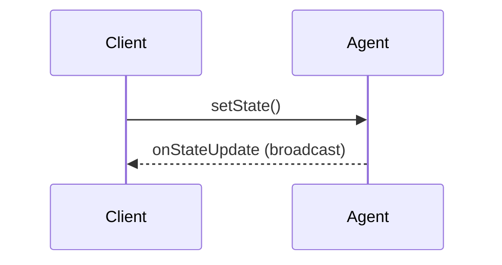

import { TypeScriptExample, LinkCard } from "~/components";

JavaScript runtime — browsers, Node.js, Deno, Bun, 또는 Edge 함수에서 에이전트에 연결하기 — WebSockets 또는 HTTP를 사용하여. SDK는 실시간 상태 동기화, RPC 메소드 호출 및 스트리밍 응답을 제공합니다.

## 제품정보

클라이언트 SDK는 WebSocket 연결과 연결할 수있는 두 가지 방법을 제공하며 HTTP 요청을 만드는 한 가지 방법을 제공합니다.

| 회사 소개         | 사용 사례                             |
| ------------- | --------------------------------- |
| `useAgent`    | React 후크 자동 재연결 및 상태 관리           |
| `AgentClient` | Vanilla JavaScript/TypeScript 클래스 |
| `agentFetch`  | WebSocket이 필요할 때 HTTP 요청          |

모든 클라이언트 제공:

- **양방향 상태 sync**- 푸시 및 실시간 상태 업데이트 수신
- **RPC 통화**- Typed 인수 및 반환 값으로 에이전트 메소드 호출
- **관련 동영상**- AI 완료에 대한 chunked 응답 처리
- **자동 연결**- exponential backoff를 가진 자동적인 reconnection

## 빠른 시작

### React\`\`를

<TypeScriptExample>
  ```ts
  import { useAgent } from "agents/react";

  function Chat() {
  	const agent = useAgent({
  		agent: "ChatAgent",
  		name: "room-123",
  		onStateUpdate: (state) => {
  			console.log("New state:", state);
  		},
  	});

  	const sendMessage = async () => {
  		const response = await agent.call("sendMessage", ["Hello!"]);
  		console.log("Response:", response);
  	};

  	return <button onClick={sendMessage}>Send</button>;
  }
  ```
</TypeScriptExample>

### 바닐라 JavaScript

<TypeScriptExample>
  ```ts
  import { AgentClient } from "agents/client";

  const client = new AgentClient({
  	agent: "ChatAgent",
  	name: "room-123",
  	host: "your-worker.your-subdomain.workers.dev",
  	onStateUpdate: (state) => {
  		console.log("New state:", state);
  	},
  });

  //자주 묻는 질문
  const response = await client.call("sendMessage", ["Hello!"]);
  ```
</TypeScriptExample>

## 에이전트 연결

### 에이전트 이름

더 보기`agent`매개 변수는 에이전트 클래스 이름입니다. camelCase에서 URL에 kebab-case로 자동 변환됩니다.

<TypeScriptExample>
  ```ts
  //이들은 동등합니다:
  useAgent({ agent: "ChatAgent" }); //→ / 시약 / 채팅 시약 / ...
  useAgent({ agent: "MyCustomAgent" }); //→ /agents/my-custom-agent/...
  useAgent({ agent: "LOUD_AGENT" }); //→ / 시약 / 루드 시약 / ...
  ```
</TypeScriptExample>

### Instance 이름

더 보기`name`매개변수는 특정 에이전트 인스턴스를 식별합니다. omitted 경우, 기본값`"default"`:

<TypeScriptExample>
  ```ts
  //특정 채팅방에 연결
  useAgent({ agent: "ChatAgent", name: "room-123" });

  //사용자의 개인 에이전트에 연결
  useAgent({ agent: "UserAgent", name: userId });

  //"default" 인스턴스 사용
  useAgent({ agent: "ChatAgent" });
  ```
</TypeScriptExample>

### 연결 옵션

모두 보기`useAgent`·`AgentClient`연결 선택권을 받아들이십시오:

<TypeScriptExample>
  ```ts
  useAgent({
  	agent: "ChatAgent",
  	name: "room-123",

  	//연결 설정
  	host: "my-worker.workers.dev", //사용자 정의 호스트 (현재 기원과 동일)
  	path: "/custom/path", //주문 경로 prefix

  	//Query 매개 변수 (연결에 의존)
  	query: {
  		token: "abc123",
  		version: "2",
  	},

  	//이벤트 핸들러
  	onOpen: () => console.log("Connected"),
  	onClose: () => console.log("Disconnected"),
  	onError: (error) => console.error("Error:", error),
  });
  ```
</TypeScriptExample>

### Async 쿼리 매개 변수

인증 토큰 또는 기타 동기화 데이터의 경우 Promise를 반환하는 함수를 전달합니다.

<TypeScriptExample>
  ```ts
  useAgent({
  	agent: "ChatAgent",
  	name: "room-123",

  	//Async 쿼리 - 연결하기 전에 호출
  	query: async () => {
  		const token = await getAuthToken();
  		return { token };
  	},

  	//쿼리를 re-fetching 하는 의존
  	queryDeps: [userId],

  	//쿼리 결과에 대한 캐시 TTL (기본값 : 5 분)
  	cacheTtl: 60 * 1000, //1 분
  });
  ```
</TypeScriptExample>

쿼리 함수는 캐쉬 및 re-called 때:

- `queryDeps`(주)
- `cacheTtl`구매하기
- WebSocket 연결 닫기 (자동 캐시 유효성)
- 구성 요소 remounts

:::노트\[자동 캐시 무효]

WebSocket 연결이 닫을 때 - 네트워크 문제, 서버 재시작, 또는 명시된 단식 - async 쿼리 캐시가 자동으로 비활성화됩니다. 클라이언트가 재연결할 때, 쿼리 함수는 신선한 데이터를 fetch로 재처리됩니다. 단속기간 동안 만료될 수 있는 인증 토큰에 특히 중요합니다.

:::

## 국가 동기화

에이전트는 모든 연결된 클라이언트와 양방향 동기화 상태를 유지할 수 있습니다.

### 국가 업데이트

<TypeScriptExample>
  ```ts
  const agent = useAgent({
  	agent: "GameAgent",
  	name: "game-123",
  	onStateUpdate: (state, source) => {
  		//국가: 대리인에서 새로운 국가
  		//소스: "서버" (시약 푸시) 또는 "클라이언트" (당신은 밀어)
  		console.log(`State updated from ${source}:`, state);
  		setGameState(state);
  	},
  });
  ```
</TypeScriptExample>

### Pushing 상태 업데이트

<TypeScriptExample>
  ```ts
  //클라이언트에서 에이전트의 상태를 업데이트
  agent.setState({ score: 100, level: 5 });
  ```
</TypeScriptExample>

전화 번호`setState()`:

1. 상태는 WebSocket에 대리인으로 보내집니다
2. 회사 소개`onStateChanged()`메서드는 호출
3. 에이전트는 모든 연결된 클라이언트에 새로운 상태를 방송
4. 내 계정`onStateUpdate`콜백 화재와`source: "client"`

### 국가 흐름



## 통화 에이전트 방법 (RPC)

당신의 에이전트에 대한 질문 방법`@callable()`.

:::참조

더 보기`@callable()`꾸러미는 외부 런타임 (browsers, other services)에서 호출하는 방법에 대해서만 필요합니다. 동일한 노동자 안에 전화할 때, 당신은 표준을 사용할 수 있습니다[튼튼한 목표 RPC](/durable-objects/best-practices/create-durable-object-stubs-and-send-requests/#invoke-rpc-methods)장식새김 없이 stub에 직접.

:::

### 호출 사용()

<TypeScriptExample>
  ```ts
  //기본 통화
  const result = await agent.call("getUser", [userId]);

  //여러 인수로 통화
  const result = await agent.call("createPost", [title, content, tags]);

  //어떤 인수도 호출
  const result = await agent.call("getStats");
  ```
</TypeScriptExample>

### stub 프록시 사용

더 보기`stub`속성은 메소드 호출을위한 클리너 문법을 제공합니다 :

<TypeScriptExample>
  ```ts
  //대신:
  const user = await agent.call("getUser", ["user-123"]);

  //당신은 쓸 수 있습니다:
  const user = await agent.stub.getUser("user-123");

  //여러 인수는 자연스럽게 작동합니다.
  const post = await agent.stub.createPost(title, content, tags);
  ```
</TypeScriptExample>

### TypeScript 통합

완전한 유형 안전을 위해, 당신의 대리인 종류를 유형 모수로 통과하십시오:

<TypeScriptExample>
  ```ts
  import type { MyAgent } from "./agents/my-agent";

  const agent = useAgent<MyAgent>({
  	agent: "MyAgent",
  	name: "instance-1",
  });

  //이제 stub 방법은 완전히 Typed입니다.
  const result = await agent.stub.processData({ input: "test" });
  ```
</TypeScriptExample>

### 스트리밍 응답

반환 방법`StreamingResponse`, 그들은 도착으로 펑크 핸들:

<TypeScriptExample>
  ```ts
  //대리인 측:
  class MyAgent extends Agent {
  	@callable({ streaming: true })
  	async generateText(stream: StreamingResponse, prompt: string) {
  		for await (const chunk of llm.stream(prompt)) {
  			await stream.write(chunk);
  		}
  	}
  }

  //클라이언트 측:
  await agent.call("generateText", [prompt], {
  	onChunk: (chunk) => {
  		//각 척에 대한 호출
  		appendToOutput(chunk);
  	},
  	onDone: (finalResult) => {
  		//스트림이 완료되면 호출
  		console.log("Complete:", finalResult);
  	},
  	onError: (error) => {
  		//스트리밍이 실패한 경우 호출
  		console.error("Stream error:", error);
  	},
  });
  ```
</TypeScriptExample>

## agentFetch와 HTTP 요청

WebSocket 연결을 유지하지 않고 1-off 요청:

<TypeScriptExample>
  ```ts
  import { agentFetch } from "agents/client";

  //자주 묻는 질문
  const response = await agentFetch({
  	agent: "DataAgent",
  	name: "instance-1",
  	host: "my-worker.workers.dev",
  });

  const data = await response.json();

  //몸에 POST 요청
  const response = await agentFetch(
  	{
  		agent: "DataAgent",
  		name: "instance-1",
  		host: "my-worker.workers.dev",
  	},
  	{
  		method: "POST",
  		headers: { "Content-Type": "application/json" },
  		body: JSON.stringify({ action: "process" }),
  	},
  );
  ```
</TypeScriptExample>

**이용 시`agentFetch`웹소켓:**

| 제품 정보`agentFetch`   | 제품 정보`useAgent`/`AgentClient` |
| ------------------- | ----------------------------- |
| 1회 요청               | 실시간 업데이트                      |
| Server-to-server 통화 | 양방향 통신                        |
| 간단한 REST 스타일 API    | 국가 동기화                        |
| 필요한 영구 연결 없음        | 다중 RPC 통화                     |

## MCP 서버 통합

에이전트가 MCP (Model Context Protocol) 서버를 사용한다면, 상태에 대한 업데이트를받을 수 있습니다.

<TypeScriptExample>
  ```ts
  const agent = useAgent({
  	agent: "AssistantAgent",
  	name: "session-123",
  	onMcpUpdate: (mcpServers) => {
  		//mcpServers는 서버 상태의 레코드입니다.
  		for (const [serverId, server] of Object.entries(mcpServers)) {
  			console.log(`${serverId}: ${server.connectionState}`);
  			console.log(`Tools: ${server.tools?.map((t) => t.name).join(", ")}`);
  		}
  	},
  });
  ```
</TypeScriptExample>

## 오류 처리

### 연결 오류

<TypeScriptExample>
  ```ts
  const agent = useAgent({
  	agent: "MyAgent",
  	onError: (error) => {
  		console.error("WebSocket error:", error);
  	},
  	onClose: () => {
  		console.log("Connection closed, will auto-reconnect...");
  	},
  });
  ```
</TypeScriptExample>

### RPC 오류

<TypeScriptExample>
  ```ts
  try {
  	const result = await agent.call("riskyMethod", [data]);
  } catch (error) {
  	//에이전트 방법으로 오류가 발생
  	console.error("RPC failed:", error.message);
  }
  ```
</TypeScriptExample>

### 스트리밍 오류

<TypeScriptExample>
  ```ts
  await agent.call("streamingMethod", [data], {
  	onChunk: (chunk) => handleChunk(chunk),
  	onError: (errorMessage) => {
  		//Stream-specific 오류 처리
  		console.error("Stream error:", errorMessage);
  	},
  });
  ```
</TypeScriptExample>

## 좋은 관행

### 1. 유형 배를 사용하십시오

<TypeScriptExample>
  ```ts
  //이 경고:
  const user = await agent.stub.getUser(id);

  //이 이상:
  const user = await agent.call("getUser", [id]);
  ```
</TypeScriptExample>

### 2. Reconnection는 자동 입니다

클라이언트 자동 연결 및 대리인은 각 연결에 현재 국가를 자동적으로 보냅니다. 내 계정`onStateUpdate`콜백은 최신 상태로 불릴 것입니다 — 수동 재 동기화가 필요하지 않습니다. async를 사용하는 경우`query`인증 기능, 캐시는 자동으로 분리에 유효하며 신선한 토큰을 재구성합니다.

### 3. 쿼리 캐싱 최적화

<TypeScriptExample>
  ```ts
  //auth 토큰의 경우,
  useAgent({
  	query: async () => ({ token: await getToken() }),
  	cacheTtl: 55 * 60 * 1000, //expiry의 앞에 5 분을 상쾌하게 하십시오
  	queryDeps: [userId], //사용자의 변경 사항
  });
  ```
</TypeScriptExample>

### 4. 연결 청소

vanilla JS에서, 마지막 연결은 할 때:

<TypeScriptExample>
  ```ts
  const client = new AgentClient({ agent: "MyAgent", host: "..." });

  //할 때:
  client.close();
  ```
</TypeScriptExample>

React''''''''''''''''''''''''''''''''''''''''''''''''''''''''''''''''''''''''''''''''''''''''''''''''''''''''''''''''''''''''''''''''''''''''''''''''''''''''''''''''''''''''''''''''''''''''''''''''''''''''''''''''''''''''''''''''''''''''''''''''''''''''''''`useAgent`클린업은 자동적으로 unmount에 취급합니다.

## React훅참고 자료

### 사용AgentOptions

```ts
type UseAgentOptions<State> = {
	//견적 요청
	agent: string; //에이전트 클래스 이름

	//옵션 정보
	name?: string; //인스턴스 이름 (과태: "과태")
	host?: string; //주문 호스트
	path?: string; //주문 경로 prefix

	//Query 매개변수
	query?: Record<string, string> | (() => Promise<Record<string, string>>);
	queryDeps?: unknown[]; //async 쿼리에 대한 의존
	cacheTtl?: number; //ms에서 쿼리 캐시 TTL (기본: 5 분)

	//콜백
	onStateUpdate?: (state: State, source: "server" | "client") => void;
	onMcpUpdate?: (mcpServers: MCPServersState) => void;
	onOpen?: () => void;
	onClose?: () => void;
	onError?: (error: Event) => void;
	onMessage?: (message: MessageEvent) => void;
};
```

### 반환 값

더 보기`useAgent`Hook은 다음과 같은 속성과 메소드를 반환합니다.

| 재산/Method                       | 제품정보      | 이름 \*              |
| ------------------------------- | --------- | ------------------ |
| `agent`                         | `string`  | Kebab-case 에이전트 이름 |
| `name`                          | `string`  | 인스턴스 이름            |
| `setState(state)`               | `void`    | 관련 제품              |
| `call(method, args?, options?)` | `Promise` | 전화 에이전트 방법         |
| `stub`                          | `Proxy`   | Typed 메소드 호출       |
| `send(data)`                    | `void`    | WebSocket 메시지 보내기  |
| `close()`                       | `void`    | 닫기 연결              |
| `reconnect()`                   | `void`    | 힘 연결               |

## 브랜드 이름

### 에이전트ClientOptions

```ts
type AgentClientOptions<State> = {
	//견적 요청
	agent: string; //에이전트 클래스 이름
	host: string; //작업자 호스트

	//옵션 정보
	name?: string; //인스턴스 이름 (과태: "과태")
	path?: string; //주문 경로 prefix
	query?: Record<string, string>;

	//콜백
	onStateUpdate?: (state: State, source: "server" | "client") => void;
};
```

### AgentClient 메소드

| 재산/Method                       | 제품정보      | 이름 \*              |
| ------------------------------- | --------- | ------------------ |
| `agent`                         | `string`  | Kebab-case 에이전트 이름 |
| `name`                          | `string`  | 인스턴스 이름            |
| `setState(state)`               | `void`    | 관련 제품              |
| `call(method, args?, options?)` | `Promise` | 전화 에이전트 방법         |
| `send(data)`                    | `void`    | WebSocket 메시지 보내기  |
| `close()`                       | `void`    | 닫기 연결              |
| `reconnect()`                   | `void`    | 힘 연결               |

클라이언트는 또한 WebSocket 사건 청취자를 지원합니다:

<TypeScriptExample>
  ```ts
  client.addEventListener("open", () => {});
  client.addEventListener("close", () => {});
  client.addEventListener("error", () => {});
  client.addEventListener("message", () => {});
  ```
</TypeScriptExample>

## 다음 단계

<LinkCard title="로그아웃" href="/agents/api-reference/routing/" description="URL 패턴 및 사용자 정의 라우팅 옵션." />

<LinkCard title="자주 묻는 질문" href="/agents/api-reference/callable-methods/" description="클라이언트 서버 방법 전화를 위한 WebSocket에 RPC." />

<LinkCard title="Cross-domain 인증" href="/agents/guides/cross-domain-authentication/" description="도메인을 통한 WebSocket 연결 보안." />

<LinkCard title="채팅 에이전트" href="/agents/getting-started/build-a-chat-agent/" description="AI 채팅과 완벽한 클라이언트 통합." />
