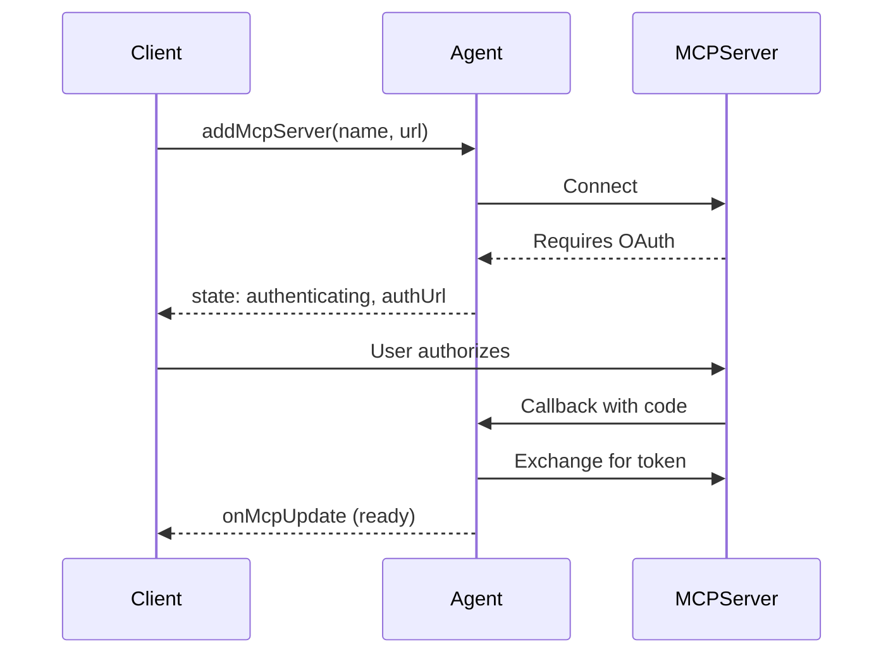

import { Render, TypeScriptExample, LinkCard } from "~/components";

외부에 에이전트를 연결[모형 Context 의정서 (MCP)](/agents/model-context-protocol/)서버는 도구, 리소스 및 프롬프트를 사용합니다. GitHub, Slack, 데이터베이스 및 표준화된 프로토콜을 통해 다른 서비스와 상호 작용할 수 있습니다.

## 제품정보

MCP 클라이언트 기능은 당신의 대리인을 시켰습니다:

- **외부 MCP 서버에 연결**- GitHub, Slack, 데이터베이스, AI 서비스
- **도구 사용**- MCP 서버에 노출된 통화 기능
- **오시는 길**- MCP 서버에서 데이터 읽기
- **연락처**- pre-built 신속한 템플릿

:::참조

이 페이지는 MCP 서버에 클라이언트로 연결됩니다. 자신의 MCP 서버를 만들려면, 참조[MCP 서버 만들기](/agents/api-reference/mcp-agent-api/).

:::

## 빠른 시작

<TypeScriptExample>
  ```ts
  import { Agent } from "agents";

  export class MyAgent extends Agent {
  	async onRequest(request: Request) {
  		//MCP 서버 추가
  		const result = await this.addMcpServer(
  			"github",
  			"https://mcp.github.com/mcp",
  		);

  		if (result.state === "authenticating") {
  			//서버는 OAuth를 요구합니다 - 사용자가 허가하는 리디렉션
  			return Response.redirect(result.authUrl);
  		}

  		//서버가 준비되어 있습니다 - 도구는 이제 사용할 수 있습니다
  		const state = this.getMcpServers();
  		console.log(`Connected! ${state.tools.length} tools available`);

  		return new Response("MCP server connected");
  	}
  }
  ```
</TypeScriptExample>

에이전트의 연결 persist[SQL 저장](/agents/api-reference/store-and-sync-state/), 에이전트가 MCP 서버에 연결 할 때, 그 서버의 모든 도구는 자동으로 사용할 수 있습니다.

## MCP 서버 추가

제품 정보`addMcpServer()`MCP 서버에 연결하십시오. non-OAuth 서버의 경우 옵션이 필요하지 않습니다.

<TypeScriptExample>
  ```ts
  //Non-OAuth 서버 — 옵션 없음
  await this.addMcpServer("notion", "https://mcp.notion.so/mcp");

  //OAuth 서버 - OAuth 리디렉션 흐름을 위한 callbackHost 제공
  await this.addMcpServer("github", "https://mcp.github.com/mcp", {
  	callbackHost: "https://my-worker.workers.dev",
  });
  ```
</TypeScriptExample>

### 교통 옵션

MCP는 다수 수송 유형을 지원합니다:

<TypeScriptExample>
  ```ts
  await this.addMcpServer("server", "https://mcp.example.com/mcp", {
  	transport: {
  		type: "streamable-http",
  	},
  });
  ```
</TypeScriptExample>

| 관련 상품             | 이름 \*                          |
| ----------------- | ------------------------------ |
| `auto`            | 서버 응답에 근거를 두는 자동 탐지 (과태)       |
| `streamable-http` | HTTP 스트리밍                      |
| `sse`             | Server-Sent 이벤트 - 레거시 / 호환성 운송 |

### 공급 업체

인증 뒤에 서버 (Cloudflare\` Access와 같은) 또는 Bearer 토큰을 사용하여:

<TypeScriptExample>
  ```ts
  await this.addMcpServer("internal", "https://internal-mcp.example.com/mcp", {
  	transport: {
  		headers: {
  			Authorization: "Bearer my-token",
  			"CF-Access-Client-Id": "...",
  			"CF-Access-Client-Secret": "...",
  		},
  	},
  });
  ```
</TypeScriptExample>

### URL 보안

MCP 서버 URL은 Server-Side Request Forgery (SSRF)를 방지하기 위해 연결하기 전에 유효합니다. 다음 URL 대상은 차단됩니다:

- 개인/내부 IP 범위 (RFC 1918:`10.x`, `172.16-31.x`, `192.168.x`)
- 루프백 주소 (loopback)`127.x`, `::1`)
- 링크-지역 주소 (`169.254.x`, `fe80::`)
- 클라우드 메타데이터 엔드포인트 (Cloud metadata endpoints)`169.254.169.254`)

내부 MCP 서버에 연결할 필요가 있다면,[RPC 수송](/agents/model-context-protocol/transport/)HTTP 대신 튼튼한 개체 바인딩.

### 반환 값

`addMcpServer()`연결 상태를 반환:

- `ready`- 서버 연결 및 도구 발견
- `authenticating`- 서버는 OAuth를 요구합니다; 사용자에게 리디렉션`authUrl`

## OAuth 인증

많은 MCP 서버는 OAuth 인증을 요구합니다. 대리인은 OAuth 교류를 자동적으로 취급합니다.

### 어떻게 작동합니까?



### 당신의 대리인에 있는 OAuth 취급

<TypeScriptExample>
  ```ts
  class MyAgent extends Agent {
  	async onRequest(request: Request) {
  		const result = await this.addMcpServer(
  			"github",
  			"https://mcp.github.com/mcp",
  		);

  		if (result.state === "authenticating") {
  			//OAuth 인증 페이지로 사용자를 다시
  			return Response.redirect(result.authUrl);
  		}

  		return Response.json({ status: "connected", id: result.id });
  	}
  }
  ```
</TypeScriptExample>

### OAuth 콜백

콜백 URL은 자동으로 구성됩니다:

```txt
https://{host}/{agentsPrefix}/{agent-name}/{instance-name}/callback
```

예를 들면:`https://my-worker.workers.dev/agents/my-agent/default/callback`

OAuth 토큰은 SQLite에 안전하게 저장되며, 에이전트가 재시작합니다.

### OAuth 콜백에서 인스턴스 이름을 보호

사용 방법`sendIdentityOnConnect: false`민감한 인스턴스 이름을 숨기려면 ( 세션 ID 또는 사용자 ID와 같은), 기본 OAuth 콜백 URL은 인스턴스 이름을 노출합니다. 이 보안 문제를 방지하려면 사용자 정의를 제공해야합니다.`callbackPath`.

<TypeScriptExample>
  ```ts
  import { Agent, routeAgentRequest, getAgentByName } from "agents";

  export class SecureAgent extends Agent {
  	static options = { sendIdentityOnConnect: false };

  	async onRequest(request: Request) {
  		//callbackPath는 sendIdentity 때 필요합니다. OnConnect는 false입니다.
  		const result = await this.addMcpServer(
  			"github",
  			"https://mcp.github.com/mcp",
  			{
  				callbackPath: "mcp-oauth-callback", //인스턴스 이름 없는 사용자 정의 경로
  			},
  		);

  		if (result.state === "authenticating") {
  			return Response.redirect(result.authUrl);
  		}

  		return new Response("Connected!");
  	}
  }

  //주문 콜백 경로를 에이전트로 경로
  export default {
  	async fetch(request: Request, env: Env) {
  		const url = new URL(request.url);

  		//Route 사용자 정의 MCP OAuth 콜백 에이전트 인스턴스
  		if (url.pathname.startsWith("/mcp-oauth-callback")) {
  			//세션/auth 메커니즘에서 인스턴스 이름을 추출하기 위해 이것을 구현하십시오.
  			const instanceName = await getInstanceNameFromSession(request);

  			const agent = await getAgentByName(env.SecureAgent, instanceName);
  			return agent.fetch(request);
  		}

  		//표준 대리인 routing
  		return (
  			(await routeAgentRequest(request, env)) ??
  			new Response("Not found", { status: 404 })
  		);
  	},
  } satisfies ExportedHandler<Env>;
  ```
</TypeScriptExample>

:::노트\[전화 대응]

OAuth 콜백은 일치합니다.`state`쿼리 매개 변수 (format:`{serverId}:{stateValue}`), URL 경로에 의해. 이것은 당신의 관례를 의미합니다`callbackPath`어떤 경로가 선택될 수 있습니다, 그 경로에 요청은 올바른 에이전트 인스턴스로 경로를 지정합니다.

:::

### 사용자 정의 OAuth 콜백 처리

OAuth 완료가 처리되는 방법을 구성하십시오. 기본적으로, 성공적인 인증은 애플리케이션 원산지로 리디렉션되며, 인증은 HTML 오류 페이지를 표시합니다.

<TypeScriptExample>
  ```ts
  export class MyAgent extends Agent {
  	onStart() {
  		this.mcp.configureOAuthCallback({
  			//성공 후 Redirect
  			successRedirect: "https://myapp.com/success",

  			//쿼리 문자열에서 오류 메시지와 오류에 대한 간접
  			errorRedirect: "https://myapp.com/error",

  			//또는 사용자 정의 핸들러 사용
  			customHandler: () => {
  				//auth 완료 후 팝업 창 닫기
  				return new Response("<script>window.close();</script>", {
  					headers: { "content-type": "text/html" },
  				});
  			},
  		});
  	}
  }
  ```
</TypeScriptExample>

## MCP 기능 사용

연결되면 서버의 기능에 액세스하십시오.

### 이용 약관

<TypeScriptExample>
  ```ts
  const state = this.getMcpServers();

  //모든 연결된 서버에서 모든 도구
  for (const tool of state.tools) {
  	console.log(`Tool: ${tool.name}`);
  	console.log(`  From server: ${tool.serverId}`);
  	console.log(`  Description: ${tool.description}`);
  }
  ```
</TypeScriptExample>

### 자원 및 신속한

<TypeScriptExample>
  ```ts
  const state = this.getMcpServers();

  //관련 자료
  for (const resource of state.resources) {
  	console.log(`Resource: ${resource.name} (${resource.uri})`);
  }

  //사용 가능
  for (const prompt of state.prompts) {
  	console.log(`Prompt: ${prompt.name}`);
  }
  ```
</TypeScriptExample>

### Server 상태

<TypeScriptExample>
  ```ts
  const state = this.getMcpServers();

  for (const [id, server] of Object.entries(state.servers)) {
  	console.log(`${server.name}: ${server.state}`);
  	//국가 : "ready" | "authenticating" | "connecting" | "connected" | "discovering" | "failed"
  }
  ```
</TypeScriptExample>

### AI SDK 연동

Vercel AI SDK와 MCP 도구를 사용하려면 사용`this.mcp.getAITools()`MCP 툴을 AI SDK 형식으로 변환:

<TypeScriptExample>
  ```ts
  import { generateText } from "ai";
  import { createWorkersAI } from "workers-ai-provider";

  export class MyAgent extends Agent<Env> {
  	async onRequest(request: Request) {
  		const workersai = createWorkersAI({ binding: this.env.AI });
  		const response = await generateText({
  			model: workersai("@cf/zai-org/glm-4.7-flash"),
  			prompt: "What's the weather in San Francisco?",
  			tools: this.mcp.getAITools(),
  		});

  		return new Response(response.text);
  	}
  }
  ```
</TypeScriptExample>

:::참조

`getMcpServers().tools`반환 원료 MCP`Tool`검사를 위한 목표. 제품 정보`this.mcp.getAITools()`AI SDK에 도구를 전달할 때.

:::

## 서버 관리

### 서버 제거

<TypeScriptExample>
  ```ts
  await this.removeMcpServer(serverId);
  ```
</TypeScriptExample>

서버에서 분리하고 저장에서 제거하십시오.

### 이름 \*

MCP 서버 persist 전역 에이전트 재시작:

- SQLite에 저장된 서버 구성
- OAuth 토큰은 안전하게 저장
- 연결은 자동으로 에이전트가 깨질 때

### 모든 서버 목록

<TypeScriptExample>
  ```ts
  const state = this.getMcpServers();

  for (const [id, server] of Object.entries(state.servers)) {
  	console.log(`${id}: ${server.name} (${server.server_url})`);
  }
  ```
</TypeScriptExample>

## Client-side 통합

Connected client는 WebSocket을 통해 실시간 MCP 업데이트를 받습니다:

<TypeScriptExample>
  ```tsx
  import { useAgent } from "agents/react";
  import { useState } from "react";

  function Dashboard() {
  	const [tools, setTools] = useState([]);
  	const [servers, setServers] = useState({});

  	const agent = useAgent({
  		agent: "MyAgent",
  		onMcpUpdate: (mcpState) => {
  			setTools(mcpState.tools);
  			setServers(mcpState.servers);
  		},
  	});

  	return (
  		<div>
  			<h2>Connected Servers</h2>
  			{Object.entries(servers).map(([id, server]) => (
  				<div key={id}>
  					{server.name}: {server.state}
  				</div>
  			))}

  			<h2>Available Tools ({tools.length})</h2>
  			{tools.map((tool) => (
  				<div key={`${tool.serverId}-${tool.name}`}>{tool.name}</div>
  			))}
  		</div>
  	);
  }
  ```
</TypeScriptExample>

## API 참고 자료

### `addMcpServer()`

MCP 서버에 연결하고 에이전트에 사용할 수있는 도구를 만듭니다.

전화 번호`addMcpServer`idempotent는 서버 이름 둘 다 &#xB54C;**·**&#x55;RL은 기존의 활성 연결과 일치합니다. 기존 연결은 중복을 만들지 않고 반환됩니다. 이 호출에 안전`onStart()`재시작에 중복 연결에 대해 걱정 없이.

전화 번호`addMcpServer`같은 이름과 함께**다른 것**URL, 새로운 연결이 생성됩니다. 두 연결은 능동적이고 도구가 결합되어 있습니다.`getAITools()`. 서버를 대체하려면, 호출`removeMcpServer(oldId)`처음.

URL은 비교하기 전에 정상화됩니다 (급료 소시지, 기본 포트 및 hostname 케이스는 취급됩니다), 그래서`https://MCP.Example.com`·`https://mcp.example.com/`동일한 URL로 처리됩니다.

```ts
//HTTP 전송 (Streamable HTTP, SSE)
async addMcpServer(
  serverName: string,
  url: string,
  options?: {
    callbackHost?: string;
    callbackPath?: string;
    agentsPrefix?: string;
    client?: ClientOptions;
    transport?: {
      headers?: HeadersInit;
      type?: "sse" | "streamable-http" | "auto";
    };
    retry?: RetryOptions;
  }
): Promise<
  | { id: string; state: "authenticating"; authUrl: string }
  | { id: string; state: "ready" }
>

//RPC 운송 (Durable Object 바인딩 - HTTP 오버 헤드 없음)
async addMcpServer(
  serverName: string,
  binding: DurableObjectNamespace,
  options?: {
    props?: Record<string, unknown>;
    client?: ClientOptions;
    retry?: RetryOptions;
  }
): Promise<{ id: string; state: "ready" }>
```

#### 매개변수 (HTTP 수송)

- `serverName`(string, required) - MCP 서버의 이름 표시
- `url`(string, required) - MCP 서버 엔드포인트의 URL
- `options`(선택 사항) - 연결 구성 :
  - `callbackHost`— OAuth 콜백 URL 호스트. OAuth-authenticated 서버에서만 필요합니다. omitted 경우, 자동으로 들어오는 요청에서 파생
  - `callbackPath`- 사용자 정의 콜백 URL 경로는 기본값을 우회합니다.`/agents/{class}/{name}/callback`건설.**자주 묻는 질문`sendIdentityOnConnect`이름 \*`false`**&#xC778;스턴스 이름을 누출 방지하기 위해. 설정할 때 콜백 URL이`{callbackHost}/{callbackPath}`. 이 경로를 에이전트 인스턴스로 전달해야 합니다.`getAgentByName`
  - `agentsPrefix`- OAuth 콜백 경로의 URL 접두사. 기본 정보:`"agents"`. 때 무시`callbackPath`이용안내
  - `client`- MCP 클라이언트 구성 옵션 (passed to`@modelcontextprotocol/sdk`클라이언트 constructor). 기본적으로 포함`CfWorkerJsonSchemaValidator`JSON schemas에 대한 검증 도구 매개 변수
  - `transport`— 수송 층 윤곽:
    - `headers`- 인증을위한 사용자 정의 HTTP 헤더
    - `type`— 수송 유형:`"auto"`(과태)`"streamable-http"`, 또는`"sse"`
  - `retry`— 연결 및 재연결 시도에 대한 구호 옵션. 재해 또는 OAuth 완료 후 연결을 복원 및 사용. 과태: 3개의 시도, 500ms 기본적인 지연, 5s 최대 지연. 더 알아보기[이름 \*](/agents/api-reference/retries/)자주 묻는 질문`RetryOptions`.

#### 매개변수 (RPC 수송)

- `serverName`(string, required) - MCP 서버의 이름 표시
- `binding` (`DurableObjectNamespace`, 필수) - 내구성 객체 바인딩`McpAgent`한국어
- `options`(선택 사항) - 연결 구성 :
  - `props`- 초기화 데이터 전달`McpAgent`이름 \*`onStart(props)`. MCP 서버 인스턴스에 user context, configuration, 또는 기타 데이터를 전달하기 위해 이것을 사용하십시오.
  - `client`- MCP 클라이언트 구성 옵션
  - `retry`— 연결 옵션

RPC 수송은 당신의 대리인을 직접 연결합니다`McpAgent`HTTP overhead 없이 튼튼한 목표 바인딩을 통해. 더 알아보기[MCP 운송](/agents/model-context-protocol/transport/)RPC 수송을 구성하는 세부사항을 위해.

#### 기타 제품

연결 상태에 근거를 둔 차별적인 조합에 해결하는 약속:

- 시간 :`state`이름 \*`"authenticating"`:
  - `id`(string) - 이 서버 연결을 위한 고유 식별자
  - `state` (`"authenticating"`) — 서버는 OAuth 허가를 기다리고 있습니다
  - `authUrl`(string) — OAuth 사용자 인증 URL

- 시간 :`state`이름 \*`"ready"`:
  - `id`(string) - 이 서버 연결을 위한 고유 식별자
  - `state` (`"ready"`) — 서버는 완전히 연결되고 조작상입니다

### `removeMcpServer()`

MCP 서버에서 분리하고 리소스를 정리합니다.

```ts
async removeMcpServer(id: string): Promise<void>
```

#### 매개 변수

- `id`(string, required) - 서버 연결 ID가 반환됨`addMcpServer()`

### `getMcpServers()`

모든 MCP 서버 연결의 현재 상태를 가져옵니다.

```ts
getMcpServers(): MCPServersState
```

#### 기타 제품

```ts
type MCPServersState = {
	servers: Record<
		string,
		{
			name: string;
			server_url: string;
			auth_url: string | null;
			state:
				| "authenticating"
				| "connecting"
				| "connected"
				| "discovering"
				| "ready"
				| "failed";
			capabilities: ServerCapabilities | null;
			instructions: string | null;
			error: string | null;
		}
	>;
	tools: Array<Tool & { serverId: string }>;
	prompts: Array<Prompt & { serverId: string }>;
	resources: Array<Resource & { serverId: string }>;
	resourceTemplates: Array<ResourceTemplate & { serverId: string }>;
};
```

더 보기`state`필드는 연결 수명주기를 나타냅니다:

- `authenticating`— OAuth 승인을위한 대기
- `connecting`— 수송 연결 설치
- `connected`— 수송 연결 설치
- `discovering`— 서버 기능 발견 (툴, 리소스, 프롬프트)
- `ready`- 완전 연결 및 운영
- `failed`— 연결 실패 (see)`error`상세 정보)

더 보기`error`필드에는 오류 메시지가 포함되어 있습니다.`state`이름 \*`"failed"`. 외부 OAuth 공급자의 오류 메시지는 XSS 공격을 방지하기 위해 자동으로 탈출되어 UI에서 직접 표시 할 수 있습니다.

### `configureOAuthCallback()`

인증이 필요한 MCP 서버의 OAuth 콜백 동작을 구성합니다. 이 방법은 사용자가 OAuth 승인을 완료 한 후 무슨 일이 일어나는지 사용자 정의 할 수 있습니다.

```ts
this.mcp.configureOAuthCallback(options: {
  successRedirect?: string;
  errorRedirect?: string;
  customHandler?: () => Response | Promise<Response>;
}): void
```

#### 매개 변수

- `options`(필수) — OAuth 콜백 구성:
  - `successRedirect`(문자, 옵션) - 성공적인 인증 후 리디렉션하는 URL
  - `errorRedirect`(문자, 옵션) - 실패한 인증 후 리디렉션하는 URL. 오류 메시지가 부과됩니다.`?error=<message>`쿼리 매개 변수
  - `customHandler`(기능, 옵션) - 콜백 응답에 대한 완전한 제어를위한 사용자 정의 핸들러. 응답을 반환

#### 기본 동작

구성이 없는 경우:

- **지원하다**: 당신의 신청 근원에 Redirects
- **실패**: 오류 메시지가있는 HTML 오류 페이지를 표시합니다.

OAuth가 실패하면 연결 상태가됩니다.`"failed"`오류 메시지가 저장됩니다.`server.error`UI에 표시된 필드.

#### 제품 정보

설정하기`onStart()`어떤 OAuth 흐름 전에 시작:

<TypeScriptExample>
  ```ts
  export class MyAgent extends Agent {
  	onStart() {
  		//옵션 1: 간단한 리디렉션
  		this.mcp.configureOAuthCallback({
  			successRedirect: "/dashboard",
  			errorRedirect: "/auth-error",
  		});

  		//옵션 2 : 사용자 정의 핸들러 (예 : 팝업 창 용)
  		this.mcp.configureOAuthCallback({
  			customHandler: () => {
  				return new Response("<script>window.close();</script>", {
  					headers: { "content-type": "text/html" },
  				});
  			},
  		});
  	}
  }
  ```
</TypeScriptExample>

## OAuth 공급자

MCP 서버에 연결할 때 사용되는 기본 OAuth 제공 업체를 무시`createMcpOAuthProvider()`당신의 대리인 종류에. 이 통합된 클라이언트 자격 증명 또는 mTLS와 같은 사용자 정의 인증 전략을 가능하게 합니다.

override는 새로운 연결을 위해 사용됩니다 (`addMcpServer`) 그리고 튼튼한 목표 재시작 후에 복원된 연결.

<TypeScriptExample>
  ```ts
  import { Agent } from "agents";
  import type { AgentMcpOAuthProvider } from "agents";

  export class MyAgent extends Agent<Env> {
  	createMcpOAuthProvider(callbackUrl: string): AgentMcpOAuthProvider {
  		const env = this.env;
  		return {
  			get redirectUrl() {
  				return callbackUrl;
  			},
  			get clientMetadata() {
  				return {
  					client_id: env.MCP_CLIENT_ID,
  					client_secret: env.MCP_CLIENT_SECRET,
  					redirect_uris: [callbackUrl],
  				};
  			},
  			clientInformation() {
  				return {
  					client_id: env.MCP_CLIENT_ID,
  					client_secret: env.MCP_CLIENT_SECRET,
  				};
  			},
  		};
  	}
  }
  ```
</TypeScriptExample>

이 방법을 무시하지 않는 경우, 에이전트는 수행 기본 공급자를 사용[OAuth 2.0 동적 클라이언트 등록](https://datatracker.ietf.org/doc/html/rfc7591)MCP 서버로.

### 주문 저장 backend

내장 된 OAuth 로직 (CSRF state, PKCE, nonce generation, 토큰 관리)을 유지하지만 다른 백엔드에 토큰 저장을 경로, 수입`DurableObjectOAuthClientProvider`그리고 당신의 자신의 저장 접합기를 통과하십시오:

<TypeScriptExample>
  ```ts
  import { Agent, DurableObjectOAuthClientProvider } from "agents";
  import type { AgentMcpOAuthProvider } from "agents";

  export class MyAgent extends Agent {
  	createMcpOAuthProvider(callbackUrl: string): AgentMcpOAuthProvider {
  		return new DurableObjectOAuthClientProvider(
  			myCustomStorage, //StrongObjectStorage 호환 어댑터
  			this.name,
  			callbackUrl,
  		);
  	}
  }
  ```
</TypeScriptExample>

## 고급: MCPClientManager

정밀한 곡물 통제를 위해, 사용`this.mcp`직접:

### 단계별 연결

<TypeScriptExample>
  ```ts
  //1. 서버 등록 ( 저장에 저장하고 in-memory 연결을 만듭니다)
  const id = "my-server";
  await this.mcp.registerServer(id, {
  	url: "https://mcp.example.com/mcp",
  	name: "My Server",
  	callbackUrl: "https://my-worker.workers.dev/agents/my-agent/default/callback",
  	transport: { type: "auto" },
  });

  //2. 연결 (운송, 필요한 경우 OAuth 핸들)
  const connectResult = await this.mcp.connectToServer(id);

  if (connectResult.state === "failed") {
  	console.error("Connection failed:", connectResult.error);
  	return;
  }

  if (connectResult.state === "authenticating") {
  	console.log("OAuth required:", connectResult.authUrl);
  	return;
  }

  //3. "connected"에서 "ready"로 전환
  if (connectResult.state === "connected") {
  	const discoverResult = await this.mcp.discoverIfConnected(id);

  	if (!discoverResult?.success) {
  		console.error("Discovery failed:", discoverResult?.error);
  	}
  }
  ```
</TypeScriptExample>

### 이벤트 구독

<TypeScriptExample>
  ```ts
  //상태 변경에 대한 듣기 (onServerStateChanged는 Event<void>)
  const disposable = this.mcp.onServerStateChanged(() => {
  	console.log("MCP server state changed");
  	this.broadcastMcpServers(); //연결된 고객
  });

  //더 이상 필요로 할 때 가입을 청소
  //처분할 수 있는.dispose ();
  ```
</TypeScriptExample>

:::참조
MCP 서버 목록 방송 (`cf_agent_mcp_servers`)는 자동적으로 연결을 제외하고[`shouldSendProtocolMessages`](/agents/api-reference/protocol-messages/)이름 \*`false`.
:::

### Lifecycle 방법

#### `this.mcp.registerServer()`

즉시 연결 없이 서버 등록.

```ts
async registerServer(
  id: string,
  options: {
    url: string;
    name: string;
    callbackUrl: string;
    clientOptions?: ClientOptions;
    transportOptions?: TransportOptions;
  }
): Promise<string>
```

#### `this.mcp.connectToServer()`

이전에 등록된 서버에 연결하기.

```ts
async connectToServer(id: string): Promise<MCPConnectionResult>

type MCPConnectionResult =
  | { state: "failed"; error: string }
  | { state: "authenticating"; authUrl: string }
  | { state: "connected" }
```

#### `this.mcp.discoverIfConnected()`

연결이 활성화되면 서버 기능을 확인합니다.

```ts
async discoverIfConnected(
  serverId: string,
  options?: { timeoutMs?: number }
): Promise<MCPDiscoverResult | undefined>

type MCPDiscoverResult = {
  success: boolean;
  state: MCPConnectionState;
  error?: string;
}
```

#### `this.mcp.waitForConnections()`

모든 in-flight MCP 연결 및 발견 작업에 대한 기대. 당신이 필요로 할 때 유용합니다`this.mcp.getAITools()`에이전트가 hibernation에서 깨어난 후 즉시 도구의 전체 세트를 반환합니다.

```ts
//자주 묻는 질문
await this.mcp.waitForConnections();

//타임 아웃 (milliseconds)
await this.mcp.waitForConnections({ timeout: 10_000 });
```

:::참조
`AIChatAgent`호출이 자동으로 그것의[`waitForMcpConnections`](/agents/api-reference/chat-agents/#waitformcpconnections)재산 (과태)`{ timeout: 10_000 }`). 당신은 단지 필요`waitForConnections()`자주 묻는 질문`Agent`MCP로, 또는 당신이 안쪽으로 더 정밀한 통제를 원할 때`onChatMessage`.
:::

#### `this.mcp.closeConnection()`

특정 서버에 연결하여 등록을 유지하고 있습니다.

```ts
async closeConnection(id: string): Promise<void>
```

#### `this.mcp.closeAllConnections()`

등록을 취소하는 동안 모든 활성 서버 연결을 닫습니다.

```ts
async closeAllConnections(): Promise<void>
```

#### `this.mcp.getAITools()`

AI SDK와 호환되는 형식으로 모든 MCP 도구를 가져옵니다.

```ts
getAITools(): ToolSet
```

도구는 서버 ID에 의해 자동으로 네임스페이스로 여러 MCP 서버가 동일한 이름으로 도구를 노출할 때 충돌을 방지합니다.

## 오류 처리

연결 오류를 처리하는 오류 감지 유틸리티를 사용합니다.

<TypeScriptExample>
  ```ts
  import { isUnauthorized, isTransportNotImplemented } from "agents";

  export class MyAgent extends Agent {
  	async onRequest(request: Request) {
  		try {
  			await this.addMcpServer("Server", "https://mcp.example.com/mcp");
  		} catch (error) {
  			if (isUnauthorized(error)) {
  				return new Response("Authentication required", { status: 401 });
  			} else if (isTransportNotImplemented(error)) {
  				return new Response("Transport not supported", { status: 400 });
  			}
  			throw error;
  		}
  	}
  }
  ```
</TypeScriptExample>

## 다음 단계

<LinkCard title="MCP 서버 만들기" href="/agents/api-reference/mcp-agent-api/" description="자체 MCP 서버를 구축하십시오." />

<LinkCard title="클라이언트 SDK" href="/agents/api-reference/client-sdk/" description="onMcpUpdate와 브라우저에서 연결하십시오." />

<LinkCard title="저장 및 동기화 상태" href="/agents/api-reference/store-and-sync-state/" description="에이전트 지속에 대해 알아보기." />
