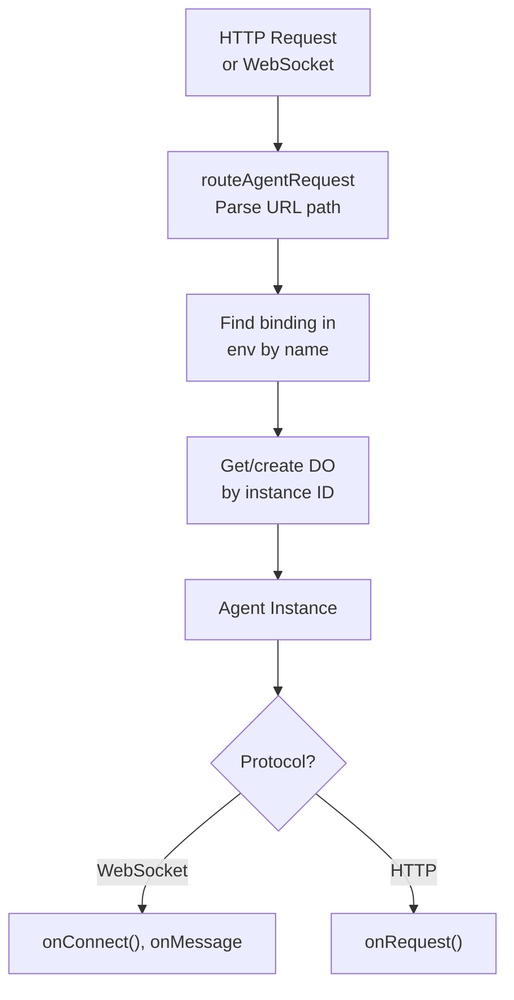

import { TypeScriptExample, WranglerConfig, LinkCard } from "~/components";

이 가이드는 에이전트에 대한 요청이 경로를 설명하고, naming 작품 및 에이전트를 구성하기위한 패턴.

## 어떻게 작동합니까?

요청이 있을 때,`routeAgentRequest()`URL을 검사하고 적절한 에이전트 인스턴스에 경로:

```txt
https://your-worker.dev/agents/{agent-name}/{instance-name}
                               └────┬────┘   └─────┬─────┘
                               Class name     Unique instance ID
                              (kebab-case)
```

**예 URL:**

| 사이트 맵                      | 에이전트 클래스   | 이름 \*      |
| -------------------------- | ---------- | ---------- |
| `/agents/counter/user-123` | `Counter`  | `user-123` |
| `/agents/chat-room/lobby`  | `ChatRoom` | `lobby`    |
| `/agents/my-agent/default` | `MyAgent`  | `default`  |

## 이름 해결책

에이전트 클래스 이름은 URL에 대한 kebab-case로 자동 변환됩니다.

| 클래스 이름        | URL 경로                     |
| ------------- | -------------------------- |
| `Counter`     | `/agents/counter/...`      |
| `MyAgent`     | `/agents/my-agent/...`     |
| `ChatRoom`    | `/agents/chat-room/...`    |
| `AIAssistant` | `/agents/ai-assistant/...` |

라우터는 원래 이름과 kebab-case 버전을 모두 일치하므로 다음을 사용할 수 있습니다.

- `useAgent({ agent: "Counter" })` → `/agents/counter/...`
- `useAgent({ agent: "counter" })` → `/agents/counter/...`

## routeAgentRequest 사용()

더 보기`routeAgentRequest()`기능은 대리인 여정을 위한 주요 입장 점입니다:

<TypeScriptExample>
  ```ts
  import { routeAgentRequest } from "agents";

  export default {
  	async fetch(request: Request, env: Env, ctx: ExecutionContext) {
  		//Route to Agent - 응답 또는 정의를 반환
  		const agentResponse = await routeAgentRequest(request, env);

  		if (agentResponse) {
  			return agentResponse;
  		}

  		//일치하지 않음 - 다른 경로 처리
  		return new Response("Not found", { status: 404 });
  	},
  } satisfies ExportedHandler<Env>;
  ```
</TypeScriptExample>

## Instance naming 패턴

인스턴스명(URL의 마지막 부분)은 에이전트 인스턴스가 요청을 처리하는 것을 결정합니다. 각 고유의 이름은 자신의 상태로 자체 격리 된 대리인을 가져옵니다.

### Per-user 대리인

각 사용자는 자신의 대리인 인스턴스를 가져옵니다:

<TypeScriptExample>
  ```ts
  //회사 소개
  const agent = useAgent({
  	agent: "UserProfile",
  	name: `user-${userId}`, //예, "user-abc123"
  });
  ```
</TypeScriptExample>

```txt
/agents/user-profile/user-abc123 → User abc123's agent
/agents/user-profile/user-xyz789 → User xyz789's agent (separate instance)
```

### 공용 객실

여러 사용자가 동일한 에이전트 인스턴스를 공유:

<TypeScriptExample>
  ```ts
  //회사 소개
  const agent = useAgent({
  	agent: "ChatRoom",
  	name: roomId, //e.g., "일반"또는 "room-42"
  });
  ```
</TypeScriptExample>

```txt
/agents/chat-room/general → All users in "general" share this agent
```

### 글로벌 싱글톤

전체 애플리케이션의 단일 인스턴스:

<TypeScriptExample>
  ```ts
  //회사 소개
  const agent = useAgent({
  	agent: "AppConfig",
  	name: "default", //또는 어떤 일관된 이름
  });
  ```
</TypeScriptExample>

### 동적인 naming

context를 기반으로 인스턴스 이름을 생성:

<TypeScriptExample>
  ```ts
  //회사연혁
  const agent = useAgent({
  	agent: "Session",
  	name: sessionId,
  });

  //한국어
  const agent = useAgent({
  	agent: "Document",
  	name: `doc-${documentId}`,
  });

  //퍼 게임
  const agent = useAgent({
  	agent: "Game",
  	name: `game-${gameId}-${Date.now()}`,
  });
  ```
</TypeScriptExample>

## 사용자 정의 URL 라우팅

URL 구조에 대한 제어가 필요한 고급 사용 사례를 위해 기본적으로 우회할 수 있습니다.`/agents/{agent}/{name}`패턴.

### BasePath 사용 (클라이언트 측)

더 보기`basePath`옵션은 클라이언트는 URL 경로에 연결:

<TypeScriptExample>
  ```ts
  //클라이언트는 /agents/user-agent/ 대신 /user에 연결 ...
  const agent = useAgent({
  	agent: "UserAgent", //BasePath가 설정되면 필수하지만 무시
  	basePath: "user", //→ /user에 연결
  });
  ```
</TypeScriptExample>

이 때 유용합니다:

- 깨끗한 URL을 원합니다.`/agents/`연락처
- 인스턴스 이름은 결정된 서버 측 (예를 들면, auth/session)
- 기존 URL 구조로 통합되어 있습니다.

### Server-side 인스턴스 선택

사용 방법`basePath`, 서버는 routing를 취급해야 합니다. 제품 정보`getAgentByName()`에이전트 인스턴스를 얻기 위해, 다음 요청을 전달`fetch()`:

<TypeScriptExample>
  ```ts
  export default {
  	async fetch(request: Request, env: Env) {
  		const url = new URL(request.url);

  		//Custom routing - 서버는 세션에서 인스턴스를 결정합니다.
  		if (url.pathname.startsWith("/user/")) {
  			const session = await getSession(request);
  			const agent = await getAgentByName(env.UserAgent, session.userId);
  			return agent.fetch(request); //대리인에 직접 앞으로 요구
  		}

  		//표준 / 시약 / ... 경로에 대한 기본 라우팅
  		return (
  			(await routeAgentRequest(request, env)) ??
  			new Response("Not found", { status: 404 })
  		);
  	},
  } satisfies ExportedHandler<Env>;
  ```
</TypeScriptExample>

### 동적 인스턴스를 가진 사용자 정의 경로

다른 인스턴스에 다른 경로:

<TypeScriptExample>
  ```ts
  //Route /chat/{room} 에 ChatRoom 에이전트
  if (url.pathname.startsWith("/chat/")) {
  	const roomId = url.pathname.replace("/chat/", "");
  	const agent = await getAgentByName(env.ChatRoom, roomId);
  	return agent.fetch(request);
  }

  //Route /doc/{id} 문서 에이전트
  if (url.pathname.startsWith("/doc/")) {
  	const docId = url.pathname.replace("/doc/", "");
  	const agent = await getAgentByName(env.Document, docId);
  	return agent.fetch(request);
  }
  ```
</TypeScriptExample>

### 인스턴스 ID 받기 (client-side)

사용 방법`basePath`, 클라이언트는 서버가이 정보를 반환 할 때까지 연결되는 것을 알 수 없습니다. 대리인은 연결에 그것의 ID를 자동적으로 보냅니다:

<TypeScriptExample>
  ```tsx
  const agent = useAgent({
  	agent: "UserAgent",
  	basePath: "user",
  	onIdentity: (name, agentType) => {
  		console.log(`Connected to ${agentType} instance: ${name}`);
  		//e.g., "사용자 시약 인스턴스에 연결 : user-123"
  	},
  });

  //Reactive state - ID가 수신될 때 재 렌더링
  return (
  	<div>
  		{agent.identified ? `Connected to: ${agent.name}` : "Connecting..."}
  	</div>
  );
  ```
</TypeScriptExample>

제품 정보`AgentClient`:

<TypeScriptExample>
  ```ts
  const agent = new AgentClient({
  	agent: "UserAgent",
  	basePath: "user",
  	host: "example.com",
  	onIdentity: (name, agentType) => {
  		//실제 인스턴스 이름을 가진 UI 업데이트
  		setInstanceName(name);
  	},
  });

  //진행하기 전에 ID를 기다립니다
  await agent.ready;
  console.log(agent.name); //이제 서버 정의 이름이 있습니다.
  ```
</TypeScriptExample>

### 재연결에 대한 ID 변경

재연결에 대한 정체가 변경되는 경우 (예를 들어, 세션 만료 및 사용자 로그는 다른 사람으로), 당신은 그것을 처리 할 수 있습니다`onIdentityChange`:

<TypeScriptExample>
  ```ts
  const agent = useAgent({
  	agent: "UserAgent",
  	basePath: "user",
  	onIdentityChange: (oldName, newName, oldAgent, newAgent) => {
  		console.log(`Session changed: ${oldName} → ${newName}`);
  		//새로 고침 국가, 표시 알림, 등.
  	},
  });
  ```
</TypeScriptExample>

이름 \*`onIdentityChange`경고는 예기치 않은 세션 변경을 돕기 위해 로그인되지 않습니다.

### 보안에 대한 정체성을 제거

인스턴스 이름이 민감한 데이터 (session ID, 내부 사용자 ID)를 포함하면 ID 전송을 비활성화 할 수 있습니다.

<TypeScriptExample>
  ```ts
  class SecureAgent extends Agent {
  	//클라이언트에 인스턴스 이름을 노출하지 마십시오.
  	static options = { sendIdentityOnConnect: false };
  }
  ```
</TypeScriptExample>

ID가 비활성화되면:

- `agent.identified`이름 \*`false`
- `agent.ready`결코 해결되지 않음 (사용 상태 업데이트 대신)
- `onIdentity`·`onIdentityChange`하지 않는

### 주문 여정을 사용할 때

| 채용정보                       | 계정 관리                                   |
| -------------------------- | --------------------------------------- |
| 표준 대리인 접근                  | 기본 정보`/agents/{agent}/{name}`           |
| auth/session의 인스턴스         | `basePath` + `getAgentByName` + `fetch` |
| 깨끗한 URL (없음)`/agents/`접두사) | `basePath`+ 맞춤 라우팅                      |
| Legacy URL 구조              | `basePath`+ 맞춤 라우팅                      |
| routing 논리                 | Worker에 있는 관례 여정                        |

## 옵션 선택

모두 보기`routeAgentRequest()`·`getAgentByName()`routing 행동을 사용자 정의하기위한 옵션을 받아들입니다.

### 사이트맵

cross-origin 요청을 위해 (당신의 frontend가 다른 도메인에 있을 때):

<TypeScriptExample>
  ```ts
  const response = await routeAgentRequest(request, env, {
  	cors: true, //기본 CORS 헤더 사용
  });
  ```
</TypeScriptExample>

또는 사용자 정의 CORS 헤더 :

<TypeScriptExample>
  ```ts
  const response = await routeAgentRequest(request, env, {
  	cors: {
  		"Access-Control-Allow-Origin": "https://myapp.com",
  		"Access-Control-Allow-Methods": "GET, POST, OPTIONS",
  		"Access-Control-Allow-Headers": "Content-Type, Authorization",
  	},
  });
  ```
</TypeScriptExample>

### 위치 hints

대기 오염 물질의 경우, 에이전트가 실행되어야하는 힌트 :

<TypeScriptExample>
  ```ts
  //getAgentByName로
  const agent = await getAgentByName(env.MyAgent, "instance-name", {
  	locationHint: "enam", //북아메리카
  });

  //routeAgentRequest (모든 일치 에이전트에 적용)
  const response = await routeAgentRequest(request, env, {
  	locationHint: "enam",
  });
  ```
</TypeScriptExample>

유효한 위치 hints:`wnam`, `enam`, `sam`, `weur`, `eeur`, `apac`, `oc`, `afr`, `me`

### 관할권

자료 residency 필요조건을 위해:

<TypeScriptExample>
  ```ts
  //getAgentByName로
  const agent = await getAgentByName(env.MyAgent, "instance-name", {
  	jurisdiction: "eu", //EU 관할권
  });

  //routeAgentRequest (모든 일치 에이전트에 적용)
  const response = await routeAgentRequest(request, env, {
  	jurisdiction: "eu",
  });
  ```
</TypeScriptExample>

### 회사 소개

대리인이 직접 건설하기 보다는 오히려 runtime에 의해 순간적으로,`props`초기화 인수를 전달하는 방법을 제공합니다:

<TypeScriptExample>
  ```ts
  const agent = await getAgentByName(env.MyAgent, "instance-name", {
  	props: {
  		userId: session.userId,
  		config: { maxRetries: 3 },
  	},
  });
  ```
</TypeScriptExample>

Props는 대리인의에 통과됩니다`onStart`lifecycle 방법:

<TypeScriptExample>
  ```ts
  class MyAgent extends Agent<Env, State> {
  	private userId?: string;
  	private config?: { maxRetries: number };

  	async onStart(props?: { userId: string; config: { maxRetries: number } }) {
  		this.userId = props?.userId;
  		this.config = props?.config;
  	}
  }
  ```
</TypeScriptExample>

사용 방법`props`이름 \*`routeAgentRequest`, 동일한 props는 어느 대리인이 URL을 일치하도록 통과했습니다. 인증과 같은 유니버셜 컨텍스트에 대해 잘 작동합니다.

<TypeScriptExample>
  ```ts
  export default {
  	async fetch(request, env) {
  		const session = await getSession(request);
  		return routeAgentRequest(request, env, {
  			props: { userId: session.userId, role: session.role },
  		});
  	},
  } satisfies ExportedHandler<Env>;
  ```
</TypeScriptExample>

에이전트 별 초기화, 사용`getAgentByName`대신 에이전트가 props를받을 정확히 제어하는 곳.

:::참조
제품 정보`McpAgent`, 버팀대는 자동적으로 저장되고 접근가능합니다`this.props`. 참고[MCP 서버](/agents/api-reference/mcp-agent-api/)상세 정보
주요 특징

### 훅

`routeAgentRequest`에이전트에 도달하기 전에 수신 요청에 대한 후크를 지원:

<TypeScriptExample>
  ```ts
  const response = await routeAgentRequest(request, env, {
  	onBeforeConnect: (req, lobby) => {
  		//WebSocket 연결 전에 호출
  		//거부, 수정, 또는 계속하려면 응답을 반환
  	},
  	onBeforeRequest: (req, lobby) => {
  		//HTTP 요청 전에 호출
  		//거부, 수정, 또는 계속하려면 응답을 반환
  	},
  });
  ```
</TypeScriptExample>

이 후크는 인증 및 검증에 유용합니다. 더 알아보기[Cross-domain 인증](/agents/guides/cross-domain-authentication/)상세한 예제.

## Server-side 에이전트 액세스

Worker 코드를 사용하여 에이전트에 액세스 할 수 있습니다.`getAgentByName()`RPC 통화의 경우:

<TypeScriptExample>
  ```ts
  import { getAgentByName, routeAgentRequest } from "agents";

  export default {
  	async fetch(request: Request, env: Env) {
  		const url = new URL(request.url);

  		//에이전트와 상호 작용하는 API 엔드포인트
  		if (url.pathname === "/api/increment") {
  			const counter = await getAgentByName(env.Counter, "global-counter");
  			const newCount = await counter.increment();
  			return Response.json({ count: newCount });
  		}

  		//일반 대리인 routing
  		return (
  			(await routeAgentRequest(request, env)) ??
  			new Response("Not found", { status: 404 })
  		);
  	},
  } satisfies ExportedHandler<Env>;
  ```
</TypeScriptExample>

같은 옵션`locationHint`, `jurisdiction`·`props`, 참조[옵션 선택](#routing-options).

## 하위 경로 및 HTTP 방법

요청은 인스턴스 이름 이후에 하위 경로가 포함될 수 있습니다. 이들은 당신의 대리인에 통과됩니다`onRequest()`핸들:

```txt
/agents/api/v1/users     → agent: "api", instance: "v1", path: "/users"
/agents/api/v1/users/123 → agent: "api", instance: "v1", path: "/users/123"
```

당신의 대리인에 있는 subpaths를 취급하십시오:

<TypeScriptExample>
  ```ts
  export class API extends Agent {
  	async onRequest(request: Request): Promise<Response> {
  		const url = new URL(request.url);

  		//url.pathname은 /agents/api/v1/를 포함한 전체 경로가 포함되어 있습니다.
  		//에이전트의 기본 경로 후 하위 경로 추출
  		const path = url.pathname.replace(/^\/agents\/api\/[^/]+/, "");

  		if (request.method === "GET" && path === "/users") {
  			return Response.json(await this.getUsers());
  		}

  		if (request.method === "POST" && path === "/users") {
  			const data = await request.json();
  			return Response.json(await this.createUser(data));
  		}

  		return new Response("Not found", { status: 404 });
  	}
  }
  ```
</TypeScriptExample>

## 다수 대리인

하나의 프로젝트에서 여러 에이전트 클래스를 가질 수 있습니다. 각은 자신의 네임스페이스를 가져옵니다:

<TypeScriptExample>
  ```ts
  //서버.ts
  export { Counter } from "./agents/counter";
  export { ChatRoom } from "./agents/chat-room";
  export { UserProfile } from "./agents/user-profile";

  export default {
  	async fetch(request: Request, env: Env) {
  		return (
  			(await routeAgentRequest(request, env)) ??
  			new Response("Not found", { status: 404 })
  		);
  	},
  } satisfies ExportedHandler<Env>;
  ```
</TypeScriptExample>

<WranglerConfig>
  ```jsonc
  {
  	"durable_objects": {
  		"bindings": [
  			{ "name": "Counter", "class_name": "Counter" },
  			{ "name": "ChatRoom", "class_name": "ChatRoom" },
  			{ "name": "UserProfile", "class_name": "UserProfile" },
  		],
  	},
  	"migrations": [
  		{
  			"tag": "v1",
  			"new_sqlite_classes": ["Counter", "ChatRoom", "UserProfile"],
  		},
  	],
  }
  ```
</WranglerConfig>

각 대리인은 그것의 자신의 길을 통해 접근됩니다:

```txt
/agents/counter/...
/agents/chat-room/...
/agents/user-profile/...
```

## 주문 흐름

여기에서 시스템의 요청 흐름은 다음과 같습니다.



## 인증 획득

에이전트에 도달하기 전에 요청을 인증하는 몇 가지 방법이 있습니다.

### 인증 후크 사용

더 보기`routeAgentRequest()`기능 제공`onBeforeConnect`·`onBeforeRequest`인증 후크:

<TypeScriptExample>
  ```ts
  import { Agent, routeAgentRequest } from "agents";

  export default {
  	async fetch(request: Request, env: Env) {
  		return (
  			(await routeAgentRequest(request, env, {
  				//WebSocket 연결 이전
  				onBeforeConnect: async (request) => {
  					const token = new URL(request.url).searchParams.get("token");
  					if (!(await verifyToken(token, env))) {
  						//연결을 거부하는 응답을 반환
  						return new Response("Unauthorized", { status: 401 });
  					}
  					//연결을 허용하지 않는 반환
  				},
  				//HTTP 요청 전에 실행
  				onBeforeRequest: async (request) => {
  					const auth = request.headers.get("Authorization");
  					if (!auth || !(await verifyAuth(auth, env))) {
  						return new Response("Unauthorized", { status: 401 });
  					}
  				},
  				//선택 사항: 에이전트 인스턴스 이름에 prefix를 prepend
  				prefix: "user-",
  			})) ?? new Response("Not found", { status: 404 })
  		);
  	},
  } satisfies ExportedHandler<Env>;
  ```
</TypeScriptExample>

### 수동 인증

자주 묻는 질문`routeAgentRequest()`:

<TypeScriptExample>
  ```ts
  export default {
  	async fetch(request: Request, env: Env) {
  		const url = new URL(request.url);

  		//에이전트 경로 보호
  		if (url.pathname.startsWith("/agents/")) {
  			const user = await authenticate(request, env);
  			if (!user) {
  				return new Response("Unauthorized", { status: 401 });
  			}

  			//선택적으로, 사용자가 자신의 대리인에 접근할 수 있는 강제
  			const instanceName = url.pathname.split("/")[3];
  			if (instanceName !== `user-${user.id}`) {
  				return new Response("Forbidden", { status: 403 });
  			}
  		}

  		return (
  			(await routeAgentRequest(request, env)) ??
  			new Response("Not found", { status: 404 })
  		);
  	},
  } satisfies ExportedHandler<Env>;
  ```
</TypeScriptExample>

### 프레임워크 사용 (Hono)

프레임워크를 사용하는 경우[호노](https://hono.dev/), 대리인을 부르기 전에 미들웨어에서 정통:

<TypeScriptExample>
  ```ts
  import { Agent, getAgentByName } from "agents";
  import { Hono } from "hono";

  const app = new Hono<{ Bindings: Env }>();

  //인증 Middleware
  app.use("/agents/*", async (c, next) => {
  	const token = c.req.header("Authorization")?.replace("Bearer ", "");
  	if (!token || !(await verifyToken(token, c.env))) {
  		return c.json({ error: "Unauthorized" }, 401);
  	}
  	await next();
  });

  //특정 에이전트로 경로
  app.all("/agents/code-review/:id/*", async (c) => {
  	const id = c.req.param("id");
  	const agent = await getAgentByName(c.env.CodeReviewAgent, id);
  	return agent.fetch(c.req.raw);
  });

  export default app;
  ```
</TypeScriptExample>

WebSocket 인증 패턴의 경우 (URS, JWT 새로 고침), 참조[Cross-domain 인증](/agents/guides/cross-domain-authentication/).

## 문제 해결

### Agent 네임스페이스가 없습니다.

오류 메시지 목록 사용 가능한 에이전트. 체크인:

1. 대리인 종류는 당신의 입장 점에서 수출됩니다.
2. Class name 코드 일치`class_name`내 계정`wrangler.jsonc`.
3. URL은 올바른 kebab-case 이름을 사용합니다.

### 요청 반환 404

1. URL 패턴 확인:`/agents/{agent-name}/{instance-name}`.
2. 여행 정보`routeAgentRequest()`404 핸들러 전에 호출됩니다.
3. 응답을 보장합니다.`routeAgentRequest()`반환 (만 호출되지 않음).

### WebSocket 연결 실패

1. 응답을 수정하지 마십시오.`routeAgentRequest()`WebSocket 업그레이드
2. 다른 기원과 연결하면 CORS가 활성화됩니다.
3. 실제 오류에 대한 브라우저 dev 도구를 확인하십시오.

### `basePath`작동하지 않음

1. 당신의 노동자는 주문 경로를 취급하고 대리인에게 전달합니다.
2. 제품 정보`getAgentByName()` + `agent.fetch(request)`요청을 전달합니다.
3. 더 보기`agent`매개 변수는 여전히 필요하지만 무시할 때`basePath`설정입니다.
4. 서버 측 경로가 클라이언트의 일치 확인`basePath`.

## API 참고 자료

### `routeAgentRequest(request, env, options?)`

적절한 에이전트에 대한 요청을 루트.

| 제품 설명                     | 제품정보                      | 이름 \*                      |
| ------------------------- | ------------------------- | -------------------------- |
| `request`                 | `Request`                 | 수신 요청                      |
| `env`                     | `Env`                     | 에이전트 바인딩을 가진 환경            |
| `options.cors`            | `boolean \| HeadersInit`  | CORS 헤더 사용                 |
| `options.props`           | `Record<string, unknown>` | 어떤 대리인든지 요구에 응하는 버팀대       |
| `options.locationHint`    | `string`                  | 에이전트 인스턴스의 선호 위치           |
| `options.jurisdiction`    | `string`                  | 에이전트 인스턴스의 데이터 관할          |
| `options.onBeforeConnect` | `Function`                | WebSocket 연결하기 전에 Callback |
| `options.onBeforeRequest` | `Function`                | HTTP 요청 전에 콜백              |

**반환:** `Promise<Response | undefined>`- 일치할 경우 응답, 에이전트 경로가 없는 경우 정의되지 않음.

### `getAgentByName(namespace, name, options?)`

Server-side RPC 또는 request forwarding의 이름으로 에이전트 인스턴스를 가져옵니다.

| 제품 설명                  | 제품정보                        | 이름 \*           |
| ---------------------- | --------------------------- | --------------- |
| `namespace`            | `DurableObjectNamespace<T>` | env에서 Agent 바인딩 |
| `name`                 | `string`                    | 인스턴스 이름         |
| `options.locationHint` | `string`                    | Preferred 위치    |
| `options.jurisdiction` | `string`                    | 데이터 관할권         |
| `options.props`        | `Record<string, unknown>`   | onStart의 초기화 속성 |

**반환:** `Promise<DurableObjectStub<T>>`- 에이전트 방법 또는 운송 요청을 호출하기위한 유형의 stub.

### `useAgent(options)` / `AgentClient`옵션 정보

주문 여정을 위한 클라이언트 연결 선택권:

| 옵션 정보              | 제품정보                                             | 이름 \*                      |
| ------------------ | ------------------------------------------------ | -------------------------- |
| `agent`            | `string`                                         | 에이전트 클래스 이름 (required)     |
| `name`             | `string`                                         | 인스턴스 이름 (과태:`"default"`)   |
| `basePath`         | `string`                                         | 전체 URL 경로 - 에이전트/이름 URL 구축 |
| `path`             | `string`                                         | URL에 추가 경로                 |
| `onIdentity`       | `(name, agent) => void`                          | 서버가 ID를 보낼 때 호출            |
| `onIdentityChange` | `(oldName, newName, oldAgent, newAgent) => void` | 재연결에 대한 ID 변경이 있을 때 호출     |

**반환 값 속성 (React Hook):**

| 회사 정보        | 제품정보            | 이름 \*                     |
| ------------ | --------------- | ------------------------- |
| `name`       | `string`        | 현재 인스턴스명(reactive)        |
| `agent`      | `string`        | 현재 에이전트 클래스 이름 (reactive) |
| `identified` | `boolean`       | 정체성(reactive)             |
| `ready`      | `Promise<void>` | ID가 수신될 때 해결              |

### `Agent.options`(서버)

대리인 윤곽을 위한 정체되는 선택권:

| 옵션 정보                        | 제품정보      | 기본 정보  | 이름 \*                            |
| ---------------------------- | --------- | ------ | -------------------------------- |
| `hibernate`                  | `boolean` | `true` | 대리인은 inactive 때 hibernate 해야 합니다 |
| `sendIdentityOnConnect`      | `boolean` | `true` | 연결에 클라이언트에게 ID를 보낼지 여부           |
| `hungScheduleTimeoutSeconds` | `number`  | `30`   | 실행 일정 전에 Timeout은 hung로 간주됩니다    |

<TypeScriptExample>
  ```ts
  class SecureAgent extends Agent {
  	static options = { sendIdentityOnConnect: false };
  }
  ```
</TypeScriptExample>

## 다음 단계

<LinkCard title="클라이언트 SDK" href="/agents/api-reference/client-sdk/" description="useAgent 및 AgentClient로 브라우저에서 연결하십시오." />

<LinkCard title="Cross-domain 인증" href="/agents/guides/cross-domain-authentication/" description="WebSocket 인증 패턴." />

<LinkCard title="자주 묻는 질문" href="/agents/api-reference/callable-methods/" description="WebSocket을 통해 클라이언트에서 RPC." />

<LinkCard title="제품 설명" href="/agents/api-reference/configuration/" description="wrangler.jsonc에 에이전트 바인딩을 설정합니다." />
