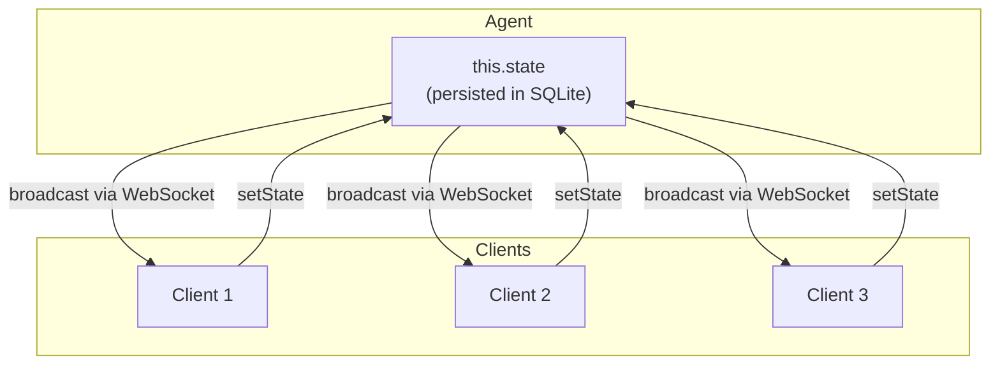

import { TypeScriptExample, LinkCard } from "~/components";

에이전트는 모든 연결된 클라이언트를 통해 자동 지속 및 실시간 동기화와 함께 내장 상태 관리를 제공합니다.

## 제품정보

에이전트 내에서 상태는:

- **회사 소개**- 자동으로 SQLite에 저장하고, 재시작 및 고용을 생존
- **동기화**- 변경은 모든 연결된 WebSocket 클라이언트로 즉시 방송됩니다.
- **공급 업체**- 서버와 클라이언트 둘 다 국가를 새롭게 할 수 있습니다
- **유형 안전**- 일반 TypeScript 지원
- **즉시 일관된**- 자신의 글을 읽으십시오
- **스레드 안전**- 동시 업데이트
- **빠른 속도**- 국가는 에이전트가 실행되는 위치를 찾습니다.

Agent state는 각 개별 Agent 인스턴스 내에서 SQL 데이터베이스에 저장됩니다. 더 높은 레벨을 사용하여 상호 작용할 수 있습니다.`this.setState`API (recommended), 당신은 상태의 동기화 상태 및 트리거 이벤트, 또는 직접 데이터베이스를 쿼리하여`this.sql`.

:::노트\[대상]
**주요 특징**클라이언트의 재시작과 동기화를 살아가는 지속적 데이터입니다.**[회사 소개](/agents/api-reference/routing/#props)**&#xC5D0;이전트가 인스턴트화 될 때 한 번의 초기화 인수입니다 - persist가 필요없는 구성에 대한 prop을 사용합니다.
주요 특징

<TypeScriptExample>
  ```ts
  import { Agent } from "agents";

  type GameState = {
  	players: string[];
  	score: number;
  	status: "waiting" | "playing" | "finished";
  };

  export class GameAgent extends Agent<Env, GameState> {
  	//새로운 대리인을 위한 과태 국가
  	initialState: GameState = {
  		players: [],
  		score: 0,
  		status: "waiting",
  	};

  	//React 상태 변경
  	onStateChanged(state: GameState, source: Connection | "server") {
  		if (source !== "server" && state.players.length >= 2) {
  			//클라이언트는 플레이어를 추가, 게임을 시작
  			this.setState({ ...state, status: "playing" });
  		}
  	}

  	addPlayer(name: string) {
  		this.setState({
  			...this.state,
  			players: [...this.state.players, name],
  		});
  	}
  }
  ```
</TypeScriptExample>

## 초기 상태 정의

사용 방법`initialState`새로운 에이전트 인스턴스에 대한 기본 값을 정의하는 속성:

<TypeScriptExample>
  ```ts
  type State = {
  	messages: Message[];
  	settings: UserSettings;
  	lastActive: string | null;
  };

  export class ChatAgent extends Agent<Env, State> {
  	initialState: State = {
  		messages: [],
  		settings: { theme: "dark", notifications: true },
  		lastActive: null,
  	};
  }
  ```
</TypeScriptExample>

### 유형 안전

두 번째 일반적인 매개 변수`Agent`상태 유형 정의:

<TypeScriptExample>
  ```ts
  //상태는 완전히 Typed입니다
  export class MyAgent extends Agent<Env, MyState> {
  	initialState: MyState = { count: 0 };

  	increment() {
  		//TypeScript는 이것을 알고 있습니다. 상태는 MyState입니다
  		this.setState({ count: this.state.count + 1 });
  	}
  }
  ```
</TypeScriptExample>

### 초기 상태의 경우

첫 번째 상태는 처음 액세스에 lazily 적용되며, 모든 상황에서는:

1. **새로운 에이전트** - `initialState`사용 및 지속
2. **회사 소개**- Persisted 상태는 SQLite에서 적재됩니다
3. **이름 \*`initialState`정의** - `this.state`이름 \*`undefined`

<TypeScriptExample>
  ```ts
  class MyAgent extends Agent<Env, { count: number }> {
  	initialState = { count: 0 };
  	async onStart() {
  		//액세스 안전 - 새로운 경우 초기 상태 반환, 또는 지속 상태
  		console.log("Current count:", this.state.count);
  	}
  }
  ```
</TypeScriptExample>

## 독서 국가

현재 상태 접근`this.state`공급 능력:

<TypeScriptExample>
  ```ts
  class MyAgent extends Agent<
  	Env,
  	{ players: string[]; status: "waiting" | "playing" | "finished" }
  > {
  	async onRequest(request: Request) {
  		//현재 상태 읽기
  		const { players, status } = this.state;

  		if (status === "waiting" && players.length < 2) {
  			return new Response("Waiting for players...");
  		}

  		return Response.json(this.state);
  	}
  }
  ```
</TypeScriptExample>

### 정의된 상태

정의하지 않는 경우`initialState`, `this.state`이름 \*`undefined`:

<TypeScriptExample>
  ```ts
  export class MinimalAgent extends Agent {
  	//초기 정의 없음

  	async onConnect(connection: Connection) {
  		if (!this.state) {
  			//첫째 시간 - 초기 상태
  			this.setState({ initialized: true });
  		}
  	}
  }
  ```
</TypeScriptExample>

## 출력 상태

제품 정보`setState()`상태 업데이트. 이:

1. SQLite에 저장 (persistent)
2. 모든 연결된 고객에게 방송 (연결 제외)[`shouldSendProtocolMessages`](/agents/api-reference/protocol-messages/)이름 \*`false`)
3. 트리거`onStateChanged()`(방송 후에; 제일 노력)

<TypeScriptExample>
  ```ts
  //전체 국가를 대체
  this.setState({
  	players: ["Alice", "Bob"],
  	score: 0,
  	status: "playing",
  });

  //특정 필드를 업데이트 (현재 상태에 대한)
  this.setState({
  	...this.state,
  	score: this.state.score + 10,
  });
  ```
</TypeScriptExample>

### 국가는 serializable이어야 합니다

국가는 JSON으로 저장되므로 serializable이어야합니다.

<TypeScriptExample>
  ```ts
  //좋은 - 일반 개체, 배열, 원시
  this.setState({
  	items: ["a", "b", "c"],
  	count: 42,
  	active: true,
  	metadata: { key: "value" },
  });

  //Bad - 기능, 클래스, 원형 참고 자료
  //기능은 serialize 아닙니다
  //날짜가 문자열이 되고, 잃는 방법
  //원형 참고 자료 실패

  //날짜를 위해, ISO 끈을 사용하십시오
  this.setState({
  	createdAt: new Date().toISOString(),
  });
  ```
</TypeScriptExample>

## 국가 변경에 대응

관련 제품`onStateChanged()`상태 변화 (notifications/side-effects) 때 반응하기 위하여:

<TypeScriptExample>
  ```ts
  class MyAgent extends Agent<Env, GameState> {
  	onStateChanged(state: GameState, source: Connection | "server") {
  		console.log("State updated:", state);
  		console.log("Updated by:", source === "server" ? "server" : source.id);
  	}
  }
  ```
</TypeScriptExample>

### 소스 매개 변수

더 보기`source`업데이트를 트리거 한 쇼 :

| 제품정보         | 이름 \*                  |
| ------------ | ---------------------- |
| `"server"`   | 에이전트 호출`setState()`    |
| `Connection` | WebSocket을 통한 고객 푸시 상태 |

이것은 유용합니다:

- 무한한 루프를 피하기 (당신의 자신의 업데이트에 반응하지 마십시오)
- 클라이언트 입력
- 고객 행동에서만 Triggering 부작용

<TypeScriptExample>
  ```ts
  class MyAgent extends Agent<
  	Env,
  	{ status: "waiting" | "playing" | "finished" }
  > {
  	onStateChanged(state: GameState, source: Connection | "server") {
  		//Ignore 서버 개시 업데이트
  		if (source === "server") return;

  		//고객 업데이트 상태 - 검증 및 프로세스
  		const connection = source;
  		console.log(`Client ${connection.id} updated state`);

  		//어쩌면 변화를 기반으로 뭔가 트리거
  		if (state.status === "submitted") {
  			this.processSubmission(state);
  		}
  	}
  }
  ```
</TypeScriptExample>

### 일반적인 패턴 : 클라이언트 구동 작업

<TypeScriptExample>
  ```ts
  class MyAgent extends Agent<Env, { messages: Message[] }> {
  	onStateChanged(state: State, source: Connection | "server") {
  		if (source === "server") return;

  		//Client 메시지 추가
  		const lastMessage = state.messages[state.messages.length - 1];
  		if (lastMessage && !lastMessage.processed) {
  			//프로세스 및 업데이트
  			this.setState({
  				...state,
  				messages: state.messages.map((m) =>
  					m.id === lastMessage.id ? { ...m, processed: true } : m,
  				),
  			});
  		}
  	}
  }
  ```
</TypeScriptExample>

## 검증된 상태 업데이트

유효한 상태 업데이트를 거부하려면 override`validateStateChange()`:

- 지속 및 방송 전에 실행
- 동기 부여
- 업데이트

<TypeScriptExample>
  ```ts
  class MyAgent extends Agent<Env, GameState> {
  	validateStateChange(nextState: GameState, source: Connection | "server") {
  		//예제: 부정적인 점수를 거부
  		if (nextState.score < 0) {
  			throw new Error("score cannot be negative");
  		}

  		//예: 특정 상태 전환만 허용
  		if (this.state.status === "finished" && nextState.status !== "finished") {
  			throw new Error("Cannot restart a finished game");
  		}
  	}
  }
  ```
</TypeScriptExample>

:::참조

`onStateChanged()`유효성 검사를 위해 예정되지 않습니다; 그것은 통보 걸이이고 방송을 막아야 합니다. 제품 정보`validateStateChange()`유효성 검사

:::

## 클라이언트 측 상태 sync

국가는 연결된 클라이언트와 자동으로 동기화합니다.

### React(사용)

<TypeScriptExample>
  ```ts
  import { useAgent } from "agents/react";

  function GameUI() {
    const agent = useAgent({
      agent: "game-agent",
      name: "room-123",
      onStateUpdate: (state, source) => {
        console.log("State updated:", state);
      }
    });

    //관련 제품
    const addPlayer = (name: string) => {
      agent.setState({
        ...agent.state,
        players: [...agent.state.players, name]
      });
    };

    return <div>Players: {agent.state?.players.join(", ")}</div>;
  }
  ```
</TypeScriptExample>

### 바닐라 JS (AgentClient)

<TypeScriptExample>
  ```ts
  import { AgentClient } from "agents/client";

  const client = new AgentClient({
  	agent: "game-agent",
  	name: "room-123",
  	onStateUpdate: (state) => {
  		document.getElementById("score").textContent = state.score;
  	},
  });

  //푸시 상태 업데이트
  client.setState({ ...client.state, score: 100 });
  ```
</TypeScriptExample>

### 국가 흐름



## Workflows의 상태

사용 방법[Workflows\`에 대해서](/agents/api-reference/run-workflows/), 작업 흐름 단계에서 에이전트 상태를 업데이트할 수 있습니다:

<TypeScriptExample>
  ```ts
  //작업 흐름
  class MyWorkflow extends Workflow<Env> {
  	async run(event: AgentWorkflowEvent, step: AgentWorkflowStep) {
  		//전체 국가를 대체
  		await step.updateAgentState({ status: "processing", progress: 0 });

  		//Merge 부분 업데이트 (다른 필드를 예약)
  		await step.mergeAgentState({ progress: 50 });

  		//초기 단계
  		await step.resetAgentState();

  		return result;
  	}
  }
  ```
</TypeScriptExample>

이들은 튼튼한 가동입니다 - 그들은 작업 흐름이 되더라도 지속됩니다.

## SQL API를

모든 개별 에이전트 인스턴스는 에이전트 자체와 동일한 컨텍스트 내에서 실행되는 자체 SQL (SQLite) 데이터베이스가 있습니다. 이것은 에이전트 내에서 데이터를 삽입하거나 쿼리하는 것은 효과적으로 0-latency입니다. 에이전트는 대륙 또는 세계에서 자신의 데이터를 액세스 할 필요가 없습니다.

에이전트에서 SQL API에 액세스할 수 있습니다.`this.sql`. SQL API는 템플릿 리터럴을 받아들입니다:

<TypeScriptExample>
  ```ts
  export class MyAgent extends Agent {
  	async onRequest(request: Request) {
  		let userId = new URL(request.url).searchParams.get("userId");

  		//'users'는 단지 예입니다 : 당신은 중재 테이블을 만들 수 있으며 자신의 스키마를 정의 할 수 있습니다
  		//SQL (SQLite syntax)를 사용하여 각 에이전트의 데이터베이스 내에서.
  		let [user] = this.sql`SELECT * FROM users WHERE id = ${userId}`;
  		return Response.json(user);
  	}
  }
  ```
</TypeScriptExample>

또한 쿼리에 TypeScript 타입 인수를 공급할 수 있습니다.

<TypeScriptExample>
  ```ts
  type User = {
  	id: string;
  	name: string;
  	email: string;
  };

  export class MyAgent extends Agent {
  	async onRequest(request: Request) {
  		let userId = new URL(request.url).searchParams.get("userId");
  		//이.sql을 호출 할 때 쿼리에 유형 매개 변수를 공급
  		//이 결과는 "id", "name", "email"열로 하나 이상의 사용자 행을 반환합니다.
  		const [user] = this.sql<User>`SELECT * FROM users WHERE id = ${userId}`;
  		return Response.json(user);
  	}
  }
  ```
</TypeScriptExample>

배열 유형을 지정할 필요가 없습니다 (`User[]`또는`Array<User>`·`this.sql`항상 지정된 유형의 배열을 반환합니다.

:::참조

type 매개 변수를 제공하면 결과가 유형 정의에 일치하지 않습니다. 들어오는 이벤트를 유효하게 할 경우, 우리는 같은 라이브러리를 추천합니다[사이트맵](https://zod.dev/)또는 당신의 자신의 Validator 논리.

:::

에이전트에 노출 된 SQL API는 하나와 유사합니다.[Durable Objects 안에](/durable-objects/api/sqlite-storage-api/#sql-api). 에이전트의 데이터베이스와 같은 SQL 쿼리를 사용할 수 있습니다. 테이블과 쿼리 데이터를 만들려면 Durable Objects 또는[₢ 킹](/d1/).

## 좋은 관행

### 작은 상태 유지

국가는 각 변화에 모든 클라이언트에 방송된다. 큰 자료를 위해:

```ts
//Bad - 국가의 큰 배열 저장
initialState = {
  allMessages: [] //수천 개의 상품으로 성장할 수 있습니다.
};

//좋은 - SQL에 있는 상점은, 국가 빛을 지킵니다
initialState = {
  messageCount: 0,
  lastMessageId: null
};

//전체 데이터에 대한 Query SQL
async getMessages(limit = 50) {
  return this.sql`SELECT * FROM messages ORDER BY created_at DESC LIMIT ${limit}`;
}
```

### Optimistic 업데이트

응답 UI를 위해, 클라이언트 상태를 즉시 업데이트하십시오:

<TypeScriptExample>
  ```ts
  //고객 측
  function sendMessage(text: string) {
  	const optimisticMessage = {
  		id: crypto.randomUUID(),
  		text,
  		pending: true,
  	};

  	//즉시 업데이트
  	agent.setState({
  		...agent.state,
  		messages: [...agent.state.messages, optimisticMessage],
  	});

  	//서버는/업데이트를 확인합니다
  }

  //서버 측
  class MyAgent extends Agent<Env, { messages: Message[] }> {
  	onStateChanged(state: GameState, source: Connection | "server") {
  		if (source === "server") return;

  		const pendingMessages = state.messages.filter((m) => m.pending);
  		for (const msg of pendingMessages) {
  			//검증 및 확인
  			this.setState({
  				...state,
  				messages: state.messages.map((m) =>
  					m.id === msg.id ? { ...m, pending: false, timestamp: Date.now() } : m,
  				),
  			});
  		}
  	}
  }
  ```
</TypeScriptExample>

### 주 vs SQL

| 사용 국가                          | SQL 사용       |
| ------------------------------ | ------------ |
| UI 상태(loading, selected items) | 역사 자료        |
| 실시간 카운터                        | 큰 컬렉션        |
| Active 세션 데이터                  | 관계           |
| 제품 설명                          | Queryable 자료 |

<TypeScriptExample>
  ```ts
  export class ChatAgent extends Agent {
  	//국가: 현재 UI 국가
  	initialState = {
  		typing: [],
  		unreadCount: 0,
  		activeUsers: [],
  	};

  	//SQL: 메시지 기록
  	async getMessages(limit = 100) {
  		return this.sql`
        SELECT * FROM messages
        ORDER BY created_at DESC
        LIMIT ${limit}
      `;
  	}

  	async saveMessage(message: Message) {
  		this.sql`
        INSERT INTO messages (id, text, user_id, created_at)
        VALUES (${message.id}, ${message.text}, ${message.userId}, ${Date.now()})
      `;
  		//실시간 UI 업데이트
  		this.setState({
  			...this.state,
  			unreadCount: this.state.unreadCount + 1,
  		});
  	}
  }
  ```
</TypeScriptExample>

### 무한한 반복을 피하십시오

당신의 자신의 업데이트에 응답에 상태 업데이트를 트리거하지 않도록주의하십시오 :

```ts
//나쁜 - 무한 루프
onStateChanged(state: State) {
  this.setState({ ...state, lastUpdated: Date.now() });
}

//좋은 - 체크 소스
onStateChanged(state: State, source: Connection | "server") {
  if (source === "server") return; //자체 업데이트에 반응하지 마십시오.
  this.setState({ ...state, lastUpdated: Date.now() });
}
```

## Model context로 Agent state 사용

에이전트에서 state와 SQL API를 결합할 수 있습니다.[AI 모델](/agents/api-reference/using-ai-models/)여러분의 프롬프트에서 모델에 대한 역사적인 맥락을 포함합니다. 현대 대형 언어 모델 (LLMs)는 종종 매우 큰 컨텍스트 윈도우 (최대 수백만의 토큰)을 가지고, 당신은 직접 당신의 신속한에 관련된 맥락을 당길 수 있습니다.

예를 들어, 에이전트의 내장 SQL 데이터베이스를 사용하여 역사를 끌어 당기고 모델을 쿼리하고 다음 호출을 모델에 앞서 그 역사를 추가 할 수 있습니다.

<TypeScriptExample>
  ```ts
  interface Env {
  	AI: Ai;
  }

  export class ReasoningAgent extends Agent<Env> {
  	async callReasoningModel(prompt: Prompt) {
  		let result = this
  			.sql<History>`SELECT * FROM history WHERE user = ${prompt.userId} ORDER BY timestamp DESC LIMIT 1000`;
  		let context = [];
  		for (const row of result) {
  			context.push(row.entry);
  		}

  		const systemPrompt = prompt.system || "You are a helpful assistant.";
  		const userPrompt = `${prompt.user}\n\nUser history:\n${context.join("\n")}`;

  		try {
  			const response = await this.env.AI.run("@cf/zai-org/glm-4.7-flash", {
  				messages: [
  					{ role: "system", content: systemPrompt },
  					{ role: "user", content: userPrompt },
  				],
  			});

  			//역사에 대한 응답을 저장
  			this
  				.sql`INSERT INTO history (timestamp, user, entry) VALUES (${new Date()}, ${prompt.userId}, ${response.response})`;

  			return response.response;
  		} catch (error) {
  			console.error("Error calling reasoning model:", error);
  			throw error;
  		}
  	}
  }
  ```
</TypeScriptExample>

에이전트의 각 인스턴스가 자신의 데이터베이스를 가지고 있기 때문에이 작품은 데이터베이스에 저장 된 상태는 에이전트에 대한 개인입니다. 단일 사용자, 방 또는 채널을 대신하여 행동 여부, 또는 깊은 연구 도구. 기본적으로 Contention을 관리하거나 네트워크에서 중앙화 된 데이터베이스에 도달 할 필요가 없습니다.

## API 참고 자료

### 제품 정보

| 회사 정보          | 제품정보    | 이름 \*             |
| -------------- | ------- | ----------------- |
| `state`        | `State` | 현재 상태 (getter)    |
| `initialState` | `State` | 새로운 대리인을 위한 과태 국가 |

### 제품 설명

| 제품 설명                 | 주요특징                                                         | 이름 \*                             |
| --------------------- | ------------------------------------------------------------ | --------------------------------- |
| `setState`            | `(state: State) => void`                                     | 업데이트 상태, 지속, 및 방송                 |
| `onStateChanged`      | `(state: State, source: Connection \| "server") => void`     | 국가 변경 시                           |
| `validateStateChange` | `(nextState: State, source: Connection \| "server") => void` | persistence의 앞에 유효성 검사 (주사하는 던지기) |

### Workflow 단계 방법

| 제품 설명                           | 이름 \*                    |
| ------------------------------- | ------------------------ |
| `step.updateAgentState(state)`  | 워크플로우에서 에이전트 상태 변경       |
| `step.mergeAgentState(partial)` | 작업 흐름에서 부분 상태 Merge      |
| `step.resetAgentState()`        | 관련 기사`initialState`작업 흐름 |

## 다음 단계

<LinkCard title="에이전트 API" href="/agents/api-reference/agents-api/" description="Agents SDK를 위한 API 참고 자료를 완료합니다." />

<LinkCard title="채팅 에이전트" href="/agents/getting-started/build-a-chat-agent/" description="AI 채팅 에이전트를 구축하고 배포합니다." />

<LinkCard title="웹소켓" href="/agents/api-reference/websockets/" description="실시간 데이터 스트리밍과 대화형 에이전트 구축" />

<LinkCard title="Workflows 실행" href="/agents/api-reference/run-workflows/" description="에이전트에서 Orchestrate asynchronous 워크플로우." />
