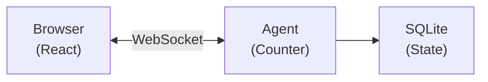

import {
	TypeScriptExample,
	WranglerConfig,
	PackageManagers,
	LinkCard,
} from "~/components";

영속되고, 추론하고, 행동하는 AI agents를 빌드하세요. Agents는 Cloudflare 전역 네트워크에서 실행되고, 요청 간 상태를 유지하며, WebSockets를 통해 클라이언트와 실시간으로 연결됩니다.

**무엇을 만들게 되나요:** 실시간으로 React frontend와 동기화되는 영속 상태 counter agent

**시간:** 약 10분

## 새 프로젝트 만들기

<PackageManagers
	type="create"
	pkg="cloudflare@latest"
	args={"--template cloudflare/agents-starter"}
/>

그다음 의존성을 설치하고 dev server를 시작하세요.

```sh
cd my-agent
npm install
npm run dev
```

이렇게 하면 다음이 포함된 프로젝트가 생성됩니다.

- `src/server.ts` — agent 코드
- `src/client.tsx` — React frontend
- `wrangler.jsonc` — Cloudflare configuration

[http://localhost:5173](http://localhost:5173)을 열어 agent가 동작하는 모습을 확인하세요.

## 첫 번째 agent

간단한 counter agent를 처음부터 만들어 봅니다. `src/server.ts`를 다음으로 교체하세요.

<TypeScriptExample>

```ts title="src/server.ts"
import { Agent, routeAgentRequest, callable } from "agents";

// Define the state shape
export type CounterState = {
	count: number;
};

// Create the agent
export class CounterAgent extends Agent<Env, CounterState> {
	// Initial state for new instances
	initialState: CounterState = { count: 0 };

	// Methods marked with @callable can be called from the client
	@callable()
	increment() {
		this.setState({ count: this.state.count + 1 });
		return this.state.count;
	}

	@callable()
	decrement() {
		this.setState({ count: this.state.count - 1 });
		return this.state.count;
	}

	@callable()
	reset() {
		this.setState({ count: 0 });
	}
}

// Route requests to agents
export default {
	async fetch(request: Request, env: Env, ctx: ExecutionContext) {
		return (
			(await routeAgentRequest(request, env)) ??
			new Response("Not found", { status: 404 })
		);
	},
} satisfies ExportedHandler<Env>;
```

</TypeScriptExample>

agent를 등록하도록 `wrangler.jsonc`를 업데이트하세요.

<WranglerConfig>

```jsonc
{
	"name": "my-agent",
	"main": "src/server.ts",
	"compatibility_date": "$today",
	"compatibility_flags": ["nodejs_compat"],
	"durable_objects": {
		"bindings": [
			{
				"name": "CounterAgent",
				"class_name": "CounterAgent",
			},
		],
	},
	"migrations": [
		{
			"tag": "v1",
			"new_sqlite_classes": ["CounterAgent"],
		},
	],
}
```

</WranglerConfig>

## React에서 연결하기

`src/client.tsx`를 다음으로 교체하세요.

```tsx title="src/client.tsx"
import { useState } from "react";
import { useAgent } from "agents/react";
import type { CounterAgent, CounterState } from "./server";

export default function App() {
	const [count, setCount] = useState(0);

	// Connect to the Counter agent
	const agent = useAgent<CounterAgent, CounterState>({
		agent: "CounterAgent",
		onStateUpdate: (state) => setCount(state.count),
	});

	return (
		<div style={{ padding: "2rem", fontFamily: "system-ui" }}>
			<h1>Counter Agent</h1>
			<p style={{ fontSize: "3rem" }}>{count}</p>
			<div style={{ display: "flex", gap: "1rem" }}>
				<button onClick={() => agent.stub.decrement()}>-</button>
				<button onClick={() => agent.stub.reset()}>Reset</button>
				<button onClick={() => agent.stub.increment()}>+</button>
			</div>
		</div>
	);
}
```

핵심 포인트:

- `useAgent`는 WebSocket을 통해 agent에 연결합니다
- `onStateUpdate`는 agent 상태가 바뀔 때마다 실행됩니다
- `agent.stub.methodName()`은 agent에서 `@callable()`이 붙은 메서드를 호출합니다

## 방금 무슨 일이 일어났나요?

버튼을 클릭하면 다음 순서로 동작합니다.

1. **Client**가 WebSocket으로 `agent.stub.increment()`를 호출합니다
2. **Agent**가 `increment()`를 실행하고 `setState()`로 상태를 업데이트합니다
3. **State**는 자동으로 SQLite에 저장됩니다
4. **Broadcast**가 연결된 모든 클라이언트에 전송됩니다
5. **React**는 `onStateUpdate`를 통해 UI를 갱신합니다



### 핵심 개념

| Concept              | What it means                                                                                         |
| -------------------- | ----------------------------------------------------------------------------------------------------- |
| **Agent instance**   | 고유한 이름마다 별도의 agent가 생성됩니다. `CounterAgent:user-123`은 `CounterAgent:user-456`과 완전히 별개입니다 |
| **Persistent state** | 상태는 재시작, 배포, 하이버네이션 이후에도 유지되며 SQLite에 저장됩니다 |
| **Real-time sync**   | 같은 agent에 연결된 모든 클라이언트는 상태 업데이트를 즉시 받습니다 |
| **Hibernation**      | 연결된 클라이언트가 없으면 agent는 하이버네이트되고(비용 없음), 다음 요청 때 다시 깨어납니다 |

## vanilla JavaScript에서 연결하기

React를 사용하지 않는다면:

<TypeScriptExample>

```ts
import { AgentClient } from "agents/client";

const agent = new AgentClient({
	agent: "CounterAgent",
	name: "my-counter", // optional, defaults to "default"
	onStateUpdate: (state) => {
		console.log("New count:", state.count);
	},
});

// Call methods
await agent.call("increment");
await agent.call("reset");
```

</TypeScriptExample>

## Cloudflare에 배포하기

```sh
npm run deploy
```

이제 agent는 Cloudflare 전역 네트워크에서 사용자 가까이에서 실행됩니다.

## Troubleshooting

### "Agent not found" 또는 404 오류

다음을 확인하세요.

1. Agent class가 server 파일에서 export되고 있는지
2. `wrangler.jsonc`에 binding과 migration이 있는지
3. client에서 사용하는 agent 이름이 class 이름과 일치하는지(대소문자 구분 없음)

### 상태가 동기화되지 않음

다음을 확인하세요.

1. `this.state`를 직접 수정하지 말고 반드시 `this.setState()`를 사용하고 있는지
2. client에서 `onStateUpdate` callback이 연결되어 있는지
3. WebSocket 연결이 실제로 수립되었는지(브라우저 dev tools 확인)

### "Method X is not callable" 오류

메서드에 `@callable()`이 붙어 있는지 확인하세요.

<TypeScriptExample>

```ts
import { Agent, callable } from "agents";

export class MyAgent extends Agent {
	@callable()
	increment() {
		// ...
	}
}
```

</TypeScriptExample>

### `agent.stub`에서 타입 오류

agent와 state type parameters를 추가하세요.

<TypeScriptExample>

```ts
import { useAgent } from "agents/react";
import type { CounterAgent, CounterState } from "./server";

// Pass the agent and state types to useAgent
const agent = useAgent<CounterAgent, CounterState>({
	agent: "CounterAgent",
	onStateUpdate: (state) => setCount(state.count),
});

// Now agent.stub is fully typed
agent.stub.increment();
```

</TypeScriptExample>

### `@callable()`에서 `SyntaxError: Invalid or unexpected token`

dev server가 `SyntaxError: Invalid or unexpected token`으로 실패한다면, `tsconfig.json`에 `"target": "ES2021"`을 설정하세요. 이렇게 하면 Vite의 esbuild transpiler가 TC39 decorators를 native syntax로 그대로 넘기지 않고 downlevel 처리합니다.

```json
{
	"compilerOptions": {
		"target": "ES2021"
	}
}
```

:::caution
`tsconfig.json`에 `"experimentalDecorators": true`를 설정하지 마세요. Agents SDK는 TypeScript legacy decorators가 아니라 [TC39 standard decorators](https://github.com/tc39/proposal-decorators)를 사용합니다. `experimentalDecorators`를 켜면 호환되지 않는 변환이 적용되어 런타임에서 `@callable()`이 조용히 깨집니다.
:::

## 다음 단계

작동하는 agent를 만들었다면 다음 주제를 살펴보세요.

### Common patterns

| Learn how to             | Refer to                                                  |
| ------------------------ | --------------------------------------------------------- |
| Add AI/LLM capabilities  | [Using AI models](/agents/api-reference/using-ai-models/) |
| Expose tools via MCP     | [MCP servers](/agents/api-reference/mcp-agent-api/)       |
| Run background tasks     | [Schedule tasks](/agents/api-reference/schedule-tasks/)   |
| Handle emails            | [Email routing](/agents/api-reference/email/)             |
| Use Cloudflare Workflows | [Run Workflows](/agents/api-reference/run-workflows/)     |

### 더 살펴보기

<LinkCard
	title="State management"
	href="/agents/api-reference/store-and-sync-state/"
	description="setState(), initialState, onStateChanged()를 깊이 있게 다룹니다."
/>

<LinkCard
	title="Client SDK"
	href="/agents/api-reference/client-sdk/"
	description="전체 useAgent 및 AgentClient API reference."
/>

<LinkCard
	title="Callable methods"
	href="/agents/api-reference/callable-methods/"
	description="`@callable()`로 메서드를 클라이언트에 노출합니다."
/>

<LinkCard
	title="Schedule tasks"
	href="/agents/api-reference/schedule-tasks/"
	description="지연, 일정, cron에 맞춰 작업을 실행합니다."
/>
