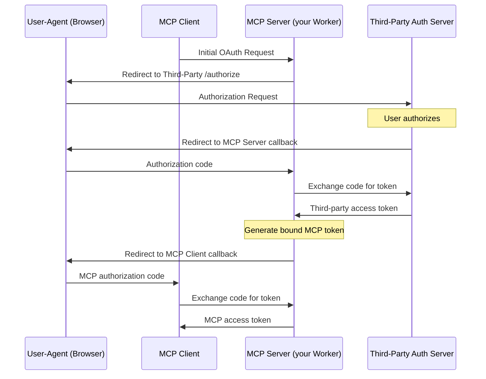
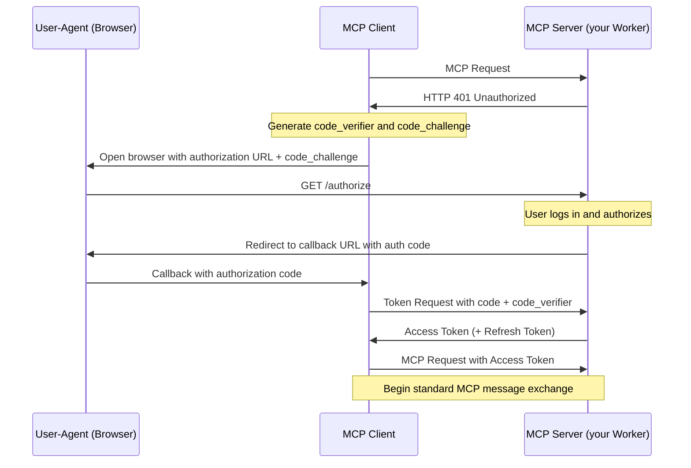

import { LinkCard } from "~/components";

건물에[모형 Context 의정서 (MCP)](https://modelcontextprotocol.io)서버, 사용자가 로그인 (authentication)을 허용하고 MCP 클라이언트 액세스를 자신의 계정 (authorization)에 부여 할 수있는 방법을 모두해야합니다.

Model Context Protocol 사용[저자화를위한 OAuth 2.1의 하위 세트](https://spec.modelcontextprotocol.io/specification/draft/basic/authorization/). OAuth는 사용자가 API 키 또는 기타 자격 증명을 공유하지 않고 리소스에 제한 된 액세스를 부여 할 수 있습니다.

Cloudflare는[OAuth 공급자 도서관](https://github.com/cloudflare/workers-oauth-provider)OAuth 2.1 프로토콜의 공급자 측면을 구현하는 것은 MCP 서버에 쉽게 권한 부여를 추가 할 수 있습니다.

4가지 방법으로 OAuth Provider Library를 사용할 수 있습니다.

1. OAuth 공급자로 Cloudflare 접근을 사용하십시오.
2. GitHub 또는 Google과 같은 타사 OAuth 공급자와 직접 통합합니다.
3. 이미 Stytch, Auth0 또는 WorkOS와 같은 Stytch, Auth0 등과 같은 OAuth 공급자와 통합합니다.
4. 당신의 노동자는 허가를 취급하고 증명합니다. MCP 서버, Cloudflare에서 실행, 완전한 OAuth 흐름을 처리.

다음 섹션은 각 옵션을 설명하고 각 코드를 실행하는 링크.

## 인증 옵션

### (1) Cloudflare 접근 OAuth 공급자

Cloudflare Access는 MCP 서버에 Single Sign-On(SSO) 기능을 추가할 수 있습니다. MCP 서버에 인증[구성 ID 공급자](/cloudflare-one/integrations/identity-providers/)또는[1회 PIN](/cloudflare-one/integrations/identity-providers/one-time-pin/), 그리고 그들은 그들의 정체성 일치 하는 경우에만 접근을 부여[오시는 길](/cloudflare-one/access-controls/policies/).

설치하기[MCP 서버](https://github.com/cloudflare/ai/tree/main/demos/remote-mcp-cf-access)OAuth 공급자로 Cloudflare 접근으로, 참조[SaaS에 대한 액세스 보안 MCP 서버](/cloudflare-one/access-controls/ai-controls/saas-mcp/).

### (2) 제3자 OAuth 공급자

더 보기[OAuth 공급자 도서관](https://github.com/cloudflare/workers-oauth-provider)GitHub 또는 Google과 같은 타사 OAuth 공급자를 사용할 수 있습니다. 이 예제를 볼 수 있습니다.[GitHub 예제](/agents/guides/remote-mcp-server/#add-authentication).

제 3 자 OAuth 공급자를 사용할 때 핸들러를 제공해야합니다.`OAuthProvider`제3자 제공업체의 OAuth 흐름을 구현합니다.

```ts ins="defaultHandler: MyAuthHandler,"
import MyAuthHandler from "./auth-handler";

export default new OAuthProvider({
	apiRoute: "/mcp",
	//MCP 서버:
	apiHandler: MyMCPServer.serve("/mcp"),
	//이 핸들러를 제3자 공급자로 인증 및 허가를 위한 자체 핸들러로 교체하십시오:
	defaultHandler: MyAuthHandler,
	authorizeEndpoint: "/authorize",
	tokenEndpoint: "/token",
	clientRegistrationEndpoint: "/register",
});
```

이름 \*[Model Context Protocol 사양 정의](https://spec.modelcontextprotocol.io/specification/draft/basic/authorization/#292-flow-description)제3자 OAuth 공급자를 사용할 때 MCP Server (your Worker)는 자체 토큰을 MCP 클라이언트에게 생성합니다.



문서 읽기[Workers OAuth Provider 라이브러리](https://github.com/cloudflare/workers-oauth-provider)더 많은 정보.

### (3) 자신의 OAuth 공급자를 가져옵니다

애플리케이션이 이미 OAuth Provider 자체를 구현하거나 저자화 서비스 제공 업체를 사용하면 타사 OAuth 공급자를 사용할 수있는 동일한 방법으로 이것을 사용할 수 있습니다. 위에서 설명 된[(2) 제3자 OAuth 공급자](#2-third-party-oauth-provider).

당신은 auth 공급자를 사용할 수 있습니다:

- 사용자는 이메일, 소셜 로그인, SSO(single sign-on), MFA(multi-factor authentication)를 통해 MCP 서버에 인증할 수 있습니다.
- MCP 도구에 직접 지도하는 범위 및 권한 정의.
- 요청된 권한과 일치하는 동의 페이지가있는 사용자.
- 해당 에이전트는 허용된 도구를 호출 할 수 있도록 권한을 강화합니다.

#### 사이트맵

시작하기[Stytch를 사용하는 원격 MCP 서버](https://stytch.com/docs/guides/connected-apps/mcp-servers)사용자는 이메일, Google 로그인 또는 기업 SSO로 로그인하고 AI 에이전트를 승인하여 대신 회사에 OKR을 조회하고 관리 할 수 있습니다. Stytch는 조직 내에서 사용자의 역할과 권한을 기반으로 AI 에이전트에 부여된 범위를 제한합니다. MCP 클라이언트를 승인할 때, 각 사용자는 대리인이 그들의 역할에 근거를 둔 보조금을 받을 수 있다는 것을 요구한 허가를 개요하는 동의 페이지를 볼 것입니다.

[](https://deploy.workers.cloudflare.com/?url=https://github.com/cloudflare/ai/tree/main/demos/mcp-stytch-b2b-okr-manager)

더 많은 소비자 사용 사례를 위해서는 인증 및 MCP 클라이언트 승인을 위해 Stytch를 사용하는 To Do 앱을 위한 원격 MCP 서버를 배치합니다. 사용자는 이메일에 로그인할 수 있으며 즉시 계정에 연결된 To Do 목록에 액세스할 수 있으며, AI Assistant에 액세스하여 작업을 관리할 수 있습니다.

[](https://deploy.workers.cloudflare.com/?url=https://github.com/cloudflare/ai/tree/main/demos/mcp-stytch-consumer-todo-list)

#### 오스0

Auth0을 사용하는 원격 MCP 서버로 시작하여 전자 메일, 소셜 로그인 또는 엔터프라이즈 SSO를 통해 사용자를 인증하여 AI 에이전트를 통해 토도 및 개인 데이터를 상호 작용합니다. MCP 서버는 사용자를 대신하여 API endpoints에 안전하게 연결하여 에이전트가 사용자로부터 동의를 받으면 액세스 할 수 있습니다. 이 구현에서 액세스 토큰은 긴 실행 상호 작용 중에 자동으로 재생됩니다.

그것을 설정하려면, 먼저 보호 된 API 엔드 포인트를 배치:

[](https://deploy.workers.cloudflare.com/?url=https://github.com/cloudflare/ai/tree/main/demos/remote-mcp-auth0/todos-api)

그런 다음 Auth0을 통해 인증을 처리하는 MCP 서버를 배포하고 API 엔드포인트에 AI 에이전트를 안전하게 연결합니다.

[](https://deploy.workers.cloudflare.com/?url=https://github.com/cloudflare/ai/tree/main/demos/remote-mcp-auth0/mcp-auth0-oidc)

#### 작업OS

WorkOS의 AuthKit을 사용하여 사용자를 인증하고 AI 에이전트에 부여 된 권한을 관리하는 원격 MCP 서버로 시작하십시오. 이 예제에서 MCP 서버는 사용자의 역할과 액세스 권한을 기반으로 도구를 동적 노출합니다. 모든 인증된 사용자는 액세스할 수 있습니다.`add`도구, 하지만 사용자가 할당 된`image_generation`WorkOS의 권한은 이미지 생성 도구에 AI 에이전트 액세스를 부여 할 수 있습니다. MCP 서버가 인증된 사용자의 역할과 권한을 기반으로 AI 에이전트에 대한 기능을 조건으로 노출 할 수있는 방법을 보여줍니다.

[](https://deploy.workers.cloudflare.com/?url=https://github.com/cloudflare/ai/tree/main/demos/remote-mcp-authkit)

#### 공지사항

Remote MCP 서버로 시작[공지사항](https://www.descope.com/)Inbound Apps는 AI 에이전트를 통해 데이터와 상호 작용하기 위해 사용자 (예 : 이메일, 소셜 로그인, SSO)를 인증하고 승인합니다. Leverage Descope 사용자 정의 범위는 더 미세 곡물 제어를위한 권한을 정의하고 관리합니다.

[](https://deploy.workers.cloudflare.com/?url=https://github.com/cloudflare/ai/tree/main/demos/remote-mcp-server-descope-auth)

### (4) 당신의 MCP Server 핸들 인증 및 인증 자체

당신의 MCP 서버, 사용[OAuth 공급자 도서관](https://github.com/cloudflare/workers-oauth-provider), 완전한 OAuth 허가 교류를, 어떤 제3자 참여 없이 취급할 수 있습니다.

더 보기[Workers OAuth Provider 라이브러리](https://github.com/cloudflare/workers-oauth-provider)'Cloudflare'는 실행하는 노동자[`fetch()`회사 소개](/workers/runtime-apis/handlers/fetch/)MCP 서버에 들어오는 요청을 처리합니다.

MCP Server의 API 및 인증 및 인증 논리 및 OAuth 엔드포인트의 URI 경로에 대한 자체 핸들러를 제공합니다.

```ts
export default new OAuthProvider({
	apiRoute: "/mcp",
	//MCP 서버:
	apiHandler: MyMCPServer.serve("/mcp"),
	//인증 및 인증을위한 핸들러 :
	defaultHandler: MyAuthHandler,
	authorizeEndpoint: "/authorize",
	tokenEndpoint: "/token",
	clientRegistrationEndpoint: "/register",
});
```

더 알아보기[시작하기](/agents/guides/remote-mcp-server/)완전한 예시를 위해`OAuthProvider`사용, 모방 인증 흐름.

이 경우에 있는 허가 교류는 다음과 같이 작동합니다:



기억하기[인증은 인증과 다릅니다.](https://www.cloudflare.com/learning/access-management/authn-vs-authz/). 당신의 MCP 서버는 허가 자체를 취급할 수 있고, 아직도 첫번째 정정 사용자에게 외부 입증 서비스에 의존하는 동안. 더 보기[이름 \*](/agents/guides/remote-mcp-server)시작된 얻은 것은 모의 인증 흐름을 제공합니다. 인증 핸들러를 구현해야 합니다. - 인증을 직접 처리하거나 외부 인증 서비스를 사용하여.

## 인증 컨텍스트 사용

사용자가 OAuth 공급자를 통해 인증 할 때, 그들의 정체 정보는 도구 내부에서 사용할 수 있습니다. 사용 여부에 따라 액세스하는 방법`McpAgent`또는`createMcpHandler`.

### McpAgent로

세 번째 유형 매개 변수`McpAgent`인증 컨텍스트의 모양을 정의합니다. 오시는 길`this.props`내 계정`init()`및 도구 핸들러.

```ts
import { McpAgent } from "agents/mcp";
import { McpServer } from "@modelcontextprotocol/sdk/server/mcp.js";

type AuthContext = {
	claims: { sub: string; name: string; email: string };
	permissions: string[];
};

export class MyMCP extends McpAgent<Env, unknown, AuthContext> {
	server = new McpServer({ name: "Auth Demo", version: "1.0.0" });

	async init() {
		this.server.tool("whoami", "Get the current user", {}, async () => ({
			content: [{ type: "text", text: `Hello, ${this.props.claims.name}!` }],
		}));
	}
}
```

### createMcpHandler로

제품 정보`getMcpAuthContext()`도구 핸들러 내에서 동일한 정보를 액세스합니다. 이 용도`AsyncLocalStorage`후드 아래에.

```ts
import { createMcpHandler, getMcpAuthContext } from "agents/mcp";
import { McpServer } from "@modelcontextprotocol/sdk/server/mcp.js";

function createServer() {
	const server = new McpServer({ name: "Auth Demo", version: "1.0.0" });

	server.tool("whoami", "Get the current user", {}, async () => {
		const auth = getMcpAuthContext();
		const name = (auth?.props?.name as string) ?? "anonymous";
		return {
			content: [{ type: "text", text: `Hello, ${name}!` }],
		};
	});

	return server;
}
```

## Permission 기반 도구 액세스

사용자 권한에 따라 사용할 수 있는 도구를 제어할 수 있습니다. 두 가지 방법이 있습니다. 도구 핸들러 내부의 권한 확인, 또는 조건으로 도구 등록.

```ts
export class MyMCP extends McpAgent<Env, unknown, AuthContext> {
	server = new McpServer({ name: "Permissions Demo", version: "1.0.0" });

	async init() {
		this.server.tool("publicTool", "Available to all users", {}, async () => ({
			content: [{ type: "text", text: "Public result" }],
		}));

		this.server.tool(
			"adminAction",
			"Requires admin permission",
			{},
			async () => {
				if (!this.props.permissions?.includes("admin")) {
					return {
						content: [
							{ type: "text", text: "Permission denied: requires admin" },
						],
					};
				}
				return {
					content: [{ type: "text", text: "Admin action completed" }],
				};
			},
		);

		if (this.props.permissions?.includes("special_feature")) {
			this.server.tool("specialTool", "Special feature", {}, async () => ({
				content: [{ type: "text", text: "Special feature result" }],
			}));
		}
	}
}
```

핸들러 내부 확인은 LLM에 오류 메시지를 반환합니다. 이는 사용자에게 denial을 설명 할 수 있습니다. 조건부 등록 도구는 LLM은 사용자가 액세스 할 수없는 도구를 결코 볼 수 없습니다. 그것은 모든 것을 호출 할 수 없습니다.

## 다음 단계

<LinkCard title="Workers OAuth 공급자" href="https://github.com/cloudflare/workers-oauth-provider" description="Workers의 OAuth 공급자 도서관." />

<LinkCard title="MCP 포털" href="/cloudflare-one/access-controls/ai-controls/mcp-portals/" description="MCP 포털을 설치하여 관리 및 보안을 제공합니다." />
