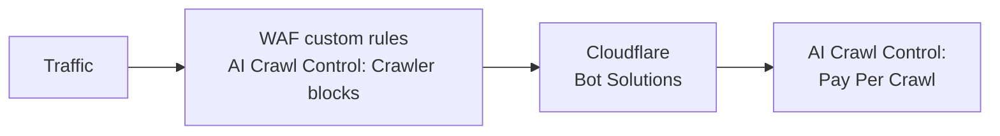

import { GlossaryTooltip, Example } from "~/components";

AI Crawl Control은 Cloudflare [bot 솔루션](/bots/)과 같은 다른 Cloudflare 제품과 함께 작동합니다. Bot 솔루션은 알려진 봇 패턴과 일치하는 트래픽을 식별하며, 원하는 대로 봇에 대해 챌린지 또는 차단을 수행할 수 있습니다.

## 우선순위

- AI Crawl Control의 AI 크롤러 차단은 [WAF 사용자 지정 규칙](/waf/custom-rules/)을 사용하며, 이는 Cloudflare bot 솔루션보다 먼저 적용됩니다.
- AI Crawl Control의 Pay Per Crawl은 Cloudflare bot 솔루션 이후에 적용됩니다.

Cloudflare bot 솔루션이 WAF 사용자 지정 규칙과 함께 작동하는 방식에 대한 자세한 내용은 [작동 방식](/bots/concepts/bot/#how-it-works)을 참고하세요.

## 예시

다음 예시를 살펴보세요.

### 모든 AI 봇을 차단하는 봇 규칙과 Pay Per Crawl

다음 두 기능을 모두 활성화했을 수 있습니다.

- AI Crawl Control의 Pay Per Crawl을 통해 과금 대상으로 선택한 AI 크롤러 집합
- [AI Bots 차단](/bots/get-started/bot-fight-mode/#block-ai-bots) Bot 구성 옵션

Pay Per Crawl은 bot 솔루션 이후에 적용되므로, 의도한 대로 Pay Per Crawl이 작동하게 하려면 먼저 **Block AI Bots**를 꺼야 합니다.
