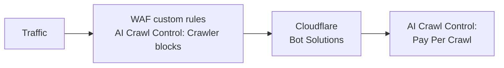

import { GlossaryTooltip, Example, Steps, Tabs, TabItem, DashButton } from "~/components";

AI Crawl Control은 Cloudflare [Web Application Firewall (WAF)](/waf/)와 같은 다른 Cloudflare 제품과 함께 작동합니다. WAF는 들어오는 웹 및 API 요청을 검사하고 규칙에 따라 원치 않는 트래픽을 필터링합니다. [WAF 사용자 지정 규칙](/waf/custom-rules/)을 사용하면 <GlossaryTooltip term="robots.txt">`robots.txt`</GlossaryTooltip> 강제 적용과 같은 특정 작업을 수행할 수 있습니다.

## 우선순위

- AI Crawl Control은 사이트 소유자가 차단하기로 결정한 AI 크롤러 집합을 차단하기 위해 WAF 사용자 지정 규칙을 사용합니다.
- AI Crawl Control의 Pay Per Crawl 기능은 WAF 이후에 적용됩니다.

이 때문에 AI Crawl Control로 AI 크롤러를 관리할 계획이라면, 기존 WAF 사용자 지정 규칙이 AI 크롤러에 영향을 주지 않도록 수정하는 것이 좋을 수 있습니다. 이렇게 하면 AI 크롤러를 AI Crawl Control에서만 관리할 수 있어 워크플로를 간소화할 수 있습니다.

:::note[AI Crawl Control이 WAF 사용자 지정 규칙을 사용하는 방식]
AI Crawl Control을 통해 AI 크롤러를 차단할 때(전체 또는 일부) 해당 AI 크롤러를 차단하기 위해 **하나의** WAF 사용자 지정 규칙을 사용합니다.

모든 AI 크롤러를 허용하도록 선택한 경우, AI Crawl Control은 어떤 WAF 사용자 지정 규칙도 사용하지 않습니다.

보유한 계정 유형에 따라 사용할 수 있는 WAF 사용자 지정 규칙 수가 제한될 수 있습니다.
:::

## WAF와 AI Crawl Control 사용 예시

다음 예시를 살펴보세요.

### 제한된 국가의 트래픽과 Pay Per Crawl

다음 두 기능을 모두 활성화했을 수 있습니다.

- [특정 국가의 트래픽을 차단하는 WAF 사용자 지정 규칙](/waf/custom-rules/use-cases/block-traffic-from-specific-countries/)
- AI 크롤러가 콘텐츠 접근을 요청할 때 과금하기 위한 AI Crawl Control의 [Pay Per Crawl](/ai-crawl-control/features/pay-per-crawl/what-is-pay-per-crawl/)

WAF 사용자 지정 규칙은 Pay Per Crawl보다 먼저 적용되므로, 차단된 국가에서 오는 트래픽(여기에는 AI 크롤러도 포함됨)은 Pay Per Crawl에 필요한 [필수 헤더](/ai-crawl-control/features/pay-per-crawl/use-pay-per-crawl-as-ai-owner/crawl-pages/#1-include-required-headers)를 제공하더라도 계속 차단됩니다.

### WAF 사용자 지정 규칙으로 허용된 검색 엔진 봇과 Pay Per Crawl

다음 두 기능을 모두 활성화했을 수 있습니다.

- [검색 엔진 봇을 허용하는 WAF 사용자 지정 규칙](/waf/custom-rules/use-cases/allow-traffic-from-verified-bots/)
- AI 크롤러가 콘텐츠 접근을 요청할 때 모든 AI 크롤러(검색 엔진 봇 포함)에 과금하는 AI Crawl Control의 [Pay Per Crawl](/ai-crawl-control/features/pay-per-crawl/what-is-pay-per-crawl/)

사용자 지정 규칙은 Pay Per Crawl보다 먼저 적용되므로 다음과 같습니다.

- 검색 엔진 봇만 사이트에 접근할 수 있습니다(사용자 지정 규칙이 강제 적용).
- 이후 검색 엔진 봇은 콘텐츠 접근에 대해 과금됩니다(AI Crawl Control의 Pay Per Crawl이 강제 적용).

:::note
이 예시는 WAF와 AI Crawl Control 간 우선순위를 강조하기 위한 용도로만 제공됩니다.

실제로는 예의 바른 검색 엔진 봇이 콘텐츠에 접근하도록 허용해 콘텐츠가 색인되도록 하는 것이 유리할 수 있습니다.
:::

### 허용된 봇 문제 해결

AI Crawl Control에서 특정 AI 크롤러를 **Allow**로 설정했는데도 여전히 차단된다면, 그보다 상위에서 해당 크롤러를 차단하고 있을 수 있는 WAF 사용자 지정 규칙이 있는지 확인하세요. AI Crawl Control 규칙에는 차단된 봇만 포함되므로, 허용된 봇은 AI Crawl Control 규칙보다 먼저 실행되는 다른 보안 규칙의 영향을 받을 수 있습니다.

이러한 상위 규칙은 트래픽에 영향을 주지만 AI Crawl Control 분석에는 표시되지 않을 수 있습니다. 허용하려는 AI 크롤러를 차단하고 있을 수 있는 규칙을 식별하고 수정하기 위해 WAF 사용자 지정 규칙을 검토하세요.

### 차단된 봇 문제 해결

AI Crawl Control에서 특정 AI 크롤러를 **Block**으로 설정했는데도 여전히 콘텐츠에 접근하고 있다면, AI Crawl Control 규칙을 우회하게 만드는 상위 규칙이 있는지 확인하세요. AI Crawl Control 규칙은 기존 WAF 사용자 지정 규칙의 끝에 추가되므로, 다음과 같은 규칙 유형은 봇이 차단을 우회하도록 만들 수 있습니다.

- WAF 사용자 지정 규칙을 우회하는 **Skip rules**
- 요청 경로를 변경하는 **Redirect rules**
- 요청을 수정하는 **Transform rules**

차단된 봇이 올바르게 차단되도록 하려면 AI Crawl Control 규칙을 WAF 사용자 지정 규칙의 맨 위로 이동해 다른 규칙보다 먼저 실행되게 하세요.

### AI 크롤러 차단 로직 충돌

다음 두 기능을 모두 활성화했을 수 있습니다.

- 모든 봇을 차단하는 WAF 사용자 지정 규칙
- 특정 AI 크롤러를 허용하는 AI Crawl Control 선택

이 시나리오에서는 AI 크롤러 처리에 대해 서로 다른 로직을 지시하는 두 개의 사용자 지정 규칙이 존재합니다. 이 문제를 해결하려면 다음 단계를 따르세요.

<Tabs syncKey="dashNewNav"> <TabItem label="새 대시보드" icon="rocket">

<Steps>
1. Cloudflare 대시보드에서 **Security rules** 페이지로 이동합니다.

   <DashButton url="/?to=/:account/:zone/security/security-rules" />

2. _Custom rules_로 필터링합니다.
3. 사용자 지정 규칙과 AI Crawl Control 규칙을 식별합니다.
4. 우선순위를 둘 규칙을 맨 위로 드래그하거나, 사용자 지정 규칙이 AI Crawl Control 구성과 충돌하지 않도록 수정합니다.
</Steps>

</TabItem> <TabItem label="이전 대시보드">

<Steps>
1. [Cloudflare 대시보드](https://dash.cloudflare.com/)에 로그인한 다음 계정과 도메인을 선택합니다.
2. **Security** > **WAF** > **Custom rules** 탭으로 이동합니다.
3. WAF 사용자 지정 규칙과 AI Crawl Control 규칙을 식별합니다.
4. 우선순위를 둘 규칙을 맨 위로 드래그하거나, WAF 사용자 지정 규칙이 AI Crawl Control 구성과 충돌하지 않도록 수정합니다.
</Steps>

</TabItem> </Tabs>
