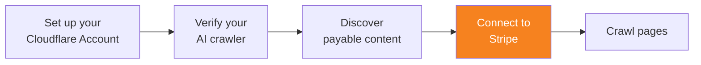

import { Steps, DashButton } from "~/components";

결제를 처리할 수 있도록 Cloudflare 계정을 Stripe에 연결하세요. 크롤당 결제는 AI 크롤러 소유자와 사이트 소유자 간 결제 처리를 위해 Stripe를 사용합니다.

{/* prettier-ignore */}
<Steps>
1. Cloudflare 대시보드에서 **Manage Account** > **Settings** 로 이동합니다.

   <DashButton url="/?to=/:account/configurations" />

2. **Pay Per Crawl** 탭으로 이동합니다.
3. **Connect to Stripe** 에서 **Connect** 를 선택합니다.
4. **Continue to Stripe** 를 선택합니다.
5. 화면의 안내에 따라 Cloudflare 계정을 Stripe 계정에 연결합니다.
   :::note[개인용이 아닌 이메일 주소 사용]
   Cloudflare는 크롤당 결제 계정을 관리할 때 전용 이메일(예: `aicrawler@company.com`)을 사용할 것을 권장합니다.
   :::
</Steps>

Stripe가 계정에 성공적으로 연결되면 **Stripe connection** 옆에 초록색 체크 표시 ✅ 가 나타납니다.

:::caution[지출 한도]
Cloudflare는 지출 한도 설정에 대해 책임지지 않습니다. AI 크롤러에 최대 지출 한도를 반드시 구성하세요.
:::

## 청구

유효한 [crawler price headers](/ai-crawl-control/features/pay-per-crawl/use-pay-per-crawl-as-ai-owner/crawl-pages/#22-include-payment-headers)와 함께 요청된 콘텐츠가 성공적으로 전달되면 요금이 기록됩니다.

인보이스는 Stripe를 통해 생성되고 관리됩니다. 크롤러는 자체적으로 지출 한도를 설정하고 강제할 책임이 있습니다.
