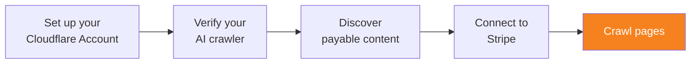

import { Steps } from "~/components";



AI 크롤러가 Web Bot Auth를 준수하면 웹페이지 크롤링을 시작할 수 있습니다. 크롤당 결제의 동작 방식에 대한 자세한 내용은 [크롤당 결제란?](/ai-crawl-control/features/pay-per-crawl/what-is-pay-per-crawl/)을 참고하세요.

## 1. 결제 요구 사항 식별

AI 크롤러가 크롤당 결제로 보호되는 페이지를 요청하면 서버는 `HTTP/2 402 Payment Required` 로 응답합니다. 이 응답에는 콘텐츠 접근 비용을 나타내는 `crawler-price` 헤더도 포함됩니다. 예를 들어 응답은 다음과 같을 수 있습니다.

```txt
HTTP/2 402
date: Fri, 06 Jun 2025 08:42:38 GMT
crawler-price: USD 0.01
```

이 콘텐츠에 접근하려면 AI 크롤러가 유료 접근용 헤더를 제공해야 합니다.

## 2. 유료 콘텐츠 접근

### 2.1. 결제 헤더 포함

AI 크롤러는 다음 두 헤더 중 하나를 제공하여 지불 의사가 있는 가격을 지정할 수 있습니다.

- `crawler-exact-price`: AI 크롤러가 접근 비용으로 정확히 지불하도록 구성된 금액입니다. 이 값은 응답 헤더 `crawler-price` 에 설정된 가격과 정확히 일치해야 합니다. AI 크롤러가 먼저 HTTP 상태 코드 402를 받았고, `crawler-price` 를 지불해 콘텐츠에 접근하려는 경우 두 번째 요청에 이 헤더를 포함하세요.
- `crawler-max-price`: AI 크롤러가 어떤 콘텐츠에 대해서든 접근 비용으로 지불하도록 구성된 최대 금액입니다. 크롤링 가격이 최대 가격 이하인 모든 크롤당 결제 콘텐츠에 접근하려면 이 옵션을 사용하세요. 페이지의 `crawler-price` 가 `crawler-max-price` 보다 높으면 AI 크롤러는 HTTP 402 응답을 받습니다.

### 2.2. Web Bot Auth로 요청 서명

[요청 서명하기](/bots/reference/bot-verification/web-bot-auth/#4-after-verification-sign-your-requests)의 단계에 따라 Web Bot Auth 헤더를 포함하세요.

:::caution[중요]
결제 헤더(`crawler-exact-price` 또는 `crawler-max-price`)는 **반드시 `signature-input` 헤더 구성 요소에 포함되어야 합니다**. [서명할 구성 요소 선택](/bots/reference/bot-verification/web-bot-auth/#41-choose-a-set-of-components-to-sign) 단계에서, 결제가 정상 처리되도록 결제 헤더를 서명 대상 구성 요소 목록에 추가하세요.
:::

### 2.3. 응답 헤더 검토

결제를 나타내는 헤더를 지정하면 두 가지 응답 중 하나를 받을 수 있습니다.

#### 성공적인 HTTP 200 응답

`crawler-charged` 헤더 값은 해당 요청에 대해 Cloudflare 계정에 실제 청구될 정확한 금액을 나타냅니다.

```txt
HTTP 200
date: Fri, 06 Jun 2025 08:42:38 GMT
crawler-charged: USD 0.01
```

#### 실패한 응답

요청이 성공하지 못하면, 특정 문제를 나타내는 `crawler-error` 헤더가 포함된 오류 응답을 받게 됩니다.

```txt
HTTP/2 402
date: Fri, 06 Jun 2025 08:42:38 GMT
content-type: text/plain; charset=utf-8
crawler-price: USD 0.01
crawler-error: InvalidCrawlerExactPrice
```

전체 오류 코드 목록과 문제 해결 지침은 [Pay Per Crawl error codes](/ai-crawl-control/features/pay-per-crawl/use-pay-per-crawl-as-ai-owner/error-codes/)를 참고하세요.

## 3. 지출 추적

크롤당 결제 콘텐츠에 성공적으로 접근하면(HTTP 상태 코드 200으로 응답), 응답에 `crawler-charged` 가 포함됩니다. 예:

```
crawler-charged: USD 0.01
```

Cloudflare는 AI 크롤러에 누적된 청구 금액을 정확히 기록할 수 있도록 이러한 값을 추적하고 저장할 것을 강력히 권장합니다.

## 추가 자료

다음 자료도 참고할 수 있습니다.

- [결제 가능한 콘텐츠 찾기](/ai-crawl-control/features/pay-per-crawl/use-pay-per-crawl-as-ai-owner/discover-payable-content/)
- [Pay Per Crawl error codes](/ai-crawl-control/features/pay-per-crawl/use-pay-per-crawl-as-ai-owner/error-codes/)
- [Pay Per Crawl FAQs](/ai-crawl-control/features/pay-per-crawl/faq/)
