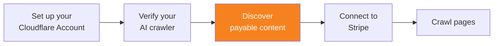

import { Steps } from "~/components";



Pay Per Crawl Discovery API를 사용하면 검증된 AI 크롤러가 어떤 도메인이 유료 콘텐츠 접근을 제공하는지 확인할 수 있습니다. 이를 통해 크롤러는 실제 크롤링 요청을 보내기 전에 Pay Per Crawl에 참여하는 사이트를 미리 식별할 수 있습니다.

## 사전 요구 사항

Pay Per Crawl Discovery API를 사용하기 전에 다음을 완료해야 합니다.

- [Cloudflare 계정 설정](/ai-crawl-control/features/pay-per-crawl/use-pay-per-crawl-as-ai-owner/set-up-cloudflare-account/)
- [AI 크롤러 검증](/ai-crawl-control/features/pay-per-crawl/use-pay-per-crawl-as-ai-owner/verify-ai-crawler/)

## Web Bot Auth로 인증

Discovery API에 대한 모든 요청은 Web Bot Auth 헤더와 함께 HTTP 메시지 서명을 사용해 인증되어야 합니다. 이렇게 하면 검증된 크롤러만 참여 도메인 목록에 접근할 수 있습니다.

<Steps>

1. [요청 서명하기](/bots/reference/bot-verification/web-bot-auth/#4-after-verification-sign-your-requests)의 단계에 따라 Web Bot Auth 서명을 생성합니다.

2. [필수 헤더 구성](/bots/reference/bot-verification/web-bot-auth/#43-construct-the-required-headers)에 설명된 대로 필요한 헤더를 구성합니다.
   - `Signature`: 요청의 암호학적 서명
   - `Signature-Input`: 서명 메타데이터 및 매개변수
   - `Signature-Agent`: 서명 에이전트에 대한 정보

</Steps>

## 참여 도메인 찾기

### API 엔드포인트

```txt
GET https://crawlers-api.ai-audit.cfdata.org/charged_zones
```

### 요청 매개변수

- `cursor` (선택 사항): 이전 호출에서 반환된 페이지네이션용 커서
- `limit` (선택 사항): 요청당 반환할 결과 수

### 요청 헤더

Web Bot Auth로 생성한 HTTP 메시지 서명 헤더를 포함하세요.

```txt
Signature: <your-signature>
Signature-Input: <signature-metadata>
Signature-Agent: <agent-information>
```

### 요청 예시

```sh
curl -X GET "https://crawlers-api.ai-audit.cfdata.org/charged_zones?limit=50" \
  -H "Signature: <your-signature>" \
  -H "Signature-Input: <signature-metadata>" \
  -H "Signature-Agent: <agent-information>"
```

### 응답 형식

이 API는 Pay Per Crawl이 활성화되어 있고 현재 크롤러로부터 결제를 받고 있는 zone(도메인) 목록을 반환합니다.

```json
{
	"result": {
		"zones": [
			{
				"domain": "example.com"
			},
			{
				"domain": "news-site.com"
			}
		]
	},
	"success": true,
	"errors": [],
	"messages": []
}
```

### 응답 필드

- `result.zones`: Pay Per Crawl이 활성화된 도메인을 담은 zone 객체 배열
- `result.zones[].domain`: Pay Per Crawl 콘텐츠를 제공하는 도메인 이름
- `success`: 요청 성공 여부를 나타내는 불리언
- `errors`: 오류 메시지 배열(성공 시 비어 있음)
- `messages`: 정보성 메시지 배열

## 발견 데이터 활용

Discovery API는 사이트 소유자가 현재 크롤러에 대해 콘텐츠 접근 과금을 명시적으로 구성한 도메인을 반환합니다. 어떤 도메인이 응답에 나타나지 않는다면, 해당 사이트 소유자는 현재 크롤러에 대해 Pay Per Crawl 과금을 활성화하지 않은 것입니다. 사이트 소유자는 WAF 규칙을 통해 현재 크롤러를 차단하거나 허용할 수도 있고, `robots.txt` 파일에 지시 사항을 설정할 수도 있으므로 이를 확인하고 준수해야 합니다.

Pay Per Crawl에 새로 참여하거나 이탈하는 도메인을 최신 상태로 유지할 수 있도록, discovery 결과를 로컬에 캐시하고 주기적으로 갱신하세요.

## 추가 자료

- [페이지 크롤링](/ai-crawl-control/features/pay-per-crawl/use-pay-per-crawl-as-ai-owner/crawl-pages/)
