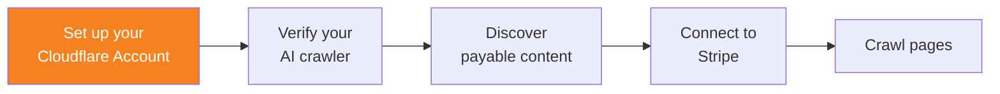

import { Steps } from "~/components";

크롤당 결제를 사용하려면 먼저 Cloudflare 계정을 설정하세요.

[Cloudflare 계정](https://dash.cloudflare.com/sign-up)에 가입합니다.

:::note[크롤당 결제 비공개 베타]
크롤당 결제는 현재 비공개 베타 상태입니다.

베타 프로그램 참여 방법을 알아보려면 [Pay per crawl signup](http://www.cloudflare.com/paypercrawl-signup/)으로 문의하거나, 기존 Enterprise 고객인 경우 담당 계정 관리자에게 문의하세요.

크롤당 결제에 대해 자세히 알아보려면 Cloudflare 블로그의 [Introducing pay per crawl: enabling content owners to charge AI crawlers for access](https://blog.cloudflare.com/introducing-pay-per-crawl/)를 참고하세요.
:::
