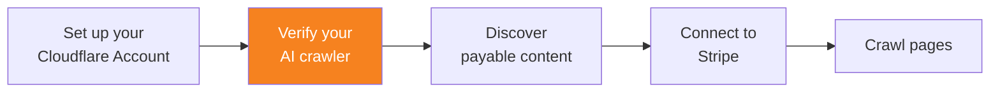

import { Steps, DashButton } from "~/components";



Stripe 계정을 연결한 후에는 AI 크롤러를 [검증된 봇](/bots/concepts/bot/verified-bots/)으로 설정하세요.

## 콘텐츠 접근 제한

AI 크롤러가 크롤당 결제로 보호되는 콘텐츠에 접근하려고 하면 HTTP 상태 코드 402를 받습니다. 이는 결제가 필요함을 의미합니다. 응답의 HTTP 헤더에는 콘텐츠 비용이 포함됩니다.

예를 들어 응답 헤더는 다음과 같을 수 있습니다.

```
HTTP/2 402
date: Fri, 06 Jun 2025 08:42:38 GMT
content-type: text/plain; charset=utf-8
crawler-price: USD 0.01
server: cloudflare
```

이 콘텐츠에 접근하려면 AI 크롤러를 검증해야 합니다.

## 1. Web Bot Auth 프로토콜 따르기

AI 크롤러가 Web Bot Auth에 필요한 헤더로 자신을 식별하도록 하세요.

[Web Bot Auth](/bots/reference/bot-verification/web-bot-auth/)에 있는 단계를 따르세요.

## 2. 검증된 봇 정책 따르기

AI 크롤러가 Cloudflare의 [검증된 봇 정책](/bots/concepts/bot/verified-bots/policy/)을 준수하도록 하세요.

## 3. 검증 요청 제출

AI 크롤러를 Cloudflare의 검증된 봇 목록에 추가하도록 양식을 제출하세요.

{/* prettier-ignore */}
<Steps>
1. Cloudflare 대시보드에서 **Manage Account** > **Settings** 로 이동합니다.

	<DashButton url="/?to=/:account/configurations" />

2. **Bot Submission Form** 탭으로 이동합니다.

3. 다음 필수 정보를 입력하여 양식을 작성합니다.
   - **Select bot type**: **Verified Bot** 또는 **Signed Agent** 중 하나를 선택합니다.
   - **Verification Method**: **Request Signature** 를 선택합니다.
   - **User-Agents header values**: 봇이 사용하는 User-Agent 문자열을 입력합니다.
   - **User-Agents Match Pattern**: User-Agent와 일치하는 부분 문자열 패턴을 입력합니다(예: `GoogleBot | GoogleScraper`).

4. **Submit** 을 선택합니다.
</Steps>
