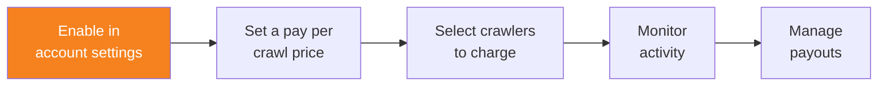

import { Steps, DashButton } from "~/components";

## 사전 요구 사항

Pay Per Crawl을 구성하려면 다음이 필요합니다.

- **Cloudflare 계정**: 도메인이 추가된 활성 Cloudflare 계정이 필요합니다.
- **Cloudflare에 있는 도메인**: 도메인이 Cloudflare 네임서버를 사용 중이거나, DNS 레코드가 Cloudflare에서 관리되어야 합니다.
- **관리자 액세스**: 계정 수준 구성을 위해 Administrator 또는 Super Administrator 권한이 필요합니다.

## 도메인 액세스 구성

모든 도메인에 액세스할 수 있는 Administrator 또는 Super Administrator가 Pay Per Crawl 제어를 표시할 도메인을 선택해야 합니다.

{/* prettier-ignore */}
<Steps>
1. Cloudflare 대시보드에서 **Manage Account** > **Settings**로 이동합니다.

   <DashButton url="/?to=/:account/configurations" />

2. **Pay Per Crawl**을 선택합니다.
3. **Domain Access** 테이블에서 Pay Per Crawl 구성이 표시될 도메인을 선택합니다.
4. 구성하려는 각 도메인의 **Visibility**를 **Visible**로 설정합니다.
</Steps>

:::note[Visibility vs Security]
도메인을 **Visible**로 설정해도 보안 규칙에는 영향을 주지 않습니다. 이 설정은 Pay Per Crawl 구성 제어를 도메인 수준 관리자도 접근할 수 있게 만들 뿐입니다.
:::

이 단계를 완료하면 도메인 관리자는 각자의 도메인에 대해 Pay Per Crawl 가격을 설정하고 Pay Per Crawl을 활성화할 수 있습니다.
