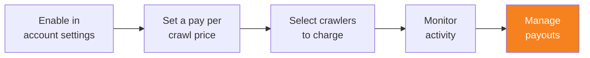

import { Steps, DashButton } from "~/components";

누적된 크롤러 활동에 대한 결제를 받을 준비가 되었다면, Cloudflare 계정을 Stripe에 연결하세요. 이 단계는 Pay Per Crawl을 활성화한 뒤 언제든지 완료할 수 있습니다.

## 새 Stripe 계정 만들기

**Administrator** 또는 **Super Administrator** 액세스 권한이 있는 사용자가 Stripe 연결을 설정해야 합니다.

{/* prettier-ignore */}
<Steps>
1. Cloudflare 대시보드에서 **Manage Account** > **Settings**로 이동합니다.

   <DashButton url="/?to=/:account/configurations" />

2. **Pay Per Crawl**을 선택합니다.
3. **Stripe account** 섹션에서 **Connect**를 선택합니다.
4. **Continue to Stripe**를 선택합니다.
5. Stripe 온보딩 절차를 완료합니다. 여기에는 다음이 포함됩니다.
   - 기본 비즈니스 정보
   - 지급을 받을 은행 계좌 정보
</Steps>

:::note[Pay Per Crawl Stripe account required]
대시보드를 통해 전용 Cloudflare Stripe Connect 계정을 만들어야 합니다. 기존 Stripe 계정은 이 기능과 호환되지 않습니다.
:::

## 청구 수명 주기

Cloudflare는 전체 청구 수명 주기를 관리합니다.

1. **과금 시작**: AI 크롤러가 요청 헤더를 통해 결제 의사를 표시합니다.
2. **과금 기록**: 콘텐츠가 성공적으로 전달되면(HTTP 200 응답) 과금 이벤트가 기록됩니다.
3. **집계**: Cloudflare가 기록된 모든 과금을 집계하고 정산합니다.
4. **지급**: 정상 상태의 퍼블리셔에게 월별 지급이 이루어집니다.

### 제한 사항

- 현재 누적 잔액은 대시보드에 표시되지 않습니다. Cloudflare 팀에 잔액 업데이트를 요청할 수 있습니다.
- 지급은 정산 기간과 최소 지급 임계값의 적용을 받습니다.
