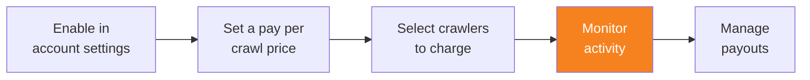

import { Steps, DashButton } from "~/components";

Pay Per Crawl을 구성한 후에는 크롤러 활동을 모니터링하여 AI 크롤러가 콘텐츠와 상호작용하는 방식을 이해하고, 수익을 추적하세요.

## 크롤러 활동 보기

{/* prettier-ignore */}
<Steps>
1. **AI Crawl Control**로 이동합니다.

   <DashButton url="/?to=/:account/:zone/ai" />

2. 자세한 분석을 보려면 **Metrics** 탭으로 이동합니다.
</Steps>

이 메트릭을 통해 다음을 파악할 수 있습니다.

- 어떤 크롤러가 콘텐츠에 접근하는지
- 얼마나 자주 과금되는지
- 요청 패턴과 추세
- robots.txt 위반

사용 가능한 메트릭에 대한 자세한 내용은 [AI Crawl Control 메트릭 보기](/ai-crawl-control/features/analyze-ai-traffic/#view-ai-crawl-control-metrics)를 참조하세요.

:::note[Balance visibility]
현재 누적 수익 잔액은 대시보드에 표시되지 않습니다. Cloudflare 팀에 잔액 업데이트를 요청할 수 있습니다.
:::

## 추가 고려 사항

### robots.txt 관리

AI 크롤러가 액세스 비용을 지불할 의사가 있더라도 어떤 페이지는 계속 접근 불가로 유지되어야 하는지 명확히 표시할 수 있도록 `robots.txt` 파일을 업데이트하는 것을 고려하세요.

### 지속적인 최적화

Pay Per Crawl을 가장 효과적으로 사용하려면 다음을 수행하세요.

- 크롤러 활동을 정기적으로 검토해 패턴을 파악합니다.
- 수요와 콘텐츠 가치에 따라 가격을 조정합니다.
- 필요에 따라 크롤러 작업(과금, 허용, 차단)을 수정합니다.
- 비정상적이거나 원치 않는 크롤러 동작이 있는지 모니터링합니다.

## 추가 리소스

- [Pay Per Crawl FAQs](/ai-crawl-control/features/pay-per-crawl/faq)
- [Analyze AI traffic](/ai-crawl-control/features/analyze-ai-traffic/)
