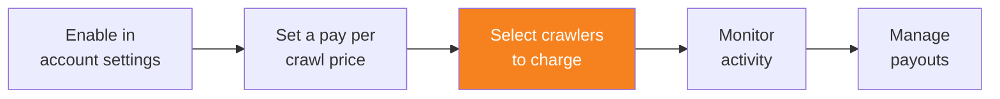

import { Steps, DashButton } from "~/components";

Pay Per Crawl을 활성화하고 가격을 설정한 뒤에는 어떤 AI 크롤러에 콘텐츠 접근 비용을 청구할지 지정할 수 있습니다.

{/* prettier-ignore */}
<Steps>
1. **AI Crawl Control**로 이동합니다.

   <DashButton url="/?to=/:account/:zone/ai" />

2. **Crawlers** 탭으로 이동합니다.
3. 각 크롤러에 대해 **Actions** 열에서 작업을 선택합니다.
   - **Charge**: 콘텐츠에 성공적으로 접근할 때 설정된 가격을 청구합니다.
   - **Allow**: 과금 없이 무료 액세스를 허용합니다.
   - **Block**: 액세스를 완전히 차단합니다.
</Steps>

:::tip[Search Engine Crawlers and SEO]
**Category** 열을 사용해 어떤 봇이 **Search Engine Crawlers**인지 식별하세요. 이 크롤러를 **Block** 또는 **Charge**로 설정하면 검색 엔진이 콘텐츠를 제대로 색인하지 못할 수 있으므로 사이트의 SEO 성능에 부정적인 영향을 줄 수 있습니다.
:::

## 일괄 작업

여러 크롤러를 한 번에 구성하려면 다음을 수행합니다.

{/* prettier-ignore */}
<Steps>
1. 필터(Name, Operator, Category)를 사용해 크롤러 목록 범위를 좁힙니다.
2. 체크박스를 선택해 구성할 크롤러를 고릅니다.
3. 테이블 위에 일괄 작업 옵션이 나타납니다.
4. 원하는 작업을 선택하고 변경 사항을 적용합니다.
</Steps>

AI 크롤러 관리에 대한 자세한 내용은 [Manage AI crawlers](/ai-crawl-control/features/manage-ai-crawlers/)를 참조하세요.
