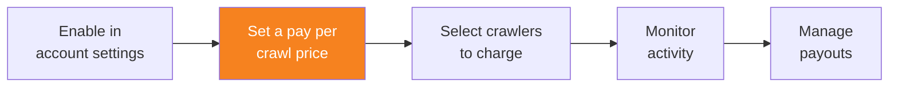

import { Steps, DashButton } from "~/components";

Account Settings에서 도메인의 가시성이 **Visible**로 설정되면, 해당 도메인에 대한 크롤당 과금 가격을 설정하고 Pay Per Crawl을 활성화할 수 있습니다.

{/* prettier-ignore */}
<Steps>
1. **AI Crawl Control**로 이동합니다.

   <DashButton url="/?to=/:account/:zone/ai" />

2. **Settings** 탭으로 이동합니다.
3. **Pay Per Crawl** 카드에서 **Enable**을 선택합니다.
4. 기본 크롤당 가격을 설정합니다. 이 금액은 AI 크롤러가 콘텐츠를 성공적으로 가져갈 때마다(HTTP 200 응답) 청구됩니다.
   - (선택 사항) 콘텐츠별로 다른 가격을 설정하려면 **Enable custom pricing**을 선택합니다. 자세한 내용은 [고급 구성](/ai-crawl-control/features/pay-per-crawl/use-pay-per-crawl-as-site-owner/advanced-configuration/#custom-pricing)을 참조하세요.
5. **Save**를 선택합니다.
</Steps>

활성화하고 가격을 설정하면 Account Settings에서 도메인 상태가 **Enabled**로 변경됩니다.

:::note[Pricing considerations]
최소 가격은 크롤당 미화 0.01달러입니다. 가격을 설정할 때는 콘텐츠 가치와 예상 크롤러 볼륨을 고려하세요.
:::
