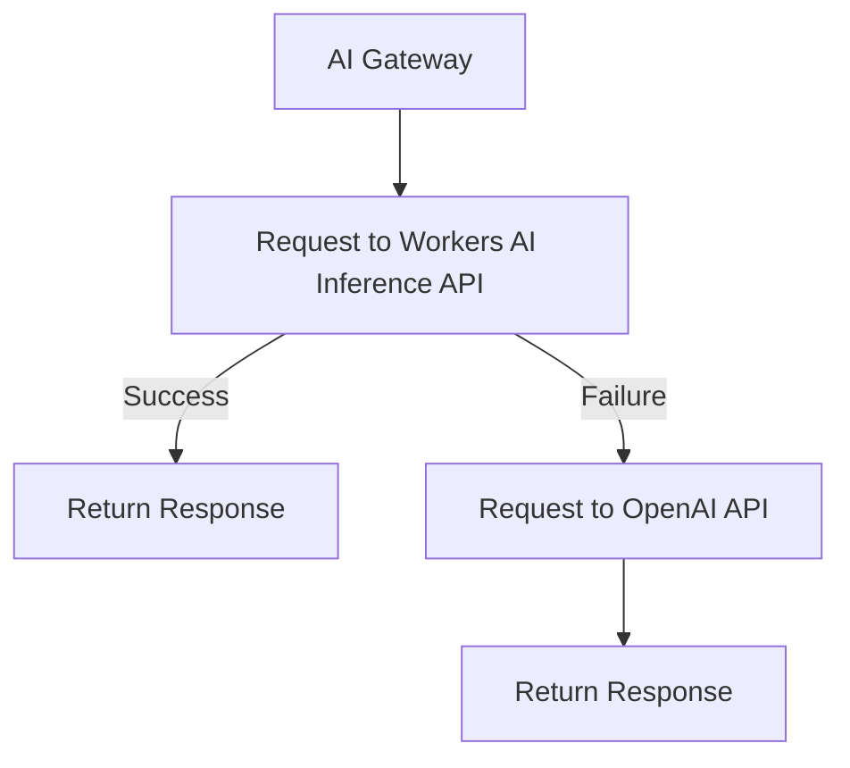

import { Render } from "~/components";

모델 또는 공급자 fallbacks를 지정하십시오.[범용 엔드포인트](/ai-gateway/usage/universal/)요청 실패를 처리하고 신뢰성을 보장합니다.

Cloudflare는 응답에 있는 당신의 fallback 공급자를 방아쇠를 수 있습니다[요청 오류](#request-failures)또는[predetermined 요청 timeouts](/ai-gateway/configuration/request-handling#request-timeouts)·[응답 헤더`cf-aig-step`](#response-headercf-aig-step)요청을 성공적으로 처리하는 것을 나타냅니다.

## 요청 실패

기본적으로, Cloudflare는 모델 요청이 오류를 반환하면 가을을 트리거합니다.

### 이름 \*

다음 예제에서, 먼저 요청은[모델 번호: Workers AI](/workers-ai/)Inference API. 요청이 실패하면 OpenAI로 돌아갑니다. 응답 헤더`cf-aig-step`요청을 성공적으로 처리 한 공급자를 나타냅니다.

1. Workers AI Inference API에 요청을 보냅니다.
2. 요청이 실패하면, OpenAI로 진행합니다.

 

필요한 만큼 많은 단점을 추가할 수 있습니다.

<Render file="universal-gateway-example" product="ai-gateway" />

## 응답 헤더(cf-aig-step)

사용시[범용 엔드포인트](/ai-gateway/usage/universal/)fallbacks로, 응답 헤더`cf-aig-step`단계 번호를 반환하여 요청을 성공적으로 처리하는 모델을 나타냅니다. 이 헤더는 낙하가 방아쇠가 발생했는지 여부에 가시성을 제공합니다. 이는 궁극적으로 응답을 처리하는 모델입니다.

- `cf-aig-step:0`– 첫번째 (primary) 모형은 성공적으로 사용되었습니다.
- `cf-aig-step:1`– 요청은 두 번째 모델로 다시 떨어졌다.
- `cf-aig-step:2`– 요청은 세 번째 모델로 다시 떨어졌다.
- 연속 단계 – 각 낙하 증가 단계 번호 1.
