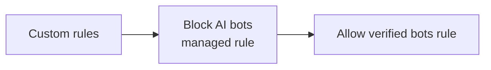

import { Render } from "~/components";

·**봇**특정 작업을 수행하는 소프트웨어 응용 프로그램입니다.

Bots는 좋은 (chatbots, 검색 엔진 크롤러) 또는 악 (inventory hoarding, credential stuffing)에 사용될 수 있습니다.

:::노트\[더 많은 정보]

더 많은 배경을 위해, 참조[봇이란?](https://www.cloudflare.com/learning/bots/what-is-a-bot/).
:::

## 검증된 봇 및 서명 에이전트

<Render file="verified-bots" product="bots" />

:::참조
확인된 봇을 허용하거나 차단하는 방법[당신의 계획](/bots/concepts/bot/verified-bots/#availability).
:::

## AI 봇

웹 사이트를 방문하여 인공 지능 (AI) 크롤러 (AI Bots)로 분류하는 봇을 차단하는 관리 된 규칙으로 선택할 수 있습니다. 고객은 교육 대형 언어 모델 (LLM)과 같은 콘텐츠의 AI 관련 사용을 방지하기 위해 이것을 선택할 수 있습니다.

### 어떤 봇이 차단됩니다

이 기능을 사용할 때, Cloudflare는 다음 봇을 차단합니다.

- `Amazonbot`(아마존)
- `Applebot`(애플)
- `Bytespider`(별도)
- `ClaudeBot`(애슬로픽)
- `DuckAssistBot`(덕덕고)
- `Google-CloudVertexBot`(구글)
- `GoogleOther`(구글)
- `GPTBot`(오픈)
- `Meta-ExternalAgent`(메타)
- `PetalBot`(아와이)
- `TikTokSpider`(별도)
- `CCBot`(코몬 크롤)

이 목록에는[검증된 봇](https://radar.cloudflare.com/bots#verified-bots)그것은 AI 크롤러로 분류, 뿐만 아니라 비슷한 행동 봇의 수, 규칙에 포함. 이 규칙은 확인된 봇을 포함하지 않습니다.`Search Engine`한국어

이 카테고리 및 이 카테고리에서 분류 된 봇은 시간이 지남에 따라 변경 될 수 있습니다.

봇 연산자 인 경우 봇이 잘못 분류 된 경우,[확인된 봇 목록에 봇 추가](https://dash.cloudflare.com/?to=/:account/configurations/verified-bots).

### 어떻게 작동합니까?

사전 구성 관리 규칙을 통해이 기능을 활성화 할 때, 'Cloudflare'는 준수 AI 봇을 감지하고 차단 할 수 있습니다`robots.txt`그리고 존경 크롤 속도, 당신의 웹 사이트에서 자신의 행동을 숨길 수 없습니다. 규칙은 규칙을 따르지 않는 AI 봇의 더 많은 서명을 포함하도록 확장되었습니다.

AI 봇을 차단하는 규칙은 다른 모든 슈퍼 봇 전투 모드 규칙을 통해 우선합니다. 예를 들어, 활성화된 경우**블록 AI 봇**·**확인된 봇**확인 된 AI 봇도 웹 사이트 또는 응용 프로그램에 다른 확인 된 봇을 허용하더라도 차단됩니다.

Bot 관리 고객을 위해, 당신은 확실히 자동화한 봇에 관리한 도전을 봉사하는 규칙을 놓친 경우에, AI bots는 주문 규칙이 AI 봇을 막는 규칙이 실행될 때 단계이기 때문에 도전될 것입니다.

이 행동은 검증된 설정이 아닌, 확실히 자동화되고, 봇이 설정된 경우`block`또는`allow`. 행동이 있는 경우`allow`이 규칙의 경우, 요청은 규칙과 일치하지 않고 다음 규칙 단계로 진행됩니다. 마찬가지로 행동이 설정되면`block`, 그들은 이전 단계에서 차단되고 AI 규칙과 일치하지 마십시오. 그러나 행동이 있을 때`challenge`, 요청은 규칙과 일치하지 않을 것입니다.

자체 보호 비봇 관리 고객을 위해, 검증된 모든 규칙, 확실히 자동화되고, AI 봇 규칙을 따르는 단계에서 봇이 실행됩니다.

이 기능은 모든 Cloudflare 계획에서 사용할 수 있습니다.

:::참조

AI 봇 차단 방법[당신의 계획](/bots/get-started/).
:::
