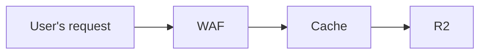

캐시 콘텐츠용으로 만든 공개 버킷에 대한 접근을 제한하려면 Cloudflare의 [WAF](/waf/custom-rules/use-cases/configure-token-authentication/)를 사용할 수 있습니다. WAF는 요청을 필터링하고 권한이 있는 트래픽만 버킷에 도달하도록 보장하는 추가 보안 계층을 제공합니다.

다음 다이어그램은 사용자의 요청이 WAF, Cache, R2를 통과하는 흐름을 보여줍니다.

 

WAF 제품은 토큰 인증을 사용하여 요청에 서명하거나 요청을 인증합니다. 그런 다음 Workers 또는 Snippets에서 이를 사용해 접근을 제어할 수 있습니다.

## 사전 서명 URL

[S3](https://docs.aws.amazon.com/AmazonS3/latest/userguide/using-presigned-url.html)와 비슷하게 URL에 사전 서명을 적용할 수 있으며, 이를 통해 만료 시간이 포함된 직접 접근 링크를 콘텐츠와 함께 공유할 수 있습니다. 이 방식은 Snippets, Rules, Cloudflare Workers를 조합해 구현할 수 있습니다.

최적의 성능을 위해 생성과 검증 과정을 다음과 같이 분리하는 것을 권장합니다.

- HMAC 생성을 위한 [Snippets](/rules/snippets/examples/signing-requests/)
- HMAC 검증을 위한 [Rules](/ruleset-engine/rules-language/functions/#hmac-validation)

Workers 문서의 [Signing requests](/workers/examples/signing-requests/) 섹션에서도 HMAC를 사용해 서명된 요청을 검증하는 예제를 확인할 수 있습니다.
