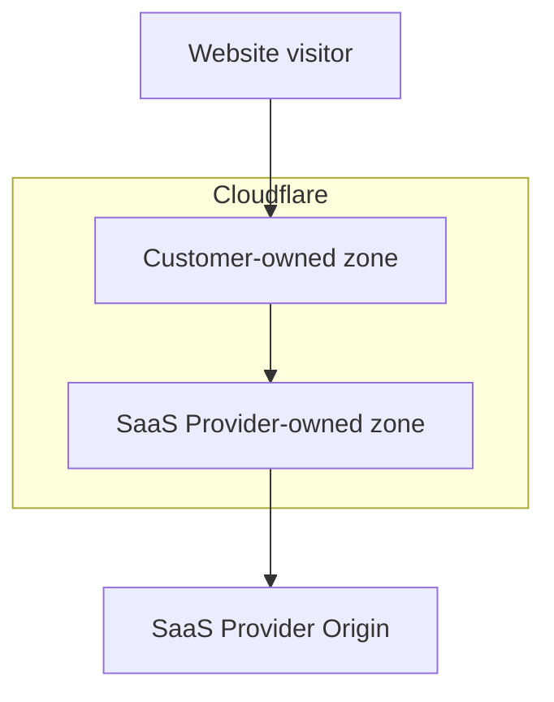
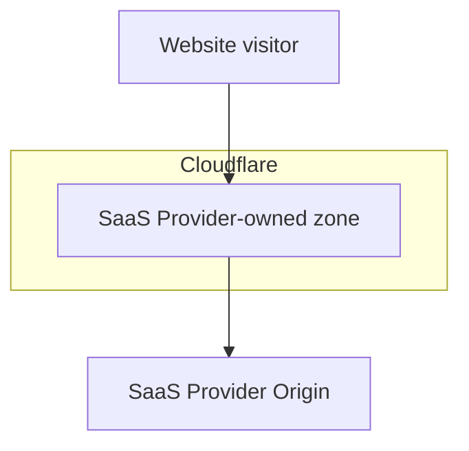

import { Example } from "~/components";

Orange-to-Orange (O2O)는 2개의 Cloudflare 지역을 통해 교통 노선이 있는 특정 교통 여정 윤곽입니다: 첫번째 CloudflareQQ 지역은 고객 1에 의해 소유되고 두번째 Cloudflare 지역은 SaaS 공급자로 여겨지는 고객 2에 의해 소유됩니다.

Cloudflare 제품을 플랫폼의 일부로 사용하는 SaaS 공급자에 한 개 이상의 호스트 이름이 내장되어 있다면 - 특히[SaaS 제품 Cloudflare](/cloudflare-for-platforms/cloudflare-for-saas/)- 그 호스트명은[사용자 정의 hostnames](/cloudflare-for-platforms/cloudflare-for-saas/domain-support/)SaaS 공급자의 영역에서.

SaaS 공급자 권한을 부여하기 위해 영역을 통해 트래픽을 경로에, 어떤 사용자 정의 호스트 이름 활성화해야합니다 (SaaS 고객) 배치[CNAME 기록](/cloudflare-for-platforms/cloudflare-for-saas/start/getting-started/#3-have-customer-create-cname-record)당신의 권위 있는 DNS에. 당신의 권위있는 DNS가 Cloudflare인 경우에, 당신은 선택권이 있습니다[프록시](/fundamentals/concepts/how-cloudflare-works/#application-services)당신의 CNAME 기록, Orange-to-Orange 설정 달성.

## 자주 묻는 질문

- O2O는 두 영역이 다른 Cloudflare 계정의 일부일 때만 적용됩니다.
- O2O는 CNAME을 기반으로 한 이후, A 레코드가 SaaS 공급자 (SaaS) 공급자에게 포인트로 사용될 때 적용되지 않습니다.[apex 프록시](/cloudflare-for-platforms/cloudflare-for-saas/start/advanced-settings/apex-proxying/)).

## O2O로

당신은 당신의 자신의 Cloudflare 지역이 있는 경우에 (`example.com`)와 당신의 지역은 포함합니다[DNS 레코드](/dns/proxy-status/)사용자 지정 hostname 일치 (`mystore.example.com`)와**이름 \***&#x53;aaS 공급자에 의해 정의된 대상은 O2O가 활성화됩니다.

<Example>
  DNS 관리**예제.com**

  | **제품정보** | **이름 \*** | **제품정보**                     | **프록시 상태** |
  | -------- | --------- | ---------------------------- | ---------- |
  | `CNAME`  | `mystore` | `customers.saasprovider.com` | 견적 요청      |
</Example>

O2O 활성화를 통해 Cloudflare 영역에 설정된 설정은 먼저 트래픽에 적용되며 SaaS 공급자의 영역에서 구성된 설정은 트래픽에 두 번째로 적용됩니다. SaaS 공급자 소유 영역에서 HTTP 헤더가 설정됩니다.`cf-connecting-o2o: 1`.

## O2O 없이

Cloudflare Zone을 가지고 있지 않은 경우 호스트 이름 중 하나 이상을 SaaS 공급자에게 공개하고 O2O가 활성화되지 않습니다.

O2O가 활성화되지 않고 SaaS 공급자의 영역에서 구성 된 설정은 트래픽에 적용됩니다.

