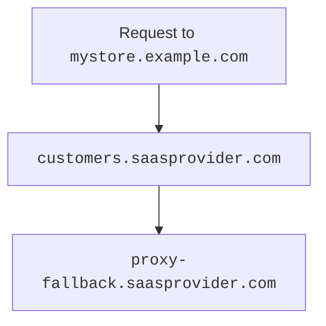

import { Example, Render } from "~/components";

***

<Render file="get-started-prereqs" params={{ one: "on a Free plan." }} product="cloudflare-for-platforms" />

***

## 초기 설정

<Render file="get-started-initial-setup-preamble" product="cloudflare-for-platforms" />

<br />

### 1. fallback 근원 창조

<Render file="get-started-fallback-origin" product="cloudflare-for-platforms" />

### 2. (선택) 창조 CNAME 표적

CNAME 대상 - 선택적이지만 매우 격려 - 고객에게 친절하고 유연한 장소를 제공합니다[그들의 교통](#3-have-customer-create-cname-record). 같은 하위 도메인을 사용할 수 있습니다.`customers.<SAAS_PROVIDER>.com`.

[이름 \*](/dns/manage-dns-records/how-to/create-dns-records/#create-dns-records)당신의 추락 기원에 당신의 CNAME 표적을 점하는 proxied CNAME (와 같은 와일드 카드일 수 있습니다`*.customers.saasprovider.com`).

<Example>
  | **제품정보** | **이름 \***    | **제품정보**                          | **프록시 상태** |
  | -------- | ------------ | --------------------------------- | ---------- |
  | `CNAME`  | `.customers` | `proxy-fallback.saasprovider.com` | 견적 요청      |
</Example>

***

## Per-hostname 설정

<Render file="get-started-per-hostname" product="cloudflare-for-platforms" />

### 3. 고객은 CNAME 기록을 창조합니다

사용자 정의 호스트 이름 설정을 완료하려면 CNAME 레코드를 설정해야 합니다.[CNAME 대상](#2-optional-create-cname-target) [^1].

<Render file="get-started-check-statuses" product="cloudflare-for-platforms" />

고객의 CNAME 레코드는 다음과 같습니다.

```txt
mystore.example.com CNAME customers.saasprovider.com
```

이 기록은 뒤에 오는 방법에 있는 교통을 노선할 것입니다:



<br />

견적 요청`mystore.example.com`CNAME 대상에 갈 것 (`customers.saasprovider.com`), 그 다음 당신의 fallback 근원에 노선 (`proxy-fallback.saasprovider.com`).

[^1]: <Render file="regional-services" product="cloudflare-for-platforms" />

:::카트로션
고객이 SaaS 대상에 대한 A 레코드를 사용해야하는 경우, 얻을 필요가 있습니다.[apex 프록시](/cloudflare-for-platforms/cloudflare-for-saas/start/advanced-settings/apex-proxying/). 기본적으로 A 레코드를 사용하여 대상에 포인트가 지원되지 않습니다.
주요 특징

#### 서비스 오염

<Render file="get-started-service-continuation" product="cloudflare-for-platforms" />
