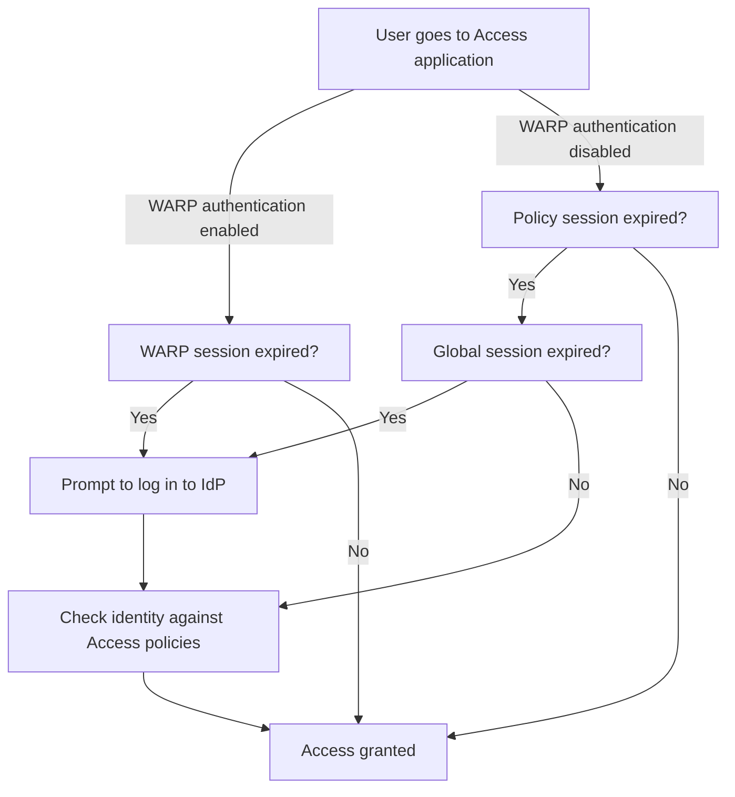

import { GlossaryTooltip, Render } from "~/components";

사용자 세션은 사용자가 재조정없이 액세스 응용 프로그램에 액세스 할 수있는 방법을 결정합니다.

## 세션 기간

액세스에 의해 보호 된 응용 프로그램에 로그인 할 때 액세스는 액세스 정책에 대한 정체성을 검증하고 두 개의 서명 된 JSON Web Tokens (JWTs)을 생성합니다.

| 토큰 토큰                                                                                                  | 이름 \*                                                      | 회사연혁                                                                             | 제품 정보                                                                     |
| ------------------------------------------------------------------------------------------------------ | ---------------------------------------------------------- | -------------------------------------------------------------------------------- | ------------------------------------------------------------------------- |
| 글로벌 세션 토큰                                                                                              | IdP에서 사용자의 ID를 저장하고 모든 액세스 응용 프로그램에 단일 서명 (SSO) 기능을 제공합니다. | [글로벌 세션 기간](#global-session-duration)                                            | 당신의 Cloudflare<GlossaryTooltip term="team domain">팀 도메인</GlossaryTooltip> |
| [앱 토큰](/cloudflare-one/access-controls/applications/http-apps/authorization-cookie/application-token/) | 특정 액세스 응용 프로그램에 액세스 할 수 있습니다.                              | [정책 세션 기간](#policy-session-duration)기본값은[앱 세션 기간](#application-session-duration) | 액세스 응용 프로그램에 의해 보호 된 호스트 이름                                               |

사용자는 애플리케이션 토큰 수명주기의 전체 기간 동안 애플리케이션에 액세스 할 수 있습니다. 애플리케이션 토큰이 만료되면 Cloudflare는 글로벌 토큰이 여전히 유효하다면 새로운 애플리케이션 토큰을 자동으로 발행합니다 (사용자의 정체성은 여전히 액세스 정책을 통과합니다). 글로벌 토큰이 만료된 경우, 사용자는 IdP와 재조립됩니다.

글로벌 토큰 만료는 일반적으로 애플리케이션 토큰 만료를 초과하거나 초과하는 것입니다. 더 긴 글로벌 토큰을 설정하는 것은 더 안전한 방법을 제공합니다. 더 긴 사용자 세션, 글로벌 토큰이 응용 프로그램에 직접 액세스 할 수 없기 때문에.

아날로그로서, 당신은 하루를 입력 할 수있는 티켓을 구입하는 축제와 같은 글로벌 세션을 생각할 수 있습니다. 특정 승차 또는 지역의 경우, 직원은 정기적으로 티켓을 확인하여 입장할 수 있습니다. 예를 들어, 백 스테이지 영역은 티켓 홀더가 30 분 투어에 갈 수 있으므로 다른 투어에 가입해야합니다. 이것은 앱 세션에 유사합니다. 이제 VIP 티켓 홀더가 원하는만큼 무대로 돌아갈 수있는 특별한 정책을 상상해보십시오. VIP는 기본 30 분의 값을 초과하는 정책 세션 기간이 있습니다.

<Render file="access/one-time-pin-warning" product="cloudflare-one" />

### 글로벌 세션 기간

글로벌 세션 기간은 Cloudflare Access가 사용자의 ID 공급자에 로그인하는 방법을 결정합니다. 15 분과 한 달 사이 글로벌 세션 기간을 설정할 수 있습니다. 기본 값은 24 시간입니다.

글로벌 세션 기간을 설정하려면:

1. 내 계정[사이트맵 한국어](https://one.dash.cloudflare.com), 이동**액세스 제어** > **액세스 설정**.
2. 이름 \***글로벌 세션 기간 설정**, 선택**제품정보**,
3. 드롭다운 메뉴에서 원하는 타임아웃 기간을 선택합니다.
4. 제품정보**제품 정보**.

사용자는 이 기간 후에 IdP와 재이용해야 합니다.

### 정책 세션 기간

정책 세션 기간은 사용자가 셀프 호스팅 액세스 응용 프로그램에 액세스 할 수있는 방법을 결정합니다. 사용자의 세션이 만료되면 액세스는 애플리케이션의 액세스 정책에 대한 저장된 사용자 ID를 다시 확인합니다.

기본적으로 정책 세션 기간은 동일합니다.[앱 세션 기간](#application-session-duration). 특정 사용자에 대 한 더 많은 과립 된 권한을 구성 하기 위해, 당신은 한 달에 즉시 타임 아웃에서 배열 하는 값에 정책 세션 기간을 변경할 수 있습니다. 예를 들면, 당신은 엔지니어를 위한 7 일에 신청 회의 내구를 놓고 싶을지도 모릅니다, 그러나 계약자를 위한 정책 회의 내구를 24 시간 놓습니다.

정책 세션 기간을 설정하려면:

1. 내 계정[사이트맵 한국어](https://one.dash.cloudflare.com), 이동**액세스 제어** > **회사연혁**.
2. 정책 및 선택**설정하기**.
3. 선택하기**세션 기간**드롭다운 메뉴에서.
4. 자주 묻는 질문

이 정책과 일치하는 사용자는 이 만료 시간으로 애플리케이션 토큰을 발행합니다.

### Application 세션 기간

Application 세션 기간은 기본값입니다.[정책 세션 기간](#policy-session-duration)액세스 응용 프로그램에 대한 모든 정책. 한 달에 즉시 타임 아웃에서 가능한 세션 기간 범위. 기본 값은 24 시간입니다.

응용 프로그램 세션 기간을 설정하려면:

1. 내 계정[사이트맵 한국어](https://one.dash.cloudflare.com), 이동**액세스 제어** > **이름 \***.
2. 응용 프로그램을 선택하고 선택**설정하기**.
3. 선택하기**세션 기간**드롭다운 메뉴에서.
4. 신청 저장.

정책과 일치한 사용자*Application 세션 타임아웃과 동일*기간이 만료 시간으로 애플리케이션 토큰을 발행합니다.

#### SaaS 응용

<Render
  file="access/saas-apps/saas-sessions"
  product="cloudflare-one"
  params={{
  	session: "Application session durations",
  	token: "Access application token",
  }}
/>

#### SSH, RDP 및 VNC

<Render file="access/self-hosted-app/ssh-sessions" product="cloudflare-one" />

### WARP 세션 기간

시간 :[WARP 인증 ID](/cloudflare-one/team-and-resources/devices/warp/configure-warp/warp-sessions/#configure-warp-sessions-in-access)액세스 응용 프로그램에 사용할 수 있습니다, WARP 세션 지속 시간이 응용 프로그램 및 정책 세션 기간을 강화. 글로벌 세션이 만료되었지만 이미 WARP 세션이 유효하다면 WARP 세션이 만료될 때까지 IdP와 함께 거부할 필요가 없습니다. 사용자는 WARP를 실행하고 있습니다.

### 법의학

다음과 같은 Flowchart는 자체 호스팅 응용 프로그램에 대한 사용자 세션을 어떻게 구현하는지 보여줍니다.

## 사용자 세션

액세스는 사용자 세션을 취소하기위한 두 가지 옵션을 제공합니다 : per-application 및 per-user.

### 회사연혁

즉시 특정 응용 프로그램에 대한 모든 활성 세션을 종료하려면:

1. 내 계정[사이트맵 한국어](https://one.dash.cloudflare.com), 이동**액세스 제어** > **이름 \***.

2. 활성 세션을 수정하고 선택하려는 응용 프로그램을 찾습니다**설정하기**.

3. 제품정보**기존 토큰**.

정책의 규칙에 대한 변경 사항이 없으면 ID 공급자의 프로필이 여전히 활성화되면 새로운 세션을 시작할 수 있습니다.

### Per-사용자

액세스는 즉시 계정의 모든 응용 프로그램을 통해 단일 사용자 세션을 수정할 수 있습니다. 그러나 사용자의 정체성 프로파일이 여전히 활성화되면 새로운 세션을 생성 할 수 있습니다.

영구적으로 사용자의 액세스를 수정하려면:

1. 본인의 정체성 공급자의 계정을 비활성화하여 인증할 수 없습니다.

2. 내 계정[사이트맵 한국어](https://one.dash.cloudflare.com), 이동**팀 & 자원** > **이름 \***.

3. 수정하려는 사용자 옆에 체크 박스를 선택합니다.

4. 제품정&#xBCF4;**- 연혁** > **다운로드**.

사용자는 더 이상 액세스에 의해 보호 된 응용 프로그램에 로그인 할 수 없습니다. 사용자는 여전히 좌석 구독을 통해 계산됩니다.[사용자 제거](/cloudflare-one/team-and-resources/users/seat-management)계정에서.

### 자주 묻는 질문

관리자가 사용자 Cloudflare를 수정할 때 액세스 토큰은 사용자가 최대 1 분 동안 다시 로그인 할 수 없습니다. Cloudflare 액세스가 오류를 표시 할 때.

## 사용자로 로그인

액세스 로그 아웃하려면 최종 사용자는 다음 URL 중 하나를 방문 할 수 있습니다.

- `<your-application-domain>/cdn-cgi/access/logout`
- `<your-team-name>.cloudflareaccess.com/cdn-cgi/access/logout`

이 작업[사용자의 세션 수정](#per-user)모든 응용 분야에 걸쳐. 액세스는 즉시 사용자의 브라우저에서 허가 쿠키를 삭제하고 이전에 발행 된 토큰은 20-30 초에서 허용됩니다. 이 두 URL의 유일한 차이점은 도메인의 허가 쿠키가 삭제됩니다. 예를 들어, 이동`<your-application-domain>/cdn-cgi/access/logout`애플리케이션 쿠키를 제거하고 로그아웃 작업을 더 즉시 느낄 수 있습니다.

이 URL을 사용하여 사용자 지정 로그 아웃 버튼을 만들거나 응용 프로그램에 직접 링크 할 수 있습니다.

:::참조

이때, 최종 사용자는 각 application에 로그아웃할 수 없습니다.
주요 특징

## 한국어

AJAX 또는 단일 페이지 애플리케이션에 의존하는 Pages는 사용자를 재 승인하지 않고 만료 된 액세스 토큰으로 인해 하위 요청을 차단할 수 있습니다.

액세스 설정할 수 있습니다.`401`만료된 세션 토큰과 하위 요청에 대한 응답. 우리는이 응답 코드를 사용하여 페이지가 새로 고침하거나 세션이 만료 된 사용자에게 메시지를 표시하는 것이 좋습니다.

자주 묻는 질문`401`만료된 세션의 경우, 모든 AJAX 요청에 다음 헤더를 추가하십시오.

`X-Requested-With: XMLHttpRequest`
