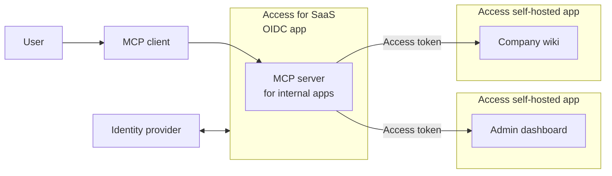

import { Render, GlossaryTooltip, APIRequest, Tabs, TabItem } from "~/components";

사이트맵 액세스는 모든 곳에서 액세스 할 수 있습니다.[자체 호스팅 응용](/cloudflare-one/access-controls/applications/http-apps/self-hosted-public-app/)한국어[SaaS MCP 서버 액세스](/cloudflare-one/access-controls/ai-controls/saas-mcp/)이름 \*[오아우트](https://modelcontextprotocol.io/specification/2025-03-26/basic/authorization). OAuth 액세스 토큰은 사용자의 특정 권한 및 범위를 사용하여 사용자를 대신하여 사용자를 대신하여 MCP 서버에 요청할 권한을 부여합니다.

예를 들어, 조직은 직원이 내부 애플리케이션과 상호 작용하는 데 도움이 MCP 서버를 배치 할 수 있습니다. 구성할 수 있습니다.[오시는 길](/cloudflare-one/access-controls/policies/#selectors)인증된 사용자만 해당 응용 프로그램에 접근할 수 있도록, 직접 또는 사용<GlossaryTooltip term="MCP client">MCP 클라이언트</GlossaryTooltip>.



이 가이드는 Cloudflare API를 사용하여 원격 MCP 서버에 자체 호스팅 응용 프로그램을 연결하는 방법을 다룹니다. 이 기능의 핵심은 Linked App Token 규칙 유형이며, 이는 하나의 응용 프로그램에 액세스 정책을 허용하여 OAuth 액세스 토큰을 다른 용도로 생성 할 수 있습니다.

## 자주 묻는 질문

- ·[셀프 호스팅 액세스 응용](/cloudflare-one/access-controls/applications/http-apps/self-hosted-public-app/)

## 1. SaaS에 대한 액세스와 MCP 서버를 확보

첫 번째 단계는 OIDC 기반 SaaS 애플리케이션으로 MCP 서버를 Cloudflare Access에 추가하는 것입니다. MCP 서버를 추가하는 방법에 대한 단계별 지침을 위해, 참조[SaaS에 대한 액세스 보안 MCP 서버](/cloudflare-one/access-controls/ai-controls/saas-mcp/).

## 2. Linked App Token과의 액세스 정책 생성

<Tabs syncKey="dashPlusAPI">
  <TabItem label="대시보드">
    1. [새로운 액세스 정책 만들기](/cloudflare-one/access-controls/policies/policy-management/#create-a-policy).
    2. 정책 설&#xC815;**- 연혁**으로*서비스 Auth*.
    3. 제품 정보**옵션 정보**, 선택*Linked 앱 토큰*.
    4. 제품 정보**제품정보**, SaaS 응용 프로그램을 선택[단계 1](#1-secure-the-mcp-server-with-access-for-saas). 예를 들면,

       | - 연혁     | 규칙 유형 | 옵션 정보       | 제품정보                   |
       | -------- | ----- | ----------- | ---------------------- |
       | 서비스 Auth | 이름 \* | Linked 앱 토큰 | `mcp-server-cf-access` |

    :::참조
    Linked App Token selector만 사용 가능[서비스 Auth](/cloudflare-one/access-controls/policies/#service-auth)행동, 서비스 토큰 규칙과 유사.
    주요 특징
  </TabItem>

  <TabItem label="사이트맵">
    1. 더 보기`id`MCP 서버 SaaS 애플리케이션의:

       <APIRequest path="/accounts/{account_id}/access/apps" method="GET" />

       ```json title="Response"
       {
       	"id": "3537a672-e4d8-4d89-aab9-26cb622918a1",
       	"uid": "3537a672-e4d8-4d89-aab9-26cb622918a1",
       	"type": "saas",
       	"name": "mcp-server-cf-access",
       	...
       }
       ```

    2. 다음 액세스 정책 만들기, 교체`app_uid`가치와`id`SaaS 응용 프로그램:

       <APIRequest
         path="/accounts/{account_id}/access/policies"
         method="POST"
         json={{
          name: "Allow MCP server",
          decision: "non_identity",
          include: [
          	{
          		linked_app_token: {
          			app_uid: "3537a672-e4d8-4d89-aab9-26cb622918a1",
          		},
          	},
          ],
       }}
       />

       :::참조
       더 보기`linked_app_token`규칙 유형은 단지 작동합니다[`non_identity`회사연혁](/cloudflare-one/access-controls/policies/#service-auth)서비스 토큰 규칙과 유사하다.
       주요 특징

    3. 액세스 정책 복사`id`응답에서 반환:

       ```json title="Response" {5}
       {
       		"created_at": "2025-08-06T20:06:23Z",
       		"decision": "non_identity",
       		"exclude": [],
       		"id": "a38ab4d4-336d-4f49-9e97-eff8550c13fa",
       		"include": [
       			{
       				"linked_app_token": {
       					"app_uid": "6cdc3892-f9f1-4813-a5ce-38c2753e1208"
       				}
       			}
       		],
       		"name": "Allow MCP server",
       		...
       }
       ```
  </TabItem>
</Tabs>

이 정책은 지정된 SaaS 응용 프로그램에 발행 된 유효한 OAuth 액세스 토큰을 제시하는 경우 요청을 허용합니다.

## 3. 자체 호스팅 응용 프로그램을 업데이트

Linked App Token 정책을 추가할 수 있습니다.[자체 호스팅 응용](/cloudflare-one/access-controls/applications/http-apps/self-hosted-public-app/)Zero Trust 계정에서. 다른 앱 유형 (예 :[SaaS 응용](/cloudflare-one/access-controls/applications/http-apps/saas-apps/))는[현재 지원되지 않음](#known-limitations).

## 4. MCP 서버 구성

각 API 요청을 자체 호스팅 응용 프로그램에 사용할 수 있습니다.`access_token`Cloudflare 액세스에서. MCP 서버를 구성해야 합니다.`access_token`HTTP 요청 헤더에:

```txt
Authorization: Bearer ACCESS_TOKEN
```

최종 승인 흐름은 다음과 같습니다.

1. MCP 서버는 OAuth를 통해 SaaS 앱에 대한 액세스를 인증합니다.
2. 성공시 MCP 서버는`access_token`.
3. MCP 서버는 요청 헤더의 토큰을 사용하여 자체 호스팅 응용 프로그램에 API 요청을합니다.
4. 사이트맵 액세스는 셀프 호스팅 응용 프로그램에 대한 요청을 가로 질러 토큰을 검사하고 그것을 검증합니다.`linked_app_token`정책의 규칙.
5. 토큰이 유효하고 연결된 SaaS 앱을 발급한 경우 요청이 허용됩니다. 그렇지 않으면 차단됩니다.

## Known 제한

MCP OAuth 기능은 자체 호스팅 응용 프로그램과 함께 작동합니다.[사이트맵 액세스 JWT](/cloudflare-one/access-controls/applications/http-apps/authorization-cookie/validating-json/)인증 및 인증 응용 프로그램이 Cloudflare 액세스 후 인증의 자체 레이어를 구현하면이 기능은 부분적인 솔루션입니다. 액세스에 의해 성공적으로 인증 된 요청은 여전히 응용 프로그램에 의해 차단 될 수 있습니다, HTTP에서 결과`401`또는`403`오류.
