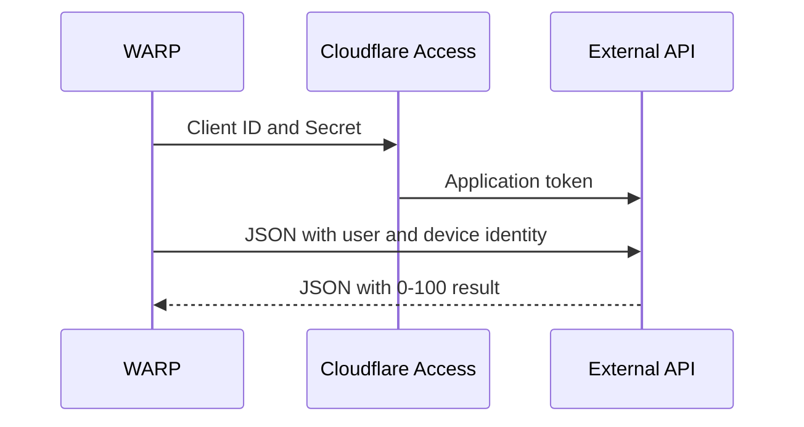

import { Render } from "~/components";

사이트맵 One은 사용자 정의 장치 자세 검사를 적용 할 수 있습니다. 이 WARP 서비스 통합을 구성하는 것은 주기적으로 제 3 자 엔드포인트 공급자 또는 홈 내장 솔루션인지 여부의 외부 API를 호출합니다. 호출 할 때, API는 Cloudflare에서 정보를 식별하고 사이의 값을 반환 할 것으로 예상됩니다`0`으로`100`. 당신은 그 후에 통행 또는 실패로 반환 가치 조사를 결정하는 장치 자세 체크를 설치할 수 있습니다; 예를 들면, 당신은 그들의 장치가 자세가 더 중대한 경우에 사용자에게 접근을 허용할 수 있었습니다`60`.



## 외부 API 필요조건

사용자 정의 서비스 제공 업체 통합은 다음과 같은 사양을 충족하는 API 서비스와 함께 작동합니다. 사용자 정의 장치 자세 통합 API의 예를 들어, 우리의 참조[Cloudflare Workers 샘플 코드](https://github.com/cloudflare/custom-device-posture-integration-example-worker).

### 인증현황

WARP 클라이언트는 Cloudflare Access를 통해 외부 API에 인증합니다. 외부 API는[Application 토큰 검증](/cloudflare-one/access-controls/applications/http-apps/authorization-cookie/validating-json/)Cloudflare 발행 우회 액세스 (예를 들어, 네트워크의 misconfiguration 때문에)가 거부되는 모든 요청이 있는지 확인합니다.

### 외부 API로 전달된 데이터

Cloudflare는 형성된 API 엔드포인트에 뒤에 오는 모수를 전달할 것입니다. 이 데이터를 사용하여 장치를 식별하고 자세 점수를 할당 할 수 있습니다. 일부 장치에서는 모든 식별 정보가 적용되지 않습니다. 해당 필드가 공백일 경우. 최대 1,000개의 기기가 요청당 전송됩니다.

| 제품정보            | 이름 \*                      |
| --------------- | -------------------------- |
| `device_id`     | WARP 클라이언트에 의해 할당된 장치 UUID |
| `email`         | WARP 클라이언트 인증              |
| `serial_number` | 장치 일련 번호                   |
| `mac_address`   | 장치 MAC 주소                  |
| `virtual_ipv4`  | 장치 가상 IPv4 주소              |
| `hostname`      | 장치 이름                      |

:::참조

기기는 일련 번호로 식별됩니다. 각 장치에는 고유한 일련 번호가 있습니다. 여러 장치가 동일한 일련 번호, Cloudflare 및 외부 API를 가지고 있다면 정확하게 일치 할 수 없습니다.

:::

예시 요청 몸 :

```json
{
  "devices": {
    [
      {
        "device_id": "9ece5fab-7398-488a-a575-e25a9a3dec07",
        "email": "jdoe@mycompany.com",
        "serial_number": "jdR44P3d",
        "mac_address": "74:1d:3e:23:e0:fe",
        "virtual_ipv4": "100.96.0.10",
        "hostname": "string",
      },
      {...},
      {...}
    ]
  }
}
```

### 외부 API에서 예상된 응답

각 Cloudflare를 위해`device_id`, API 서비스는 자세 점수 및 선택적으로 타사 장치 ID를 반환 할 것으로 예상됩니다.

| 제품정보     | 이름 \*                   |
| -------- | ----------------------- |
| `s2s_id` | 제3자 장치 ID (사용할 수 없는 경우) |
| `score`  | Integer 값`0` - `100`    |

예 응답 몸:

```json
{
  "result": {
    "9ece5fab-7398-488a-a575-e25a9a3dec07": {
      "s2s_id": "",
      "score": 10
    },
    "device_id2": {...},
    "device_id3": {...}
  }
}
```

## 사용자 지정 장치 자세 체크 설정

### 1. 서비스 토큰 만들기

WARP는 Access Client ID와 Access Client Secret를 사용하여 외부 API에 안전하게 인증합니다. 이미 Access Client ID와 Access Client Secret가 없는 경우,[새로운 서비스 토큰 만들기](/cloudflare-one/access-controls/service-credentials/service-tokens/#create-a-service-token).

### 2. 액세스 신청서 작성

다음 Cloudflare Access 뒤에 외부 API를 확보하여 WARP는 서비스 토큰으로 인증할 수 있습니다. 액세스에 API 엔드포인트를 추가하려면:

1. [자체 호스팅 응용 프로그램 만들기](/cloudflare-one/access-controls/applications/http-apps/self-hosted-public-app/)API 엔드포인트를 위해.
2. 다음 액세스 정책을 응용 프로그램에 추가합니다. 견적 요&#xCCAD;**- 연혁**설정*서비스 Auth*(없음)*지원하다*).

   | - 연혁     | 규칙 유형 | 옵션 정보  | 제품정보           |
   | -------- | ----- | ------ | -------------- |
   | 서비스 Auth | 이름 \* | 서비스 토큰 | `<TOKEN-NAME>` |

### 3. 서비스 제공업체 통합 추가

맞춤 서비스-서비스 통합 만들기:

<Render file="posture/add-service-provider" product="cloudflare-one" params={{ provider: "Custom service provider" }} />

5. 내 계정**액세스 클라이언트 ID**·**Access 클라이언트 비밀**, 외부 API를 인증하는 데 사용되는 액세스 서비스 토큰을 입력하십시오.
6. 내 계정**나머지 API URL**, Cloudflare가 posture 정보 (예를 들면,`https://api.example.com`). 더 많은 정보를 원하시면, 참조[외부 API 필요조건](#external-api-requirements).
7. 내 계정**오염 빈도**, 자주 Cloudflare를 선택하는 방법 1은 정보를 위해 외부 API를 쿼리해야합니다.
8. 제품정보**시험 및 저장**. Cloudflare가 제공하는 액세스 자격 증명을 사용하여 API URL에 인증 할 수 있는지 검사합니다.

다음 것,[장치 자세 검사 구성](#4-configure-the-posture-check)주어진 자세 점수가 패스를 구성하거나 실패하면 결정하십시오.

### 4. 자세 검사 구성

<Render file="posture/configure-posture-check" product="cloudflare-one" params={{ one: "Custom service provider" }} />

## 장치 자세 특성

| 옵션 정보 | 이름 \*                | 제품정보       |
| ----- | -------------------- | ---------- |
| 이름 \* | 외부 API에 의해 반환된 자세 점수 | `0`으로`100` |
