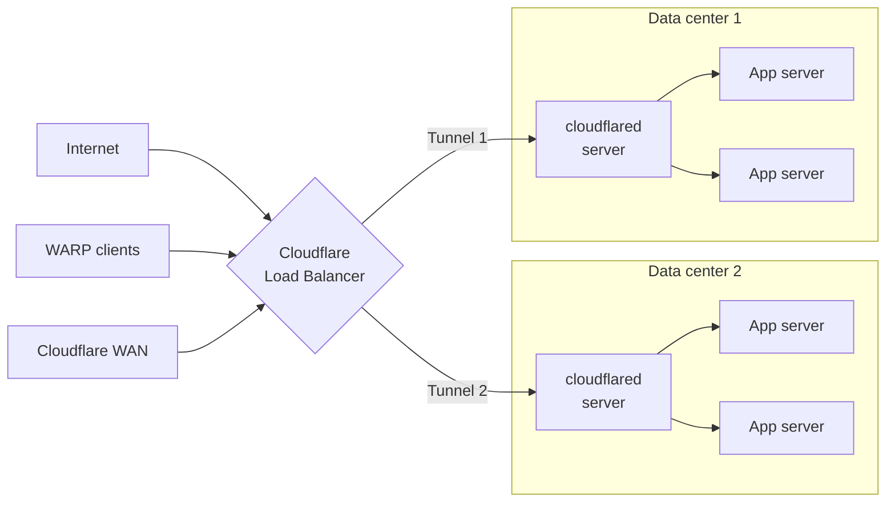

import { Details, GlossaryTooltip, Render } from "~/components";

우리의 경량과 open-source 연결관,[`cloudflared`](https://github.com/cloudflare/cloudflared), 어떤 추가 구성 필요조건도 없이 높게 유효한 건축되었습니다. 터널을 실행할 때,`cloudflared`근원 서버와 Cloudflare 네트워크 사이 4개의 아웃바운드 전용 연결을 설치합니다. 이 4개의 연결은 적어도 2개의 명백한 자료 센터의 맞은편에 4개의 다른 서버로 퍼집니다. 이 모델은 높은 가용성을 보장하고 개별 연결 실패의 위험을 감소시킵니다. 이것은 단일 연결, 서버 또는 데이터 센터가 오프라인으로 진행되는 경우 리소스가 사용할 수 있습니다.

## `cloudflared`회사 소개

사이트맵 Tunnel은 사용자가 커넥터의 추가 인스턴스를 배포할 수 있도록 합니다.`cloudflared`, 가용성 및 장애 시나리오에 대 한. 우리는 이러한 독특한 인스턴스를 복제합니다. 각 복제는 네 가지 새로운 연결을 설정하여 진입의 추가 포인트로, 당신은 그들을 필요로해야합니다. 복제의 각각은 동일한 터널로 점합니다. 이것은 네트워크가 단일 호스트 실행 이벤트에서 남아 있음을 보장합니다.`cloudflared`계속하기

<Render file="tunnel/availability/cloudflared-replicas-diagram" product="cloudflare-one" />

디자인에 의하여, 복제는 교통 조타 (random, hash, 또는 둥근 robin)의 어떤 수준을 제안하지 않습니다. 대신 Cloudflare에 도착하면 지리적으로 가까운 복제물에 전달됩니다. 그 거리 계산이 실패하거나 연결이 실패한 경우, 우리는 다른 사람을 다시 시도하지만 연결이 선택된 것에 대해 보증이 없습니다.

### 이용 시`cloudflared`회사 소개

- 단일 터널에 대한 가용성의 추가 포인트를 제공하기 위해.
- 네트워크 내에서 실패 노드를 할당합니다.
- 터널의 구성을 업데이트하려면[가동 시간 없음](/cloudflare-one/networks/connectors/cloudflare-tunnel/downloads/update-cloudflared/#update-with-multiple-cloudflared-instances).

설정 지침을 위해, 참조[Cloudflared 복제](/cloudflare-one/networks/connectors/cloudflare-tunnel/configure-tunnels/tunnel-availability/deploy-replicas/).

## Cloudflare 로드밸런서

[Cloudflare 부하 균형](/load-balancing/)불쾌한 근원에서 멀리 proactively steers 소통량 및 지능적으로 당신의 선택에 근거를 둔 소통량 짐을 배부합니다[핸들링 알고리즘](/load-balancing/understand-basics/traffic-steering/). 싫어[`cloudflared`회사 소개](#cloudflared-replicas)같은 터널을 모두 사용하는 것은 일반적인 로드밸런서 설정은 여러 터널을 만듭니다. 대부분의 고객은 자료 센터 당 1개의 갱도 및 갱도 당 1개의 짐 밸런서 수영장을 창조할 것입니다.

### 로드밸런서를 사용할 때

- 지연, 위치, 기타 신호를 기반으로 한 지능적으로 스티어 트래픽.
- 터널이 비활성 상태에 도달하면 실패 논리를 구현합니다.
- 시작하기[건강 경고](/notifications/notification-available/#load-balancing)터널이 비활성 상태에 도달 할 때.
- Cloudflare Tunnel-accessible Origin 또는 endpoints를 통해 트래픽을 더욱 안전하게 배포할 수 있습니다.

설정 지침을 위해, 참조[압축밸런서](/cloudflare-one/networks/connectors/cloudflare-tunnel/routing-to-tunnel/public-load-balancers/)또는[개인 네트워크 부하 Balancing](/load-balancing/private-network/)에 따라[사용 사례](#types-of-load-balancers).

### 로드밸런서의 종류

Cloudflare 터널 엔드포인트와 함께 사용할 수있는 로드밸런서의 두 가지 유형이 있습니다.

- [압축밸런서](/cloudflare-one/networks/connectors/cloudflare-tunnel/routing-to-tunnel/public-load-balancers/)Cloudflare 도메인에 게시 된 응용 프로그램에 인터넷에서 steer 트래픽. Cloudflare 터널에 의해 서비스 제공 하는 경우이 방법을 사용[관련 앱](/cloudflare-one/networks/connectors/cloudflare-tunnel/get-started/create-remote-tunnel/#2a-publish-an-application).
- [개인 부하 balancers](/load-balancing/private-network/)WARP 클라이언트, Cloudflare WAN 및 기타의 스티어 트래픽<GlossaryTooltip term="on-ramp">에-램프</GlossaryTooltip>개인 네트워크의 내부 IP에. Cloudflare 터널에 연결되는 경우 이 방법을 사용하십시오.[CIDR 노선](/cloudflare-one/networks/connectors/cloudflare-tunnel/private-net/cloudflared/connect-cidr/).

:::참조
[개인 별명 노선](/cloudflare-one/networks/connectors/cloudflare-tunnel/private-net/cloudflared/connect-private-hostname/)현재 Load Balancing과 호환되지 않습니다. 해당 이용 후기에 달린 코멘트가 없습니다.`cloudflared` [회사 소개](#cloudflared-replicas)높은 가용성.
주요 특징
