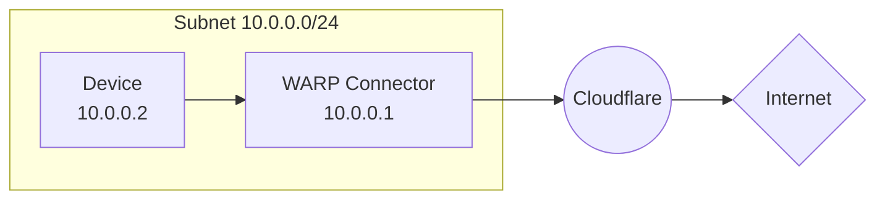
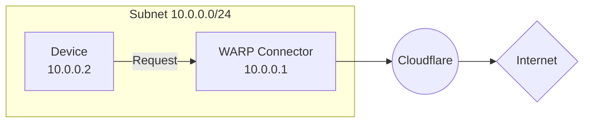

import { Render, Details, GlossaryTooltip, TabItem, Tabs } from "~/components";

이 가이드는 WARP 커넥터를 사용하여 인터넷에 개인 네트워크를 연결하는 방법을 다룹니다. 이 예에서, 우리는 subnet를 위한 WARP 연결관을 창조할 것입니다`10.0.0.0/24`설치하기`10.0.0.1`.

## 자주 묻는 질문

- Linux 호스트[^1]하위넷에
- 방화벽이 인바운드 / 아웃바운드 트래픽을 허용합니다.[WARP IP 주소, 포트 및 도메인](/cloudflare-one/team-and-resources/devices/warp/deployment/firewall/).

## 1. WARP 커넥터 설치

<Render file="tunnel/warp-connector-install" product="cloudflare-one" />

## 2. (추천) 장치 프로필 만들기

<Render file="tunnel/warp-connector-device-profile" product="cloudflare-one" />

## 3. subnet에서 WARP 연결관에 노선 교통

WARP 커넥터 호스트는 자동으로 DNS 및 네트워크 트래픽을 Cloudflare로 전달합니다. WARP 커넥터를 설치 한 곳에 따라 WARP 커넥터를 통해 아웃바운드 요청을 경로를 설정할 수 있습니다.

### 옵션 1: 기본 게이트웨이

<Render file="tunnel/warp-connector-default-gateway" product="cloudflare-one" />

### 선택권 2: Alternate 출입구

<Render file="tunnel/warp-connector-alternate-gateway" product="cloudflare-one" />

#### 라우터에 IP 경로 추가

예를 들어, subnet에서 WARP 커넥터를 통해 egress에 모든 트래픽을 위해, 경로에 대한 규칙을 추가`0.0.0.0`WARP 연결관 주인 기계에 (`10.0.0.100`).

<Render file="tunnel/warp-connector-alternate-gateway-flow" product="cloudflare-one" />

#### 라우터에 DNS 해설기 구성

<Render file="tunnel/warp-connector-alternate-gateway-dns" product="cloudflare-one" />

### 선택권 3: 중간 출입구

<Render file="tunnel/warp-connector-intermediate-gateway" product="cloudflare-one" />

#### 장치에 IP 경로 추가

<Render file="tunnel/warp-connector-route-all-traffic" product="cloudflare-one" />

<Render file="tunnel/warp-connector-verify-routes" product="cloudflare-one" />

#### 장치에서 DNS 해설기 구성

<Render file="tunnel/warp-connector-intermediate-gateway-dns" product="cloudflare-one" />

## 4. WARP 연결관을 시험하십시오

Cloudflare를 통해 하위넷 경로에서 트래픽을 테스트 할 수 있습니다. 예를 들어,

1. 에 의해`10.0.0.2`장치, 실행`curl --ipv4 www.google.com`.
2. 자주 묻는 질문[Gateway DNS 로그](/cloudflare-one/insights/logs/gateway-logs/)자주 묻는 질문`warp_connector@<your-team-name>.cloudflareaccess.com`. 로그는 몇 분이 걸릴 수 있습니다.

[^1]: <Render file="tunnel/warp-connector-linux-packages" product="cloudflare-one" />
