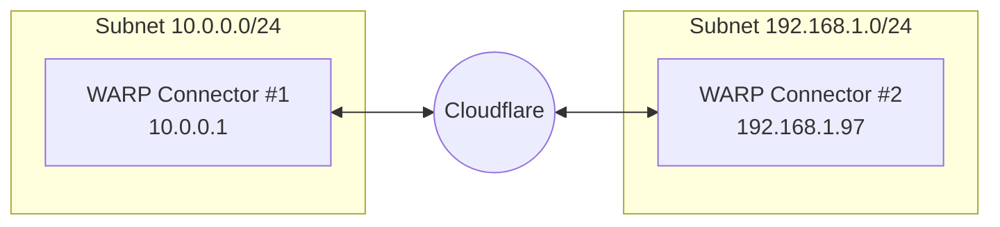
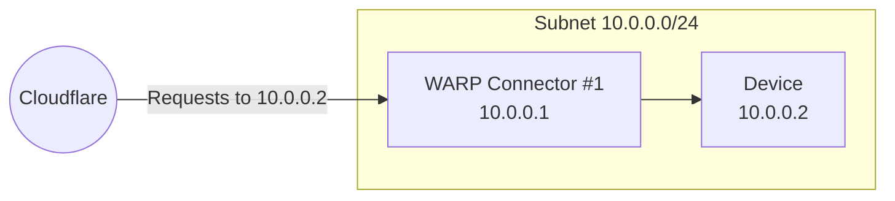
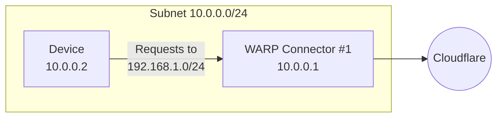
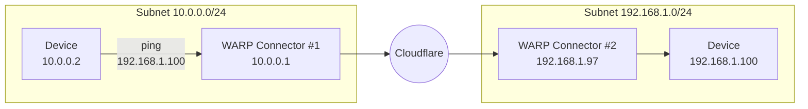

import { Render, Details, GlossaryTooltip, TabItem, Tabs } from "~/components";

이 가이드는 WARP 연결관을 가진 2개의 독립적인 subnets를 연결하는 방법을 포함합니다. 각 서브넷은 Linux 호스트의 WARP 커넥터를 실행해야 합니다. 라우터에 설치는 가장 간단한 설정이지만 라우터에 액세스 할 수없는 경우 하위넷에 다른 기계를 선택할 수 있습니다.



이 예에서, 우리는 subnet를 위한 WARP 연결관을 창조할 것입니다`10.0.0.0/24`설치하기`10.0.0.1`. 우리는 그 때 subnet를 위한 두번째 WARP 연결관을 창조할 것입니다`192.168.1.0/24`설치하기`192.168.1.97`.

## 자주 묻는 질문

- Linux 호스트[^1]각 하위넷에.
- 방화벽이 인바운드 / 아웃바운드 트래픽을 허용합니다.[WARP IP 주소, 포트 및 도메인](/cloudflare-one/team-and-resources/devices/warp/deployment/firewall/).

## 1. WARP 커넥터 설치

<Render file="tunnel/warp-connector-install" product="cloudflare-one" />

## 2. (추천) 장치 프로필 만들기

<Render file="tunnel/warp-connector-device-profile" product="cloudflare-one" />

## 3. WARP 연결관과 Cloudflare 사이 노선 교통

1. 내 계정[사이트맵 한국어](https://one.dash.cloudflare.com), 이동**네트워크** > **오시는 길**.
2. 제품정보**경로 추가**.
3. 내 계정**CIDR 소개**,이 WARP 커넥터를 통해 루트하려는 개인 IPv4 주소 범위를 입력 (예를 들어,`10.0.0.0/24`). WARP 커넥터는 현재 IPv6 경로를 지원하지 않습니다.
   :::참조
   이미 개인 네트워크 범위를 가지고 있지 않다면, 이 중 하나에서 하위 네트워크를 선택할 수 있습니다.[사전 정의 CIDR](https://datatracker.ietf.org/doc/html/rfc1918#section-3).
   :::
4. 제품 정보**관련 제품**, 당신의 WARP 연결관의 이름을 선정하십시오 (*서브넷-10.0.0.0/24*).
5. 제품정보**이름 \***.
6. WARP 연결관 장치 단면도에서,[분할 터널 구성](/cloudflare-one/team-and-resources/devices/warp/configure-warp/route-traffic/split-tunnels/)그래서 개인 네트워크 CIDR에 트래픽 (`10.0.0.0/24`) WARP 갱도를 통해서 노선. 예를 들어, 사용중인 경우**이름 \***&#xBAA8;드, 삭제`10.0.0.0/8`Split Tunnels에서 다음 IP를 다시 추가하십시오.`10.0.1.0/24`, `10.0.2.0/23`, `10.0.4.0/22`, `10.0.8.0/21`, `10.0.16.0/20`, `10.0.32.0/19`, `10.0.64.0/18`, `10.0.128.0/17`, `10.1.0.0/16`, `10.2.0.0/15`, `10.4.0.0/14`, `10.8.0.0/13`, `10.16.0.0/12`, `10.32.0.0/11`, `10.64.0.0/10`, `10.128.0.0/9`

WARP 커넥터는 이제 서브넷에 기기에 인바운드 요청을 전달합니다.



### DNS 필터링

Cloudflare Gateway를 사용하여 개인 DNS 쿼리를 필터링하고 싶다면 체크[분할 터널](/cloudflare-one/team-and-resources/devices/warp/configure-warp/route-traffic/split-tunnels/)그리고 WARP 연결관을 통해서 뒤에 오는 IPs 노선을 지킵니다:

- 내부 DNS 해결 IP
- <GlossaryTooltip term="initial resolved IP">초기 해결 IP</GlossaryTooltip>CGNAT 범위:
  <Render file="gateway/egress-selector-cgnat-ips" product="cloudflare-one" />

게이트웨이를 통해 WARP 커넥터에서 DNS 쿼리를 해결할 때 게이트웨이는 개인 소스 IP로 쿼리를 기록합니다. 개인 소스 IP를 사용하여 만들 수 있습니다.[해결사 정책](/cloudflare-one/traffic-policies/resolver-policies/)관련 기사[내부 DNS 레코드](/cloudflare-one/traffic-policies/resolver-policies/#internal-dns).

## 4. subnet에서 WARP 연결관에 노선 교통

WARP 커넥터 호스트는 자동으로 DNS 및 네트워크 트래픽을 Cloudflare로 전달합니다. WARP 커넥터를 설치 한 곳에 따라 WARP 커넥터를 통해 아웃바운드 요청을 경로를 설정할 수 있습니다.



### 옵션 1: 기본 게이트웨이

<Render file="tunnel/warp-connector-default-gateway" product="cloudflare-one" />

### 선택권 2: Alternate 출입구

<Render file="tunnel/warp-connector-alternate-gateway" product="cloudflare-one" />

#### 라우터에 IP 경로 추가

예를 들어, subnet에 대한 장치`10.0.0.0/24`subnet 뒤에 적용`192.168.1.0/24`, 경로 라우터에 규칙을 추가`192.168.1.0/24`WARP 연결관 주인 기계에 (`10.0.0.100`).

<Render file="tunnel/warp-connector-alternate-gateway-flow" product="cloudflare-one" />

#### 라우터에 DNS 해설기 구성

<Render file="tunnel/warp-connector-alternate-gateway-dns" product="cloudflare-one" />

### 선택권 3: 중간 출입구

<Render file="tunnel/warp-connector-intermediate-gateway" product="cloudflare-one" />

#### 장치에 IP 경로 추가

<Render file="tunnel/warp-connector-route-all-traffic" product="cloudflare-one" />

또는 WARP 커넥터를 통해 egress에 특정 경로만 구성할 수 있습니다. 예를 들어, 내부 애플리케이션 및 장치로 인한 트래픽을 필터링하고 싶을 수도 있지만 Cloudflare를 우회하는 공공 인터넷 트래픽을 허용합니다.

<Tabs>
  <TabItem label="리눅스">
    ```sh
    sudo ip route add <DESTINATION-IP> via <WARP-CONNECTOR-IP> dev eth0
    ```
  </TabItem>

  <TabItem label="맥 OS">
    ```sh
    sudo route -n add -net <DESTINATION-IP> <WARP-CONNECTOR-IP>
    ```
  </TabItem>

  <TabItem label="윈도우">
    ```bash
    route /p add <DESTINATION-IP> mask 255.255.255.255 <WARP-CONNECTOR-IP>
    ```
  </TabItem>
</Tabs>

<Render file="tunnel/warp-connector-verify-routes" product="cloudflare-one" />

#### 장치에서 DNS 해설기 구성

<Render file="tunnel/warp-connector-intermediate-gateway-dns" product="cloudflare-one" />

## 5. 다른 WARP 연결관을 설치하십시오

subnet에 추가 WARP 커넥터를 설치하기 위해 1, 3 및 4 단계 반복`192.168.1.0/24`. 단계 2에서 창조된 장치 단면도는 모든 WARP 연결관에 적용합니다.


## 6. WARP 연결관을 시험하십시오

이제 두 개의 서브넷 간의 연결을 테스트 할 수 있습니다. WARP 커넥터 호스트에 연결을 테스트하려면`10.0.0.2`장치 실행`ping 192.168.1.97`. WARP 연결관의 뒤에 장치에 연결하기 위하여는, 뛰기`ping 192.168.1.100`.



:::참조
개인 hostnames를 사용하여 컬을 테스트하는 경우, 추가`--ipv4`컬 명령에 플래그.
주요 특징

내 계정[Gateway 활동 로그](/cloudflare-one/insights/logs/gateway-logs/)이메일과 관련된 트래픽을 표시합니다.`warp_connector@<your-team-name>.cloudflareaccess.com`.

[^1]: <Render file="tunnel/warp-connector-linux-packages" product="cloudflare-one" />
