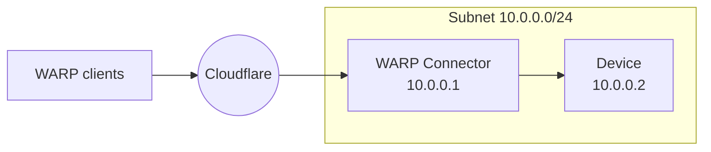
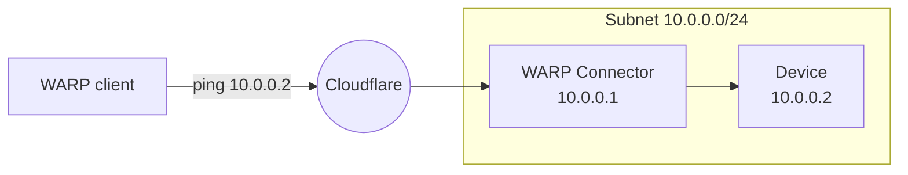

import { Render, Details, GlossaryTooltip, TabItem, Tabs } from "~/components";

이 가이드는 WARP 클라이언트 사용자 장치를 WARP 연결관 뒤에 개인적인 네트워크에 연결하는 방법을 포함합니다. 이 예에서, 우리는 subnet를 위한 WARP 연결관을 창조할 것입니다`10.0.0.0/24`설치하기`10.0.0.1`.



## 자주 묻는 질문

- Linux 호스트[^1]하위넷에.
- WARP를 위해 Cloudflare 서비스에 연결하는 커넥터, 방화벽은 inbound/outbound 트래픽을 허용해야 합니다.[WARP IP 주소, 포트 및 도메인](/cloudflare-one/team-and-resources/devices/warp/deployment/firewall/).
- WARP 클라이언트가 하위넷에 연결하기 위해 방화벽은 귀하의 방화벽에서 인바운드 트래픽을 허용해야합니다[장치 IPs](/cloudflare-one/team-and-resources/devices/warp/configure-warp/device-ips/).

## 1. WARP 커넥터 설치

<Render file="tunnel/warp-connector-install" product="cloudflare-one" />

## 2. (추천) 장치 프로필 만들기

<Render file="tunnel/warp-connector-device-profile" product="cloudflare-one" />

## 3. Cloudflare를 통해 경로 장치 IPs

WARP 클라이언트와 WARP 연결관은 그들의 사용으로 접근됩니다[장치 IP](/cloudflare-one/team-and-resources/devices/warp/configure-warp/device-ips/). 그러므로, 당신의 장치 IPs에 교통은 WARP 연결관 주인과 WARP 클라이언트 장치 둘 다에 Cloudflare를 통해서 경로를 해야 합니다.

1. WARP 커넥터 장치 프로파일에서[분할 터널](/cloudflare-one/team-and-resources/devices/warp/configure-warp/route-traffic/split-tunnels/).

2. <Render file="tunnel/cgnat-split-tunnels" product="cloudflare-one" />

3. 모든 WARP 클라이언트 장치 프로파일에 대한 이전 단계를 반복합니다.

## 4. subnet에서 WARP 연결관에 노선 교통

WARP 커넥터를 설치 한 곳에 따라 WARP 커넥터를 통해 하위넷에 다른 장치를 구성해야 할 수 있습니다.

### 옵션 1: 기본 게이트웨이

<Render file="tunnel/warp-connector-default-gateway" product="cloudflare-one" />

### 선택권 2: Alternate 출입구

<Render file="tunnel/warp-connector-alternate-gateway" product="cloudflare-one" />

#### 라우터에 IP 경로 추가

`100.96.0.0/12`모든 사용자 장치에 대한 기본 CIDR입니다.[WARP 클라이언트](/cloudflare-one/team-and-resources/devices/warp/). 라우터에서, 대상 IP를 경로 규칙을 추가`100.96.0.0/12`WARP 연결관 주인 기계에 (`10.0.0.100`).

<Render file="tunnel/warp-connector-alternate-gateway-flow" product="cloudflare-one" />

### 선택권 3: 중간 출입구

<Render file="tunnel/warp-connector-intermediate-gateway" product="cloudflare-one" />

#### 장치에 IP 경로 추가

오시는 길<GlossaryTooltip term="WARP CGNAT IP">사이트맵</GlossaryTooltip>WARP 연결관을 통해서 교통:

<Tabs>
  <TabItem label="리눅스">
    ```sh
    sudo ip route add 100.96.0.0/12 via <WARP-CONNECTOR-IP> dev eth0
    ```
  </TabItem>

  <TabItem label="맥 OS">
    ```sh
    sudo route -n add -net 100.96.0.0/12 <WARP-CONNECTOR-IP>
    ```
  </TabItem>

  <TabItem label="윈도우">
    ```bash
    route /p add 100.96.0.0/12 mask 255.255.255.255 <WARP-CONNECTOR-IP>
    ```
  </TabItem>
</Tabs>

<Render file="tunnel/warp-connector-verify-routes" product="cloudflare-one" />

## 5. WARP 연결관을 시험하십시오

WARP 클라이언트 사용자 장치에서 서브넷에 요청을 보낼 수 있습니다. WARP 커넥터 호스트에 연결을 테스트하려면 WARP 클라이언트 장치 실행`ping 10.0.0.1`. WARP 연결관의 뒤에 장치에 연결하기 위하여는, 뛰기`ping 10.0.0.2`.



[^1]: <Render file="tunnel/warp-connector-linux-packages" product="cloudflare-one" />
