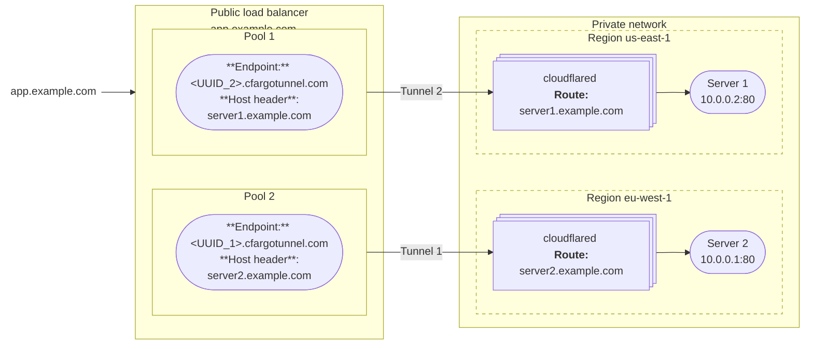
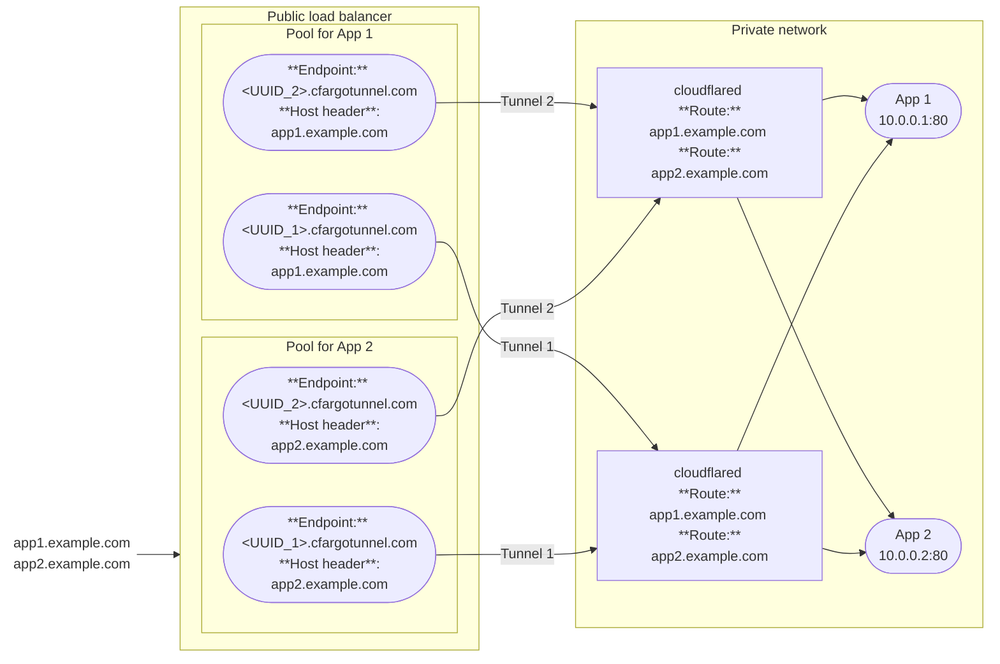

import { Render, DashButton, Details } from "~/components";

·[압축밸런서](/load-balancing/load-balancers/)서버에서 트래픽을 배포할 수 있습니다.[관련 앱](/cloudflare-one/networks/connectors/cloudflare-tunnel/routing-to-tunnel/).

추가할 때[관련 앱](/cloudflare-one/networks/connectors/cloudflare-tunnel/get-started/create-remote-tunnel/#2a-publish-an-application)Cloudflare 터널로 Cloudflare는 하위 도메인을 생성합니다.`cfargotunnel.com`창조된 갱도의 UUID로. 로드밸런서 풀에 애플리케이션을 추가할 수 있습니다.`<UUID>.cfargotunnel.com`으로[endpoint 주소](/load-balancing/understand-basics/load-balancing-components/#endpoints)Application hostname을 지정합니다.`app.example.com`) 에서[endpoint 호스트 헤더](/load-balancing/additional-options/override-http-host-headers/). Load Balancer는 직접 추가하지 않습니다.`app.example.com`서비스가 Cloudflare 터널 뒤에 있는 끝점으로.

## public load balancer 만들기

### 자주 묻는 질문

- Cloudflare의 특징 터널[관련 앱](/cloudflare-one/networks/connectors/cloudflare-tunnel/get-started/create-remote-tunnel/#2a-publish-an-application)

### 로드밸런서 만들기

<Render
  file="tunnel/availability/load-balancer-create"
  product="cloudflare-one"
  params={{
  publishedAppRouteURL: "/cloudflare-one/networks/connectors/cloudflare-tunnel/get-started/create-remote-tunnel/#2a-publish-an-application",
  tunnelIdLocation: "[Cloudflare One](https://one.dash.cloudflare.com) under **Networks** > **Connectors** > **Cloudflare Tunnels**"
}}
/>

더 알아보기[관련 문서](/load-balancing/)Load Balancer 설정 및 구성에 대한 자세한 내용은.

### 선택 Cloudflare 설정

이 응용 프로그램은 기본적으로 Cloudflare 설정에 대한 로드밸런서 hostname, 포함[이름 \*](/rules/), [캐시 규칙](/cache/how-to/cache-rules/)·[WAF 규칙](/waf/). 호스트명을 위한 설정을 변경할 수 있습니다.[Cloudflare 대시보드](https://dash.cloudflare.com/).

## 일반 건축

Cloudflare 터널 뒤에 간행된 신청을 위한 일반적인 짐 균형을 잡는 윤곽을 검토하십시오.

### 로드밸런서 당 하나의 앱

이 예제에서는 두 개의 다른 데이터 센터에서 서버를 실행하는 웹 응용 프로그램을 가정합니다. Cloudflare에 응용 프로그램을 연결하고 있기 때문에 사용자는 세계 어디서나 응용 프로그램에 액세스 할 수 있습니다. 또한, 우리는 Cloudflare를 원하여 서버의 잔액을 1 차 서버가 실패하면, 이차 서버는 모든 트래픽을받습니다.

도표에서 보이는 것과 같이, 전형적인 체제는 다음을 포함합니다:

- 데이터 센터 당 전용 Cloudflare 터널.
- 갱도 당 1개의 짐 밸런서 수영장. load balancer hostname 은 user-facing application hostname 으로 설정한다.`app.example.com`).
- 풀 당 1개의 짐 밸런서 엔드포인트. endpoint 호스트 헤더 설정`cloudflared`앱 호스트 이름 (Event application hostname)`server1.example.com`)
- 적어도 2`cloudflared` [회사 소개](#session-affinity-and-replicas)각각의 데이터 센터에서 터널 당, 경우`cloudflared`주인 기계는 아래로 갑니다.

사용자는 load balancer hostname을 사용하여 애플리케이션에 연결할 수 있습니다.`app.example.com`). 이 구성은 유효하다는 것을 참고하십시오[Active-Passive 장애](/load-balancing/load-balancers/common-configurations/#active---passive-failover), 각 수영장은 갱도 당 1개의 endpoint만 지원합니다.

### 로드밸런서 당 여러 앱

다음과 같은 다이어그램은 단일 로드밸런서를 사용하여 개인 네트워크에서 두 가지 다른 응용 프로그램에 대한 스티어 트래픽을 설명합니다.

이 짐 밸런싱 설정 포함:

- 두 Cloudflare 동일한 경로와 같은 터널 모두 응용.
- 신청 당 1개의 짐 밸런서 수영장.
- 각 짐 밸런서 수영장에는 갱도 당 endpoint가 있습니다.
- ·[DNS 기록](#dns-records)로드밸런서 hostname을 점하는 각 애플리케이션을 위해.

사용자는 이제 Load Balancer를 통해 모든 응용 프로그램에 액세스 할 수 있습니다. 풀당 여러 터널 엔드포인트가 있기 때문에, 이 구성은 지원[Active-Active 실패](/load-balancing/load-balancers/common-configurations/#active---active-failover). Active-Active는 풀에서 사용 가능한 모든 엔드 포인트를 동시에 처리하고, 더 나은 성능과 확장성을 제공하여 트래픽을 분산시킵니다.

#### DNS 레코드

대시보드를 통해 게시된 응용 프로그램을 구성할 때 Cloudflare는 자동으로 생성됩니다.`CNAME`Application hostname을 점유하는 DNS 레코드 (`app1.example.com`) 갱도 subdomain에 (`<UUID>.cfargotunnel.com`). 당신은 할 수[이 DNS 레코드를 수정](/dns/manage-dns-records/how-to/create-dns-records/#edit-dns-records)대신 로드밸런서 hostname에 해당합니다.

:::참조
API 또는 CLI를 통해 구성된 터널 경로가 필요합니다.[수동으로 DNS 레코드 생성](/cloudflare-one/networks/connectors/cloudflare-tunnel/routing-to-tunnel/dns/).
:::

다음은 DNS 레코드가 이전과 설정 후처럼 보일 것입니다.[로드밸런서 당 여러 앱](#multiple-apps-per-load-balancer):

**이전 다음**:

| 제품정보  | 이름 \* | 이름 \*                       |
| ----- | ----- | --------------------------- |
| 이름 \* | 앱1    | `<UUID_1>.cfargotunnel.com` |
| 이름 \* | 앱2    | `<UUID_1>.cfargotunnel.com` |
| 이름 \* | 앱1    | `<UUID_2>.cfargotunnel.com` |
| 이름 \* | 앱2    | `<UUID_2>.cfargotunnel.com` |

**이름 \***:

| 제품정보  | 이름 \*            | 이름 \*            |
| ----- | ---------------- | ---------------- |
| 사이트맵  | `lb.example.com` | ₢ 킹              |
| 이름 \* | 앱1               | `lb.example.com` |
| 이름 \* | 앱2               | `lb.example.com` |

## Known 제한

### 모니터 및 TCP 터널 기원

<Render
  file="tunnel/availability/load-balancer-tcp-monitors"
  product="cloudflare-one"
  params={{
  publishedAppRouteURL: "/cloudflare-one/networks/connectors/cloudflare-tunnel/get-started/create-remote-tunnel/#2a-publish-an-application"
}}
/>

### 세션 친화 및 복제

load balancer는 구별하지 않습니다.[회사 소개](/cloudflare-one/networks/connectors/cloudflare-tunnel/configure-tunnels/tunnel-availability/)동일한 갱도의. 두 개의 별도의 호스트에 동일한 터널 UUID를 실행하면, 로드 밸런서는 단일 엔드포인트로 호스트를 다룰 수 있습니다. 설치하기[세션 친화](/load-balancing/understand-basics/session-affinity/)클라이언트와 특정 호스트 사이에, 당신은 서로 다른 터널 UUID를 사용하여 Cloudflare에 각 호스트를 연결해야합니다.

### 로컬 연결 p참고 자료

<Render
  file="tunnel/availability/load-balancer-local-connection"
  product="cloudflare-one"
  params={{
  replicasURL: "/cloudflare-one/networks/connectors/cloudflare-tunnel/configure-tunnels/tunnel-availability/"
}}
/>
