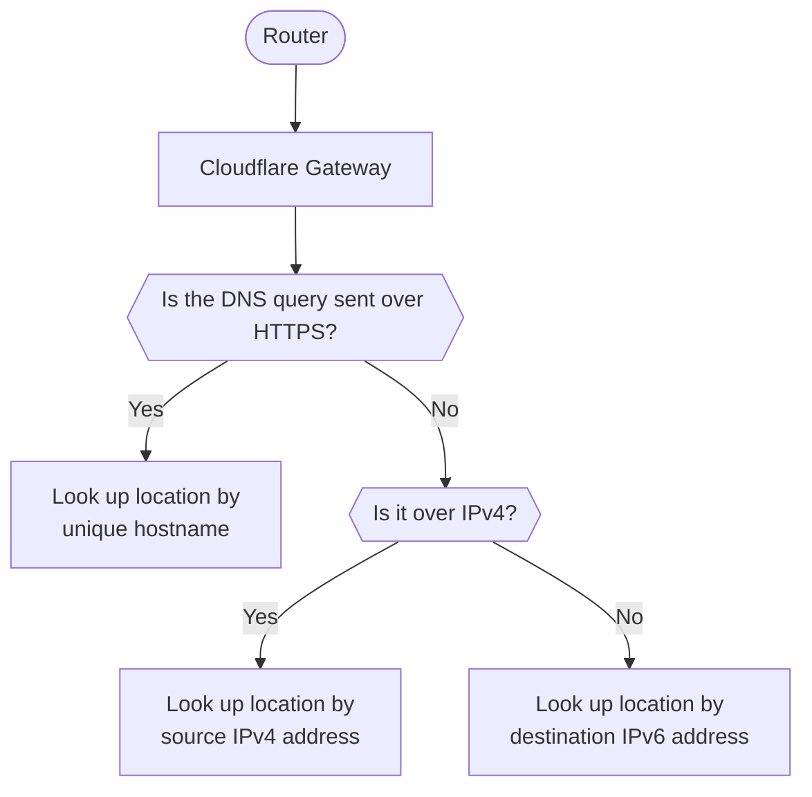

DNS 위치를 만들 때 Gateway는 IPv4/IPv6 주소와 DoT/DoH 호스트명을 해당 위치로 할당합니다. 이러한 IP 주소와 호스트명은 게이트웨이에 DNS 쿼리를 보낼 수 있습니다.

해결사 엔드포인트 IP 주소와 DNS 위치에 대한 호스트명보기:

1. 내 계정[사이트맵 한국어](https://one.dash.cloudflare.com/), 이동**네트워크** > **해결사 및 Proxies**.
2. DNS 위치 선택, 다음 선택**제품정보**.
3. 오시는 길**설정 설명서**. 주소와 호스트명은**당신의 윤곽**.

## DNS 쿼리 위치 매칭

게이트웨이는 요청 및 네트워크의 유형에 따라 DNS 쿼리에 다른 방법을 사용합니다.

1. 먼저, 게이트웨이는 쿼리가 HTTPS를 통해 DNS를 사용했는지 확인합니다. 네, Gateway가 고유의 호스트 이름에 의해 DNS 위치를 볼 수 있다면.
2. 다음, 쿼리가 HTTPS 이상 DNS로 전송되지 않은 경우, 게이트웨이는 IPv4를 통해 전송했는지 확인합니다. 네, 소스 IPv4 주소로 DNS 위치를 찾습니다.
3. 마지막으로 쿼리가 IPv4에 전송되지 않은 경우, 그것은 IPv6에 전송 된 것을 의미한다. Gateway는 고유의 DNS 해결자 IPv6 주소를 기반으로 쿼리와 관련된 DNS 위치를 볼 수 있습니다.

## IPv4/IPv6 주소

### 근원 IP

Gateway는 네트워크의 공개 소스 IPv4 주소를 사용하여 DNS 위치를 식별하고 정책을 적용하고 DNS 요청을 로그합니다. 구매하지 않은[전용 IPv4 해결 IP](#dedicated-dns-resolver-ip), 당신은 DNS 정책을 필터링하려는 IPv4 트래픽에 대한 소스 IP 주소를 제공해야합니다. 그렇지 않으면 Gateway는 계정에 트래픽을 속성 할 수 없습니다.

엔터프라이즈 플랜에 있다면, 선택의 한 개 이상의 소스 IP 주소를 수동으로 입력할 수 있습니다. 이러한 네트워크의 IP 주소에서 연결하지 않는 경우에도 Gateway DNS 위치를 만들 수 있습니다.

### DNS 해결자 IP

DNS 위치를 만들 때 Gateway는 기본 DNS 해결 IP 주소로 IPv4에 쿼리를 해결합니다. 이 주소는 모든 Cloudflare Zero Trust 계정에서 공유된 IP 주소입니다. IPv6를 통해 쿼리를 해결하려면 위치가 수신되고 고유 한 DNS 해커 IPv6 주소를 사용합니다. 이러한 IP 주소는 게이트웨이가 DNS 쿼리에 어떻게 일치하고 적절한 필터링 규칙을 적용합니다.

#### 전용 DNS 해결 IP

엔터프라이즈 사용자는 기본 anycast 주소 대신 DNS 위치에 대한 제공 될 전용 DNS 해결자 IPv4 주소를 요청할 수 있습니다. 해당 주소로 전달되는 쿼리는 전용 DNS 해결자 IPv4 주소를 사용하여 식별됩니다.

Cloudflare는 Zero Trust 계정의 해결자 IP 주소를 요청합니다. 전용 DNS 해결자 IPv4 주소 요청에 대한 자세한 내용은 계정 팀에 문의하십시오.

#### 자신의 DNS 해결 IP를 가져옵니다

엔터프라이즈 사용자는 자신의 권위 증명된 IPv4 및 IPv6 주소로 위치를 위한 DNS 엔드포인트를 사용할 수 있습니다. 게이트웨이는 UDP, TCP, DoT 및 DoH 쿼리를 통해 제공된 IPv4 주소를 통해 UDP 및 TCP 쿼리를 해결할 수 있습니다.

IP 주소를 내장한 후, IP 주소는 새로운 DNS 위치를 만들 때 관련 엔드포인트 아래에 표시됩니다. 특정 엔드포인트 유형의 IP 주소를 제공하지 않았다면, 기본 Cloudflare 결산 IP 또는 전용 결산 IP를 사용하여 자체 결산 IP를 사용할 수 있습니다. 예를 들어, IPv6 엔드포인트를 사용하려는 경우, IPv4 주소만 제공되며, IPv4 및 IPv6에 대한 기본 Cloudflare IP를 사용할 수 있습니다.

더 많은 정보를 원하시면, 참조[Cloudflare 베이프](/byoip/)또는 계정 팀에 문의.

## TLS (DoT)에 DNS

각 DNS 위치는 TLS(DoT)에서 DNS에 대한 고유한 호스트명을 할당합니다. Gateway는 DoT hostname을 기반으로 한 위치를 식별합니다.

## HTTPS (DoH) 이상 DNS

각 DNS 위치는 HTTPS(DoH)에서 DNS에 대한 고유한 호스트명을 할당합니다. Gateway는 DoH hostname을 기반으로 한 위치를 식별합니다.

### DoH 하위 도메인

Cloudflare Zero Trust의 각 DNS 위치는 고유한 DoH subdomain을 가지고 있습니다. 조직이 DNS 정책을 사용하는 경우 WARP 클라이언트 설정의 일부로 위치의 DoH 하위 도메인을 입력 할 수 있습니다.

예를 들어, DoH hostname의 경우`https://65y9p2vm1u.cloudflare-gateway.com/dns-query`, DoH 하위 도메인은`65y9p2vm1u`.

## Gateway에 특정 쿼리를 전송

기본적으로 구성된 DNS 위치의 모든 쿼리는 게이트웨이에 의해 검열되는 DNS 해결자 IP 주소로 전송됩니다. 위치 내에서 특정 네트워크에서 시작된 필터 쿼리만 구성할 수 있습니다:

1. [IP 목록 만들기](/cloudflare-one/reusable-components/lists/)IPv4 및 / 또는 IPv6 주소로 조직이 쿼리를 소스 할 수 있습니다.
2. 추가하기[근원 IP](/cloudflare-one/traffic-policies/dns-policies/#source-ip)DNS 정책에 대한 조건.

예를 들어 특정 네트워크에 대한 보안 위협을 차단하려면 다음 정책을 만들 수 있습니다.

| 옵션 정보   | 회사연혁   | 제품정보                     | 로그인   | - 연혁 |
| ------- | ------ | ------------------------ | ----- | ---- |
| 보안 카테고리 | 내 계정   | 모든 카테고리를 선택              | 이름 \* | 제품정보 |
| 근원 IP   | 계정 만들기 | 조직의 네트워크를 포함하는 IP 목록의 이름 |       |      |

IP 목록에 없는 IP 주소로 만든 DNS 쿼리는 귀하의 조직의 필터링 또는 팝업되지 않습니다.[Gateway 활동 로그](/cloudflare-one/insights/logs/gateway-logs/).
