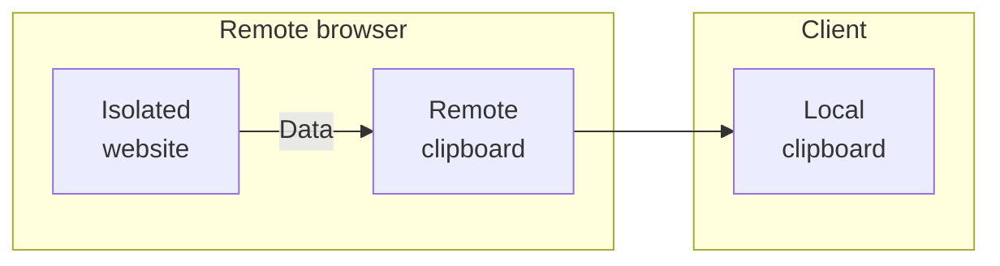
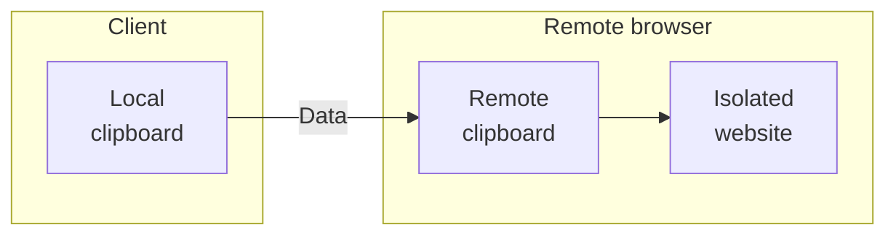

import { Render, Badge, Tabs, TabItem, APIRequest } from "~/components";

Browser Isolation을 사용하면 정체성, 보안 위협, 콘텐츠에 기반한 동적 격리 웹 사이트에 정책을 정의 할 수 있습니다.

## 사이트맵

HTTP 정책이 Isolate 동작을 적용하면 사용자의 웹 브라우저는 투명하게 HTML 호환 원격 브라우저 클라이언트를 제공합니다. 고립 정책은 다음과 같은 요청에 적용됩니다.`Accept: text/html*`. 이것은 Browser Isolation 정책을 API 트래픽과 공동 노력할 수 있습니다.

다음 예제는 모든 웹 트래픽에 대한 고립을 가능하게합니다.

| 옵션 정보 | 회사연혁     | 제품정보 | - 연혁 |
| ----- | -------- | ---- | ---- |
| 이름 \* | 경기 regex | `.*` | 사이트맵 |

특정 페이지를 격리 할 필요가 있다면, 당신은 트래픽을 격리하고 싶은 도메인을 나열 할 수 있습니다 :

| 옵션 정보 | 회사연혁 | 제품정보                         | - 연혁 |
| ----- | ---- | ---------------------------- | ---- |
| 이름 \* | 내 계정 | `example.com`, `example.net` | 사이트맵 |

:::note\[신청에 대한 정체성 제공]

비 격리된 브라우징에서 쿠키 및 세션이 원격 브라우저로 전송되지 않습니다. 타사 쿠키를 사용하여 단일 서명을 구현하는 웹 사이트는 격리해야합니다.

예를 들어,`example.com`Google Workspace를 사용하여 인증, 당신은 또한 최고 수준의 격리해야합니다[Google 워크스페이스 URL](https://support.google.com/a/answer/9012184).

:::

## 격리하지 마십시오

특정 목적지 또는 범주에 대한 고립을 비활성화 할 수 있습니다. 다음 구성 disables isolation for traffic 지시`example.com`:

| 옵션 정보 | 회사연혁 | 제품정보          | - 연혁      |
| ----- | ---- | ------------- | --------- |
| 이름 \* | 내 계정 | `example.com` | 격리하지 마십시오 |

## 정책 설정

다음 옵션 설정은 게이트웨이 HTTP 정책 빌더에 표시됩니다.*사이트맵*활동. 이러한 설정 구성[데이터 손실 방지](https://blog.cloudflare.com/data-protection-browser/)사용자가 원격 브라우저에서 신뢰할 수없는 웹 사이트와 상호 작용할 때.

### 복사 (고객에 원격에서)

- *지원하다*: (과태) 사용자는 격리 된 웹 사이트에서 로컬 클립 보드에 콘텐츠를 복사 할 수 있습니다.
- *격리된 브라우저에서만 허용*: 사용자는 분리 된 웹 사이트에서 원격 클립 보드에 콘텐츠를 복사 할 수 있습니다. 사용자는 원격 브라우저에서 로컬 클립보드에 콘텐츠를 복사할 수 없습니다. 함께 이 설정을 사용할 수 있습니다.[**Paste (고객에서 원격으로)**: *격리된 브라우저에서만 허용*](/cloudflare-one/remote-browser-isolation/isolation-policies/#paste-from-client-to-remote)격리된 웹 사이트를 통해 복사를 할 수 있습니다.
- *허용되지 않음*: 격리 된 웹 사이트에서 콘텐츠를 복사하여 Prohibits 사용자.

### Paste (고객에서 원격으로)

- *지원하다*: (과태) 사용자는 격리 된 웹 사이트에 로컬 클립 보드에서 콘텐츠를 붙여 넣을 수 있습니다.
- *격리된 브라우저에서만 허용*: 사용자는 원격 클립보드에서 격리 된 웹 사이트에 콘텐츠를 붙여넣을 수 있습니다. 사용자는 로컬 클립보드에서 원격 브라우저로 콘텐츠를 풀 수 없습니다. 함께 이 설정을 사용할 수 있습니다.[**복사 (고객에 원격에서)**: *격리된 브라우저에서만 허용*](/cloudflare-one/remote-browser-isolation/isolation-policies/#copy-from-remote-to-client)격리된 웹 사이트를 통해 복사를 할 수 있습니다.
- *허용되지 않음*: 과거 콘텐츠에서 고립 된 웹 사이트에 Prohibits 사용자.

### 파일 다운로드

- *지원하다*: (과태) 사용자는 격리 된 웹 사이트에서 로컬 기계에 파일을 다운로드 할 수 있습니다.
- *허용되지 않음*: 격리 된 웹 사이트에서 파일을 다운로드하여 사용자를 로컬 머신에 연결합니다.
- *원격 브라우저에서 보기*: 사용자는 격리 된 환경에서 파일을 열고 볼 수 있습니다.

:::참조
이 옵션은 원격 브라우저에 다운로드 된 파일이 방지되지 않습니다. 원격 브라우저에 다운로드되는 파일을 방지하려면 HTTP Policies를 사용하여 차단하십시오.[다운로드 Mime Type](/cloudflare-one/traffic-policies/http-policies/#download-and-upload-mime-type).
:::

### 파일 업로드

- *지원하다*: (Default) 사용자는 격리 된 웹 사이트에 로컬 머신에서 파일을 업로드 할 수 있습니다.
- *허용되지 않음*: 로컬 머신에서 분리된 웹 사이트로 파일을 업로드하여 Prohibits 사용자.

:::참조
이 옵션은 타사 클라우드 파일 관리자 또는 다른 고립 된 웹 사이트에서 원격 브라우저 다운로드 바에 다운로드 한 파일에 업로드 된 파일을 방지하지 않습니다. 원격 브라우저에서 고립 된 웹 사이트에 업로드 된 파일을 방지하려면 HTTP Policies를 사용하여 차단하십시오.[Mime 유형 업로드](/cloudflare-one/traffic-policies/http-policies/#download-and-upload-mime-type).
:::

### 한국어

- *지원하다*: (기본) 사용자는 분리 된 웹 사이트에 키보드 입력을 수행 할 수 있습니다.
- *허용되지 않음*: 키보드 입력을 고립 된 웹 사이트에 실행하는 Prohibits 사용자.

:::참조
마우스 입력은 사용자가 하이퍼링크와 스크롤하여 웹 사이트를 검색 할 수 있도록 사용할 수 있습니다. 이 웹 사이트에서 제3자 가상 키보드로 사용자 입력을 방지하지 않습니다.
주요 특징

### 제품정보

- *지원하다*: (기본) 사용자는 격리 된 웹 페이지를 로컬 기계에 인쇄 할 수 있습니다.
- *허용되지 않음*: 격리 된 웹 페이지를 로컬 기계에 인쇄하는 Prohibits 사용자.

## 사용자 정의 블록 대화 상자<Badge text="Beta" variant="note" />

사용자 정의 블록 대화 상자를 사용하여 사용자 정의 블록 페이지를 호스트 할 수 있습니다 특정 작업을 수행 할 때, 같은[이름 \*](/cloudflare-one/remote-browser-isolation/isolation-policies/#copy-from-remote-to-client), [이름 \*](/cloudflare-one/remote-browser-isolation/isolation-policies/#paste-from-client-to-remote), [다운로드](/cloudflare-one/remote-browser-isolation/isolation-policies/#file-downloads), [이름 \*](/cloudflare-one/remote-browser-isolation/isolation-policies/#file-uploads), [키보드 입력 수행](/cloudflare-one/remote-browser-isolation/isolation-policies/#keyboard), 또는[인쇄하기](/cloudflare-one/remote-browser-isolation/isolation-policies/#printing), 격리된 브라우저 세션 내에서.

Administrators는 블록에 대한 이유를 설명하기 위해 사용자 정의 블록 대화 상자를 구성하고 제공된 쿼리 매개 변수를 사용하여 문제를 해결하는 방법에 대한 사용자를 안내 할 수 있습니다.

- `action`: 복사, 붙여넣기, 다운로드, 업로드, 키보드 입력 및 인쇄 수행
- `cf_colo`: 예를 들어,`sea01`
- `client_url`: 예를 들어,`https://example.com`
- `policy_id`: 32문자 ID
- `rbi_debug_id`: 32문자 ID
- `user_id`: 32문자 ID

사용자 정의 블록 대화 상자는 여전히 베타입니다. 사용자 정의 블록 대화 상자를 사용하여 시작하려면 계정 팀에 문의하십시오.

## 일반 정책

### 모든 보안 위협을 격리

악성 코드와 피싱과 같은 보안 위협을 격리.

<Tabs syncKey="dashPlusAPI">
  <TabItem label="대시보드">
    | 옵션 정보   | 회사연혁 | 제품정보       | - 연혁 |
    | ------- | ---- | ---------- | ---- |
    | 보안 카테고리 | 내 계정 | *모든 보안 위험* | 사이트맵 |
  </TabItem>

  <TabItem label="사이트맵">
    <APIRequest
      path="/accounts/{account_id}/gateway/rules"
      method="POST"
      json={{
  	name: "Isolate all security threats",
  	description: "Isolate security threats such as malware and phishing",
  	enabled: true,
  	action: "isolate",
  	filters: ["http"],
  	traffic:
  		"any(http.request.uri.security_category[*] in {68 178 80 83 176 175 117 131 134 151 153})",
  	identity: "",
  	device_posture: "",
  }}
    />
  </TabItem>
</Tabs>

### Isolate 높은 위험 내용

새로 등록 된 도메인과 같은 높은 위험 내용 범주.

<Tabs syncKey="dashPlusAPI">
  <TabItem label="대시보드">
    | 옵션 정보 | 회사연혁 | 제품정보    | - 연혁 |
    | ----- | ---- | ------- | ---- |
    | 제품 분류 | 내 계정 | *보안 위험* | 사이트맵 |
  </TabItem>

  <TabItem label="사이트맵">
    <APIRequest
      path="/accounts/{account_id}/gateway/rules"
      method="POST"
      json={{
  	name: "Isolate high risk content",
  	description:
  		"Isolate high risk content categories such as newly registered domains",
  	enabled: true,
  	action: "isolate",
  	filters: ["http"],
  	traffic: "any(http.request.uri.content_category[*] in {32 169 177 128})",
  	identity: "",
  	device_posture: "",
  }}
    />
  </TabItem>
</Tabs>

### 고립된 뉴스 및 매체

고립 된 뉴스 및 미디어 사이트, 즉 공격에 대 한 대상입니다.

<Tabs syncKey="dashPlusAPI">
  <TabItem label="대시보드">
    | 옵션 정보 | 회사연혁 | 제품정보       | - 연혁 |
    | ----- | ---- | ---------- | ---- |
    | 제품 분류 | 내 계정 | *뉴스 및 미디어* | 사이트맵 |
  </TabItem>

  <TabItem label="사이트맵">
    <APIRequest
      path="/accounts/{account_id}/gateway/rules"
      method="POST"
      json={{
  	name: "Isolate news and media",
  	description:
  		"Isolate news and media sites, which are targets for malvertising attacks",
  	enabled: true,
  	action: "isolate",
  	filters: ["http"],
  	traffic: "any(http.request.uri.content_category[*] in {122})",
  	identity: "",
  	device_posture: "",
  }}
    />
  </TabItem>
</Tabs>

### Isolate 분류되지 않은 내용

분류되지 않은 콘텐츠[Cloudflare 레이더](/radar/).

<Tabs syncKey="dashPlusAPI">
  <TabItem label="대시보드">
    | 옵션 정보 | 회사연혁 | 제품정보         | - 연혁 |
    | ----- | ---- | ------------ | ---- |
    | 제품 분류 | 뚱 베어 | *모든 내용 카테고리* | 사이트맵 |
  </TabItem>

  <TabItem label="사이트맵">
    <APIRequest
      path="/accounts/{account_id}/gateway/rules"
      method="POST"
      json={{
  	name: "Isolate uncategorized content",
  	description: "Isolate content not categorized by Cloudflare Radar",
  	enabled: true,
  	action: "isolate",
  	filters: ["http"],
  	traffic:
  		"not(any(http.request.uri.content_category[*] in {2 67 125 133 3 75 183 89 182 6 90 91 144 150 7 70 74 76 79 92 96 100 106 107 116 120 121 122 127 139 156 164 99 9 101 137 10 103 146 11 12 77 98 108 110 111 118 126 129 172 168 113 33 179 166 15 115 119 124 141 161 17 85 87 102 157 135 138 180 162 140 142 32 169 177 128 22 73 82 88 148 23 24 181 71 72 173 78 84 86 94 97 104 105 114 174 93 130 132 136 147 149 154 158 152 26 69 184 81 95 109 123 145 155 159 160 163 165 167}))",
  	identity: "",
  	device_posture: "",
  }}
    />
  </TabItem>
</Tabs>

### 고립된 ChatGPT

ChatGPT의 사용을 고립시킵니다.

<Tabs syncKey="dashPlusAPI">
  <TabItem label="대시보드">
    | 옵션 정보 | 회사연혁 | 제품정보    | - 연혁 |
    | ----- | ---- | ------- | ---- |
    | 제품 설명 | 내 계정 | *채팅GPT* | 사이트맵 |

    내 계정**정책 설정 구성**ChatGPT에 대한 제한을 사용자 정의 할 수 있습니다. 예를 들어, 민감한 정보를 입력하여 사용자를 방지하기 위해 선택할 수 있습니다.**복사 / 붙여넣기**·**Disable 파일 업로드**.
  </TabItem>

  <TabItem label="사이트맵">
    <APIRequest
      path="/accounts/{account_id}/gateway/rules"
      method="POST"
      json={{
  	name: "Isolate ChatGPT",
  	description: "Isolate the use of ChatGPT",
  	enabled: true,
  	action: "isolate",
  	filters: ["http"],
  	traffic: "any(app.ids[*] in {1199})",
  	identity: "",
  	device_posture: "",
  }}
    />
  </TabItem>
</Tabs>
