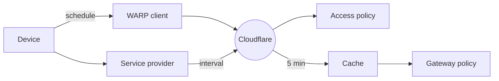

import { Render } from "~/components";

Cloudflare Zero Trust와 함께 Zero Trust 정책을 WARP 클라이언트 또는 타사 엔드포인트 보안 제공 업체에서 추가 신호를 다시 설정할 수 있습니다. 장치 자세 검사가 구성될 때, 사용자는 관리하거나 건강한 장치가 있는 경우에만 보호한 신청 또는 네트워크 자원에 연결할 수 있습니다.

## 1. Enable 장치 자세 검사

설정 지침 및 요구 사항은 장치 자세 속성에 따라 다릅니다. 아래 링크를 참조하여 공급자를위한 설정 가이드를 볼 수 있습니다.

- [WARP 클라이언트 체크](/cloudflare-one/reusable-components/posture-checks/warp-client-checks/)Cloudflare WARP 클라이언트가 수행됩니다.
- [서비스 체크인](/cloudflare-one/integrations/service-providers/)제3자 장치 자세 공급자에 의해 수행됩니다.
- [Access 통합 체크](/cloudflare-one/reusable-components/posture-checks/access-integrations/)접근 신청을 위해 단지 configurable 입니다. 이 속성은 Gateway 정책에서 사용할 수 없습니다.

## 2. 장치 자세 검사 확인

게이트웨이 또는 액세스 정책의 장치 자세 검사를 통합하기 전에, Pass / 실패 결과가 기대에 일치한다는 것을 확인합니다. 특정 장치에 대한 최신 테스트 결과보기 :

1. 내 계정[사이트맵 한국어](https://one.dash.cloudflare.com/), 이동**팀 & 자원** > **제품정보**.
2. 장치 선택.
3. 제품정보**자주 묻는 질문**.
4. 선택하기**자주 묻는 질문**탭.

## 3. 장치 자세 정책을 구축

이제 장치 자세 검사를 사용할 수 있습니다.[오시는 길](/cloudflare-one/access-controls/policies/)또는 Gateway[네트워크](/cloudflare-one/traffic-policies/network-policies/common-policies/#enforce-device-posture)또는[HTTP: HTTP](/cloudflare-one/traffic-policies/http-policies/common-policies/#check-device-posture)회사 정보 액세스에서 활성화 된 장치 자세 특성은 사용할 수있는 목록에서 나타납니다.[회사 소개](/cloudflare-one/access-controls/policies/#selectors). Gateway에서 속성은 선택할 때 나타납니다.[Passed Device Posture 체크](/cloudflare-one/traffic-policies/network-policies/#device-posture)옵션 정보

:::caution\[Gateway 정책 제한]

Gateway는 장치 자세 검사를 지원하지 않습니다.[Tanium Access 통합](/cloudflare-one/reusable-components/posture-checks/warp-client-checks/tanium/).
:::

## 4. 통행은 WARP를 통해서 갑니다

[WARP 클라이언트](/cloudflare-one/reusable-components/posture-checks/warp-client-checks/)·[서비스-to-service](/cloudflare-one/integrations/service-providers/)posture checks rely on traffic going through WARP to detect posture 정보 용 장치. 내 계정[Split Tunnel 구성](/cloudflare-one/team-and-resources/devices/warp/configure-warp/route-traffic/split-tunnels/), 다음 도메인이 WARP에 포함된다는 것을 보증하십시오:

- IdP는 Cloudflare Zero Trust를 인증하는 데 사용됩니다.
- `<your-team-name>.cloudflareaccess.com`자세 검사가 Access 정책의 일부인 경우.
- 액세스 또는 게이트웨이 정책에 의해 보호 된 응용 프로그램입니다.

## 정책 시행률

접근은 같은 비율에 장치 자세에 있는 변화를 검출합니다[오염 빈도](#polling-frequency)자세 검사에 대한 구성.

Gateway는 모든 요청에 네트워크 및 HTTP 정책을 평가하기 때문에 5 분마다 업데이트되는 자세 결과의 로컬 캐시를 유지합니다. 따라서 Gateway 정책은 5분 지연이 추가로 적용됩니다. 예를 들어, 10 분에 오염 빈도를 설정하면 게이트웨이에 15 분이 걸릴 수 있습니다.

:::카트로션

Gateway는 종료되지 않습니다.[활동 세션](/cloudflare-one/team-and-resources/devices/warp/configure-warp/warp-sessions/#configure-warp-sessions-in-gateway)이후의 자세 체크가 그 세션 동안 실패하더라도. 게이트웨이는 세션의 시작 부분에 자세 검사를 평가하고, 지속적인 세션은 무결하게 유지됩니다.

예를 들어, 성공적인 자세 검사를 기반으로 SSH 세션을 수립하는 경우, 세션이 시작된 후, 세션이 활성화됩니다.

:::

### 회사연혁

기본적으로 Cloudflare의 자세 결과는 새로운 데이터에 의해 과잉될 때까지 유효합니다. 지정할 수 있습니다.`expiration`시간 사용[사이트맵](/api/resources/zero_trust/subresources/devices/subresources/posture/methods/update/). Cloudflare는 적어도 두 배로 expiration를 조정하는 것을 추천합니다[오염 빈도](#polling-frequency). 예를 들면, 자세 검사 polling 빈도가 1 시간에 놓인 경우에, 그것의 만료 시간은 2 시간 또는 더 중대한 놓아야 합니다.

### 오염 빈도

#### WARP 클라이언트 체크

기본적으로 WARP 클라이언트는 5 분마다 상태를 변경하기위한 장치를 조사합니다. 오염 빈도를 수정하려면 API를 사용하여 업데이트하십시오.[`schedule`](/api/resources/zero_trust/subresources/devices/subresources/posture/methods/update/)모수.

#### 서비스 공급자 checks

설정할 때[service-to-service 통합](/cloudflare-one/integrations/service-providers/), 당신은 종종 Cloudflare가 제 3 자 API를 쿼리하는 방법을 결정하는 polling 빈도를 선택할 것입니다. API를 통해 오염 빈도를 설정하려면, 사용[`interval`](/api/resources/zero_trust/subresources/devices/subresources/posture/subresources/integrations/methods/edit/)모수.
