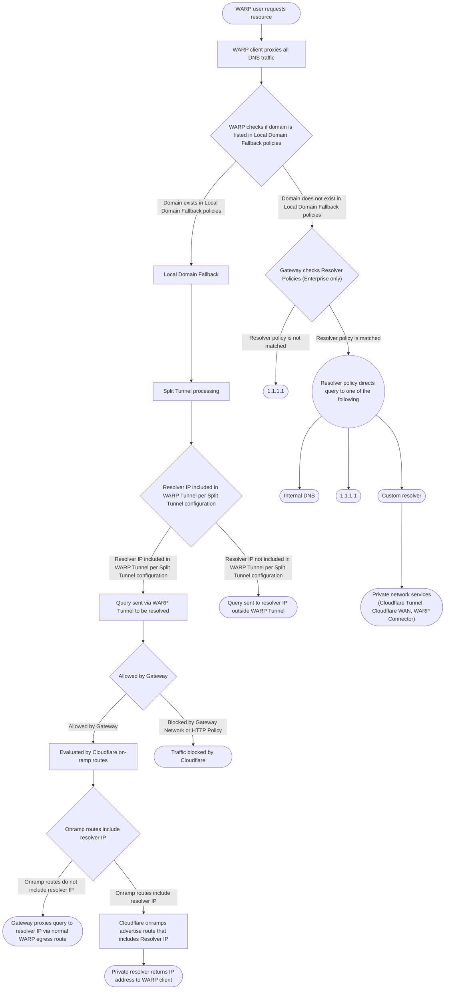

import { GlossaryTooltip } from "~/components";

WARP 클라이언트가 장치에 배치되면 Cloudflare는 기본적으로 모든 DNS 쿼리 및 네트워크 트래픽을 처리 할 것입니다. 그러나 특정 상황에서 특정 DNS 쿼리 또는 WARP에서 네트워크 트래픽을 제외 할 수 있습니다. 예를 들어, Cloudflare 대신 개인 DNS 해결사로 내부 호스트명을 해결해야 할 수도 있습니다.[공용 DNS 해결자](/1.1.1.1/).

Cloudflare는 기업 사용자 구성을 추천합니다[Gateway 해결사 정책](/cloudflare-one/traffic-policies/resolver-policies/)사용자 정의 해결자와 트래픽을 해결하기 위해. WARP는 게이트웨이에 개인 DNS 쿼리를 보낼 것이며 게이트웨이는 일치하는 정책에 따라 사용자 정의 해결자에게 쿼리를 보낼 것입니다.

또한 WARP에서 트래픽을 제외한 세 가지 옵션이 있습니다.

- [지역 도메인 Fallback](/cloudflare-one/team-and-resources/devices/warp/configure-warp/route-traffic/local-domains/): WARP 클라이언트가 WARP 게이트웨이가 아닌 해결자에게 지정된 도메인에 대한 프록시 DNS 요청을 지시하는 Local Domain Fallback을 사용합니다. 그것은 당신이 공공 인터넷에 그렇지 않으면 해결되지 않을 개인 별명이있을 때 유용합니다.
  :::카트로션
  Gateway는 로컬 도메인 Fallback에 입력된 도메인 이름에 DNS 정책을 암호화, 모니터 또는 적용하지 않습니다.
  주요 특징
- [분할 터널](/cloudflare-one/team-and-resources/devices/warp/configure-warp/route-traffic/split-tunnels/)모드 제외 : WARP 클라이언트를 지시하는 모드를 사용하여 IP 주소 또는 도메인의 지정된 설정에 트래픽을 무시합니다. 분할 터널에서 정의 된 IP 주소 또는 도메인에 정의 된 모든 트래픽은 WARP 클라이언트에 의해 무시되고 로컬 기계에 의해 처리됩니다. 이 모드를 사용하여 트래픽의 대부분을 암호화하고 게이트웨이에 의해 처리 할 때, 하지만 응용 호환성으로 인해 특정 루트를 제외하고, 또는 WARP VPN과 함께 실행하려면.
- [분할 터널](/cloudflare-one/team-and-resources/devices/warp/configure-warp/route-traffic/split-tunnels/)모드 포함: WARP 클라이언트가 IP 주소 또는 도메인의 지정된 설정에 트래픽을 처리하는 모드를 포함. 분할 터널에서 정의 된 IP 주소 또는 도메인에 의해 포함되지 않은 모든 트래픽은 WARP 클라이언트에 의해 무시되고 로컬 기계에 의해 처리됩니다. 특정한 리소스를 사용할 때 게이트웨이에 의해 처리되는 특정 트래픽을 원할 때이 모드를 사용합니다.
  :::카트로션
  게이트웨이는 분할 터널 구성으로 WARP에서 제외되는 트래픽을 암호화, 관리 또는 모니터링하지 않습니다.
  주요 특징

## WARP 클라이언트가 DNS 요청을 처리하는 방법

WARP 클라이언트를 함께 사용할 때`cloudflared`터널 또는 타사 VPN, Cloudflare는 각 요청을 평가하고 다음 트래픽 흐름에 따라 경로:

#### 이름 \*

#### Cloudflare에 방법 교통이 얻는

- <GlossaryTooltip term="on-ramp">에 램프</GlossaryTooltip>: 더 알아보기[온-램프](/learning-paths/secure-internet-traffic/connect-devices-networks/choose-on-ramp/).
- [Cloudflare 갱도](/cloudflare-one/networks/connectors/cloudflare-tunnel/)
- [WARP 연결관](/cloudflare-one/networks/connectors/cloudflare-tunnel/private-net/warp-connector/)
- [Cloudflare 대만](/cloudflare-wan/)

#### Routing 기능 (어떻게 쿼리가 처리됩니다)

- [지역 도메인 Fallback](/cloudflare-one/team-and-resources/devices/warp/configure-warp/route-traffic/local-domains/)
- [분할 터널](/cloudflare-one/team-and-resources/devices/warp/configure-warp/route-traffic/split-tunnels/)
- [Gateway Resolver 정책](/cloudflare-one/traffic-policies/resolver-policies/)

#### Resolvers (어떤 쿼리가 해결됩니다)

- [내부 DNS](/dns/internal-dns/)
- [1.1.1.1](/1.1.1.1/)

## DNS suffix 추가

WARP에서 DNS suffix 검색 목록을 지원하는 것은 현재 개발 중입니다. 다음 지침을 사용하여 장치 레벨에서 DNS suffixes를 수동으로 구성할 수 있습니다.

### 맥 OS

수동으로 macOS에서 DNS suffix를 구성하려면:

1. 기타**시스템 설정**(주)**체계 P참고 자료s**이전 macOS 버전에서).
2. 오시는 길**회사연혁**그리고 당신의 활동 연결을 선택 (**와이파이**또는**네트워크**).
3. 제품정보**이름 \***(주)**지원하다**).
4. 오시는 길**DNS 보호**탭.
5. 이름 \***도메인 검색**, 선택`+`버튼과 DNS suffix를 추가합니다.
6. 제품정보**이름 \***, 다음**지원하다**.

### 윈도우

Windows에서 DNS suffix를 수동으로 설정하려면:

1. 자주 묻는 질문**이름 \***&#x57;indows의 막대기, 유형**네트워크 연결**, 그리고 선택**기타**.
2. 네트워크 어댑터를 마우스 오른쪽 클릭 (**와이파이**또는**네트워크**) 수정 및 선택**제품 정보**. (필수)
3. 더블 클릭**인터넷 프로토콜 버전 4 (TCP/IPv4)**.
4. 내 계정**인터넷 프로토콜 (TCP/IP) 속성**창, 선택**지원하다**.
5. 오시는 길**DNS 보호**탭.
6. 제품정보**이러한 DNS suffixes를 승인 (주문에서)**.
7. 제품정보**더 보기**DNS suffix를 입력하고 선택**더 보기**.
8. 제품정보**이름 \***&#xBAA8;든 창에서 변경 사항을 적용합니다.
