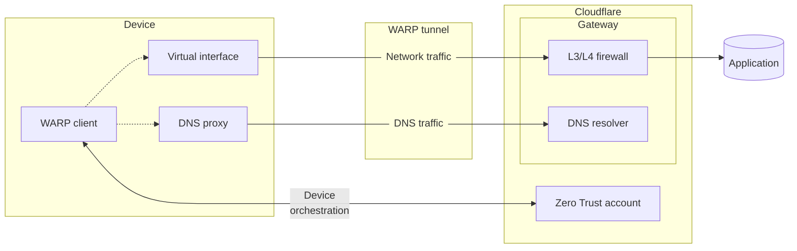
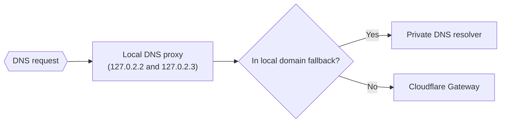
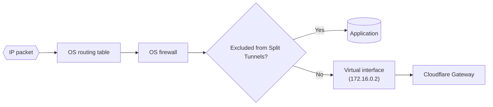

import { Render, TabItem, Tabs, GlossaryTooltip } from "~/components";

이 가이드는 Cloudflare WARP 클라이언트가 장치의 운영 체제와 상호 작용하는 방법을 설명합니다[교통 및 DNS 모드](/cloudflare-one/team-and-resources/devices/warp/configure-warp/warp-modes/#traffic-and-dns-mode-default)모드.

내 계정[DNS만 모드](/cloudflare-one/team-and-resources/devices/warp/configure-warp/warp-modes/#dns-only-mode)모드, IP 트래픽 정보는 적용되지 않습니다. 내 계정[교통 모드](/cloudflare-one/team-and-resources/devices/warp/configure-warp/warp-modes/#traffic-only-mode)모드, DNS 트래픽 정보는 적용되지 않습니다.

## WARP 교통 교류

WARP 클라이언트는 조직이 최종 사용자 장치가 접근할 수 있는 애플리케이션을 세밀하게 제어할 수 있게 해줍니다. 클라이언트는 장치의 DNS 및 네트워크 트래픽을 Cloudflare 글로벌 네트워크로 전달합니다. Gateway 정책 적용은 클라우드에서 수행됩니다. 모든 운영 체제에서 WARP daemon은 장치와 Cloudflare 사이에 세 개의 연결을 유지합니다:

| 관련 링크                                                                                                                                     | 프로젝트 | 제품정보                                                           |
| ----------------------------------------------------------------------------------------------------------------------------------------- | ---- | -------------------------------------------------------------- |
| WARP 갱도 ([WireGuard 또는 MASQUE를 통해](/cloudflare-one/team-and-resources/devices/warp/configure-warp/warp-settings/#device-tunnel-protocol)) | 사이트맵 | 네트워크 정책 시행, HTTP 정책 시행 및 개인 네트워크 액세스를 위한 Gateway에 IP 패킷을 보냅니다. |
| [사이트맵](https://www.cloudflare.com/learning/dns/dns-over-tls/)                                                                             | 다운로드 | DNS 정책 시행에 대한 게이트웨이에 DNS 요청을 보냅니다. DoH 연결은 WARP 갱도의 안쪽에 유지됩니다. |
| 장치 Orchestration                                                                                                                          | 다운로드 | 사용자 등록을 수행, 장치 자세 검사, 적용 WARP 프로필 설정.                          |



내 계정[분할 터널](/cloudflare-one/team-and-resources/devices/warp/configure-warp/route-traffic/split-tunnels/)구성은 IP 트래픽이 WARP 터널 아래로 전송되는 것을 결정합니다. 내 계정[지역 도메인 Fallback](/cloudflare-one/team-and-resources/devices/warp/configure-warp/route-traffic/local-domains/)구성은 DNS 요청이 게이트웨이로 전송되는 것을 결정합니다. 교통수단[장치 Orchestration API](/cloudflare-one/team-and-resources/devices/warp/deployment/firewall/#client-orchestration-api)endpoint는 항상 WARP 갱도의 외부를 운영하기 때문에 쪼개지는 갱도 규칙을 방해하지 않습니다.

다음, WARP가 로컬 도메인 Fallback 및 Split Tunnel routing 규칙을 적용하기 위해 운영 시스템을 구성하는 방법을 배울 것입니다. 구현 세부 사항 데스크톱 및 모바일 클라이언트와 다릅니다.

## Windows, macOS 및 Linux

데스크톱 클라이언트는 두 가지 구성 요소로 구성되어 있습니다: 귀하의 장치에서 모든 WARP 기능을 처리하는 서비스/daemon, 그리고 사용자가 daemon과 상호 작용하는 GUI 래퍼.

### DNS 트래픽

WARP를 켜면 WARP는 장치에서 로컬 DNS 프록시를 만들고 포트 53 (DNS 트래픽에 지정된 포트)에 이러한 IP 주소에 바인딩합니다.

- **IPv4 지원**: `127.0.2.2`·`127.0.2.3`
- **IPv6를**:
  - macOS 및 Linux:`fd01:db8:1111::2`·`fd01:db8:1111::3`
  - 윈도우:`::ffff:127.0.2.2`

WARP는 그런 IP 주소에 모든 DNS 요청을 보낼 수있는 운영 체제를 구성합니다. 장치의 모든 네트워크 인터페이스는 이제 DNS 해상도의이 로컬 DNS 프록시를 사용합니다. 즉, 모든 DNS 트래픽은 이제 WARP 클라이언트가 처리됩니다.

:::참조

설정된 DoH 브라우저는 로컬 DNS 프록시를 우회합니다. 브라우저에서 DoH 설정을 비활성화 할 수 있습니다.
주요 특징

로컬 도메인 Fallback 구성을 기반으로 WARP는 DNS 정책 시행에 대한 게이트웨이에 요청을 전달하거나 개인 DNS 해결자에게 요청을 전달합니다.

- Gateway에 대한 요청은 당사에 발송됩니다.[DoH 연결](#overview)WARP 갱도 안쪽에.
- 개인 DNS의 해결자에게 요청은 분할 터널 구성에 따라 터널 내부 또는 외부로 전송됩니다. 더 많은 정보를 원하시면, 참조[WARP 클라이언트가 DNS 요청을 처리하는 방법](/cloudflare-one/team-and-resources/devices/warp/configure-warp/route-traffic/#how-the-warp-client-handles-dns-requests).



운영 체제가 WARP의 로컬 DNS 프록시를 사용하여 있는지 확인할 수 있습니다.

<Tabs>
  <TabItem label="맥 OS">
    macOS에서 터미널 창을 열고 실행`scutil --dns`. DNS 서버는 WARP의 로컬 DNS 프록시 IP로 설정해야 합니다.

    ```sh
    scutil --dns
    ```

    ```sh {4-5} output
    DNS configuration (for scoped queries)
    resolver #1개
      search domain[0] : <DNS-SEARCH-DOMAIN>
      nameserver[0] : 127.0.2.2
      nameserver[1] : 127.0.2.3
      if_index : 15 (en0)
      flags    : Scoped, Request A records
      reach    : 0x00030002 (Reachable,Local Address,Directly Reachable Address)
    resolver #2개
      nameserver[0] : 127.0.2.2
      nameserver[1] : 127.0.2.3
      nameserver[2] : fd01:db8:1111::2
      nameserver[3] : fd01:db8:1111::3
      if_index : 23 (utun3)
      flags    : Scoped, Request A records, Request AAAA records
      reach    : 0x00030002 (Reachable,Local Address,Directly Reachable Address)
    ```
  </TabItem>

  <TabItem label="윈도우">
    Windows에서 PowerShell 창을 열고 실행`ipconfig`. DNS 서버는 WARP의 로컬 DNS 프록시 IP로 설정해야 합니다.

    ```powershell
    ipconfig
    ```

    ```txt {15-16} output
    Windows IP Configuration

    Unknown adapter CloudflareWARP:

       Connection-specific DNS Suffix  . :
       Description . . . . . . . . . . . : Cloudflare WARP Interface Tunnel
       Physical Address. . . . . . . . . :
       DHCP Enabled. . . . . . . . . . . : No
       Autoconfiguration Enabled . . . . : Yes
       IPv6 Address. . . . . . . . . . . : 2606:4700:110:8f79:145:f180:fc4:8106(Preferred)
       Link-local IPv6 Address . . . . . : fe80::83b:d647:4bed:d388%49(Preferred)
       IPv4 Address. . . . . . . . . . . : 172.16.0.2(Preferred)
       Subnet Mask . . . . . . . . . . . : 255.255.255.255
       Default Gateway . . . . . . . . . :
       DNS Servers . . . . . . . . . . . : 127.0.2.2
                                           127.0.2.3
       NetBIOS over Tcpip. . . . . . . . : Enabled
    ```
  </TabItem>

  <TabItem label="리눅스">
    Linux에서 확인`/etc/resolv.conf`파일. DNS 서버는 WARP의 로컬 DNS 프록시 IP로 설정해야 합니다.

    ```sh
    cat /etc/resolv.conf
    ```

    ```sh {2-3} output
    #이 파일은 cloudflare-warp에 의해 생성되었습니다.
    nameserver 127.0.2.2
    nameserver 127.0.2.3
    nameserver fd01:db8:1111::2
    nameserver fd01:db8:1111::3
    search <DNS-SEARCH-DOMAIN>
    options edns0
    options trust-ad
    ```
  </TabItem>
</Tabs>

### IP 트래픽

WARP에서 켤 때, WARP는 WARP 갱도의 안쪽 또는 외부가 있는 경우에 통제하는 장치에 3개의 변화를 만듭니다:

- 계정 만들기[가상 네트워크 인터페이스](#virtual-interface).
- 운영 체제를 수정[routing 테이블](#routing-table)분할 터널 규칙에 따라.
- 운영 체제를 수정[계정 관리](#system-firewall)분할 터널 규칙에 따라.



#### 가상 인터페이스

가상 인터페이스는 네트워크 인터페이스 컨트롤러 (NIC)와 같은 물리적 인터페이스를 로그로 변환하는 운영 체제를 허용하며, IP 트래픽을 라우팅하기위한 별도의 인터페이스입니다. WARP의 가상 인터페이스는 장치와 Cloudflare 사이에서 WireGuard/MASQUE 연결을 유지하는 것입니다. 기본적으로 IPv4 주소는 hardcoded 입니다.`172.16.0.2`WireGuard를 사용하는 장치, MASQUE를 사용하는 장치[고유 IP 할당](/cloudflare-one/team-and-resources/devices/warp/configure-warp/warp-settings/#assign-a-unique-ip-address-to-each-device)CGNAT IP 공간에서 (`100.96.0.0/12`). 기본 가상 인터페이스 IP를 무시할 수 있습니다.[주문 장치 IP](/cloudflare-one/team-and-resources/devices/warp/configure-warp/device-ips/).

운영 체제의 모든 네트워크 인터페이스의 목록을 보려면:

<Render file="warp/check-network-interface-ip" product="cloudflare-one" />

#### 연락처

WARP는 시스템 라우팅 테이블을 편집하여 IP 트래픽이 게이트웨이로 이동합니다. 라우팅 테이블은 네트워크 인터페이스가 특정 IP 주소로 패킷을 처리해야한다는 것을 나타냅니다. 기본적으로 분할 터널의 IP 및 도메인을 제외한 WARP의 가상 인터페이스를 통해 모든 트래픽 경로는 목록 (장치에 기본 인터페이스를 사용하는).

routing table가 Split Tunnel 규칙과 일치하도록 확인할 수 있습니다.

<Tabs>
  <TabItem label="맥 OS">
    macOS의 전체 라우팅 테이블을 보려면 실행`netstat -r`.

    도메인 또는 IP 주소를 위한 라우팅 테이블도 검색할 수 있습니다. 이 예제에서, 우리는 그 트래픽을 볼`google.com`본문 바로가기`utun3`이 장치에 WARP 사실상 공용영역인 ,:

    ```sh
    route get google.com
    ```

    ```sh {4} output
       route to: lga25s81-in-f14.1e100.net
    destination: 136.0.0.0
           mask: 248.0.0.0
      interface: utun3
          flags: <UP,DONE,PRCLONING>
     recvpipe  sendpipe  ssthresh  rtt,msec    rttvar  hopcount      mtu     expire
           0         0         0         0         0         0      1280         0
    ```

    대조적으로, 이 DHCP 주소는 WARP에서 제외되고 기본 공용영역을 이용합니다:

    ```sh
    route get 169.254.0.0
    ```

    ```sh {4} output
       route to: 169.254.0.0
    destination: 169.254.0.0
           mask: 255.255.0.0
      interface: en0
          flags: <UP,DONE,CLONING,STATIC>
     recvpipe  sendpipe  ssthresh  rtt,msec    rttvar  hopcount      mtu     expire
           0         0         0         0         0         0      1500   -210842
    ```
  </TabItem>

  <TabItem label="윈도우">
    Windows에서 전체 라우팅 테이블을 보려면 실행`netstat -r`.

    IP 주소를 위한 라우팅 테이블도 검색할 수 있습니다. 이 예제에서, 우리는 그 트래픽을 볼`1.1.1.1`WARP 가상 인터페이스를 통해 보내집니다:

    ```powershell
    Find-NetRoute -RemoteIPAddress "1.1.1.1" | Select-Object InterfaceAlias -Last 1
    ```

    ```txt output
    InterfaceAlias
    --------------
    CloudflareWARP
    ```

    대조적으로, 이 DHCP 주소는 WARP에서 제외되고 기본 공용영역을 이용합니다:

    ```powershell
    Find-NetRoute -RemoteIPAddress "169.254.0.0" | Select-Object InterfaceAlias -Last 1
    ```

    ```txt output
    InterfaceAlias
    --------------
    Wi-Fi
    ```
  </TabItem>

  <TabItem label="리눅스">
    Linux에서 전체 라우팅 테이블을 보려면 실행`ip -6 route show table all`또는`ip -4 route show table all`.

    IP 주소를 위한 라우팅 테이블도 검색할 수 있습니다. 이 예제에서, 우리는 그 트래픽을 볼`1.1.1.1`WARP 가상 인터페이스를 통해 보내집니다:

    ```sh
    ip route get 1.1.1.1
    ```

    ```sh output
    1.1.1.1 dev CloudflareWARP table 65743 src 172.16.0.2 uid 1000
        cache
    ```

    대조적으로, 이 DHCP 주소는 WARP에서 제외되고 기본 공용영역을 이용합니다:

    ```sh
    ip route get 169.254.0.0
    ```

    ```sh output
    169.254.0.0 dev ens18 src 172.24.8.6 uid 1000
        cache
    ```
  </TabItem>
</Tabs>

#### 시스템 방화벽

WARP는 분할 터널 규칙을 시행하기 위해 운영 체제를 수정합니다. 이것은 다른 인터페이스를 통해 트래픽을 직접 전송하기 위해 라우팅 테이블과 트리를 우회하여 서비스에서 보호 층을 추가합니다. 예를 들어 트래픽이 있으면`203.0.113.0`Gateway에 의해 검사되어야합니다. 우리는 블록을 차단하는 방화벽 규칙을 만듭니다.`203.0.113.0`모든 인터페이스에서 제외`utun`.

## iOS, Android 및 ChromeOS

iOS 및 Android/ChromeOS에서 Cloudflare One Agent는 VPN 클라이언트가 모든 트래픽을 캡처하고 경로로 설치합니다. 앱은 iOS 및 Android의 공식 VPN 프레임 워크에 내장되어 있습니다. 더 많은 정보를 원하시면 Apple의 참조[NetworkExtension 문서](https://developer.apple.com/documentation/networkextension)구글의[Android 개발자 문서](https://developer.android.com/guide/topics/connectivity/vpn).

ChromeOS는 기본 Chrome 앱을 실행하는 것보다 가상 머신에서 Android 앱을 실행합니다.
