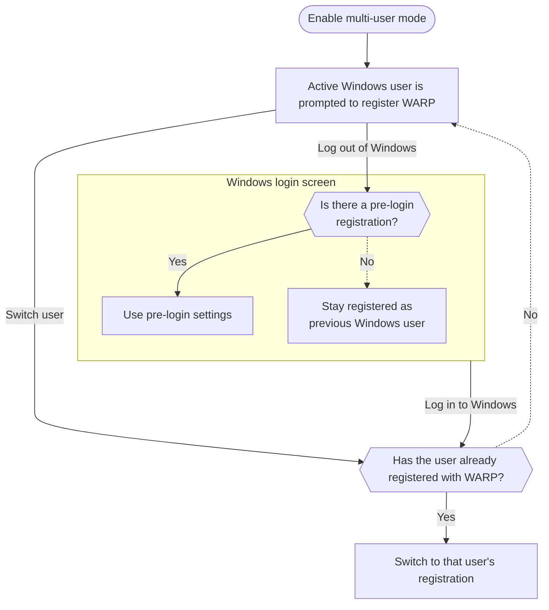

import { Details, Render } from "~/components";

<Details header="기능 가용성">
  | [WARP 형태](/cloudflare-one/team-and-resources/devices/warp/configure-warp/warp-modes/) | [Zero Trust 계획](https://www.cloudflare.com/teams-pricing/) |
  | ------------------------------------------------------------------------------------- | ---------------------------------------------------------- |
  | 모든 모드                                                                                 | 모든 계획                                                      |

  | 시스템   | 적용분야 | 최소 WARP 버전    |
  | ----- | ---- | ------------- |
  | 윈도우   | ✅    | 2025.6.1400.0 |
  | 맥 OS  | ❌    |               |
  | 리눅스   | ❌    |               |
  | iOS 앱 | ❌    |               |
  | 다운로드  | ❌    |               |
  | 크롬 OS | ❌    |               |
</Details>

Cloudflare WARP는 단 하나 Windows 장치에 다수 사용자를 지원합니다. 다중 사용자 모드에서 각 사용자는 자신의[장치 등록](/cloudflare-one/team-and-resources/devices/device-registration/), 그리고 WARP는 사용자가 Windows 계정에 로그인할 때 자동으로 장치 등록을 전환합니다. Cloudflare에 모든 트래픽은 현재 활성 Windows 사용자에 노출됩니다. 이 관리자는 ID 기반 정책 및 장치 설정, 감사 사용자 활동 및 공유 워크 스테이션에서 개별 사용자를 제거 할 수 있습니다.

:::카ution\[DNS 로깅]
사용자가 활성화하는 경우**DNS 쿼리를 로그**WARP GUI에서 (또는 실행`warp-cli dns log enable`), WARP는 디스크에 장치에 모든 DNS 쿼리를 저장할 것입니다. 장치의 모든 사용자는 다른 사용자의 DNS 쿼리를 검사 할 수 있습니다.
주요 특징

## 다중 사용자 모드 활성화

Windows에서 다중 사용자 지원 가능[MDM 파일을 배치](/cloudflare-one/team-and-resources/devices/warp/deployment/mdm-deployment/#windows)기기에`multi_user`키 설정`true`. 예를 들면:

```xml
<dict>
  <key>multi_user</key>
  <true/>
  <key>configs</key>
  <array>
    <dict>
      <key>organization</key>
      <string>your-team-name</string>
      <key>display_name</key>
      <string>Default</string>
    </dict>
  </array>
</dict>
```

다중 사용자 모드를 사용하여[Windows 사전 로그인](/cloudflare-one/team-and-resources/devices/warp/deployment/mdm-deployment/windows-prelogin/)·[Zero Trust 조직 사이 스위치](/cloudflare-one/team-and-resources/devices/warp/deployment/mdm-deployment/switch-organizations/)옵션:

```xml
<dict>
  <key>multi_user</key>
	<true/>
  <key>pre_login</key>
  <dict>
    <key>organization</key>
    <string>mycompany</string>
    <key>auth_client_id</key>
    <string>88bf3b6d86161464f6509f7219099e57.access</string>
    <key>auth_client_secret</key>
    <string>bdd31cbc4dec990953e39163fbbb194c93313ca9f0a6e420346af9d326b1d2a5</string>
  </dict>
  <key>configs</key>
  <array>
		<dict>
			<key>organization</key>
			<string>mycompany</string>
			<key>display_name</key>
			<string>Production environment</string>
  	</dict>
		<dict>
			<key>organization</key>
			<string>test-org</string>
			<key>display_name</key>
			<string>Test environment</string>
		</dict>
  </array>
</dict>
```

다중 사용자 모드를 처음 사용할 때, 사용자는 이전 등록을 한 경우에도 재등록해야합니다.

## WARP 등록 논리

다음 순서도는 WARP 등록 설정이 사용자 로그인 및 아웃으로 효력을 발생합니다.



### 빠른 사용자 전환

:::참조
이름 \*[다중 사용자 모드](#enable-multi-user-mode).
:::

[빠른 사용자 전환](https://learn.microsoft.com/windows/win32/shell/fast-user-switching)사용자가 로그 아웃없이 계정을 전환 할 수있는 Windows 기능입니다. 빠른 사용자 전환으로 여러 사용자가 기기에 로그인하고 네트워크 트래픽을 생성 할 수 있습니다. WARP 클라이언트는 사용자가 모든 트래픽을 특성화합니다.[대화형 창역](http://techcommunity.microsoft.com/blog/askperf/sessions-desktops-and-windows-stations/372473). 예를 들어, 사용자 A가 로그인하고 사용자 B로 빠른 사용자 스위치가 사용자 B로 이동하면 두 계정의 트래픽이 사용자 B로 나타날 것입니다. 이제 Windows 데스크톱 GUI를 사용하고 있기 때문입니다. 이제 사용자 B 로그아웃을 가정하고 아무 것도 없다[사전 로그인](/cloudflare-one/team-and-resources/devices/warp/deployment/mdm-deployment/windows-prelogin/); WARP는 사용자가 Windows 데스크탑으로 돌아가는 로그까지 사용자 B에 트래픽을 계속할 것입니다.

특정 사용자에 네트워크 트래픽을 정확하게 속성하려면 Cloudflare는 빠른 사용자 전환 또는 적어도 구성하는 빠른 사용자를 해제하는 것이 좋습니다[사전 로그인](/cloudflare-one/team-and-resources/devices/warp/deployment/mdm-deployment/windows-prelogin/).
