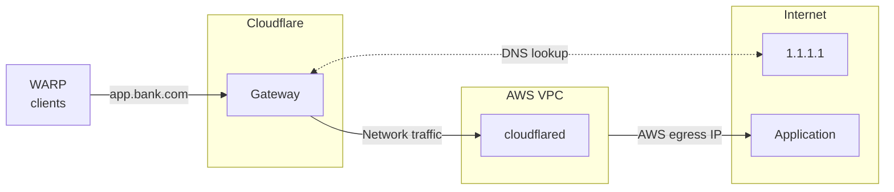

import { Render, Details, GlossaryTooltip } from "~/components";

<Render file="gateway/egress-selector-warp-version" product="cloudflare-one" />

모델 번호: Cloudflare 터널은 기존의 egress IP를 구매할 때 소스 IP 앵커링에 사용될 수 있습니다.[Cloudflare 전용 IPs](/cloudflare-one/traffic-policies/egress-policies/dedicated-egress-ips/). 일부 타사 웹 사이트는 특정 소스 IP에서 연결 할 수있는 Access Control List (ACL)가있을 수 있습니다. 이미 허용 목록에 비-Cloudflare IP가 있는 경우 (iSP 또는 AWS와 같은 클라우드 공급자에 의해 제공된 egress IP와 같은), 당신은 구성할 수 있습니다`cloudflared`오늘 사용하는 동일한 IP에 사용자 트래픽을 앵커합니다.

예를 들어, 조직의 금융 서비스,`app.bank.com`, AWS IP에서 온 사용자 트래픽을 기대합니다. 설치 가능`cloudflared`AWS 환경에서는 공공 hostname 루트 포인팅을 추가합니다.`app.bank.com`. 사용자가 연결할 때`app.bank.com`WARP 클라이언트를 사용하여 게이트웨이는 네트워크 정책을 적용하고 해당 Cloudflare 터널을 AWS로 필터링 트래픽을 우회합니다. 트래픽은 AWS egress IP를 사용하여 공공 인터넷에 진입 할 수 있습니다.

Gateway가 hostname 기반 egress 정책을 적용하는 방법에 대해 자세히 알아 보려면 여기를 클릭하십시오.[Cloudflare 블로그](https://blog.cloudflare.com/egress-policies-by-hostname/).

## 자주 묻는 질문

사용자 트래픽은 다음과 같은 방법 중 하나를 사용하여 게이트웨이로 전환됩니다.

<Render file="gateway/egress-selector-onramps" product="cloudflare-one" />

## 1. 개인 네트워크 연결

[개인 네트워크 연결](/cloudflare-one/networks/connectors/cloudflare-tunnel/private-net/cloudflared/connect-cidr/)Cloudflare에`cloudflared`. 예를 들어 AWS에서 egress에 트래픽을 원하면 AWS VPC의 개인 CIDR 블록을 연결합니다.

::::주
이름 \*`cloudflared`버전 2025.7.0 이상.
:::::

## 2. 공공 hostname 루트 추가

Cloudflare 갱도를 통해 대중적인 hostname를 노선하기 위하여:

1. 내 계정[모델 번호: Cloudflare 한국어](https://one.dash.cloudflare.com), 이동**네트워크** > **오시는 길** > **Hostname 노선**.

2. 제품정보**hostname 경로 만들기**.

3. 내 계정**이름 \***, 응용 프로그램을 나타내는 public hostname을 입력 (예를 들어,`app.bank.com`). hostname은 공용 인터넷에서 접근해야 합니다.

4. 제품 정보**관련 제품**Cloudflare에 개인 네트워크를 연결하는 데 사용되는 Cloudflare 터널을 선택하십시오.

5. 제품정보**경로 만들기**.

## 3. WARP를 통해 경로 네트워크 트래픽

당신의 WARP에서[분할 터널](/cloudflare-one/team-and-resources/devices/warp/configure-warp/route-traffic/split-tunnels/)구성, 게이트웨이에 WARP 터널을 통해 다음 IP 주소를 경로.

### 초기 해결 IP

사용자가 공용 호스트 이름 경로에 연결하면 Gateway가 할당됩니다.<GlossaryTooltip term="initial resolved IP">초기 해결 IP</GlossaryTooltip>다음 범위에서 DNS 쿼리에:

Gateway의 네트워크 엔진이 L3/L4에서 작동하기 때문에 처음 해결된 IP는 연결을 처리할 때 IP (호스트 이름)를 볼 수 있습니다. 패킷의 대상 IP가 처음 해결된 IP CGNAT 범위 내에서 떨어지면 게이트웨이는 IP 맵이 공개 호스트 이름 경로로 이동하고 해당 Cloudflare 터널을 아래로 트래픽을 보냅니다.

WARP를 통해 처음 해결된 IP를 경로에:

<Render file="gateway/egress-selector-split-tunnels" product="cloudflare-one" />

### 개인 네트워크 IP

개인 네트워크의 CIDR 블록도 WARP 터널을 통해 경로가 있어야 합니다. 상세한 구성 예제의 경우, 참조[개인 네트워크 연결](/cloudflare-one/networks/connectors/cloudflare-tunnel/private-net/cloudflared/connect-cidr/#3-route-private-network-ips-through-warp).

## 4. (선택) 네트워크 정책을 구성하십시오

당신은 구축 할 수 있습니다[Gateway 네트워크 정책](/cloudflare-one/traffic-policies/network-policies/)포트에 공용 호스트 이름에 HTTPS 트래픽을 필터링`443`. 예를 들면, 접속에서 모든 WARP 사용자를 막고 싶은 suppose`app.bank.com`사용자 또는 그룹의 특정 세트를 제외하고. 또한, 그 권한이 있는 사용자만 접근해야 합니다.`app.bank.com`AWS egress IP를 사용하여 두 개의 정책을 사용하여이 작업을 수행 할 수 있습니다 : 첫 번째는 특정 사용자가 도달 할 수 있습니다`app.bank.com`, 그리고 두번째 구획 다른 항구`443`오시는 길`app.bank.com`.

1. 회사 직원을 허용:
   <Render file="gateway/policies/restrict-access-to-private-networks-allow" product="cloudflare-one" params={{ selector: "SNI", value: "app.bank.com" }} />

2. 다른 모든 것을 항구에 막으십시오`443`:

   | 옵션 정보 | 회사연혁 | 제품정보           | - 연혁 |
   | ----- | ---- | -------------- | ---- |
   | 사이트맵  | 내 계정 | `app.bank.com` | 제품정보 |

Gateway는 현재 호스트 이름 기반 필터링을 지원하지 않습니다.`443`항구. 교통을 차단`app.bank.com`모든 포트에, 당신은 사용할 필요가[대상 IP](/cloudflare-one/traffic-policies/network-policies/#destination-ip)selector 및 공공 IP 공간 지정`app.bank.com`.

## 5. 연결을 시험하십시오

WARP 장치에서 브라우저를 열고 이동`app.bank.com`.

검색할 수 있습니다.`app.bank.com`내 계정[Gateway DNS 로그](/cloudflare-one/insights/logs/gateway-logs/)·**DNS 응답 세부사항**섹션은 공개 IP뿐만 아니라 IP를 표시해야<GlossaryTooltip term="initial resolved IP">초기 해결 IP</GlossaryTooltip>. 당신은 또한 당신의 검사할 수 있습니다[모델 번호: Cloudflare 터널 로그](/cloudflare-one/networks/connectors/cloudflare-tunnel/monitor-tunnels/logs/)이 요청은 터널을 통해 공개 IP를 해결합니다.

## 제한 사항

### Google Chrome은 로컬 네트워크 액세스를 제한합니다.

<Render file="gateway/egress-selector-chrome-issue" product="cloudflare-one" />
