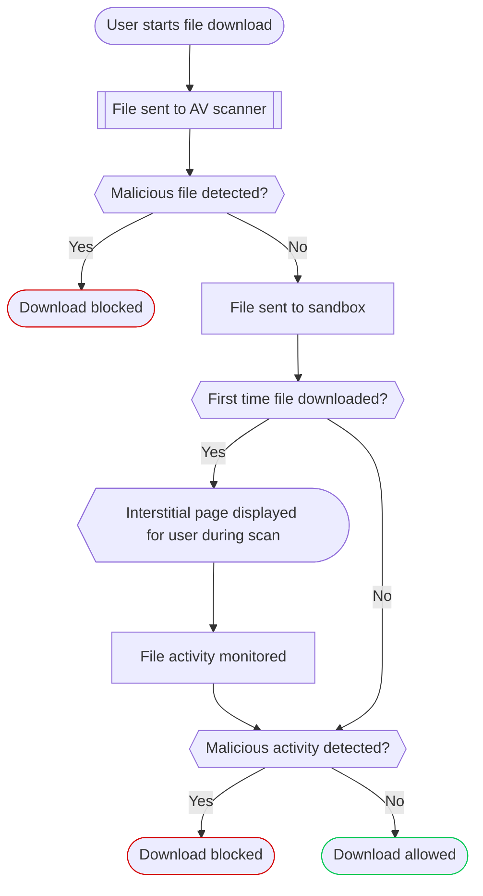

import { Render, Details } from "~/components";

:::참조
Zero Trust 기업 계획에 추가 기능으로 사용할 수 있습니다. 더 많은 정보를 원하시면 계정 팀에 문의하십시오.
주요 특징

더 알아보기[안티 바이러스 (AV) 스캐닝](/cloudflare-one/traffic-policies/http-policies/antivirus-scanning/), Gateway can quarantine before unseen files download by your users into the sandbox and scan them for malware.

AV 스캔이 파일 다운로드에 악성 코드를 감지하지 않는 경우, Gateway는 파일에 quarantine[샌드박스](#sandbox-environment). 파일이 이전에 다운로드되지 않은 경우 게이트웨이는 파일에 의해 촬영 한 작업을 모니터링하고 알려진 악성 코드 패턴을 비교합니다. 이 과정에서 Gateway는 사용자의 브라우저에서 interstitial 페이지를 표시합니다. sandbox가 악의 활동을 감지하지 않는 경우 Gateway는 quarantine에서 파일을 해제하고 사용자의 장치에 다운로드합니다. sandbox가 악의 활동을 감지하면 Gateway는 다운로드를 차단합니다. 나중에 파일을 다운로드하면 Gateway가 기억하고 허용 / 블록 결정을 적용 할 수 있습니다.

Gateway는 모든 파일 sandbox 결정에 로그인합니다.[HTTP 로그](/cloudflare-one/insights/logs/gateway-logs/#http-logs).

## 모델 번호: 시작하기

다운로드 된 파일을 quarantining 시작하려면 파일 sandboxing을 켜십시오.

1. 내 계정[모델 번호: Cloudflare 한국어](https://one.dash.cloudflare.com), 이동**교통 정책** > **교통 설정**.
2. 내 계정**정책 설정**, 켜기**sandbox 환경에서 이전에 파일 열기**.
3. (선택) 자주 묻는 질문[non-scannable 파일](#non-scannable-files), 선택**스캔할 수없는 파일에 대한 블록 요청**.

지금 만들 수 있습니다[Quarantine HTTP 정책](/cloudflare-one/traffic-policies/http-policies/#quarantine)sandbox에서 스캔 할 파일들을 결정하기 위해.

## 시험 정책

파일 sandboxing이 작동하면 Quarantine 정책을 만들 수 있습니다.[Cloudflare Sandbox 시험](https://sandbox.cloudflaredemos.com/):

1. 내 계정[모델 번호: Cloudflare 한국어](https://one.dash.cloudflare.com/), 이동**교통 정책** > **방화벽 정책**, 다음 선택**HTTP: HTTP**.

2. 제품정보**정책 추가**.

3. 다음 표현 추가:

   | 옵션 정보 | 회사연혁  | 제품정보                          | - 연혁 |
   | ----- | ----- | ----------------------------- | ---- |
   | 이름 \* | 이름 \* | `sandbox.cloudflaredemos.com` | 퀄리티  |

4. 내 계정**Sandbox 파일 형식**, 선택*ZIP 아카이브 (zip)*.

5. 장치에서[Zero Trust 조직에 연결](/cloudflare-one/team-and-resources/devices/), 브라우저를 열고 이동[Cloudflare Sandbox 시험](https://sandbox.cloudflaredemos.com/).

6. 제품정보**다운로드 Test File**.

Gateway는 quarantine이며 파일을 스캔하고 브라우저의 상호적 상태 페이지를 표시 한 다음 다운로드 파일이 표시됩니다.

## Sandbox 환경

Gateway는 sandboxed Windows 운영 체제 환경에서 quarantined 파일을 실행합니다. 기계 학습을 사용하여, sandbox는 이러한 파일이 행동하는 방법에 비해 특정 유형의 파일이 어떻게 동작하는지 비교합니다. sandbox는 커널 레벨로 파일 작업을 감지하고이 실시간 악성 코드 데이터베이스를 비교합니다. 또한 Gateway는 악의적인 행동과 데이터 압축을 위한 sandbox의 네트워크 활동을 확인합니다.

## 지원하다

### 지원된 파일 유형

<Render file="gateway/sandbox-file-types" product="cloudflare-one" />

### Non-scannable 파일

Gateway는 다음과 같은 파일을 포함하는 요청을 스캔 할 수 없습니다.

- 100MB 이상 파일
- PGP 암호화 파일
