import {
	GlossaryDefinition,
	GlossaryTooltip,
	Render,
	TabItem,
	Tabs,
	Badge,
} from "~/components";

모델 번호: Cloudflare Gateway는 수행 할 수 있습니다.[SSL/TLS 해독](https://www.cloudflare.com/learning/security/what-is-https-inspection/)악성 코드 및 기타 보안 위험에 대한 HTTPS 트래픽을 검사하기 위해.

TLS 해독을 켜면 게이트웨이는 HTTPS를 통해 전송된 모든 트래픽을 해독하고 HTTP 정책을 적용하고 요청을 다시 암호화합니다.[사용자 측 증명서](/cloudflare-one/team-and-resources/devices/user-side-certificates/).

Cloudflare는 기억에 있는 그것의 자료 센터에 있는 HTTPS 요청을 해독하고, 검열하고, 재 암호화해서 교통 방해를 막습니다. Gateway만 저장할 수 있는 캐시 콘텐츠에서 나머지. 모든 캐시 디스크는 나머지에서 암호화됩니다. TLS decryption 를 설정할 수 있습니다.[지역 서비스](/data-localization/regional-services/)내 계정[Cloudflare 데이터 로컬라이제이션 스위트 (DLS)](/data-localization/). 데이터 센터 트래픽을 더 제어하려면, 당신은 사용할 수 있습니다[전용 egress IP](/cloudflare-one/traffic-policies/egress-policies/dedicated-egress-ips/).

Cloudflare는 사용자가 TLS 1.1, 1.2 및 1.3 이상 게이트웨이에 연결을 지원합니다.

## TLS 해독을 켜십시오

:::노트\[필수]
TLS 해독을 켜기 전에, 당신은 당신 설치한 것을 지킵니다[Cloudflare 생성된 증명서](/cloudflare-one/team-and-resources/devices/user-side-certificates/)또는[주문 증명서](/cloudflare-one/team-and-resources/devices/user-side-certificates/custom-certificate/)사용자의 장치.
주요 특징

TLS 해독을 켜기:

<Render file="gateway/enable-tls-decryption" product="cloudflare-one" />

## 검사 제한

Gateway는 TLS decryption을 사용하지 않습니다.

- [인증 핀닝](#incompatible-certificates)
- [자기 서명 인증서](#incompatible-certificates)
- [Mutual TLS (mTLS) 인증](#incompatible-certificates)
- [ESNI 및 ECH 핸즈크 암호화](#esni-and-ech)
- [자동 HTTPS 업그레이드](#google-chrome-automatic-https-upgrades)

### 모든 항구에 검사<Badge text="Beta" variant="caution" size="small" />

<Render
  file="gateway/inspect-on-all-ports"
  product="cloudflare-one"
  params={{
  	turnOnProcedure:
  		"you can turn on [protocol detection](/cloudflare-one/traffic-policies/network-policies/protocol-detection/) and configure Gateway to [inspect traffic on all ports](/cloudflare-one/traffic-policies/network-policies/protocol-detection/#inspect-on-all-ports)",
  }}
/>

### 호환 인증서

인증서 pinning 및 mTLS 인증을 사용하는 응용 프로그램은 Cloudflare 인증서를 신뢰하지 않습니다. 예를 들어 대부분의 모바일 애플리케이션 사용<GlossaryTooltip term="certificate pinning" link="/ssl/reference/certificate-pinning/">인증 핀닝</GlossaryTooltip>. Cloudflare는 공공 CA에 의해 서명된 증명서 대신 자기 서명한 증명서를 이용하는 신청을 신뢰하지 않습니다.

호환 인증서 구성을 가진 응용 프로그램에 TLS 해독을 수행하려고하면 응용 프로그램은 SSL 또는 신뢰 오류 및 / 또는로드 실패를 반환 할 수 있습니다. 이 문제를 해결하려면:

- 추가하기[Cloudflare 증명서](/cloudflare-one/team-and-resources/devices/user-side-certificates/manual-deployment/#add-the-certificate-to-applications)지원되는 신청.
- 이름 \*[Inspect 정책 없음](/cloudflare-one/traffic-policies/http-policies/#do-not-inspect)검사에서 신청을 면제하십시오. 더 보기[신청 selector](/cloudflare-one/traffic-policies/http-policies/#application)임베디드 인증서를 사용하는 신뢰할 수있는 응용 프로그램의 목록을 제공합니다. 응용 프로그램 또는 웹 사이트에 대한 Do Not Inspect 정책을 작성하면 HTTP 요청을 로그 또는 차단 할 수있는 능력을 잃고 DLP 정책을 적용하고 AV 스캔을 수행합니다.
- 설정하기[분할 터널](/cloudflare-one/team-and-resources/devices/warp/configure-warp/route-traffic/split-tunnels/)게이트웨이를 보장하기 위해 모드를 포함하면 IP 또는 도메인에 대한 트래픽이 중단됩니다. 이것은 사용자의 개인 장치에 Zero Trust를 배치하는 조직에 유용합니다 또는 그렇지 않으면 사용될 개인 신청을 예상하십시오.

대신, HTTP 필터링을 허용하는 동안 insecure 인증서로 사이트에 액세스, 설정[위탁된 증명서 활동](/cloudflare-one/traffic-policies/http-policies/#untrusted-certificates)으로*오시는 길*.

### Google Chrome 자동 HTTPS 업그레이드

Google Chrome은 HTTP 요청을 HTTPS 요청에 자동으로 업그레이드 할 수 있으므로 명시적으로 선언 한 링크를 선택할 때`http://`. 당신은 프록시에 게이트웨이를 사용하고 트래픽을 필터링 할 때, 이 업그레이드는 Zero Trust 사용자와 게이트웨이 사이의 연결을 중단 할 수 있습니다.

정책, Chrome 브라우저 플래그 또는 Chrome Enterprise 정책을 통해 자동 HTTPS 업그레이드를 해제 할 수 있습니다.

<Tabs>
  <TabItem label="자주 묻는 질문">
    Zero Trust 조직의 URL에 대한 자동 HTTPS 업그레이드를 비활성화하려면 정책을 통해 게이트웨이 패스를 만듭니다.

    1. 수정하기[주문 루트 인증서](/cloudflare-one/team-and-resources/devices/user-side-certificates/custom-certificate/).

    2. 이름 \*[HTTP 정책](/cloudflare-one/traffic-policies/http-policies/)URL의 도메인을 자동으로 업그레이드합니다. 예를 들면:

       | 옵션 정보 | 회사연혁 | 제품정보          | - 연혁 |
       | ----- | ---- | ------------- | ---- |
       | 사이트 맵 | 내 계정 | `example.com` | 지원하다 |

    3. 내 계정**위탁된 증명서 활동**, 선택*오시는 길*.

    4. 제품정보**공지사항**.

    정책을 통해 패스는 Zero Trust 조직에 연결된 모든 장치에 대한 insecure 연결 업그레이드를 우회합니다. 더 많은 정보를 원하시면, 참조[법적 책임](/cloudflare-one/traffic-policies/http-policies/#untrusted-certificates).
  </TabItem>

  <TabItem label="Chrome 브라우저 플래그">
    per-browser에 자동 HTTPS 업그레이드를 비활성화하려면 이동[Chrome 플래그](chrome://flags/#https-upgrades)관련 기사**HTTPS 업그레이드**.
  </TabItem>

  <TabItem label="Chrome 기업 정책">
    Chrome Enterprise 사용자는 모든 URL에 대한 자동 HTTPS 업그레이드를 해제 할 수 있습니다.[`HttpsUpgradesEnabled`회사연혁](https://chromeenterprise.google/policies/#HttpsUpgradesEnabled).
  </TabItem>
</Tabs>

### 상호 TLS (mTLS)

트래픽을 검사하기 위해 TLS를 해독 할 때, 상호 TLS (mTLS)를 사용하는 연결은 Gateway가 필요한 클라이언트 인증서를 반환 할 수 없기 때문에 실패합니다. 연결 실패를 방지하기 위해,[Inspect 정책 없음](/cloudflare-one/traffic-policies/http-policies/#do-not-inspect)이 교통을 위해.

### ESNI 및 ECH

웹 사이트 준수[ESNI 또는 암호화된 클라이언트 Hello (ECH) 표준](https://blog.cloudflare.com/encrypted-client-hello/)TLS에서 Server Name Indicator (SNI)를 암호화하고 따라서 HTTP 검사와 호환됩니다. Gateway가 SNI에 의존하기 때문에 정책에 HTTP 요청을 일치합니다. ECH가 실패하면 브라우저는 초기 요청에서 암호화되지 않은 SNI를 사용하여 TLS Handhake를 다시 구합니다. 이 행동을 피하려면 사용자의 브라우저에서 ECH를 비활성화 할 수 있습니다.

아직 적용 할 수 있습니다.[네트워크 정책 필터](/cloudflare-one/traffic-policies/network-policies/#selectors)SNI 및 SNI 도메인 제외. ESNI 및 ECH 트래픽을 제한하려면 옵션은 모든 포트를 필터링하는 것입니다.`80`·`443`SNI 헤더를 포함하지 않는 트래픽.

## 포스트 양 지원

게이트웨이는 TLS 1.3 이상 X25519 및 MLKEM768과 하이브리드 키 교환을 사용하여 포스트 양자 암호화를 지원합니다. 키 교환이 완료되면 게이트웨이는 AES-128-GCM을 사용하여 트래픽을 암호화합니다.

더 알아보기[포스트 양자 암호화](/ssl/post-quantum-cryptography/)더 알아보기.

## FIPS 준수

기본적으로 TLS 해독은 TLS 버전 1.2와 1.3 모두 사용할 수 있습니다. 그러나 FedRAMP와 같은 일부 환경은 FIPS 140-2와 호환되는 cipher 스위트 및 TLS 버전이 필요할 수 있습니다. FIPS 준수는 현재 TLS 버전 1.2이 필요합니다.

### FIPS 준수

<Render file="gateway/enable-tls-decryption" product="cloudflare-one" />

3. 제품정보**FIPS 140-2와 호환되는 cipher Suite 및 TLS 버전만 사용 가능**.

### 제한 사항

FIPS 준수가 활성화되면 게이트웨이만 선택됩니다.[FIPS-compliant 수석 스위트](#cipher-suites)근원에 연결할 때. FIPS-compliant ciphers를 지원하지 않는 경우 요청이 실패합니다.

FIPS-compliant 트래픽 기본적으로[HTTP / 1 페이지](/cloudflare-one/traffic-policies/http-policies/http3/). UDP 트래픽에 대한 HTTP 정책을 시행하려면, 당신은 켜야해야합니다[UDP의 Gateway 프록시](/cloudflare-one/traffic-policies/http-policies/http3/#enable-http3-inspection).

## FedRAMP 준수

이용 시[Cloudflare 지역 서비스](/data-localization/regional-services/)미국에서 WARP 클라이언트를 사용해 Gateway로 TLS 트래픽을 온램프하면, 해당 트래픽은 Cloudflare의 FedRAMP 경계 내에 있는 Cloudflare 데이터 센터에서 송신됩니다. 사용자의 가장 가까운 데이터 센터가 FedRAMP 비준수인 경우에도, 해당 트래픽은 여전히 FedRAMP 준수 데이터 센터에서 송신되어 트래픽의 FedRAMP 준수를 유지합니다.

```mermaid
flowchart LR
 %% Accessibility
 accTitle: How Gateway routes FedRAMP compliant traffic with Regional Services
 accDescr: Flowchart describing how WARP with Gateway routes traffic to egress from a FedRAMP compliant data center when used with Regional Services in the United States.

 %% Flowchart
 subgraph s1["Non-FedRAMP data center"]
        n2["WARP TLS encryption terminated"]
  end
 subgraph s2["FedRAMP data center"]
        n3["Gateway TLS encryption (FIPS) terminated"]
  end
 subgraph s3["Private internal network"]
        n5["FedRAMP compliant cloudflared"]
        n6(["Private server"])
  end
    n1(["User near non-FedRAMP compliant data center"]) -- Gateway TLS connection wrapped with WARP TLS (MASQUE) --> n2
    n2 -- Gateway TLS connection --> n3
    n3 <-- FIPS tunnel --> n5
    n5 --> n6

    n5@{ shape: rect}
```

## Cipher 스위트

<GlossaryDefinition term="cipher suite" prepend="A cipher suite is " />

다음 표는 TLS 해독에 대한 기본 cipher Suites Gateway 용도를 나열합니다.

| 이름 (OpenSSL)                  | 이름 (IANA)                               | FIPS 호환 |
| ----------------------------- | --------------------------------------- | ------- |
| ECDHE-ECDSA-AES128-GCM-SHA256 | TLS ECDHE ECDSA WITH AES 128 GCM SHA256 | ✅       |
| ECDHE-ECDSA-AES256-GCM-SHA384 | TLS ECDHE ECDSA WITH AES 256 GCM SHA384 | ✅       |
| ECDHE-RSA-AES128-GCM-SHA256   | TLS ECDHE RSA WITH AES 128 GCM SHA256   | ✅       |
| ECDHE-RSA-AES256-GCM-SHA384   | TLS ECDHE RSA WITH AES 256 GCM SHA384   | ✅       |
| 적능력 RSA-AES128-SHA            | TLS ECDHE RSA WITH AES 128 CBC SHA256   | ❌       |
| ECDHE-RSA-AES256-SHA384       | TLS ECDHE RSA WITH AES 256 CBC SHA384   | ✅       |
| 모델 번호: AES128-GCM-SHA256      | TLS RSA WITH AES 128 GCM SHA256         | ✅       |
| 모델 번호: AES256-GCM-SHA384      | TLS RSA WITH AES 256 GCM SHA384         | ✅       |
| AES128-샤                      | TLS RSA WITH AES 128 CBC SHA            | ❌       |
| AES256-샤                      | TLS RSA WITH AES 256 CBC SHA            | ❌       |

cipher Suite에 대한 자세한 내용은 참조[Cipher 스위트](/ssl/edge-certificates/additional-options/cipher-suites/).
