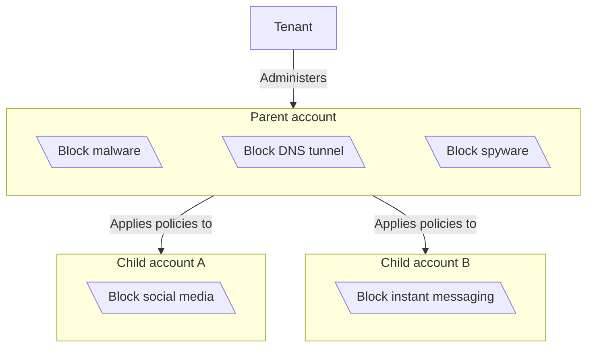
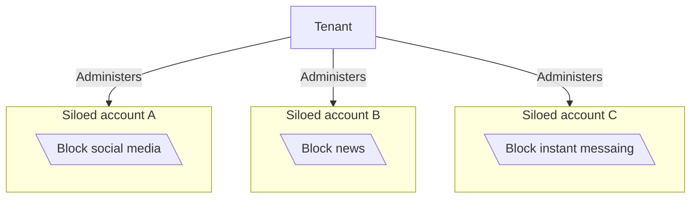

:::참조
Enterprise 플랜에서만 사용할 수 있습니다. 더 많은 정보를 원하시면 계정 팀에 문의하십시오.
주요 특징

Gateway 지원[Cloudflare 테넌트 API](/tenant/)Cloudflare-partnered 관리 서비스 제공 업체 (MSP)를 설정하고 고객에게 Cloudflare 계정 및 서비스를 관리 할 수 있습니다. Tenant API를 사용하면 MSP는 글로벌 게이트웨이 정책 컨트롤을 사용하여 Zero Trust 배포를 만들 수 있습니다. 정책은 그룹 또는 개별 계정 수준에서 사용자 정의 또는 overridden 할 수 있습니다.

Tenant 플랫폼만 지원[DNS 정책](/cloudflare-one/traffic-policies/dns-policies/). 자세한 내용은, 참조[관리 서비스 공급자를 위한 Cloudflare Zero Trust](https://blog.cloudflare.com/gateway-managed-service-provider/)블로그 게시물.

## 모델 번호: 시작하기

{/* Don't need to surface much of the policy creation flow here */}

Tenant API를 설정하려면, 참조[모델 번호: 시작하기](/tenant/get-started/). 일단 당신이 제공하고 당신의 고객의 Cloudflare 계정을 형성하면, 당신은 창조할 수 있습니다[DNS 정책](/cloudflare-one/traffic-policies/dns-policies/).

## 계정 유형

Gateway Tenant 플랫폼은 계층화된 계정 구성을 지원합니다.

### 계층 계정

계층화 된 계정 구성에서 최상위 부모 계정은 모든 자녀 계정에 적용하는 글로벌 보안 정책을 시행합니다. 자녀 계정은 아직 부모 계정으로 관리되고있는 동안 필요한 정책을 삭제하거나 추가 할 수 있습니다. MSP는 부모 계정에서 독립적으로 자녀 계정을 구성할 수 있습니다.

- 설정하기[사용자 정의 블록 페이지](/cloudflare-one/reusable-components/custom-pages/gateway-block-page/)
- 생성 및 업로드[루트 인증서](/cloudflare-one/team-and-resources/devices/user-side-certificates/)
- 뚱 베어[DNS 위치](/cloudflare-one/networks/resolvers-and-proxies/dns/locations/)
- 회사연혁[이름 \*](/cloudflare-one/reusable-components/lists/)

각 아이 계정은 기본 Zero Trust에 적용됩니다[계정 제한](/cloudflare-one/account-limits/).

Gateway는 자녀 계정 정책 전에 부모 계정 정책을 평가합니다. 특정 부모 계정 정책을 무시하기 위해 자녀 계정을 허용하려면, 당신은 사용할 수 있습니다[Zero Trust 업데이트 Gateway 규칙](/api/resources/zero_trust/subresources/gateway/subresources/rules/methods/update/)정책의 설정의 끝점`allow_child_bypass`규칙 설정`true`.

### Siloed 계정

siloed 계정 구성에서, 각 계정은 독립적으로 동일한 10ant 내에서 작동합니다. MSP는 각 계정의 보안 정책, 리소스 및 구성을 별도로 관리합니다.

