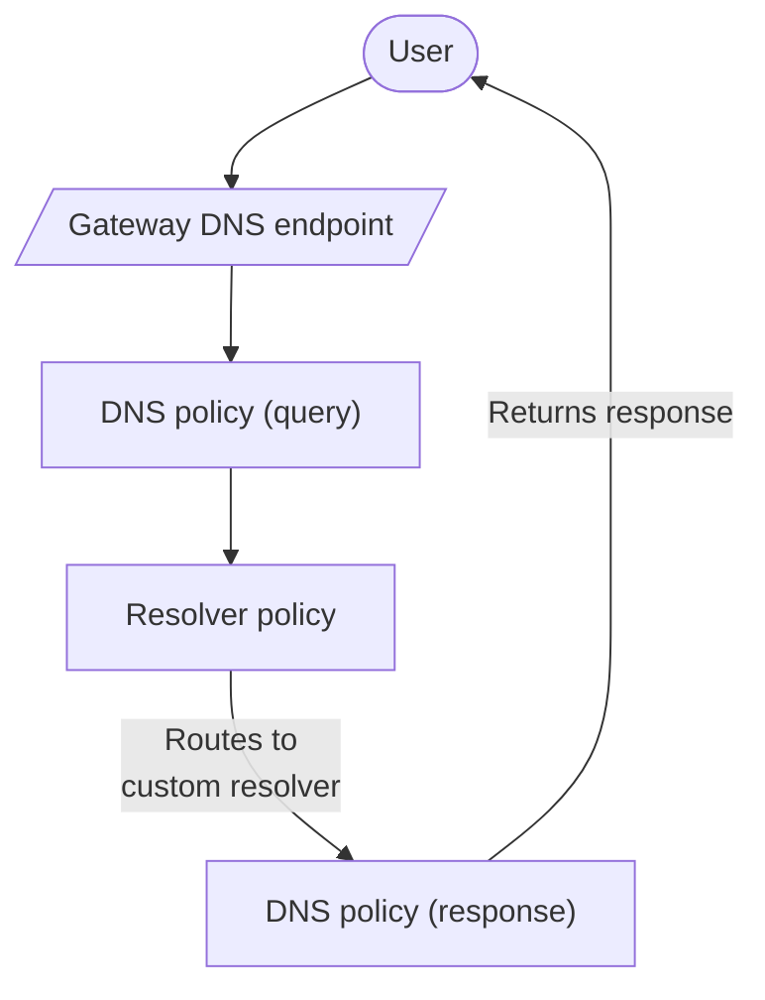

import { Render, Badge, GlossaryTooltip } from "~/components";

:::참조
Enterprise 플랜에서만 사용할 수 있습니다.
주요 특징

기본적으로 Gateway는 DNS 요청을 보냅니다.[1.1.1.1](/1.1.1.1/), Cloudflare의 공개적인 DNS 결심자, 해결책을 위해. Enterprise 사용자는 게이트웨이 정책을 사용하여 DNS 쿼리를 사용자 정의 할 수 있습니다.

게이트웨이는 사용자 트래픽을 구성하는 DNS 해결사에 전달할 것입니다.

## 사용 사례

개인 네트워크 서비스 또는 내부 리소스와 같은 비공개 도메인에 액세스해야하는 경우 해결자 정책을 사용할 수 있습니다. 보호 된 DNS 서비스에 액세스하거나 여러 위치에 DNS 관리를 단순화 할 필요가있는 경우 해결자 정책을 사용할 수 있습니다.

### 내부 DNS<Badge text="Beta" variant="caution" size="small" />

[Cloudflare 내부 DNS](/dns/internal-dns/)개인 네트워크의 내부 리소스에 DNS 레코드를 관리 할 수 있습니다. 내부 DNS에서 구성 된 DNS 영역은 게이트웨이 해결사에 의해 정복 할 수 있습니다. 해결자 정책으로 게이트웨이가 조직의 DNS 쿼리를 해결하는 방법을 결정할 수 있습니다. 내부 리소스를 기반으로 쿼리의 컨텍스트를 기반으로합니다. 알려진 소스 IP와 같은 지리적 위치.

시작하기는 내부 DNS 쿼리를 해결하여 해결 정책을 참조합니다.[모델 번호: 시작하기](/dns/internal-dns/get-started/).

### 지역 도메인 Fallback

Cloudflare 갱도, IPsec/GRE 갱도, 또는 다른 공중 인터넷 연결을 통해 클라이언트 장치 그리고 출입구에 의하여 뿐만 아니라 도달할 수 있는 경우에, 당신은 구성해야 합니다[지역 도메인 Fallback](/cloudflare-one/team-and-resources/devices/warp/configure-warp/route-traffic/local-domains/)당신의 장치를 위해. Local Domain Fallback 및 fixr 정책 모두 동일한 장치로 구성되면 Cloudflare는 클라이언트 측 Local Fallback 규칙을 먼저 적용할 것입니다. WARP 클라이언트와 게이트웨이에 DNS 쿼리를 내장하고 해결자 정책을 통해 경로, 쿼리의 소스 IP는 WARP 클라이언트에 의해 할당 된 IP 주소가 될 것입니다.

<Render file="warp/ldf-best-practice" product="cloudflare-one" />

## Resolver 연결

해결 정책 지원 TCP 및 UDP 연결. 사용자 정의 해결자는 IPv4 또는 IPv6를 통해 인터넷에 포인트 할 수 있습니다, 또는 개인 네트워크 서비스에, 같은[매직 터널](/magic-transit/how-to/configure-tunnel-endpoints/). 포트에 기본 정책`53`. 당신은 당신의 결심자 용도를 당신의 정책에서 customizing에 의하여 변화할 수 있습니다.

DDoS 공격으로부터의 권한 네임서버를 보호할 수 있습니다.[DNS 방화벽](/dns/dns-firewall/).

### Cloudflare 갱도

Cloudflare에 연결되는 개인적인 결심자에게 연결을 구성할 수 있습니다[Cloudflare 갱도](/cloudflare-one/networks/connectors/cloudflare-tunnel/). 보증`cloudflared`UDP 트래픽을 해결할 수 있습니다.[견적 요청](/cloudflare-one/networks/connectors/cloudflare-tunnel/configure-tunnels/run-parameters/#protocol).

Cloudflare 갱도를 가진 Cloudflare에 개인적인 DNS 결심자를 연결하는 방법에 대한 자세한 내용은, 참조합니다[개인 DNS](/cloudflare-one/networks/connectors/cloudflare-tunnel/private-net/cloudflared/private-dns/).

### Cloudflare 대만

Cloudflare에 연결되는 개인적인 결심자에게 연결을 가능하게 하기 위하여[Cloudflare 대만](/cloudflare-wan/), 당신의 계정 팀을 접촉하십시오.

### 유효한 DNS 엔드포인트

Resolver 정책은 다음과 같은 DNS 엔드포인트의 해상도에 대한 쿼리를 할 수 있습니다.

- IPv4 지원
- IPv6를
- [HTTPS (DoH) 이상 DNS](/cloudflare-one/networks/resolvers-and-proxies/dns/dns-over-https/)
- [TLS (DoT)에 DNS](/cloudflare-one/networks/resolvers-and-proxies/dns/dns-over-tls/)
- Cloudflare에 의해 생성된 DNS 쿼리[브라우저 고립](/cloudflare-one/remote-browser-isolation/)·[Clientless 웹 고립](/cloudflare-one/remote-browser-isolation/setup/clientless-browser-isolation/)
- DNS 쿼리 생성[프록시 엔드포인트](/cloudflare-one/networks/resolvers-and-proxies/proxy-endpoints/)

Gateway는 필터, 해결 및 endpoint에 관계없이 쿼리를 로그합니다.

## 해결사 정책

<Render file="gateway/create-resolver-policy" product="cloudflare-one" />

DNS 정책 생성에 대한 자세한 내용은 참조[DNS 정책](/cloudflare-one/traffic-policies/dns-policies/).

<Render file="gateway/terraform-precedence-warning" product="cloudflare-one" />

## 이름 \*

### 제품 분류

<Render file="gateway/selectors/dns-content-categories" product="cloudflare-one" />

### DNS 해결 IP

<Render file="gateway/selectors/dns-resolver-ip" product="cloudflare-one" />

### DoH 하위 도메인

<Render file="gateway/selectors/doh-subdomain" product="cloudflare-one" />

### 이름 \*

<Render file="gateway/selectors/domain-dns" product="cloudflare-one" params={{ APIendpoint: "dns.domains" }} />

### 이름 \*

<Render file="gateway/selectors/host-dns" product="cloudflare-one" params={{ APIendpoint: "dns.fqdn" }} />

### 제품정보

<Render file="gateway/selectors/location" product="cloudflare-one" />

### Query 기록 유형

<Render file="gateway/selectors/query-record-type" product="cloudflare-one" />

### 보안 카테고리

<Render file="gateway/selectors/security-categories" product="cloudflare-one" />

### 소스 Continent

이 선택기를 사용하여 쿼리가 Gateway에 도착한 대륙에 기반을 둔 필터를 사용합니다.<Render product="cloudflare-one" file="gateway/selectors/source-continent-dns" params={{ one: "dns.src" }} />

### 소스 국가

이 선택기를 사용하여 쿼리가 Gateway에 도착한 국가를 기준으로 필터링합니다.<Render product="cloudflare-one" file="gateway/selectors/source-country-dns" params={{ one: "dns.src" }} />

### 근원 IP

<Render file="gateway/selectors/source-ip-resolver" product="cloudflare-one" />

### 이름 \*

<Render file="gateway/selectors/users-dns" product="cloudflare-one" />

## 비교 연산자

<Render file="gateway/comparison-operators" product="cloudflare-one" />

## 제품정보

<Render file="gateway/value" product="cloudflare-one" params={{ selector: "Host", selectordescription: "hostname", operator: "matches regex", valueOne: ".*whispersystems.org", valueTwo: ".*signal.org" }} />

## Logical 연산자

<Render file="gateway/logical-operators" product="cloudflare-one" params={{ one: "Identity" }} />
