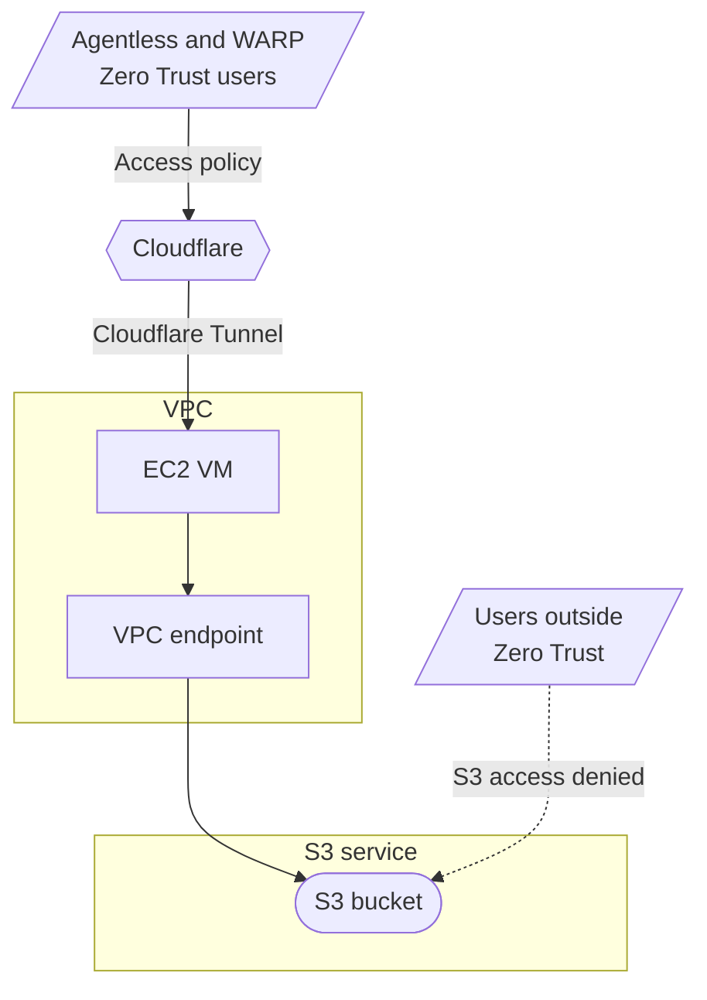
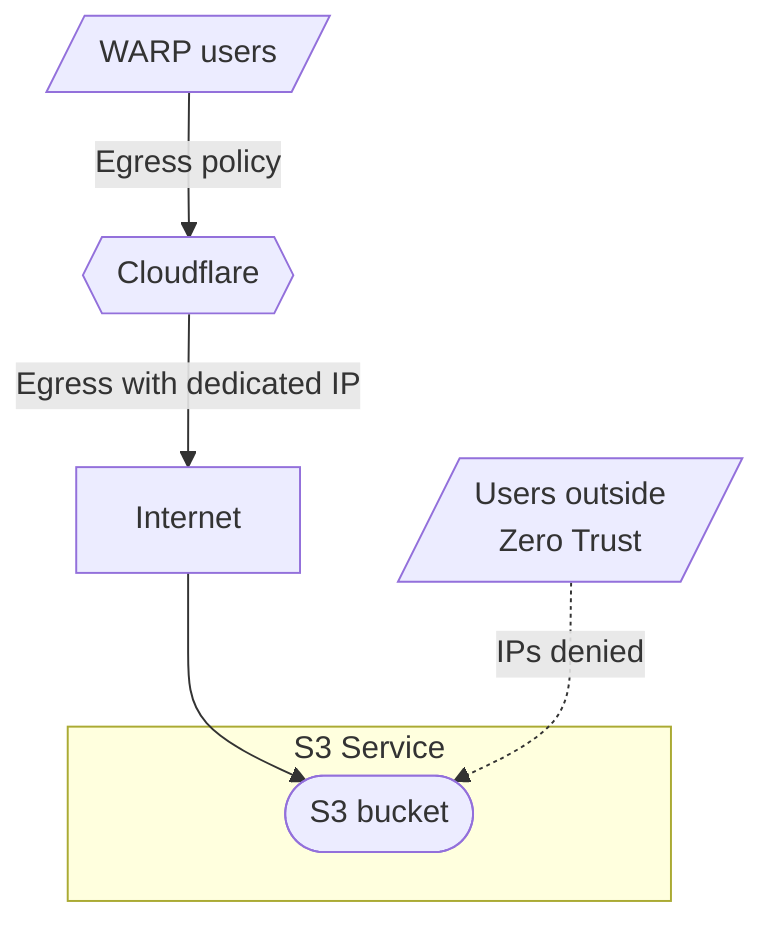

이 튜토리얼은 Cloudflare Zero Trust Zero Trust와 Amazon S3 버킷에 대한 액세스를 안전하게 보호하는 방법을 설명합니다. 이 버킷의 데이터는 인터넷에 노출되지 않습니다. Cloudflare 액세스 및 AWS VPC 엔드포인트를 결합할 수 있습니다. 엔터프라이즈는 Cloudflare Gateway egress 정책을 전용 IP로 사용할 수 있습니다.

## 방법 1: Cloudflare를 통해 액세스 및 VPC 엔드 포인트



### 자주 묻는 질문

- Cloudflare Zero Trust에 의해 보호되는 S3 물통
- 1개의 EC2 가상 기계 (VM)를 가진 AWS VPC[사이트맵 터널 daemon](/cloudflare-one/networks/connectors/cloudflare-tunnel/)
- S3 버킷 및 AWS VPC는 동일하게 구성[AWS 지역](https://docs.aws.amazon.com/AmazonRDS/latest/UserGuide/Concepts.RegionsAndAvailabilityZones.html)

### 1. AWS에서 VPC 엔드포인트 만들기

1. 내 계정[AWS 대시보드](https://aws.amazon.com/console/), 이동**제품정보** > **네트워킹 & 내용 납품** > **모형: VPC**.
2. 이름 \***가상 개인 클라우드**, 이동**이름 \***.
3. 제품정보**endpoint 만들기**그리고 endpoint 이름.
4. 제품 정보*AWS 서비스*서비스 범주로.
5. 내 계정**제품정보**, 검색 및 VPC의 같은 지역에서 S3 서비스를 선택합니다. 예를 들어, AWS 지역**유럽 (런던) - eu-west-2**, 대응 S3 서비스는 지명됩니다`com.amazonaws.eu-west-2.s3`Gateway의 유형으로.
6. 내 계정**모형: VPC**, Cloudflare 갱도 daemon를 호스팅하는 EC2 VM를 포함하는 당신의 VPC를 선정하십시오.
7. 내 계정**노선표**, VPC와 관련된 노선 테이블을 선택하십시오.
8. 내 계&#xC815;**- 연혁**, 선택*전체 액세스*.
9. 제품정보**endpoint 만들기**.

VPC 엔드포인트를 생성한 후, VPC 엔드포인트가 있는 타겟을 가진 VPC 경로 테이블에 새로운 항목. 항목에는 형식이 있습니다.`vpce-xxxxxxxxxxxxxxxxx`.

### 2. VPC 접근을 위한 물통 정책을 설치하십시오

1. 오시는 길**제품정보** > **제품 정보** > **사이트맵**.
2. 아마존 S3에서, 이동**기타 제품** > **\<당신의-S3-bucket>** > **제출**.
3. 사용 방법**모든 공공 접근**.
4. 내 계정**버킷 정책**, 다음 정책을 추가:

```json
{
	"Version": "2012-10-17",
	"Id": "VPCe",
	"Statement": [
		{
			"Sid": "VPCe",
			"Effect": "Allow",
			"Principal": "*",
			"Action": "s3:*",
			"Resource": [
				"arn:aws:s3:::<your-S3-bucket01>",
				"arn:aws:s3:::<your-S3-bucket01>/*"
			],
			"Condition": {
				"StringEquals": {
					"aws:SourceVpce": "<your-vpc-endpoint>"
				}
			}
		}
	]
}
```

당신의 물통 정책은 당신의 S3 물통에 접근하기 위하여 당신의 VPC를 허용할 것입니다.

### 3. S3 물통을 위한 정체되는 웹 호스팅

1. Amazon S3로 돌아가기**기타 제품** > **\<당신의-S3-bucket01>** > **제품 정보**.
2. 내 계정**웹 호스팅**, 선택**제품정보**.
3. 이름 \***웹 호스팅**.
4. S3 버킷의 인덱스 및 오류 문서를 지정합니다.
5. 제품정보**비밀번호**.

버킷 웹 사이트 엔드포인트에서 사용할 수 있습니다.`http://<your-S3-bucket01>.s3-website.<aws-region>.amazonaws.com`. 물통 정책 때문에, 이 웹 사이트 엔드포인트는 VPC 엔드포인트로 VPC에서만 접근할 수 있습니다.

### 4. Cloudflare 터널에 게시 된 응용 프로그램을 추가

1. 내 계정[사이트맵 한국어](https://one.dash.cloudflare.com/), 이동**네트워크** > **연결관** > **사이트맵 연락처**.
2. 터널을 선택, 다음 선택**설정하기**.
3. 오시는 길**연락처**, 다음 선택**대중적인 hostname 추가**.
4. 하위 도메인을 입력하면 S3 버킷에 액세스 할 수 있습니다. 예를 들어,`s3-bucket.<your-domain>.com`.
5. 이름 \***제품정보**, 선택*HTTP: HTTP*제품 정보**제품정보**. 에서**사이트 맵**, 입력`<your-S3-bucket01>.s3-website.<aws-region>.amazonaws.com`.
6. 내 계정**추가 신청 설정** > **HTTP 설정**, 입력**HTTP 호스트 헤더**이름 \*`<your-S3-bucket01>.s3-website.<aws-region>.amazonaws.com`.
7. 제품정보**호스트 이름**.

당신의 Cloudflare 갱도는 당신의 공중 hostname를 사용하여 AWS VPC에 종결될 것입니다.

### 5. 접근 정책에 S3 접근 제한

1. 오시는 길**액세스 제어** > **이름 \***.
2. 제품정보**앱 추가**.
3. 제품정보**셀프 호스팅**.
4. 신청의 이름을 입력합니다.
5. 제품정보**공공 hostname 추가**당신의 갱도에 의해 이용된 대중적인 hostname를 입력하십시오. 예를 들어,`s3-bucket.<your-domain>.com`.
6. 더 보기[오시는 길](/cloudflare-one/access-controls/policies/)사용자 및 애플리케이션이 물통에 접근할 수 있는지 결정합니다. 선택적으로 만들 수 있습니다[서비스 토큰](/cloudflare-one/access-controls/service-credentials/service-tokens/)S3 버킷에 자동으로 액세스 할 수있는 정책.
7. 자주 묻는 질문[자체 호스팅 응용 프로그램 생성 단계](/cloudflare-one/access-controls/applications/http-apps/self-hosted-public-app/)앱을 게시합니다.

Cloudflare를 통해 성공적으로 인증된 사용자 및 응용 접근은 S3 물통에 접근할 수 있습니다`https://s3-bucket.<your-domain>.com`.

## 방법 2: Cloudflare를 통해 Gateway egress 정책

:::참조

이 방법은 엔터프라이즈 플랜에서만 사용할 수 있습니다.
주요 특징



### 자주 묻는 질문

- Cloudflare Zero Trust 계정[전용 egress IP](/cloudflare-one/traffic-policies/egress-policies/dedicated-egress-ips/)
- Cloudflare Zero Trust에 의해 보호되는 S3 물통

### 1. 특정 IP 주소에 대한 액세스를 제한하는 양동이 정책을 설정합니다.

1. 내 계정[AWS 대시보드](https://aws.amazon.com/console/), 이동**제품정보** > **제품 정보** > **사이트맵**.
2. 오시는 길**기타 제품** > **\<당신의-S3-bucket02>** > **제출**.
3. 사용 방법**모든 공공 접근**.
4. 내 계정**버킷 정책**, 다음 정책을 추가:

```json
{
	"Version": "2012-10-17",
	"Id": "SourceIP",
	"Statement": [
		{
			"Sid": "SourceIP",
			"Effect": "Allow",
			"Principal": "*",
			"Action": "s3:*",
			"Resource": [
				"arn:aws:s3:::<your-S3-bucket02>",
				"arn:aws:s3:::<your-S3-bucket02>/*"
			],
			"Condition": {
				"IpAddress": {
					"aws:SourceIp": "<your-dedicated-ip>/32"
				}
			}
		}
	]
}
```

### 2. S3 물통을 위한 정체되는 웹 호스팅

1. 당신의 물통에 돌려, 그 후에 갈**제품 정보**.
2. 내 계정**웹 호스팅**, 선택**제품정보**.
3. 이름 \***웹 호스팅**.
4. S3 버킷의 인덱스 및 오류 문서를 지정합니다.
5. 제품정보**비밀번호**.

버킷 웹 사이트 엔드포인트에서 사용할 수 있습니다.`http://<your-S3-bucket02>.s3-website.<aws-region>.amazonaws.com`. 양동이 정책 때문에 웹 사이트 엔드포인트는 전용 egress IP로 지정된 트래픽에 접근 할 수 있습니다.

### 3. 전용 egress IP 정책 설정

1. 내 계정[사이트맵 한국어](https://one.dash.cloudflare.com/), 이동**교통 정책** > **Egress 정책**. 선택**정책 추가**.
2. proxied 트래픽 게이트웨이가 할당해야하는 정책을 작성하십시오.[전용 egress IP](/cloudflare-one/traffic-policies/egress-policies/dedicated-egress-ips/)이름 \* 더 많은 정보를 원하시면, 참조[Egress 정책](/cloudflare-one/traffic-policies/egress-policies/).
3. 내 계정**IP 선택**, 선택*전용 Cloudflare egress IPs 사용*. 당신의 물통 정책에서 정의된 전용 egress IP를 선택하십시오.
4. 제품정보**공지사항**.

게이트웨이에 의해 추진되고 지정된 egress IP를 할당하면 S3 버킷에 액세스 할 수 있습니다.`http://<your-S3-bucket02>.s3-website.<aws-region>.amazonaws.com`.
