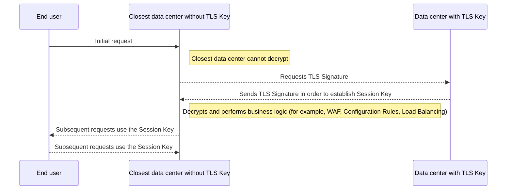

Geo Key Manager는 개인 SSL/TLS 키의 저장 위치에 대한 향상된 제어를 제공하며 지역 데이터 규정 및 보안 요구 사항을 준수합니다.

## 핵심 저장

기본적으로 개인 키는 암호화되고 안전하게 각 데이터 센터로 배포됩니다. 로컬 SSL/TLS 종료에 사용할 수 있습니다. Geo Key Manager는 개인 키를 저장하려는 위치를 선택할 수 있습니다.

Geo Key Manager는 미국, EU 및 높은 보안 데이터 센터에 제한되었지만 Geo Key Manager의 새로운 버전으로 사용할 수 있습니다.[닫히는 베타](https://blog.cloudflare.com/configurable-and-scalable-geo-key-manager-closed-beta/), 이제 만들 수 있습니다`allowlists`·`blocklists`개인 키가 저장되는 국가의. 즉, 당신은 열쇠를 저장하는 특정한 지리적 위치를 정의할 수 있다는 것을 의미합니다, 예를 들면 당신은 호주에서 독점적으로 당신의 개인적인 열쇠를 저장하거나 EU와 영국에 개인 열쇠 저장을 제한할 수 있습니다.

## Cloudflare 데이터 센터 유량 예

뒤에 오는 도표는 개인적인 TLS 열쇠 없이 Cloudflare 자료 센터의 교류의 고도 예입니다. 이 과정에서 데이터 센터는 개인 TLS 키를 보유하는 Cloudflare 데이터 센터에 도달함으로써 임시 세션 키를 요청하고 생성해야합니다.

 

 

설정 및 지원 옵션에 대한 자세한 정보는 참조[Geo Key Manager 문서](/ssl/edge-certificates/geokey-manager/).
