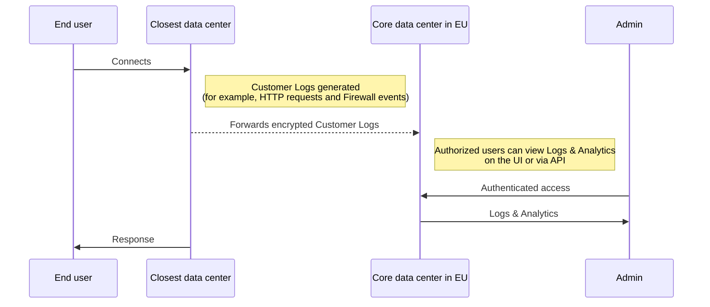

Data Localization Suite의 일환으로 고객 Metadata Boundary(CMB)는 고객의 최종 사용자를 식별할 수 있는 모든 트래픽 메타데이터를 보장합니다.[계정 ID](/fundamentals/account/find-account-and-zone-ids/)) — 숙박`EU`(유럽 연합) 또는`US`(미국), 지역에 따라 고객 선택. 예를 들어, 고객이 선택한 경우`EU`고객 메타데이터 경계, 메타데이터**한국어**유럽 연합 (EU)에 위치한 우리의 핵심 데이터 센터로 보내집니다.

예외는 "Allow out-of-region access"가 활성화되면 이루어집니다. 활성화되면 고객 로그는 여전히 구성 영역에서 저장되지만 물리적 위치에 관계없이 공인된 최종 사용자에게 접근 할 수 있습니다. 더 알아보기[지역 접근](/data-localization/metadata-boundary/out-of-region-access/)더 많은 정보.

## 고객 교통 metadata 흐름

다음 다이어그램은 고객의 트래픽에 대한 메타 데이터가 Cloudflare 데이터 센터에 생성되는 방식의 흐름입니다. Logs는 Cloudflare 고객을 위한 EU 핵심 데이터 센터에 독점적으로 보내지고 허가한 사용자는 접근 및 전망에.

 

 

## 로그인 관리

또한, 고객은 구성할 옵션이 있습니다.[다운로드](/logs/logpush/)고객의 다양한 저장 서비스, SIEM 및 로그 관리 제공 업체에 로그인하십시오.

## 제품 specific-behavior

Metadata Boundary에 대한 제품 별 행동에 대한 자세한 내용은 참조[Cloudflare 제품 호환성](/data-localization/compatibility/)사이트 맵
