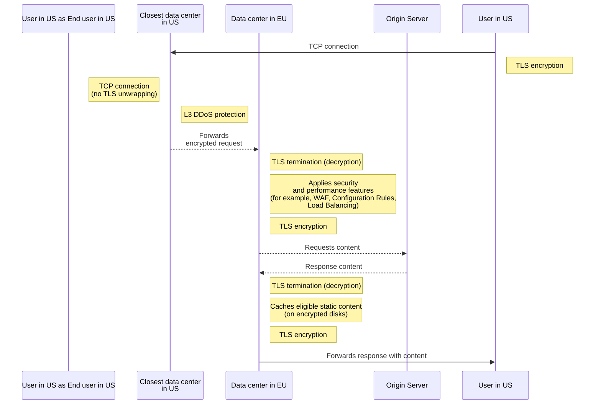

import { GlossaryTooltip } from "~/components"

지역 서비스는 데이터 센터의 해독 및 서비스 HTTPS 트래픽을 설정하여 지역 제한을 수용 할 수있는 능력을 제공합니다.

지역 서비스 지역 규정 준수를 충족하거나 해당 데이터에 대한 지역 통제를 유지하기위한 p참고 자료s를 보유하고있는 특정 지역에서 트래픽을 진행하고 처리합니다. 사용 사례의 예는 지역 제한을 수용해야 할 고객 일 수 있습니다.[GDPR](https://www.cloudflare.com/trust-hub/gdpr/)(General Data Protection Regulation), 또는 데이터 흐름 또는 데이터 처리에 대한 지리적 제한을 포함하는 자신의 고객과의 계약에 따라되는 고객.

지역 서비스로, TLS는 구성 영역 내에서만 종료됩니다. 예를 들어, 호스트 이름은 유럽 연합 (EU)에 지역화로 구성되는 경우, 미국 (US)의 모든 HTTPS 요청은 유럽 연합 (EU)에 경로가됩니다.

## 글로벌 트래픽 관리

지역 서비스 Globally ingest 트래픽, 구현[L3/L4 DDoS 완화](/ddos-protection/about/attack-coverage/). 그 사이에, 안전, 성과, 및 신뢰성 기능은 단지 in-region Cloudflare 위치에서 서비스됩니다.

지역 서비스는 선택한 지역 내에서 모든 가장자리 애플리케이션 서비스가 작동한다는 것을 보증합니다. 이 포함 (다음 목록은 소진되지 않습니다):

- Cache에서 콘텐츠를 저장하고 검색합니다.
- 웹 애플리케이션 방화벽 (WAF)로 악성 HTTP 페이로드 차단.
- Bot Management와 의심스러운 활동을 탐지하고 차단합니다.
- Cloudflare Workers 스크립트를 실행합니다.
- 가장 좋은 근원 서버 (또는 다른 사람에 짐 균형을 잡는 교통<GlossaryTooltip term="endpoint">끝점</GlossaryTooltip>).

## 요청 흐름 예

다음 다이어그램은 Cloudflare Regional Services를 사용하여 웹 사이트에 연결된 최종 사용자로부터 오는 요청의 흐름의 고급 예입니다.

 

 

## 자주 묻는 질문

지역 서비스와 호환되는 제품에 대한 자세한 내용은 참조[Cloudflare 제품 호환성](/data-localization/compatibility/)사이트 맵 기업 가입 계획의 일환으로이 제품을 구입 한 경우 Cloudflare는 지역 서비스 구성 된 지리적 지역에서이 제품에 대한 TLS 연결을 종결합니다.
