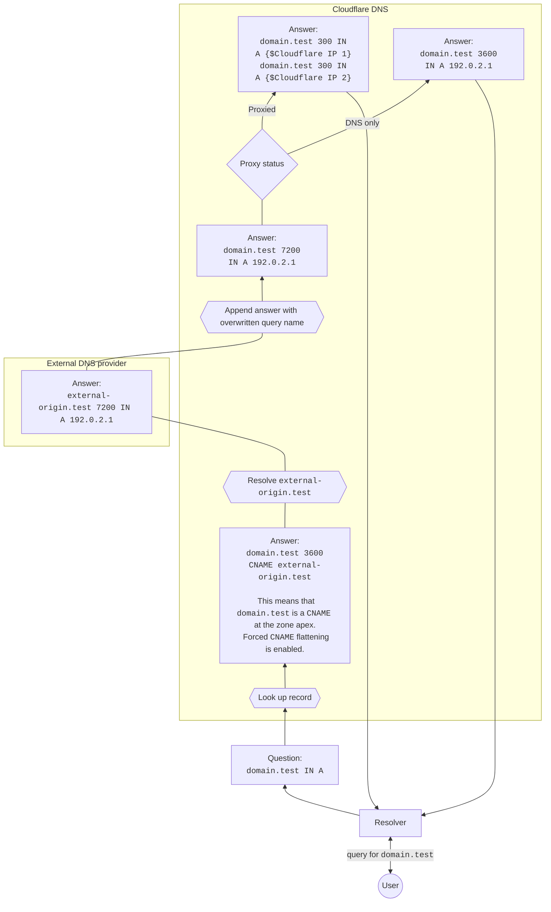

import { Example } from "~/components"

CNAME flattening을 사용하면 Cloudflare는 CNAME 레코드가 가리키는 대상 호스트 이름 대신 IP 주소를 반환합니다.
이 과정은 몇 가지 기능을 지원하며, [CNAME flattening 개념 문서](/dns/cname-flattening/)에서 언급한 것처럼 더 나은 성능과 유연성을 제공합니다.

아래 다이어그램을 보면 CNAME flattening에 포함될 수 있는 단계를 전체적으로 이해할 수 있습니다.

:::note

이 예시는 더 단순한 시나리오라는 점에 유의하세요. CNAME flattening이 선택 사항이거나 대상 호스트 이름이 Cloudflare 외부가 아닌 경우에는 다르게 동작합니다.

:::

## 예시 사용 사례

* `domain.test`는 Cloudflare의 Zone이며, 다음과 같은 CNAME 레코드를 가지고 있습니다.

<Example>

| Type       | Name          | Content                | TTL    |
| ---------- | ------------- | ---------------------- | ------ |
| `CNAME`    | `domain.test` | `external-origin.test` | `3600` |

</Example>

* `external-origin.test`는 다른 DNS 제공업체의 Zone이며, 다음과 같은 A 레코드를 가지고 있습니다.

<Example>

| Type       | Name                   | Content     | TTL    |
| ---------- | ---------------------- | ----------- | ------ |
| `A`        | `external-origin.test` | `192.0.2.1` | `7200` |

</Example>

이 경우 `domain.test`에 대한 쿼리에 IP 주소로 직접 응답하는 과정은 아래 다이어그램으로 나타낼 수 있습니다.

## 고려할 점

* CNAME 레코드가 Cloudflare에서 프록시되는 경우, 응답은 여러 개의 [Cloudflare IP](https://www.cloudflare.com/ips/)로 구성되며 Time to Live(TTL)는 `300`으로 설정됩니다.
* Cloudflare의 CNAME 레코드가 프록시되지 않는 경우, flatten된 응답은 외부 DNS 제공업체의 IP 주소로 구성되며 TTL은 외부 레코드와 Cloudflare CNAME 레코드 중 더 낮은 값을 따릅니다.
